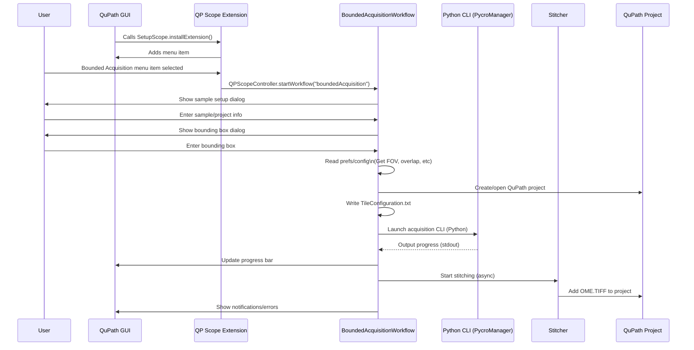

# QuPath Scope Control (QPSC) Extension

[](https://qupath.github.io/)
[](#license)
[](#)

> **Part of the QPSC (QuPath Scope Control) system**
> For complete installation instructions and system overview, see: https://github.com/uw-loci/QPSC

## Overview

**QPSC** is an extension for [QuPath](https://qupath.github.io/) that lets you **control your microscope directly from QuPath** to automatically acquire high-resolution images of regions you select.

**In plain terms:** Draw a box around a region in QuPath, and QPSC will move your microscope stage, capture all the tiles needed to cover that region, stitch them together, and add the resulting image back to your QuPath project.

The extension connects QuPath to your microscope via [Pycro-Manager](https://pycro-manager.readthedocs.io/) and [Micro-Manager](https://micro-manager.org/), enabling reproducible, high-throughput imaging workflows for digital pathology research.

---

## Contents

- [Features](#features)
- [Getting Started](#getting-started)
  - [Prerequisites](#prerequisites)
  - [Installation](#installation)
  - [First-Time Setup Checklist](#first-time-setup-checklist)
  - [Usage](#usage)
- [Multi-Sample Project Support](#multi-sample-project-support)
- [Image Naming and Metadata System](#image-naming-and-metadata-system)
- [Calibration Workflows](#calibration-workflows)
  - [White Balance Calibration (JAI/Prism Cameras)](#white-balance-calibration-jaiprism-cameras)
  - [Background Collection](#background-collection)
  - [Polarizer Calibration (PPM)](#polarizer-calibration-ppm)
  - [Autofocus Settings Editor](#autofocus-settings-editor)
- [Building from Source](#building-from-source)
- [File Structure (For Developers)](#file-structure-for-developers)
- [YAML Configuration](#yaml-configuration)
- [Future Plans](#future-plans)
- [Troubleshooting](#troubleshooting)
- [Getting Help](#getting-help)

---

## Features

### Core Capabilities

| Feature | Description |
|---------|-------------|
| **Bounding Box Acquisition** | Draw a region in QuPath, automatically tile and acquire at high resolution |
| **Existing Image Acquisition** | Target specific annotations on a previously scanned slide |
| **Automated Stage Control** | Move XY, Z, and rotation stages with safety bounds checking |
| **Multi-angle Imaging (PPM)** | Polarized light microscopy with automatic rotation sequences |

### Calibration Tools

- **Background Collection**: Acquire flat-field correction images (removes uneven illumination)
- **Polarizer Calibration**: Find optimal rotation angles for crossed polarizers
- **Autofocus Editor**: Configure focus parameters per objective

### Technical Features

- **Automatic Stitching**: Tiles are automatically stitched into pyramidal OME-TIFF/OME-ZARR images
- **Project Integration**: Acquired images automatically added to your QuPath project
- **Real-time Progress**: Live feedback during acquisition via socket communication
- **Modality System**: Pluggable imaging modes (PPM, brightfield, future: SHG)

> **Note:** Polarized (PPM) acquisitions use the `ppm_` prefix (e.g., `ppm_20x`). Modalities without this prefix perform single-pass acquisitions.

---

## Getting Started

### Prerequisites

**Hardware Requirements:**
- Motorized XY microscope stage (controlled via Micro-Manager)
- Digital camera compatible with Micro-Manager
- Optional: Motorized Z-stage for autofocus, rotation stage for polarized imaging (PPM)

**Software Requirements:**
- **Operating System**: Windows 10+ (primary), Linux (limited testing), macOS (untested)
- [QuPath 0.6.0+](https://qupath.github.io/) with Java 21+
- [qupath-extension-tiles-to-pyramid](https://github.com/uw-loci/qupath-extension-tiles-to-pyramid) - Required for image stitching
- [Micro-Manager 2.0](https://micro-manager.org/) configured for your microscope
- Python 3.8+ with [Pycro-Manager](https://pycro-manager.readthedocs.io/) installed

### Installation

1. **Download the extension JARs:**
   - `qupath-extension-qpsc-[version].jar` - This extension
   - `qupath-extension-tiles-to-pyramid-[version].jar` - [Required dependency](https://github.com/uw-loci/qupath-extension-tiles-to-pyramid)

2. **Install in QuPath:** Drag both JAR files into an open QuPath window, or copy them to your QuPath `extensions/` folder.

3. **Restart QuPath** and verify the "QP Scope" menu appears.

4. **Configure** your microscope YAML (see `config_PPM.yml` sample) and shared hardware resource file (`resources/resources_LOCI.yml`).

5. **Set preferences** in QuPath: Edit -> Preferences -> QPSC Extension (Python controller path, server settings).

### First-Time Setup Checklist

Before your first acquisition, verify each component:

- [ ] **QuPath**: "QP Scope" menu visible in menu bar
- [ ] **Micro-Manager**: Can control stage manually (test XY movement)
- [ ] **Python Server**: Server script starts without errors
- [ ] **Connection**: Use "Stage Control" to test QuPath can move the stage
- [ ] **Configuration**: YAML files point to correct hardware IDs

**Recommended first test:** Use "Stage Control" from the QP Scope menu to verify communication before attempting a full acquisition.

### Usage

Open the **QP Scope** menu in QuPath to access all features:

**Main Workflows:**
| Menu Item | When to Use |
|-----------|-------------|
| Bounding Box Acquisition | New acquisition - draw region, acquire tiles |
| Existing Image Acquisition | Re-acquire regions from a previously scanned slide |
| Microscope Alignment | Initial setup - align QuPath coordinates to stage |

**Calibration (run as needed):**
| Menu Item | When to Use |
|-----------|-------------|
| Collect Background Images | After lamp changes, for flat-field correction |
| Polarizer Calibration | After hardware changes (PPM only) |
| Autofocus Settings | To tune focus quality per objective |

**Utilities:**
| Menu Item | Purpose |
|-----------|---------|
| Stage Control | Test stage movement, verify connection |
| Server Settings | Configure Python server connection |

---

## Multi-Sample Project Support

QPSC supports managing multiple samples within a single QuPath project through an automatic metadata tracking system. This enables complex multi-slide studies while maintaining proper data organization and acquisition validation.

### How Metadata Works

Each image in a project is automatically tagged with metadata to track:

- **Image Collection**: Groups related images (e.g., all acquisitions from the same physical slide)
- **XY Offsets**: Physical position on the slide in micrometers for precise re-acquisition
- **Flip Status**: Whether the image has been flipped (critical for microscope alignment)
- **Sample Name**: Identifies which physical sample the image represents
- **Parent Relationships**: Links sub-images to their source images

### Key Behaviors

**Automatic Collection Assignment:**
- First image in a project gets `image_collection=1`
- New unrelated images increment the collection number
- Sub-images inherit their parent's collection number

**Flip Validation:**
- When X/Y flips are enabled in preferences, only flipped images can be used for acquisition
- Prevents acquisition errors due to coordinate system mismatches
- Original (unflipped) images are preserved with all annotations

**Position Tracking:**
- Each image stores its offset from the slide corner
- Sub-images calculate their position relative to the parent
- Enables accurate stage positioning for multi-region acquisition

### Multi-Sample Workflow Example

1. **Import multiple slides into one project**
   - Each gets a unique `image_collection` number
   - Metadata tracks which images belong together

2. **Create flipped versions if needed**
   - Use the "Create Flipped Duplicate" function
   - Annotations and hierarchy are automatically transformed
   - Both versions exist in the project with proper metadata

3. **Acquire sub-regions from any image**
   - Extension validates flip status before acquisition
   - Sub-images inherit the parent's collection
   - All related images stay grouped by metadata

### Best Practices

- Let the system manage metadata automatically - manual editing may break workflows
- When working with flipped images, always use the flipped version for acquisition
- Use descriptive sample names when setting up projects for easier identification
- Sub-images from the same parent will share the same collection number for easy filtering

> This metadata system operates transparently in the background, ensuring data integrity while supporting complex multi-sample workflows.

---

## Image Naming and Metadata System

QPSC uses a flexible, user-configurable image naming system that balances human readability with comprehensive metadata storage.

### Default Naming Pattern

Images are named using a clean, minimal format by default:
```
SampleName_001.ome.tif
SampleName_002.ome.zarr
```

For multi-angle acquisitions (e.g., PPM):
```
SampleName_001_7.0.ome.zarr
SampleName_001_-7.0.ome.zarr
SampleName_002_7.0.ome.zarr
```

**Key Points:**
- Index increments per acquisition/annotation, **NOT per angle**
- Angles distinguish images within the same acquisition
- All acquisition information is stored in QuPath metadata

### Customizable Filename Components

Users can configure which information appears in filenames via **QuPath Preferences → QPSC Extension**:

**Image name includes:**
- ☐ **Objective** - Add magnification (e.g., `SampleName_20x_001.ome.tif`)
- ☐ **Modality** - Add imaging mode (e.g., `SampleName_ppm_001.ome.tif`)
- ☐ **Annotation** - Add region name (e.g., `SampleName_Tissue_001.ome.tif`)
- ☑ **Angle** - Add polarization angle (defaults to **ON** for PPM - critical for distinguishing images!)

**Combining preferences:**
```
With Modality + Objective + Angle:
SampleName_ppm_20x_001_7.0.ome.zarr
```

### Complete Metadata Storage

**Important:** Regardless of filename configuration, **ALL** acquisition information is stored in QuPath metadata:
- Sample name
- Modality (ppm, bf, etc.)
- Objective/magnification
- Polarization angle (for multi-angle)
- Annotation name
- Image index
- Image collection number
- XY offsets (microns)
- Flip status
- Parent image relationships

Metadata can be viewed in QuPath's **Image → Image Properties** panel.

### Sample Name Validation

Sample names are validated for cross-platform filename safety:
- **Allowed**: Letters, numbers, spaces, underscores, hyphens
- **Blocked**: `/ \ : * ? " < > | newlines`
- **Protected**: Windows reserved names (CON, PRN, AUX, NUL, COM1-9, LPT1-9)
- **Automatic sanitization**: Invalid characters replaced with underscores

**Workflows:**
- **Bounded Acquisition**: User specifies sample name (editable, validated)
- **Acquire from Existing Image**: Defaults to current image name without extension (editable)

### Multi-Sample Projects

Projects can now contain multiple samples with distinct names:
- Each sample can have its own name (no longer tied to project name)
- Metadata tracks which images belong to which sample
- Essential for collaborative studies with multiple specimens

---

## Calibration Workflows

### White Balance Calibration (JAI/Prism Cameras)

**Purpose**: Determine per-channel (R,G,B) exposure times needed to achieve neutral white balance at each polarization angle. This calibration is **critical** for prism-based color cameras like JAI.

#### Why Prism-Based Cameras Are Different

**Standard Bayer cameras** capture all color channels with a single exposure time. White balance is achieved through digital gain adjustments after capture.

**Prism-based cameras (JAI, etc.)** use a prism to split light into separate R, G, B sensors. Each channel can have its own exposure time, enabling hardware-level white balance without digital gain artifacts. However, this means:

- Each color channel may need a **different exposure time** to achieve white balance
- Different polarization angles require **different per-channel exposure ratios**
- **Backgrounds must be captured with the same per-channel exposures as acquisitions**, or flat-field correction will be incorrect

#### The Critical Relationship: WB Calibration -> Backgrounds -> Acquisition

For JAI and similar prism-based cameras, these three steps **must use matching exposure settings**:

```
1. WB Calibration  -->  Determines per-channel exposures, saves to YAML
         |
         v
2. Background Collection  -->  Uses same per-channel exposures from YAML
         |                      Captures white/neutral background images
         v
3. Acquisition  -->  Uses same per-channel exposures from YAML
         |           Flat-field correction works correctly
         v
   Properly corrected images
```

**If any step uses different exposures, flat-field correction will over- or under-correct your images.**

#### When to Run White Balance Calibration

- **Required before first use** with a JAI or prism-based camera
- After changing objectives (each objective/detector combination needs its own calibration)
- After hardware changes affecting light path (filters, lamp replacement)
- When images show color cast or uneven color balance across the field

#### Workflow

1. **Position the stage** at a clean, blank area (white reference or empty slide area)
2. In QuPath, go to **Extensions > QP Scope > White Balance Calibration**
3. Select:
   - **Modality**: ppm (or other modality)
   - **Objective**: Your current objective
4. Click **Calibrate**

**What happens:**
- Server iteratively adjusts R, G, B exposures at each polarization angle
- Finds exposure ratios that produce neutral gray (equal R, G, B values)
- Saves calibration to `imageprocessing_{microscope}.yml`:

```yaml
imaging_profiles:
  ppm:
    LOCI_OBJECTIVE_OLYMPUS_20X_POL_001:
      LOCI_DETECTOR_JAI_001:
        angles:
          crossed:
            exposures_ms: {r: 45.2, g: 38.1, b: 52.3}
            gains: {r: 1.0, g: 1.0, b: 1.0}
          uncrossed:
            exposures_ms: {r: 1.2, g: 1.0, b: 1.4}
            gains: {r: 1.0, g: 1.0, b: 1.0}
          positive:
            exposures_ms: {r: 28.5, g: 24.2, b: 31.1}
          negative:
            exposures_ms: {r: 28.3, g: 24.1, b: 30.9}
```

#### After Calibration

Once WB calibration is complete:

1. **Run Background Collection** (see next section) - backgrounds will automatically use the calibrated exposures
2. **Run acquisitions** - the same calibrated exposures will be applied
3. Flat-field correction will work correctly because all three steps use matching exposures

#### Automatic JAI Detection

The system automatically detects JAI cameras and:
- **Loads calibration automatically** during background collection (regardless of checkbox setting)
- **Warns you** if no calibration exists for the current objective/detector
- **Forces per-channel mode** when calibration is available

This means even if you forget to check the "Use per-channel white balance" checkbox, JAI cameras will still use the correct per-channel exposures if calibration exists.

#### Troubleshooting

| Symptom | Cause | Solution |
|---------|-------|----------|
| Color cast in acquired images | WB calibration not run | Run White Balance Calibration for this objective |
| Backgrounds not white | Background collection used wrong exposures | Re-run background collection after WB calibration |
| Over/under-corrected tiles | Background/acquisition exposure mismatch | Ensure all steps use same objective and have calibration |
| "No calibration found" warning | Missing calibration for objective | Run WB calibration for this objective/detector |

### Background Collection

**Purpose**: Acquire flat-field correction images for improved image quality and quantitative analysis.

**Key Features**:
- **Adaptive Exposure Control**: Automatically adjusts exposure times to reach target grayscale intensities (e.g., 245 for PPM 90°, 125 for PPM 0°)
- **Fast Convergence**: Typically achieves target intensity in 2-5 iterations using proportional control algorithm
- **Accurate Metadata**: Records actual exposure times used (not requested values) for reproducibility
- **Modality Support**: Works with all imaging modes (PPM, brightfield, etc.)
- **JAI/Prism Camera Support**: Automatically uses per-channel calibration when available (see below)

**When to Use**:
- Initial microscope setup
- After light source changes or bulb replacement
- When image quality degrades
- For quantitative imaging requiring flat-field correction
- **After running White Balance Calibration** (for JAI/prism cameras)

**Workflow**:
1. Position microscope at clean, blank area (uniform background)
2. Select **"Collect Background Images"** from menu
3. Choose modality, objective, and output folder
4. Review/adjust angles and initial exposure estimates
5. **For JAI cameras**: Verify "Use per-channel white balance" is checked (default: ON)
6. System acquires backgrounds, adjusting exposure automatically
7. Metadata files saved with actual exposure values for each angle

#### Special Considerations for JAI/Prism Cameras

> **Important**: For JAI and other prism-based cameras, you must run [White Balance Calibration](#white-balance-calibration-jaiprism-cameras) **before** collecting backgrounds.

**Per-Channel White Balance Checkbox**:
- Located in the Background Collection dialog
- **Default: Checked (ON)** - recommended for JAI cameras
- When checked: Uses calibrated per-channel (R,G,B) exposures from WB calibration
- When unchecked: Uses unified adaptive exposure (may cause flat-field correction issues)
- **Setting is remembered** between QuPath sessions

**Automatic JAI Detection**:
The system automatically detects JAI cameras and will:
- Load WB calibration automatically, even if checkbox is unchecked
- Warn you if no calibration exists for the current objective
- Force per-channel mode when calibration is available

**Why This Matters**:
Background images must be captured with the **same exposure settings** used during acquisition. For JAI cameras with per-channel exposures, if backgrounds use different exposures, flat-field correction will produce incorrectly colored or intensity-shifted images.

**Verification**: After background collection, the saved images should appear **white/neutral** (similar to the WB calibration verification images). If backgrounds appear colored or gray, re-run WB calibration first.

### Polarizer Calibration (PPM)

**Purpose**: Determine exact hardware offset (`ppm_pizstage_offset`) for PPM rotation stage calibration.

**Key Features**:
- **Two-Stage Calibration**: Coarse sweep to locate minima, then fine sweep for exact hardware positions
- **Hardware Position Detection**: Works directly with encoder counts for precise calibration
- **Automatic Offset Calculation**: Determines the exact hardware position for optical angle reference (0°)
- **Sine Curve Fitting**: Uses `scipy` to fit intensity vs. angle data for validation
- **Comprehensive Report**: Generates text file with exact hardware positions and config recommendations

**When to Use**:
- **CRITICAL**: After installing or repositioning rotation stage hardware
- After reseating or replacing the rotation stage motor
- After optical component changes that affect polarizer alignment
- To recalibrate `ppm_pizstage_offset` in `config_PPM.yml`
- **NOT needed** for routine imaging sessions or between samples

**Two-Stage Calibration Process**:

**Stage 1 - Coarse Sweep:**
- Sweeps full 360° rotation in hardware encoder counts
- User-defined step size (default: 5°, equivalent to 5000 encoder counts for PI stage)
- Identifies approximate locations of 2 crossed polarizer minima (180° apart)
- Takes ~90 seconds at 5° steps

**Stage 2 - Fine Sweep:**
- Narrow sweep around each detected minimum
- Very small steps (0.1°, equivalent to 100 encoder counts)
- Determines exact hardware position of each intensity minimum
- Takes ~20 seconds per minimum (40 seconds total for 2 minima)

**Workflow**:
1. Position microscope at uniform, bright background
2. Select **"Polarizer Calibration (PPM)..."** from menu
3. Configure calibration parameters:
   - Coarse step size (default: 5°; recommended range: 2-10°)
   - Exposure time (default: 10ms; keep short to avoid saturation)
4. Start calibration (~2 minutes total for full two-stage calibration)
5. Review generated report containing:
   - **Exact hardware positions** (encoder counts) for each crossed polarizer minimum
   - **Recommended `ppm_pizstage_offset` value** (hardware position to use as 0° reference)
   - Optical angles relative to recommended offset
   - Intensity statistics and validation data
   - Raw data from both coarse and fine sweeps
6. **Update `config_PPM.yml`** with recommended offset value

**Output Report Includes**:
```
EXACT HARDWARE POSITIONS (CROSSED POLARIZERS)
================================================================================
Found 2 crossed polarizer positions:

  Minimum 1:
    Hardware Position: 50228.7 encoder counts
    Optical Angle: 0.00 deg (relative to recommended offset)
    Intensity: 118.3

  Minimum 2:
    Hardware Position: 230228.7 encoder counts
    Optical Angle: 180.00 deg (relative to recommended offset)
    Intensity: 121.5

Separation between minima: 180000.0 counts (180.0 deg)
Expected: 180000.0 counts (180.0 deg)

CONFIG_PPM.YML UPDATE RECOMMENDATIONS
================================================================================
CRITICAL: Update ppm_pizstage_offset to the recommended value below.
This sets the hardware reference position for optical angle 0 deg.

ppm_pizstage_offset: 50228.7

After updating the offset, you can use the following optical angles:

rotation_angles:
  - name: 'crossed'
    tick: 0   # Reference position (hardware: 50228.7)
    # OR tick: 180   # Alternate crossed (hardware: 230228.7)
  - name: 'uncrossed'
    tick: 90  # 90 deg from crossed (perpendicular)
```

**Important Notes**:
- This calibration determines the **hardware offset itself**, not just optical angles
- The offset value is specific to your rotation stage and optical configuration
- After updating `ppm_pizstage_offset`, the optical angle convention (tick values) remains simple: 0°, 90°, 180°
- Hardware automatically converts: `hardware_position = (tick * 1000) + ppm_pizstage_offset`

### Autofocus Settings Editor

**Purpose**: Configure per-objective autofocus parameters in an easy-to-use GUI without manually editing YAML files.

**Key Features**:
- **Per-Objective Configuration**: Set different autofocus parameters for each objective (10X, 20X, 40X, etc.)
- **Three Key Parameters**:
  - **n_steps**: Number of Z positions to sample during autofocus (higher = more accurate but slower)
  - **search_range_um**: Total Z range to search in micrometers (centered on current position)
  - **n_tiles**: Spatial frequency - autofocus runs every N tiles during large acquisitions (lower = more frequent but slower)
- **Live Validation**: Warns about extreme values that may cause poor performance
- **Separate Storage**: Settings stored in `autofocus_{microscope}.yml` (e.g., `autofocus_PPM.yml`)
- **Working Copy**: Edit multiple objectives before saving to file

**When to Use**:
- Initial microscope setup
- After changing objectives or optical configuration
- When autofocus performance needs tuning (too slow, not accurate enough, etc.)
- To optimize autofocus frequency for different sample types

**Workflow**:
1. Select **"Autofocus Settings Editor..."** from menu
2. Select objective from dropdown
3. Edit parameters:
   - **n_steps**: Typical range 5-20 (default: 9-15 depending on objective)
   - **search_range_um**: Typical range 10-50 μm (default: 10-15 μm)
   - **n_tiles**: Typical range 3-10 (default: 5-7)
4. Switch between objectives to edit other settings (changes saved automatically)
5. Click **"Write to File"** to save all settings
6. Click **"OK"** to save and close, or **"Cancel"** to discard unsaved changes

**Parameter Guidance**:
- **Higher magnification** → More n_steps, smaller search_range_um (e.g., 40X: 15 steps, 10 μm range)
- **Lower magnification** → Fewer n_steps, larger search_range_um (e.g., 10X: 9 steps, 15 μm range)
- **Thick samples** → Increase search_range_um
- **Time-critical acquisitions** → Increase n_tiles (less frequent autofocus), decrease n_steps
- **Critical focus quality** → Decrease n_tiles (more frequent autofocus), increase n_steps

**Configuration File Format** (`autofocus_PPM.yml`):
```yaml
autofocus_settings:
  - objective: 'LOCI_OBJECTIVE_OLYMPUS_10X_001'
    n_steps: 9
    search_range_um: 15.0
    n_tiles: 5

  - objective: 'LOCI_OBJECTIVE_OLYMPUS_20X_POL_001'
    n_steps: 11
    search_range_um: 15.0
    n_tiles: 5

  - objective: 'LOCI_OBJECTIVE_OLYMPUS_40X_POL_001'
    n_steps: 15
    search_range_um: 10.0
    n_tiles: 7
```

**First-Time Use**:
- If `autofocus_{microscope}.yml` doesn't exist, editor loads sensible defaults
- Objectives from main config automatically populate
- Save creates the file with all configured objectives

---

## Building from Source

If you want to build the extension yourself (for development or to get the latest changes), follow these steps:

### Prerequisites

- **Java 21+** (JDK, not just JRE)
- **Git** for cloning repositories

### Build Steps

**1. Clone both repositories:**

```bash
git clone https://github.com/uw-loci/qupath-extension-tiles-to-pyramid.git
git clone https://github.com/uw-loci/qupath-extension-qpsc.git
```

**2. Publish tiles-to-pyramid to Maven Local** (required one-time setup):

```bash
cd qupath-extension-tiles-to-pyramid
./gradlew publishToMavenLocal
```

This installs the tiles-to-pyramid dependency to your local Maven repository (`~/.m2/repository/`).

**3. Build the QPSC extension:**

```bash
cd qupath-extension-qpsc
./gradlew shadowJar
```

**4. Find the output JAR:**

The built JAR will be at:
```
build/libs/qupath-extension-qpsc-<version>-all.jar
```

The `-all` suffix indicates this is a "fat JAR" that includes the tiles-to-pyramid dependency bundled inside.

### Troubleshooting Build Issues

**OME Repository Unavailable:**

If you see errors about `repo.openmicroscopy.org` being unreachable:
```
Could not resolve ome:formats-gpl:8.1.1
> No such host is known (repo.openmicroscopy.org)
```

This can happen when the OME artifact server is down. The build configuration has been updated to minimize dependence on this repository, but if issues persist:

1. Ensure you're using the latest version of both repositories (`git pull`)
2. Try building with `--offline` if you've built successfully before:
   ```bash
   ./gradlew shadowJar --offline
   ```

**tiles-to-pyramid Not Found:**

If you see:
```
Could not resolve io.github.uw-loci:qupath-extension-tiles-to-pyramid:0.1.0
```

Make sure you completed Step 2 (publishToMavenLocal) in the tiles-to-pyramid directory.

### Development in IntelliJ IDEA

For development with hot-reload via QuPath:

1. Clone the [qupath-qpsc-dev](https://github.com/uw-loci/qupath-qpsc-dev) repository (custom QuPath build with QPSC pre-installed)
2. Open as a Gradle project in IntelliJ
3. Run the QuPath main class to launch with the extension

---

## File Structure (For Developers)

```text

qupath-extension-qpsc/
├── .github/
├── .gradle/
├── .idea/
├── build/
├── gradle/
├── src/
│   ├── main/
│   │   ├── java/
│   │   │   └── qupath/
│   │   │       └── ext/
│   │   │           └── qpsc/
│   │   │               ├── controller/
│   │   │               ├── modality/
│   │   │               ├── preferences/
│   │   │               ├── service/
│   │   │               ├── ui/
│   │   │               ├── utilities/
│   │   │               ├── QPScopeChecks.java
│   │   │               └── SetupScope.java
│   │   └── resources/
│   │       └── qupath/
│   │           └── ext/
│   │               └── qpsc/
│   │                   └── ui/
│   │                       ├── interface.fxml
│   │                       └── strings.properties
│   └── test/
│       └── java/
│           └── qupath/
│               └── ext/
│                   └── qpsc/
│                       ├── CoordinateTransformationTest.java
│                       ├── QPProjectFunctionsTest.java
│                       └── WorkflowTests.java
├── resources/
│   ├── config_PPM.yml
│   ├── resources_LOCI.yml
│   └── ...
├── heartbeat_client.py
├── build.gradle.kts
├── settings.gradle.kts
├── .gitignore
├── README.md
└── project-structure.txt

```

Legend
controller/ – Main workflow logic for acquisition, bounding box, existing image, etc.

modality/ – Pluggable modality handlers (e.g., PPM) and rotation utilities.

preferences/ – User settings and persistent configuration.

service/ – Abstractions for CLI/Python process integration.

ui/ – User dialogs (JavaFX), UI controllers for user input and feedback.

utilities/ – Helpers for file IO, YAML/JSON, tiling, stitching, etc.

resources/ – Configuration files (YAML), FXML, localizable strings.

test/ – Unit and integration tests.

heartbeat_client.py – Python script for test/integration workflows.


Workflow Overview:
The diagram below illustrates the sequence of operations when a user performs a "Bounded Acquisition" workflow in the QP Scope extension. User input and configuration guide the Java workflow, which orchestrates microscope control via Python scripts, handles asynchronous stitching, and integrates the final OME-TIFF into the QuPath project.
### Bounded Acquisition Workflow


## YAML Configuration
Microscope config: Describes imaging modes, detectors, objectives, stage limits, etc. (config_PPM.yml)

Shared resources: Centralized lookup for hardware IDs (cameras, objectives, stages), e.g., for multi-microscope setups (resources/resources_LOCI.yml).

## Development & Testing
Workflows are in controller/. GUI dialogs are in ui/.

Unit tests use JUnit and Mockito. See src/test/ for examples.

Extending: Add new dialogs, Python commands, or custom modalities by implementing a `ModalityHandler` and registering it via `ModalityRegistry.registerHandler`.

## Future Plans

The following features and improvements are planned for upcoming releases:

**Documentation & Onboarding**:
- **Configuration templates**: Annotated YAML examples for common microscope setups
- **Quickstart guide**: Step-by-step tutorial for first-time acquisition
- **Video tutorials**: Installation and workflow walkthroughs

**New Modalities**:
- **SHG (Second Harmonic Generation)**: Support for multiphoton microscopy workflows
- **Laser scanning**: Integration with confocal and multi-photon laser scanning systems

**Additional Improvements**:
- Pre-built JAR releases via GitHub Actions
- Configuration validation wizard
- Expanded troubleshooting documentation

---

## Troubleshooting

**Common Issues:**

| Problem | Likely Cause | Solution |
|---------|--------------|----------|
| "QP Scope" menu doesn't appear | Extension not loaded | Verify both JAR files are in extensions folder, restart QuPath |
| "Cannot connect to server" | Python server not running | Start the Python microscope server before acquisition |
| Stage won't move | Micro-Manager not configured | Check Micro-Manager can control your stage independently |
| Timeouts during acquisition | Network/heartbeat issue | Check Python script heartbeat, adjust timeout settings |
| Stitching fails | tiles-to-pyramid missing | Install the [tiles-to-pyramid extension](https://github.com/uw-loci/qupath-extension-tiles-to-pyramid) |

**For detailed troubleshooting**, see the comprehensive [Troubleshooting Guide](documentation/TROUBLESHOOTING.md) with:
- Quick diagnostic checklist
- FAQ organized by category
- Error message reference
- Configuration validation tips
- Log file interpretation guide

---

## Getting Help

- **Troubleshooting Guide**: [documentation/TROUBLESHOOTING.md](documentation/TROUBLESHOOTING.md) - Comprehensive FAQ and error reference
- **Bug Reports & Feature Requests**: [GitHub Issues](https://github.com/uw-loci/qupath-extension-qpsc/issues)
- **QuPath Community**: [image.sc Forum](https://forum.image.sc/tag/qupath) (tag: qupath)
- **Micro-Manager Help**: [Micro-Manager Documentation](https://micro-manager.org/wiki/Documentation)

When reporting issues, please include:
1. QuPath version and operating system
2. Error messages from QuPath console (View > Show Log)
3. Steps to reproduce the problem
4. Relevant log excerpts (see [Troubleshooting Guide](documentation/TROUBLESHOOTING.md#log-files-and-diagnostics))

---

## License

MIT License - see [LICENSE](LICENSE) for details.

## Citation

If you use QPSC in published work, please cite:
- The [QuPath platform](https://qupath.github.io/)
- This repository

## Acknowledgments

Developed by [LOCI](https://eliceirilab.org/), University of Wisconsin-Madison.

With thanks to the QuPath community and everyone contributing to open-source microscopy software.