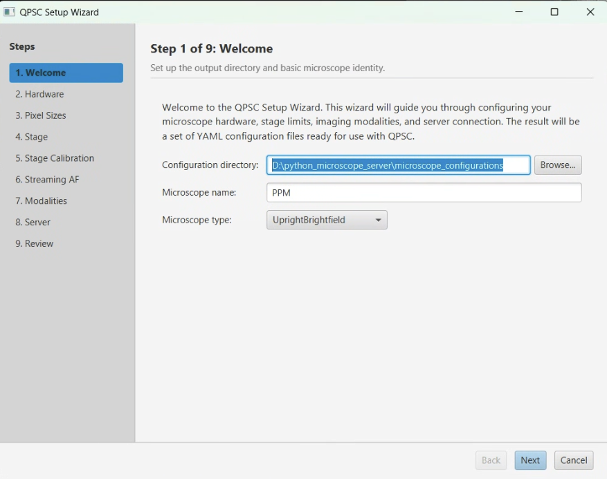

# QPSC Installation Guide

## Overview

**QPSC (QuPath Scope Control)** is an extension for [QuPath](https://qupath.github.io/) that lets you control your microscope directly from QuPath. You draw regions of interest in QuPath, and QPSC automatically moves the stage, acquires tiled images, stitches them into pyramidal whole-slide images, and adds them back to your project. The system connects QuPath (Java) to your microscope hardware through a Python socket server that uses [Pycro-Manager](https://pycro-manager.readthedocs.io/) and [Micro-Manager](https://micro-manager.org/).

**What you will need:**

- A Windows PC connected to your microscope (primary platform)
- QuPath 0.6.0+
- Micro-Manager 2.0+ configured for your hardware
- Python 3.10+
- About 30 minutes for full setup (assuming Micro-Manager is already configured)

---

## System Requirements

| Component           | Minimum Version | Notes                                           |
|---------------------|-----------------|--------------------------------------------------|
| Operating System    | Windows 10+     | Primary platform. Linux has limited testing. macOS is untested. |
| Java (JDK)         | 21+             | Required for QuPath 0.6.0 and for building from source |
| QuPath              | 0.6.0+          | Download from https://qupath.github.io/          |
| Micro-Manager       | 2.0+            | Download from https://micro-manager.org/          |
| Python              | 3.10+           | Required for the microscope server and all Python packages |
| pip                 | Latest           | Python package installer (comes with Python)     |
| Git                 | Latest           | Required for `pip install git+https://...` commands |

**Hardware Requirements:**

- Motorized XY microscope stage (controlled via Micro-Manager)
- Digital camera compatible with Micro-Manager
- Optional: Motorized Z-stage for autofocus
- Optional: Rotation stage for polarized imaging (PPM)

---

## Step 1: Install QuPath

1. Download QuPath 0.6.0 or later from https://qupath.github.io/
2. Run the installer for your platform.
3. Launch QuPath to confirm it opens correctly.

You should see the QuPath main window with menus across the top. No project needs to be open yet.

For detailed QuPath installation help, see the [QuPath documentation](https://qupath.readthedocs.io/).

---

## Step 2: Install Micro-Manager

1. Download Micro-Manager 2.0 from https://micro-manager.org/Download_Micro-Manager_Latest_Release
2. Run the installer.
3. Launch Micro-Manager and configure your hardware devices (camera, stage, etc.) using the Hardware Configuration Wizard.

**Important:** Micro-Manager must be fully configured and able to control your hardware before proceeding with QPSC setup. You should be able to:

- Move the XY stage using the Stage Control window
- Snap an image from your camera
- (If applicable) Move the Z-stage

We do not cover Micro-Manager device configuration here. See the [Micro-Manager documentation](https://micro-manager.org/Micro-Manager_Configuration_Guide) for hardware setup instructions.

---

## Step 3: Install Python Packages

QPSC requires three Python packages that handle microscope communication, hardware control, and image processing. Install them in the order shown below (the order matters because of dependencies).

### 3.1 Create a virtual environment (recommended)

```bash
python -m venv venv_qpsc
```

Activate it:

```bash
# Windows (PowerShell)
venv_qpsc\Scripts\Activate.ps1

# Windows (Command Prompt)
venv_qpsc\Scripts\activate.bat

# Linux / macOS
source venv_qpsc/bin/activate
```

You should see `(venv_qpsc)` at the beginning of your command prompt.

### 3.2 Install the three packages

**Option A: Install from GitHub (recommended for most users)**

```bash
# 1. ppm-library (image processing - no hardware dependencies)
pip install git+https://github.com/uw-loci/ppm_library.git

# 2. microscope-control (hardware abstraction layer - depends on ppm-library)
pip install git+https://github.com/uw-loci/microscope_control.git

# 3. microscope-command-server (socket server - depends on both above)
pip install git+https://github.com/uw-loci/microscope_command_server.git
```

**Option B: Clone and install in editable mode (for developers)**

```bash
git clone https://github.com/uw-loci/ppm_library.git
cd ppm_library
pip install -e .
cd ..

git clone https://github.com/uw-loci/microscope_control.git
cd microscope_control
pip install -e .
cd ..

git clone https://github.com/uw-loci/microscope_command_server.git
cd microscope_command_server
pip install -e .
cd ..
```

### 3.3 Verify installation

Run these commands to confirm all three packages installed correctly:

```bash
python -c "import ppm_library; print('ppm_library: OK')"
python -c "import microscope_control; print('microscope_control: OK')"
python -c "import microscope_command_server; print('microscope_command_server: OK')"
```

You should see three "OK" lines with no errors. If you see `ModuleNotFoundError`, check that your virtual environment is activated and re-run the pip install commands.

### 3.4 Troubleshooting Python installation

**Problem: `ModuleNotFoundError: No module named 'cv2'`**

Install OpenCV manually:
```bash
pip install opencv-python
```

**Problem: `pip install git+https://...` fails**

Make sure Git is installed and available on your PATH:
```bash
git --version
```
If this command fails, install Git from https://git-scm.com/

---

## Step 4: Install the QPSC Extension JAR

### Option A: Download from GitHub Releases (simplest)

1. Go to https://github.com/uw-loci/qupath-extension-qpsc/releases
2. Download the latest `qupath-extension-qpsc-<version>-all.jar` file.
   The `-all` suffix means this is a "fat JAR" that includes all dependencies (including the tiles-to-pyramid stitching extension).

### Option B: Build from source

See the [For Developers: Building from Source](#for-developers-building-from-source) section at the end of this guide.

### Install the JAR in QuPath

**Method 1 (drag and drop):**

1. Launch QuPath.
2. Drag the `.jar` file into the open QuPath window.
3. QuPath will ask to copy it to the extensions folder. Click **Yes**.

**Method 2 (manual copy):**

1. Find your QuPath extensions folder:
   - In QuPath, go to **Edit -> Preferences -> Extensions**
   - Note the "Extensions directory" path
   - If no directory is set, click **Set extension directory** and choose a folder
2. Copy the `.jar` file into that folder.

### Verify

1. Restart QuPath after installing the JAR.
2. Look for the **"QP Scope"** menu in the menu bar (between the other menus).

You should see "QP Scope" as a top-level menu. If it does not appear, verify the JAR is in the correct extensions folder and restart QuPath.

---

## Step 5: Create Configuration Files (Setup Wizard)

QPSC needs YAML configuration files that describe your microscope hardware (objectives, cameras, stage limits, imaging modalities, etc.). The **Setup Wizard** walks you through creating these files.



### Launch the Setup Wizard

1. In QuPath, go to **Extensions -> QP Scope -> Setup Wizard**
   - Note: The wizard also appears automatically the first time you try to use QPSC if no valid configuration is found.

### Walk through the 7 wizard steps

| Step | Name                | What you configure                                                        |
|------|---------------------|---------------------------------------------------------------------------|
| 1    | Welcome             | Output directory for config files, microscope name, microscope type       |
| 2    | Hardware            | Objectives and detectors (cameras) - select from the LOCI resource catalog or define custom entries |
| 3    | Pixel Size          | Pixel size (um/pixel) for each objective + detector combination           |
| 4    | Stage               | Stage ID and XYZ travel limits (min/max in micrometers)                   |
| 5    | Modalities          | Imaging modes (brightfield, PPM, laser scanning/SHG, fluorescence) with modality-specific settings (rotation angles, laser/PMT/Pockels cell parameters, etc.) |
| 6    | Server Connection   | Host and port for the Python microscope_command_server (default: localhost:5000) |
| 7    | Review              | Summary of all settings - review and confirm before writing files         |

### What gets created

After completing the wizard, YAML configuration files are written to the directory you chose in Step 1. These typically include:

- `config_<MicroscopeName>.yml` - Main microscope configuration (objectives, detectors, stage, modalities)
- `resources_LOCI.yml` - Shared hardware resource definitions (if using LOCI catalog entries)

You should see a confirmation message listing the files that were created. The wizard also updates your QuPath QPSC preferences to point to these new configuration files.

---

## Step 6: Start the Python Server

The Python server bridges QuPath and your microscope hardware. It must be running whenever you use QPSC for acquisition.

### Prerequisites

- Micro-Manager must be running with your hardware configuration loaded
- Your Python virtual environment must be activated

### Start the server

```bash
# Option 1: Entry point command (note: hyphens, not underscores)
microscope-command-server

# Option 2: Python module syntax
python -m microscope_command_server.server.qp_server
```

### Expected output

You should see output similar to:

```
INFO - Starting microscope command server on 0.0.0.0:5000
INFO - Connecting to Micro-Manager...
INFO - Connected to Micro-Manager core
INFO - Server ready. Waiting for connections...
```

The server is now listening for commands from QuPath. Leave this terminal window open.

### Troubleshooting server startup

**Problem: `OSError: [Errno 48] Address already in use` (or `[WinError 10048]`)**

Another process is using port 5000. Find and stop it:

```bash
# Windows
netstat -ano | findstr :5000

# Linux / macOS
lsof -i :5000
```

Or change the port in both the server startup and QuPath's QPSC communication settings.

**Problem: `ModuleNotFoundError: No module named 'microscope_command_server'`**

Your virtual environment is not activated, or the package is not installed. Activate your environment and verify with:

```bash
pip show microscope-command-server
```

**Problem: Server starts but cannot connect to Micro-Manager**

Make sure Micro-Manager is running and has loaded a hardware configuration. The server uses Pycro-Manager to communicate with Micro-Manager, which requires MM to be open.

---

## Step 7: Verify Installation

With the Python server running, test the full connection from QuPath.

### Test the connection

1. Open QuPath with the QPSC extension loaded.
2. Go to **Extensions -> QP Scope -> Communication Settings**
3. Verify the host and port match your server settings:
   - **Host**: `localhost` (or the IP address if the server is on a different machine)
   - **Port**: `5000` (default)
4. Click **"Test Connection"**

### Expected result

- A green status indicator and a message confirming the connection was successful.
- The log area shows the server response.

### If the test fails

| Symptom                          | Check                                                      |
|----------------------------------|------------------------------------------------------------|
| Connection refused               | Is the Python server running? Check the server terminal.   |
| Connection timed out             | Is the host/port correct? Is a firewall blocking port 5000?|
| Server responds but stage fails  | Is Micro-Manager running with hardware loaded?             |

### Recommended first test

Once the connection is verified, use the **Live Viewer** to confirm end-to-end functionality:

1. Go to **Extensions -> QP Scope -> Live Viewer**
2. You should see a live camera feed from your microscope.
3. Use the stage control arrows to move the stage.

If you see a camera image and can move the stage, your QPSC installation is complete and working.

---

<details>
<summary><h2>For Developers: Building from Source</h2></summary>

If you want to build the extension yourself (for development or to get the latest unreleased changes), follow these steps.

### Prerequisites

- **Java 21+ JDK** (not just JRE) - download from https://adoptium.net/
- **Git** for cloning repositories

### Clone repositories

```bash
git clone https://github.com/uw-loci/qupath-extension-tiles-to-pyramid.git
git clone https://github.com/uw-loci/qupath-extension-qpsc.git
```

### Build tiles-to-pyramid first (one-time setup)

The QPSC extension depends on tiles-to-pyramid. You must publish it to your local Maven repository before building QPSC:

```bash
cd qupath-extension-tiles-to-pyramid
./gradlew publishToMavenLocal
```

This installs the dependency to `~/.m2/repository/`. You only need to do this once (or again if you update tiles-to-pyramid).

### Build the QPSC extension

```bash
cd qupath-extension-qpsc
./gradlew shadowJar
```

The built JAR will be at:

```
build/libs/qupath-extension-qpsc-0.4.0-all.jar
```

Copy this file to your QuPath extensions folder (see Step 4 above).

### Python packages for development

For development, install all Python packages in editable mode so your changes take effect immediately:

```bash
cd ppm_library
pip install -e .
cd ..

cd microscope_control
pip install -e .
cd ..

cd microscope_command_server
pip install -e .
cd ..
```

### Build troubleshooting

**"Could not resolve io.github.uw-loci:qupath-extension-tiles-to-pyramid"**

You need to publish tiles-to-pyramid to Maven Local first. Run `./gradlew publishToMavenLocal` in the `qupath-extension-tiles-to-pyramid` directory.

**"Could not resolve ome:formats-gpl" or OME repository errors**

The OME artifact server may be temporarily down. Try:

```bash
# If you have built successfully before, use cached dependencies
./gradlew shadowJar --offline
```

Or pull the latest code (`git pull` in both repos) which includes fallback repository URLs.

### Development with IntelliJ IDEA

For development with hot-reload via QuPath, clone the [qupath-qpsc-dev](https://github.com/uw-loci/qupath-qpsc-dev) repository (custom QuPath build with QPSC pre-installed), open it as a Gradle project in IntelliJ IDEA, and run the QuPath main class to launch with the extension loaded.

After cloning the extension, IntelliJ requires a few configuration steps to build correctly with Gradle.

#### 1. Set the Gradle JVM (Critical)

This is the most common source of build errors. Gradle uses its own JVM setting that is separate from the Project SDK.

Go to:
`File -> Settings -> Build, Execution, Deployment -> Build Tools -> Gradle`

Set **Gradle JVM** to **Java 21** (or any JDK 17+).

> **Common error if this is wrong:**
> ```
> Dependency requires at least JVM runtime version 11. This build uses a Java 8 JVM.
> ```
> This means Gradle is using an old JDK. Fix it by changing the Gradle JVM setting above -- not just the Project SDK.

#### 2. Set the Project SDK

Go to:
`File -> Project Structure -> Project`

Set the **SDK** to **Java 21**. This should match the Gradle JVM above.

#### 3. Install a JDK if Needed

If Java 21 is not listed in either dropdown, IntelliJ can download one for you:

1. In either dropdown, select **"Download JDK..."**
2. Choose **Version: 21**, **Vendor: Eclipse Temurin** (recommended) or Amazon Corretto
3. Click **Download**

Alternatively, install manually from [Adoptium Temurin](https://adoptium.net/) and point IntelliJ to the installation directory.

#### 4. Sync and Build

After updating JDK settings:

1. Click the **Reload Gradle** button in the Gradle tool window, or go to `File -> Sync Project with Gradle Files`
2. Run `./gradlew build` from the terminal or use the Gradle tool window in IntelliJ

</details>

---

<details>
<summary><h2>Adding New Hardware</h2></summary>

If you need to support new microscope hardware beyond what was configured in the Setup Wizard, here is a summary of what to update.

### Adding new devices in Micro-Manager

New hardware devices (cameras, stages, filter wheels, etc.) must first be configured in Micro-Manager using its Hardware Configuration Wizard. QPSC does not manage device drivers -- it communicates with whatever Micro-Manager exposes.

### Updating YAML configuration files

After adding devices in Micro-Manager, update the QPSC configuration files (typically in the directory you chose during Setup Wizard Step 1):

- **`config_<Microscope>.yml`** - Add new objectives, detectors, or stage settings. Each device is referenced by a hardware ID string.
- **`resources_LOCI.yml`** (if using the LOCI resource system) - Add entries for new hardware components. This file acts as a shared catalog so that multiple microscopes can reference the same hardware definitions.

Hardware IDs in the config file must match exactly what Micro-Manager reports. For example, if Micro-Manager names your camera "Hamamatsu_C15440", that exact string is used in the YAML configuration.

### When you need to modify the Python server

You will need to modify the Python code if your new hardware requires:

- **Custom camera property handling** (e.g., per-channel exposure control for multi-sensor cameras) -> modify `microscope_control/hardware/pycromanager.py`
- **Custom stage behavior** (e.g., non-standard coordinate systems, encoder-based positioning) -> modify `microscope_control/hardware/pycromanager.py`
- **New server commands** (e.g., a new calibration routine) -> modify `microscope_command_server/server/qp_server.py`
- **New acquisition workflow logic** -> modify `microscope_command_server/acquisition/workflow.py`

### Where to find key files

| Purpose                          | Repository                  | Key file(s)                              |
|----------------------------------|-----------------------------|------------------------------------------|
| Microscope config (YAML)         | microscope_configurations   | `config_*.yml`, `resources/resources_LOCI.yml` |
| Hardware control (Python)        | microscope_control          | `hardware/pycromanager.py`               |
| Server command routing (Python)  | microscope_command_server   | `server/qp_server.py`                    |
| Acquisition workflows (Python)   | microscope_command_server   | `acquisition/workflow.py`                |
| QuPath extension (Java)          | qupath-extension-qpsc       | `utilities/MicroscopeConfigManager.java` |

For most new-hardware scenarios, you only need to update the YAML config files. Python or Java changes are only necessary if the new hardware requires behavior not already supported by the existing abstractions.

</details>

---

## Quick Reference: GitHub Repositories

| Repository                     | URL                                                           | Description                  |
|--------------------------------|---------------------------------------------------------------|------------------------------|
| qupath-extension-qpsc          | https://github.com/uw-loci/qupath-extension-qpsc             | Main QuPath extension (Java) |
| microscope_command_server      | https://github.com/uw-loci/microscope_command_server          | Python socket server         |
| microscope_control             | https://github.com/uw-loci/microscope_control                 | Hardware abstraction layer   |
| ppm_library                    | https://github.com/uw-loci/ppm_library                       | Image processing library     |
| qupath-extension-tiles-to-pyramid | https://github.com/uw-loci/qupath-extension-tiles-to-pyramid | Image stitching extension    |

---

## Next Steps

Installation complete! Choose your path:

- **[Brightfield / PPM Quick Start](QUICKSTART-BF.md)** -- First acquisition with a standard camera
- **[Laser Scanning / SHG Quick Start](QUICKSTART-LSM.md)** -- First acquisition with multiphoton or confocal
- **[Workflows Guide](WORKFLOWS.md)** -- Overview of all acquisition workflows
