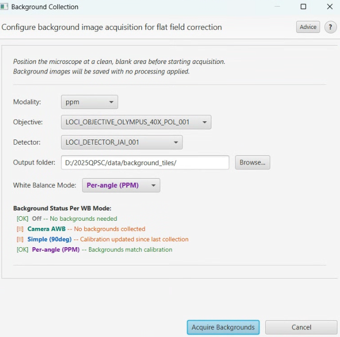
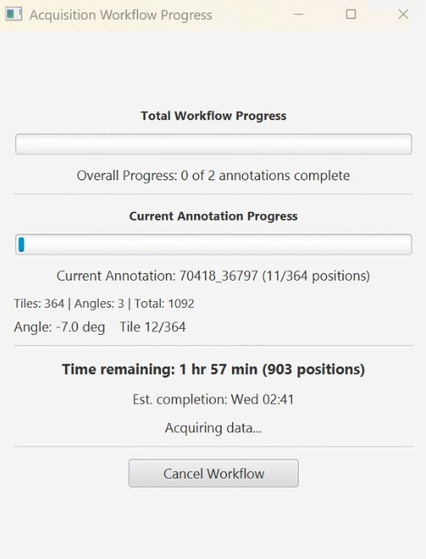

# Quick Start: Brightfield / PPM Acquisition

> Get from "everything is installed" to "I have my first calibrated, scanned image."

> [Back to README](../README.md) | [Workflows Guide](WORKFLOWS.md)

---

## Step 1: Start the Software (2 minutes)

QPSC uses three programs that work together. Start them **in this order**:

| Order | Program | What to Do |
|-------|---------|------------|
| 1st | **Micro-Manager** | Launch and load your hardware configuration. Verify the camera and stage respond. |
| 2nd | **Python Server** | Run `start_server.bat` (or `Launch-QPSC.ps1`). Wait for "Server ready." |
| 3rd | **QuPath** | Open QuPath. The "QP Scope" menu should appear. |

**Why three programs?** Micro-Manager controls the hardware. The Python server coordinates between QuPath and Micro-Manager. QuPath is your control center.

---

## Step 2: Verify Your Setup with the Live Viewer (2 minutes)

**Menu: Extensions -> QP Scope -> Acquisition Wizard...**

The Wizard automatically opens the Live Viewer and Stage Map.

**What you should see:** A live camera feed updating several times per second.

**Quick checks:**
- Arrow buttons move the image (stage is working)
- Z scroll changes focus (Z stage is working)
- Image is bright and evenly lit (lamp is on)

| Problem | Fix |
|---------|-----|
| Black screen | Turn on the lamp. Check Micro-Manager is running. |
| "Connection refused" | Start the Python server first. |
| Nothing moves | Initialize hardware in Micro-Manager. |

---

## Step 3: White Balance Calibration (3 minutes)

White balance ensures consistent color across your camera's RGB channels. **Do this before collecting background images.**

**Menu: Extensions -> QP Scope -> White Balance Calibration**

1. **Navigate to a blank area** of the slide -- clear glass with no tissue, ink, or debris. Use the Live Viewer to find a good spot.

2. **Select your hardware:**
   - **Objective:** Must match the objective you will use for acquisition
   - **Detector:** Your camera (e.g., JAI)

3. **Choose a WB mode:**
   - **Simple (90 deg)** -- Single calibration applied to all angles. Faster. Good for most brightfield work.
   - **Per-angle (PPM)** -- Separate calibration at each polarizer angle. Use for PPM multi-angle acquisition where color accuracy between angles matters.

   > **Important:** The WB mode you choose here must match the WB mode you select when acquiring tiles. The mode names are **color-coded** throughout QPSC to help you match them (Simple = blue, Per-angle = orange).

4. **Click Calibrate.** The system adjusts per-channel exposures iteratively. This takes 30-60 seconds.

For more details, see [White Balance Calibration](tools/white-balance-calibration.md).

---

## Step 4: Collect Background Images (3 minutes)

Background images correct for uneven illumination (flat-field correction). **Use the same blank area and objective as white balance.**

**Menu: Extensions -> QP Scope -> Collect Background Images**

1. **Stay on the blank area** from Step 3. Same slide, same position, same objective.

2. **Select hardware:** Modality, Objective, and Detector should match your acquisition plan.

3. **Choose the WB mode** that matches your white balance calibration:
   - If you calibrated **Simple** WB -> select **Simple** here
   - If you calibrated **Per-angle** WB -> select **Per-angle** here
   - Mismatched modes will show a warning

4. **Click Acquire Backgrounds.** The dialog stays open during collection. Wait for "Background collection complete!"

> **Tip:** Defocus slightly (1-2 Z steps) if the slide has minor scratches. Click the **Advice** button for more best practices.

For more details, see [Background Collection](tools/background-collection.md).

---

## Step 5: Navigate to Your Sample (2 minutes)

Now find the tissue you want to scan:

- **Stage Map:** If available, shows a bird's-eye view. Double-click to move.
- **Arrow buttons:** Use the Live Viewer's navigation controls. Start with 1 FOV step size for big moves, 1/4 FOV for fine positioning.
- **Focus:** Use Z scroll to bring tissue into sharp focus.

---

## Step 6: Run a Small Test Acquisition (5 minutes)

**Menu: Extensions -> QP Scope -> Bounded Acquisition**

1. **Sample Name:** Enter a name (e.g., "TestScan01").
2. **Hardware:** Modality, Objective, Detector should be pre-filled. **WB Mode** is now visible directly below Detector -- verify it matches your calibration.
3. **Center position:** Click **"Use Current Position as Center"**.
4. **Region size:** Start small: **Width: 1000, Height: 1000** (micrometers). This creates ~3x3 tiles.
5. **Check the preview:** Tile count, estimated time, and storage shown at the bottom.
6. **Click Start Acquisition.**

The progress dialog shows current tile, time remaining, and estimated completion. After tiles are captured, stitching runs automatically.

---

## Step 7: View Your Result (1 minute)

The stitched image opens in your QuPath project. You can zoom in, draw annotations, and measure features.

For a larger scan, repeat Step 6 with a bigger region (e.g., 5000 x 5000 um). The preview shows timing before you commit.

---

## Summary: Calibration Checklist

Before every imaging session, verify these in order:

- [ ] **Lamp warmed up** (5-10 minutes for stable color temperature)
- [ ] **Kohler illumination** set up for even illumination
- [ ] **White balance** calibrated for your objective + WB mode
- [ ] **Background images** collected for the same objective + WB mode
- [ ] **Autofocus** configured for your objective (optional but recommended)

The Acquisition Wizard checks calibration status automatically -- green dots mean you are ready.

---

## What's Next?

- **[Workflows Guide](WORKFLOWS.md)** -- Choose between Bounded, Existing Image, and Alignment workflows
- **[Autofocus Editor](tools/autofocus-editor.md)** -- Tune focus quality per objective
- **[Troubleshooting Guide](TROUBLESHOOTING.md)** -- Common issues and fixes

---

## Troubleshooting

| Problem | Quick Fix |
|---------|-----------|
| Black screen in Live Viewer | Check Micro-Manager is running and lamp is on |
| Stage does not move | Verify hardware in Micro-Manager |
| WB calibration fails | Make sure Live mode is off; check camera connection |
| Background "stale" warning | WB was recalibrated -- collect new backgrounds |
| Colors differ between angles | Use Per-angle WB mode instead of Simple |
| Focus looks wrong | Open [Autofocus Editor](tools/autofocus-editor.md), adjust search range |

For more help, see the full [Troubleshooting Guide](TROUBLESHOOTING.md).
