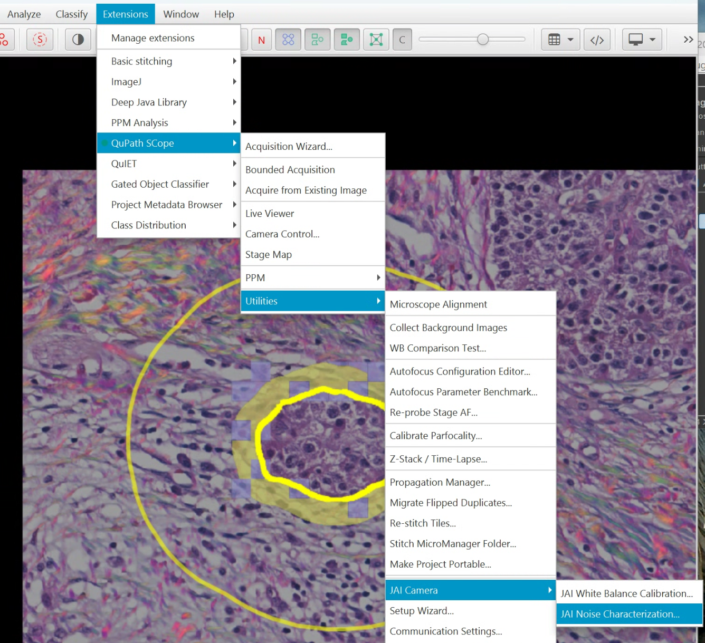

# QPSC Utilities Reference

This document provides an overview of all utilities available in the QPSC extension. Click any tool name for full documentation including all options, workflow details, and troubleshooting.

---

## Quick Reference

| Utility | Purpose | Menu Location |
|---------|---------|---------------|
| **Top-Level Menu** | | |
| [Acquisition Wizard](tools/acquisition-wizard.md) | Guided setup for new acquisitions | Extensions > QP Scope > Acquisition Wizard... |
| Bounded Acquisition | Direct bounding-box acquisition from stage coordinates | Extensions > QP Scope > Bounded Acquisition |
| Existing Image Acquisition | Targeted acquisition from annotations on existing images | Extensions > QP Scope > Acquire from Existing Image |
| [Live Camera Viewer](tools/live-viewer.md) | Real-time camera feed with integrated stage control | Extensions > QP Scope > Live Viewer |
| [Camera Control](tools/camera-control.md) | View/test camera exposure and gain settings | Extensions > QP Scope > Camera Control... |
| [Stage Map](tools/stage-map.md) | Visual map with slide positions and macro overlay | Extensions > QP Scope > Stage Map |
| **Utilities Submenu** | | |
| Microscope Alignment | Semi-automated alignment between QuPath and microscope | Extensions > QP Scope > Utilities > Microscope Alignment... |
| [Background Collection](tools/background-collection.md) | Capture flat-field correction images | Extensions > QP Scope > Utilities > Collect Background Images |
| [WB Comparison Test](tools/wb-comparison-test.md) | Compare white balance modes side-by-side | Extensions > QP Scope > Utilities > WB Comparison Test... |
| [Autofocus Editor](tools/autofocus-editor.md) | Configure per-objective autofocus parameters | Extensions > QP Scope > Utilities > Autofocus Configuration Editor... |
| [Autofocus Benchmark](tools/autofocus-benchmark.md) | Find optimal autofocus settings systematically | Extensions > QP Scope > Utilities > Autofocus Parameter Benchmark... |
| [Z-Stack / Time-Lapse](tools/z-stack-timelapse.md) | Single-tile Z-stack or time-lapse acquisition | Extensions > QP Scope > Utilities > Z-Stack / Time-Lapse... |
| [Propagation Manager](tools/propagation-manager.md) | Transfer objects between base and sub-images | Extensions > QP Scope > Utilities > Propagation Manager... |
| Re-stitch Tiles | Re-stitch tiles from a failed or incomplete acquisition | Extensions > QP Scope > Utilities > Re-stitch Tiles... |
| [Setup Wizard](tools/setup-wizard.md) | Create microscope config files (first-time setup) | Extensions > QP Scope > Utilities > Setup Wizard... |
| [Communication Settings](tools/server-connection.md) | Configure server connection and notification alerts | Extensions > QP Scope > Utilities > Communication Settings... |
| **JAI Camera Submenu** (conditional -- only when JAI detected) | | |
| [White Balance Calibration](tools/white-balance-calibration.md) | Calibrate JAI 3-CCD camera white balance | Extensions > QP Scope > Utilities > JAI Camera > White Balance... |
| [JAI Noise Characterization](tools/noise-characterization.md) | Measure camera noise statistics | Extensions > QP Scope > Utilities > JAI Camera > Noise Characterization... |
| **PPM Modality Submenu** (conditional -- only with PPM modality) | | |
| [Polarizer Calibration](https://github.com/uw-loci/qupath-extension-ppm/blob/master/documentation/polarizer-calibration.md) | Calibrate polarizer rotation stage | Scope > PPM > Polarizer Calibration (PPM)... |
| [PPM Reference Slide](https://github.com/uw-loci/qupath-extension-ppm/blob/master/documentation/ppm-reference-slide.md) | Hue-to-angle calibration from sunburst slide | Scope > PPM > PPM Reference Slide... |
| [PPM Sensitivity Test](https://github.com/uw-loci/qupath-extension-ppm/blob/master/documentation/ppm-sensitivity-test.md) | Test rotation stage precision | Scope > PPM > PPM Rotation Sensitivity Test... |
| [PPM Birefringence Optimization](https://github.com/uw-loci/qupath-extension-ppm/blob/master/documentation/ppm-birefringence-optimization.md) | Find optimal polarizer angle for maximum contrast | Scope > PPM > PPM Birefringence Optimization... |
| **PPM Analysis Extension** (separate extension) | | |
| [PPM Hue Range Filter](https://github.com/uw-loci/qupath-extension-ppm/blob/master/documentation/ppm-hue-range-filter.md) | Interactive HSV filtering for PPM images | Extensions > PPM Analysis > PPM Hue Range Filter... |
| [PPM Polarity Plot](https://github.com/uw-loci/qupath-extension-ppm/blob/master/documentation/ppm-polarity-plot.md) | Polar histogram visualization of fiber orientations | Extensions > PPM Analysis > PPM Polarity Plot... |
| [Surface Perpendicularity](https://github.com/uw-loci/qupath-extension-ppm/blob/master/documentation/surface-perpendicularity.md) | Fiber orientation relative to annotation boundaries | Extensions > PPM Analysis > Surface Perpendicularity... |
| [Batch PPM Analysis](https://github.com/uw-loci/qupath-extension-ppm/blob/master/documentation/batch-ppm-analysis.md) | Batch processing of PPM image sets | Extensions > PPM Analysis > Batch PPM Analysis... |

---

## Imaging & Stage Control

### [Live Camera Viewer](tools/live-viewer.md)

Real-time camera feed with integrated stage control, histogram, and noise statistics. The primary tool for verifying microscope communication, positioning the stage, and checking camera settings before acquisition. Includes a virtual joystick, saved stage positions, and per-channel saturation monitoring.

### [Camera Control](tools/camera-control.md)

View and test camera exposure and gain settings loaded from calibration profiles. Particularly useful for JAI 3-CCD camera white balance troubleshooting. Displays per-angle cards with exposure, gain, and an Apply button that sets camera settings and rotates the polarizer.

### [Stage Map](tools/stage-map.md)

Visual representation of the microscope stage insert showing slide positions and current stage location. Supports configurable macro image overlay for navigation context. Includes a scanner preset selector for choosing which scanner-to-stage alignment to use for the overlay (e.g., "Ocus40 to PPM").

If the microscope config has no `stage.inserts` block, the Stage Map synthesizes a single-slide insert at the center of `stage.limits` using `slide_size_um` for the slide footprint. This lets scopes with only basic stage-limits calibration get a working Stage Map without an explicit per-instrument insert block.

---

## Connection & Configuration

### [Setup Wizard](tools/setup-wizard.md)

Step-by-step wizard that creates all required microscope YAML configuration files. Appears automatically as the first menu item when no valid configuration is found. Guides users through hardware selection (objectives, detectors, stage), pixel size calibration, modality setup, and server connection. Uses a bundled catalog of known LOCI hardware for quick selection.

### [Communication Settings](tools/server-connection.md)

Configure and test the connection between QuPath and the microscope control server, and manage notification alerts. Includes connection, advanced timeout, status, and alerts tabs with push notification support via ntfy.sh.

### [Acquisition Wizard](tools/acquisition-wizard.md)

Guided setup wizard that walks new users through the complete first-time configuration process. Checks prerequisites (server connection, configuration files, calibrations) and launches the appropriate setup tools.

---

## Calibration Tools

### [White Balance Calibration](tools/white-balance-calibration.md)

Calibrate per-channel (R, G, B) exposure times for JAI 3-CCD prism cameras. Supports Simple (single angle) and PPM (4 angles) modes. Results are saved to YAML and used automatically by background collection and acquisition.

### [WB Comparison Test](tools/wb-comparison-test.md)

Acquire and display side-by-side images using different white balance modes. Helps users visually compare Off, Camera AWB, Simple, and Per-angle WB modes to select the best option for their sample.

### [Background Collection](tools/background-collection.md)

Acquire flat-field correction images with adaptive exposure control. Automatically adjusts exposure to reach target intensity at each angle. Supports per-channel white balance for JAI cameras.

### [Polarizer Calibration](https://github.com/uw-loci/qupath-extension-ppm/blob/master/documentation/polarizer-calibration.md)

Two-stage calibration (coarse sweep + fine sweep) to find the exact hardware offset for the PPM rotation stage. Determines the encoder position corresponding to crossed polarizers. Only needed after hardware installation or repositioning.

### [PPM Reference Slide (Sunburst Calibration)](https://github.com/uw-loci/qupath-extension-ppm/blob/master/documentation/ppm-reference-slide.md)

Create a hue-to-angle calibration from a reference slide with a sunburst pattern. Samples hue values along radial spokes and creates a linear regression for PPM image processing. Includes manual center selection and debug mask visualization.

### [Autofocus Configuration Editor](tools/autofocus-editor.md)

Configure per-objective autofocus parameters (n_steps, search_range_um, n_tiles) in an intuitive GUI. Supports editing multiple objectives before saving to YAML.

### [Autofocus Parameter Benchmark](tools/autofocus-benchmark.md)

Systematically find optimal autofocus settings by testing multiple parameter combinations at various defocus distances. Generates CSV results and performance recommendations.

### [JAI Noise Characterization](tools/noise-characterization.md)

Measure camera noise statistics (mean, standard deviation, SNR) with Quick, Full, or Custom presets. Useful for characterizing camera performance and detecting hardware issues.

---

## PPM Tools

PPM functionality is split across two extensions:
- **QPSC** (this extension): Hardware calibration and acquisition workflows under **Scope > PPM**
- **[qupath-extension-ppm](https://github.com/uw-loci/qupath-extension-ppm)**: Image analysis workflows under **Extensions > PPM Analysis** (no microscope needed)

PPM computations use the [ppm_library](https://github.com/uw-loci/ppm_library) Python package.

### Calibration & Hardware Validation (QPSC, Scope > PPM)

| Tool | Purpose | Requires | Full Docs |
|------|---------|----------|-----------|
| Polarizer Calibration | Calibrate rotation stage to find crossed polarizer positions | Connected microscope | [Guide](https://github.com/uw-loci/qupath-extension-ppm/blob/master/documentation/polarizer-calibration.md) |
| PPM Reference Slide | Hue-to-angle calibration from sunburst reference slide | Connected microscope | [Guide](https://github.com/uw-loci/qupath-extension-ppm/blob/master/documentation/ppm-reference-slide.md) |
| PPM Sensitivity Test | Test rotation stage precision and repeatability | Connected microscope | [Guide](https://github.com/uw-loci/qupath-extension-ppm/blob/master/documentation/ppm-sensitivity-test.md) |
| PPM Birefringence Optimization | Find optimal polarizer angle for maximum contrast | Connected microscope, sample slide | [Guide](https://github.com/uw-loci/qupath-extension-ppm/blob/master/documentation/ppm-birefringence-optimization.md) |

### Analysis Tools (PPM extension, Extensions > PPM Analysis)

**All analysis tools below require a completed [Sunburst Calibration](https://github.com/uw-loci/qupath-extension-ppm/blob/master/documentation/ppm-reference-slide.md)** (.npz file) and operate on PPM birefringence or sum images.

#### Interactive Analysis

| Tool | Purpose | Requires | Full Docs |
|------|---------|----------|-----------|
| PPM Hue Range Filter | Real-time overlay highlighting pixels whose fiber angle falls within a user-specified range | Sunburst calibration, open PPM image | [Guide](https://github.com/uw-loci/qupath-extension-ppm/blob/master/documentation/ppm-hue-range-filter.md) |
| PPM Polarity Plot | Rose diagram of fiber orientation distribution with circular statistics (mean, std, resultant length) | Sunburst calibration, open PPM image, selected annotation | [Guide](https://github.com/uw-loci/qupath-extension-ppm/blob/master/documentation/ppm-polarity-plot.md) |

### Boundary & Perpendicularity Analysis

| Tool | Purpose | Requires | Full Docs |
|------|---------|----------|-----------|
| Surface Perpendicularity (PS-TACS) | Score fiber orientation relative to annotation boundaries using the PS-TACS method | Sunburst calibration, open PPM birefringence image, boundary annotation (tissue interface) + region annotation (analysis zone), pixel classifier or thresholder for foreground segmentation | [Guide](https://github.com/uw-loci/qupath-extension-ppm/blob/master/documentation/surface-perpendicularity.md) |

### Batch & Project-Wide

| Tool | Purpose | Requires | Full Docs |
|------|---------|----------|-----------|
| Batch PPM Analysis | Run polarity and/or perpendicularity analysis across all annotations in a project; exports CSV | Sunburst calibration, project with annotated PPM images | [Guide](https://github.com/uw-loci/qupath-extension-ppm/blob/master/documentation/batch-ppm-analysis.md) |
| [Propagation Manager](tools/propagation-manager.md) | Bidirectional transfer of annotations/detections between base images and sub-images | Multi-sample project with sub-images, alignment transform | [Guide](tools/propagation-manager.md) |
| [Z-Stack / Time-Lapse](tools/z-stack-timelapse.md) | Single-tile Z-stack or time-lapse at current position | Microscope connection, positioned at area of interest | [Guide](tools/z-stack-timelapse.md) |

---

## Internal Utilities

### MacroImageAnalyzer (Tissue Detection)

`MacroImageAnalyzer` provides automatic tissue detection on macro/overview images. It is called internally by the Existing Image workflow when no annotations are present and the user chooses "Run tissue detection."

**Available Threshold Methods:**

| Method | Description |
|--------|-------------|
| Otsu | Standard Otsu thresholding on grayscale |
| Mean | Mean intensity threshold |
| Percentile | Percentile-based threshold |
| Fixed | User-specified fixed threshold value |
| H&E Eosin / H&E Dual / Color Deconvolution | Color-space methods for stained tissue |
| **Artifact-aware (ARTIFACT_FILTER)** | **Otsu with artifact masking and morphological cleanup** |

**ARTIFACT_FILTER Method (default):**

The artifact-aware method combines artifact masking with Otsu thresholding to handle slides that have pen marks, dust, or other non-tissue debris. The algorithm is inspired by LazySlide (Zheng et al. 2026, Nature Methods).

**How it works:**
1. For each pixel, compute an artifact score: `max(R-G, 0) * max(B-G, 0)`. Tissue is typically green-dominant (in grayscale terms), so pixels where both red and blue significantly exceed green are flagged as potential artifacts.
2. Apply Otsu thresholding to the artifact score image to classify artifact vs. non-artifact pixels.
3. Apply standard Otsu thresholding on the grayscale image for tissue vs. background segmentation.
4. Combine: a pixel is classified as tissue only if it passes the grayscale threshold AND is not flagged as an artifact.
5. Apply morphological cleanup (median filter + morphological closing) to remove noise and fill gaps.

**Configuration:** The artifact filter parameters (median kernel size, closing kernel size, closing iterations) are configurable via Preferences. See [Tissue Detection Parameters](PREFERENCES.md#tissue-detection-parameters) for details.

**No additional dependencies:** The artifact filter uses QuPath's bundled OpenCV -- no external libraries are required.

---

## See Also

- [Workflows Guide](WORKFLOWS.md) - Step-by-step workflow documentation
- [Preferences Reference](PREFERENCES.md) - All settings explained
- [Troubleshooting Guide](TROUBLESHOOTING.md) - Common issues and solutions
