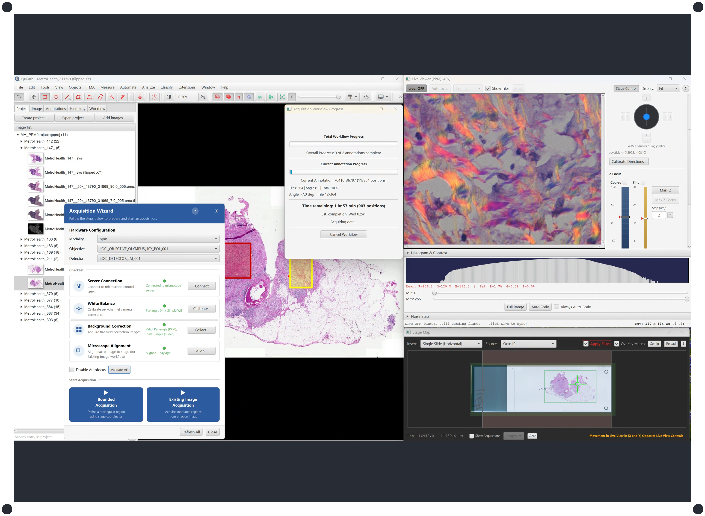

# QPSC Data Collection Workflows

QPSC connects QuPath to your microscope via Pycro-Manager and Micro-Manager. You draw annotations or define coordinates in QuPath, and QPSC moves the stage, captures tiles, stitches them, and imports the result back into your project -- all without leaving QuPath. This page helps you choose the right workflow and understand how the tools fit together. For installation instructions, see the [main README](../README.md).



> **First time with brightfield / PPM?** See the **[Brightfield Quick Start](QUICKSTART-BF.md)** to get your first image in 15 minutes.
>
> **First time with laser scanning / SHG?** See the **[Laser Scanning Quick Start](QUICKSTART-LSM.md)** for multiphoton-specific setup.

---

## Quick Reference

| I want to... | Workflow | Menu Path |
|--------------|----------|-----------|
| Scan a rectangular region by stage coordinates | [Bounded Acquisition](#workflow-1-bounded-acquisition) | Extensions -> QP Scope -> Bounded Acquisition |
| Acquire high-res images of annotated regions on an overview slide | [Acquire from Existing Image](#workflow-2-acquire-from-existing-image) | Extensions -> QP Scope -> Acquire from Existing Image |
| Acquire multi-channel widefield immunofluorescence (IF or BF+IF) | [Multi-Channel Acquisition](#multi-channel-acquisition-widefield-if-bfif) | Same menu entries as Bounded / Existing Image |
| Calibrate the coordinate link between a scanner image and the microscope | [Microscope Alignment](#workflow-3-microscope-alignment) | Extensions -> QP Scope -> Utilities -> Microscope Alignment |
| Get guided help through the full setup-to-acquisition process | [Acquisition Wizard](#acquisition-wizard) | Extensions -> QP Scope -> Acquisition Wizard... |

> **Multi-channel note:** Widefield immunofluorescence and combined Brightfield + IF are **not** separate menu items. They dispatch through the regular Bounded Acquisition and Acquire from Existing Image workflows whenever the selected acquisition profile's modality declares a `channels:` library in YAML. See [Multi-Channel Acquisition](#multi-channel-acquisition-widefield-if-bfif) below for what the picker looks like and how files land on disk.

---

## Before You Begin

### Platform Requirements

QPSC requires **Windows 10+** for microscope control. Most microscope hardware drivers (stages, cameras, rotation stages) are Windows-only, and Micro-Manager's device adapter ecosystem is most complete on Windows. Development and testing are done on Windows; Linux and macOS are not supported for acquisition.

### Startup Order (Every Session)

The three components must be started in this order:

| Step | Application | What to Do |
|------|-------------|------------|
| 1 | **Micro-Manager** | Launch and load your hardware configuration. Verify the camera and stage respond. |
| 2 | **Python Server** | Run `start_server.bat` (or `python -m microscope_command_server.server.qp_server`). Wait for "Server ready." |
| 3 | **QuPath** | Launch QuPath. The QP Scope menu will auto-connect if enabled in preferences. |

> **Tip:** If you installed QPSC with the [PPM-QuPath.ps1 installer](https://github.com/uw-loci/QPSC), it creates a `Launch-QPSC.ps1` script in your install directory that starts the Python server (and optionally QuPath) with package verification. You still need to start Micro-Manager manually first.
>
> For a simpler approach, create desktop shortcuts for all three applications arranged left-to-right in startup order. The `start_server.bat` script (in the microscope_command_server folder) activates the virtual environment and launches the server -- ideal as a desktop shortcut.

### First-Time Setup Checklist

If this is your first time, complete these additional steps. The **Acquisition Wizard** (Extensions -> QP Scope -> Acquisition Wizard...) checks each prerequisite and launches the right tool for you.

1. **Install QPSC and its dependencies.**
   The extension JAR, the tiles-to-pyramid extension JAR, and the Python microscope server must all be installed. See the [main README](../README.md) and [Installation Guide](INSTALLATION.md) for details.

2. **Create a microscope configuration file.**
   The **Setup Wizard** appears automatically on first launch and walks you through hardware selection, pixel size calibration, and server connection. See [Setup Wizard docs](tools/setup-wizard.md).

3. **Collect background images.**
   Used for flat-field correction. See [Background Collection docs](tools/background-collection.md).

4. **Calibrate white balance (JAI cameras only).**
   If using a JAI 3-CCD prism camera. See [White Balance Calibration docs](tools/white-balance-calibration.md).

5. **Configure autofocus (recommended).**
   Set search range, step size, and scoring method per objective. See [Autofocus Editor docs](tools/autofocus-editor.md) and [Autofocus System Overview](AUTOFOCUS.md) for how the system works.

6. **Configure laser scanning hardware (if applicable).**
   For SHG/multiphoton systems, configure laser, Pockels cell, PMT, and zoom settings. See [Laser Scanning Quick Start](QUICKSTART-LSM.md).

---

## Workflow 1: Bounded Acquisition

### What It Does

Bounded Acquisition scans a rectangular region of the slide defined by stage coordinates. QPSC creates a tile grid over the region, acquires every tile through the microscope, stitches them into a single high-resolution image, and adds that image to a QuPath project. Everything is configured in a single dialog.

### When You Need It

- You want to scan a region and do not have an existing overview/macro image of the slide.
- You know the approximate stage coordinates of the area you want (or you can read them from the Live Viewer or Stage Map).
- You are setting up a new sample and want a quick initial scan.

**Time-lapse:** The acquisition dialog has a collapsible **Time-Lapse Options** pane. Enable it to repeat the full region acquisition over multiple timepoints at a fixed interval. If a timepoint runs longer than the interval, QPSC shows a one-time "falling behind" warning (a modal dialog plus a push notification if alerts are configured) and continues to completion.

See [full documentation](tools/bounded-acquisition.md) for step-by-step instructions, all options, and troubleshooting.

---

## Workflow 2: Acquire from Existing Image

### What It Does

This workflow lets you target specific regions on an existing macro or overview image for high-resolution acquisition. You draw annotations on the overview image in QuPath, and QPSC transforms those annotation coordinates into physical stage positions, acquires tiles covering each annotated region, stitches them, and adds the results to your project.

### When You Need It

- You have a macro or overview image of your slide (from a slide scanner, low-magnification scan, or previous Bounded Acquisition).
- You want to acquire specific regions at higher magnification.
- You want to use tissue detection or manual annotations to define what to scan.

### Automatic Alignment for QPSC-Acquired Images

When you run this workflow on an image that was previously acquired through QPSC (Bounded Acquisition, Acquire from Existing Image, etc.), the workflow automatically detects the acquisition metadata embedded in that image and uses it for alignment. You do not need to manually create an alignment transform or specify a saved preset — QPSC-acquired images are recognized and aligned automatically. This is especially helpful for multi-step acquisitions where you acquire at low magnification, then acquire sub-regions at higher magnification from those results.

### Variations

**No annotations on the image:** If you start the workflow without annotations, QPSC offers three options: run automatic tissue detection (artifact-aware filtering is applied by default -- see [Preferences](PREFERENCES.md#tissue-detection-parameters) for tuning), draw annotations manually, or cancel.

**First-time alignment:** If no saved transform exists, the workflow prompts you to create one via the Microscope Alignment process. Once saved, the workflow continues from where it left off.

**Single-tile refinement:** When selected, QPSC acquires one reference tile and shows you the result so you can verify alignment before scanning all annotations. This catches minor drift without a full re-alignment.

See [full documentation](tools/existing-image-acquisition.md) for step-by-step instructions, all options, and troubleshooting.

### MS-Existing Image (experimental)

Enable **Enable Multi-Slide Workflow (experimental)** in Preferences to show the **MS-Existing Image (experimental)** menu entry. The menu item appears and disappears live when you toggle the preference — no restart required. It is a shepherding layer over Workflow 2 for slide carriers that hold multiple slides (currently the 4-slide vertical holder, `quad_v`):

1. Pick the carrier in the assignment dialog.
2. For each slot, assign one project macro entry (or check Skip).
3. Run the slots. There are three ways, and you can mix them:
   - **Run All Remaining** (semi-automated single pass) walks every not-yet-done slot in order -- the panel opens each macro entry and runs the full Existing Image workflow on it, advancing the slot to **Done** when acquisition completes and moving on. You still answer each slide's own dialogs (alignment, refinement, acquisition setup) as its turn comes up; the panel automates only the sequencing between slides.
   - **Two-pass (unattended acquire)** -- for a walk-away batch, first click **Set Up All Remaining**: this runs the interactive align + refine + tissue pass on every slot *without acquiring*, so each slot advances to **Set up (ready to acquire)** and remembers its acquisition settings. Then click **Acquire All Set-Up**: the panel acquires every set-up slot **unattended, with no dialogs**, replaying each slot's settings against the alignment saved during setup. Front-load all your decisions in the setup pass, then leave it running. **Tip:** choose **single-tile refinement** during each slot's setup -- the focus Z it establishes is carried into the unattended acquire pass to seed that slot's first-tile autofocus, so acquisition starts near focus instead of hunting. (With no refinement, the acquire pass still autofocuses from the current stage Z; it just has no head-start.)
   - Or drive one slot by hand with its row buttons: **Open** switches to that slot's macro entry, then **Run Single-Slide Workflow** launches the regular workflow on it.

   **Control buttons:**
   - **Stop after current slide** — Tick this checkbox to halt any of the batch drivers cleanly once the running slide finishes (an in-flight acquisition is never interrupted).
   - **Abort All** — Click this button to stop the batch driver immediately and prevent further slides from starting. A currently running acquisition still completes or cancels via its own dialog, but no new slides will be opened after this button is clicked.
   
   A slot advances to **Done** on a successful acquisition, or stays **In Progress** / **Set up** (so you can retry or Skip) if a run is cancelled at a gate or hits a handled error.
4. Once every slot is Done or Skipped, click **Finish** to see a summary.

**Slide orientation (label on either end):** each slot's orientation is established by *its own alignment during setup*, not by the holder calibration. The holder calibration is just a slot **center** (the midpoint of two diagonal corners), which is invariant to how the slide is rotated. Placing a slide with its label at the opposite end is a pure **180-degree rotation** about the slot center -- no mirror or inversion -- so tissue at the center stays centered and off-center tissue moves to the opposite end. A **manual (landmark) alignment** measures that rotation directly, so a rotated slide is handled correctly. The green-box / saved-preset alignment path assumes the macro's standard orientation, so **use manual alignment for any slot whose slide may be rotated** -- otherwise a rotated slide is targeted at the wrong end.

Each assigned entry gets `slide_position`, `slide_carrier`, and `ms_run_id` metadata so the run is auditable and partial runs are recoverable after a crash. The acquisition and alignment logic of each slot is unchanged from the single-slide Workflow 2 -- the two-pass mode just splits that same workflow into a setup half (which persists the per-slide alignment) and an acquire half (which replays it). This is an early experimental release.

---

## Workflow 3: Microscope Alignment

### What It Does

Microscope Alignment creates a coordinate transformation (affine transform) that maps pixel positions in your overview/macro image to physical stage positions on the microscope. Without it, the Existing Image workflow cannot navigate the stage to the correct locations.

### When You Need It

- **First time with a new scanner/microscope combination.** Each slide scanner produces images with different coordinate systems.
- **After hardware changes.** If the microscope stage, scanner, or optical path has been modified.
- **When acquired images do not line up with annotations.** This indicates the saved transform is no longer accurate.

You do *not* need to re-run alignment every time you load a new slide from the same scanner, as long as the slides are loaded consistently and the hardware has not changed.

### SIFT Auto-Alignment

An **Auto-Align (SIFT)** button is available in two places:

1. **Per-tile confirm during the 3-point Microscope Alignment workflow** -- once the stage is roughly close to a calibration tile, click Auto-Align (SIFT) to refine the last few microns before clicking *Current Position is Accurate*.
2. **The post-alignment Single-Tile Refinement step in the Existing Image Workflow** -- the dialog also offers Save / Skip / New Alignment because that step writes the per-slide JSON.

SIFT works best on tissue with visible structural features and handles different pixel sizes between the WSI and microscope automatically. It is a *refinement*, not a search -- the live view must already partially overlap the target tile (rule of thumb: a few hundred microns) for matching to succeed. Falls back to manual alignment if SIFT cannot find enough features.

Cross-modality matching (16-bit monochrome camera against 8-bit H&E WSI, the typical OWS3 / PPM brightfield case) is handled by configurable bit-depth normalization (`PERCENTILE` / `MIN_MAX` / `BIT_SHIFT`) plus optional CLAHE in the SIFT Settings dialog. Defaults are tuned for that scenario.

See [full documentation](tools/microscope-alignment.md) for step-by-step instructions, point distribution guidelines, flip/invert settings, and troubleshooting.

---

## Multi-Channel Acquisition (Widefield IF, BF+IF)

### When It Applies

There is no new menu entry for multi-channel acquisition. Any acquisition profile whose modality declares a `channels:` library in the microscope YAML automatically takes the channel path when you run it through either [Bounded Acquisition](#workflow-1-bounded-acquisition) or [Acquire from Existing Image](#workflow-2-acquire-from-existing-image). Pure-IF profiles use a modality of type `widefield` and combined BF+IF profiles use type `bf_if`; both flow through the same UI and the same acquisition code path.

Angle-based modalities (PPM) and channel-based modalities are mutually exclusive per acquisition. If a profile has a channel library, the angle axis is suppressed; if it does not, the workflow falls back to the existing single-snap / multi-angle path unchanged.

### Picking a Channel-Based Profile

The modality dropdown in the sample setup dialog now shows enhanced profile keys (e.g. `Fluorescence_10x`, `BF_IF_20x`) rather than raw modality types. Picking any enhanced key that resolves to a `widefield` or `bf_if` modality lights up the Fluorescence Channels panel further down the dialog. If your OWS3 (or other scope with a channel library) has both a `Fluorescence_10x` and a `BF_IF_10x` profile, pick the one that matches what you want to collect -- there is no way to toggle BF on/off after the fact because the BF entry is declared in the library for `bf_if` only.

### What You See in the UI

When a channel-based profile is selected, the acquisition dialog grows a **Fluorescence Channels** panel below the main settings. The panel shows:

- A **"Customize channel selection for this acquisition"** master checkbox.
- One row per channel from the library, each with:
  - A **Use** checkbox
  - The channel's display name
  - A per-channel **Exposure (ms)** spinner
  - A per-channel **Intensity** spinner (only for channels whose YAML library entry declares an `intensity_property`; greyed out otherwise)
  - A **Focus** radio button (one and only one channel per acquisition can be the focus channel)
  - A **Split** checkbox (write this channel as its own separate stitched file instead of merging; only enabled when the row is selected)
- A **Preset** bar (when master checkbox is enabled) with a dropdown to load saved presets, and **Save...** / **Delete** buttons to manage them. This lets you quickly recall and reapply previous channel configurations.
- A **Test Current Channel** button (when master checkbox is enabled) to verify a single selected channel's hardware settings by applying it to the microscope and opening the Live Viewer. Useful for dialing in exposure and intensity values before starting a full acquisition.
- A **Stitched output** dropdown (above the channel grid) to control how the stitched channels are grouped: **Single combined file** merges all channels into one multichannel image, or **Separate file per channel** writes each channel as its own file. Individual per-channel "Split" checkboxes give finer control: when set to "Single combined file," only the split channels are written separately and the rest are merged.

Default behavior (master checkbox OFF): the acquisition uses every channel in the library at its YAML-declared exposure and intensity. The Use/Exposure/Intensity controls are greyed out. The Focus radio buttons remain active so you can pick which channel drives autofocus even when you are not customizing anything else.

Customized behavior (master checkbox ON): the per-row controls are enabled. Only checked channels are acquired, in library order, at the exposure and intensity values shown in their spinners. Per-channel selections, exposures, intensities, and the focus-channel pick are persisted between sessions (see [PREFERENCES.md](PREFERENCES.md#channel-picker-persistent-preferences) for the exact keys).

**Focus channel:** The channel you mark as the focus channel is always collected first for every tile. Autofocus runs against that channel's image, and the resulting Z position is reused for the remaining channels in the tile. Pick the channel with the strongest, most focus-sensitive signal for your sample -- DAPI for nuclear stains, FITC/GFP for cytoplasmic markers, BF for BF+IF profiles with bright transmitted light. Picking a dim or sparse channel as the focus channel is a fast way to get drifted, out-of-focus stacks.

If the master checkbox is on and you uncheck every channel row, the workflow refuses to start the acquisition with a clear error -- zero-channel acquisitions are blocked rather than silently falling back to the full library.

### What Lands on Disk

Each channel gets its own per-tile directory, mirroring the PPM per-angle layout:

```
{projectsFolder}/{sample}/{profile}_{n}/{annotation}/
    BF/tile_0_0.tif
    BF/tile_0_1.tif
    DAPI/tile_0_0.tif
    DAPI/tile_0_1.tif
    FITC/...
    TRITC/...
    Cy5/...
    TileConfiguration.txt
```

After the tile loop finishes, each channel subdirectory is stitched independently into its own single-channel pyramidal OME-TIFF (via `StitchingHelper.stitchChannelDirectories`, which reuses the same helper that PPM uses per angle).

**Channel Grouping in Output:** The stitched channels are then partitioned based on the "Stitched output" dropdown and per-channel "Split" settings:

- **Channels marked "Split" or when "Separate file per channel" is selected** are imported into the QuPath project as individual entries, one per channel.
- **Remaining channels** (unmarked when "Single combined file" is selected) are merged into a single multichannel output with `ChannelMerger` / `ChannelMergeImageServer` from the [qupath-extension-tiles-to-pyramid](https://github.com/uw-loci/qupath-extension-tiles-to-pyramid) extension. If only one channel remains to be merged, it is imported directly as its own entry (the merger requires at least two inputs).

**Merged Filename Convention**

Merged (multichannel) files use a short-modality prefix:

```
<sample>_<short_modality>_NNN.ome.tif
```

For example: `PollenIF_fl_001.ome.tif` for a widefield fluorescence acquisition of the `PollenIF` sample, or `SkinBiopsy_bf_if_003.ome.tif` for the third combined BF+IF acquisition on `SkinBiopsy`. The short modality slug (`fl` for `widefield`, `bf_if` for `bf_if`) is chosen per modality type and the zero-padded counter is per annotation.

Split (per-channel) files keep the name of their own per-channel stitched pyramid (which encodes the channel id) and are imported as separate project entries.

When the "Single combined file" default is used with no channels split, only the merged multichannel file is added to the QuPath project; the per-channel intermediate OME-TIFFs are written with `skipProjectImport: true` so they stay on disk as recovery artifacts but never clutter the project tree (you will not see single-channel entries flash into existence during acquisition). Channels you split out -- and every channel under "Separate file per channel" -- are instead imported as their own entries.

### BF+IF on Single-Camera Scopes

On instruments with one camera that can be switched between a transmitted port and an epi port (e.g. OWS3), combined brightfield + IF acquisition is available as its own `bf_if` modality. A single profile (e.g. `BF_IF_20x`) acquires the BF tile and the N IF channels in sequence for every tile position. There is nothing special about the BF step in the code path -- it is just one entry in the channel library. Its `mm_setup_presets` switch the light path back to transmitted before the snap, and its `intensity_property` points at the transmitted lamp (e.g. `DiaLamp.Intensity`) rather than at a DLED wavelength so the Intensity spinner in the channel picker controls the brightfield lamp directly.

Everything downstream (per-tile layout, per-channel stitching, multichannel merge, merged filename with `bf_if` prefix) is identical to pure IF. You can mark BF as the focus channel on BF+IF profiles, which is typically the right choice on samples with strong transmitted contrast because BF focuses far more reliably than sparse fluorescence.

### Autofocus Strategy Override (partial feature)

When the v2 `autofocus_<scope>.yml` schema is present, the per-modality autofocus strategy (dense / sparse / dark-field / manual_only / etc.) is resolved at acquisition start and logged as part of the run banner. You can see which strategy was picked in the server log under the autofocus loader.

> **Note:** The Java UI dropdown for "AF strategy: from config / dense / sparse / dark-field / manual_only" is **not yet wired up**. Selecting a strategy in the GUI has no effect at acquisition time. To tune AF strategies today, hand-edit `autofocus_<scope>.yml` in your microscope configurations directory and restart the acquisition. A full GUI editor for per-modality strategies is a follow-up feature and is deliberately deferred.

### Learn More / Troubleshooting

- [CHANNELS.md](CHANNELS.md) -- YAML schema, profile-level overrides, the extended `device_properties` merge rule, and channel-specific troubleshooting.
- [TROUBLESHOOTING.md](TROUBLESHOOTING.md#multi-channel-acquisition) -- quick fixes for the most common multi-channel failures.
- `../../QPSC/docs/multichannel-if-overview.md` -- cross-repo design overview and the end-to-end OWS3 example.

---

## Calibration & Setup Tools

Configure these before your first acquisition. Most only need to be run once (or when hardware changes). Click each link for full documentation.

| Tool | When to Run | Docs |
|------|-------------|------|
| **Acquisition Wizard** | Use for guided setup -- checks all prerequisites and launches the right tools. | [Acquisition Wizard](tools/acquisition-wizard.md) |
| **Communication Settings** | Configure and test the socket connection to the microscope server. Set up push notifications for long acquisitions. | [Communication Settings](tools/server-connection.md) |
| **Background Collection** | Collect flat-field correction images. Run after changing objectives, detectors, or illumination. | [Background Collection](tools/background-collection.md) |
| **White Balance Calibration** | Calibrate per-channel R/G/B exposures for JAI 3-CCD cameras. Run before background collection. | [White Balance Calibration](tools/white-balance-calibration.md) |
| **Autofocus Editor** | Configure per-objective autofocus parameters (search range, step count, frequency). | [Autofocus Editor](tools/autofocus-editor.md) |
| **Setup Wizard** | First-time microscope configuration. Creates YAML config files. Appears automatically when no config is found. | [Setup Wizard](tools/setup-wizard.md) |

---

## Utility Tools

These tools help you monitor and control the microscope during your work session.

| Tool | What It Does | Docs |
|------|-------------|------|
| **Live Viewer** | Real-time camera feed with stage controls, histogram, and noise statistics. Use to navigate, verify focus, and check exposure. | [Live Viewer](tools/live-viewer.md) |
| **Stage Map** | Bird's-eye view of the stage insert showing slide positions and current objective location. Double-click to navigate. | [Stage Map](tools/stage-map.md) |
| **Camera Control** | View and test camera exposure/gain settings from calibration profiles. Testing only -- changes are not saved to YAML. | [Camera Control](tools/camera-control.md) |
| **Stitching Recovery** | Re-run stitching on previously acquired tiles if stitching failed. | -- |
| **[Propagation Manager](tools/propagation-manager.md)** | Transfer annotations/detections between base images and sub-images. Supports forward (base->sub) and back (sub->base) with base variant selection. | [Guide](tools/propagation-manager.md) |
| **[Z-Stack / Time-Lapse](tools/z-stack-timelapse.md)** | Single-tile Z-stack or time-lapse acquisition at the current stage position. | [Guide](tools/z-stack-timelapse.md) |

---

## Putting It All Together: Typical Session

A typical data collection session looks like this:

1. **Start the microscope server** on the microscope computer.
2. **Open QuPath** and verify the connection via the Acquisition Wizard or Communication Settings.
3. **Load your slide** on the microscope stage.
4. **Quick look around** -- Open the Live Viewer to navigate the slide and find the area of interest. Use the Stage Map for orientation.
5. **Choose your workflow:**
   - If you have an overview/macro image -> [Acquire from Existing Image](#workflow-2-acquire-from-existing-image)
   - If you want to scan by coordinates -> [Bounded Acquisition](#workflow-1-bounded-acquisition)
6. **Run the acquisition.** Configure the dialog, click OK, and monitor the progress bar.
7. **Review results** in the QuPath project. Inspect stitched images, overlay with annotations, and proceed to analysis.

---

## See Also

- [Utilities Reference](UTILITIES.md) -- All tools with full option documentation
- [Preferences Reference](PREFERENCES.md) -- Every setting explained
- [Troubleshooting Guide](TROUBLESHOOTING.md) -- Common issues and solutions
- [Main README](../README.md) -- Installation and system overview
