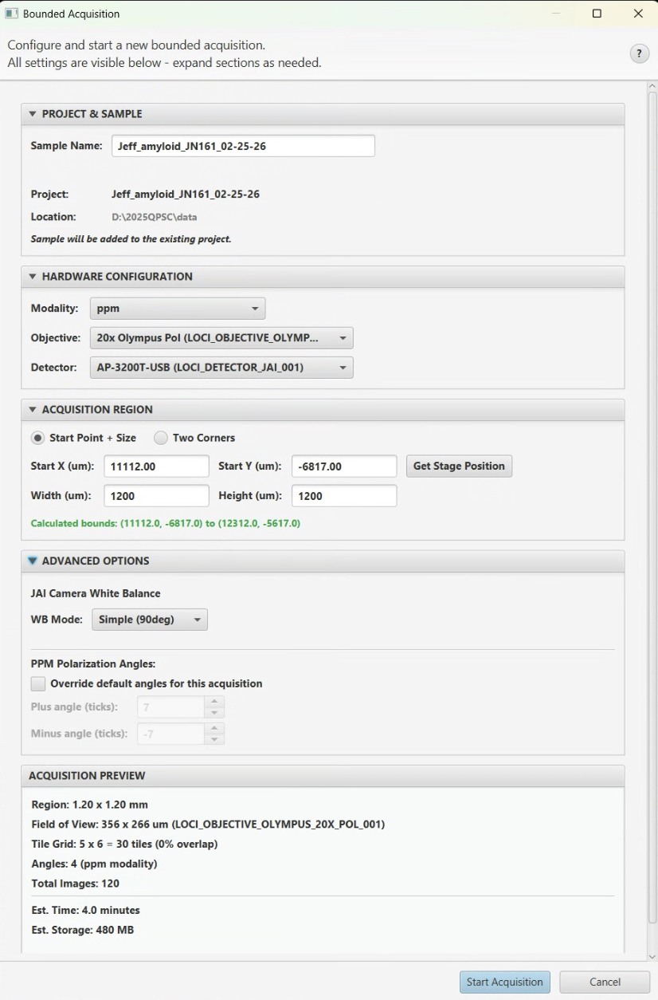
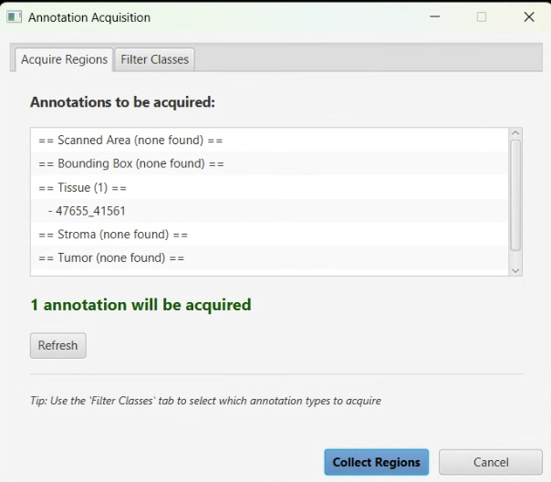
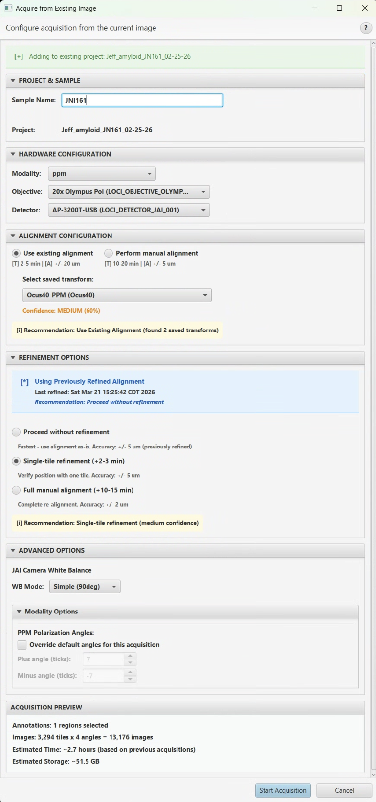

# QPSC Data Collection Workflows

This guide walks you through every step of collecting microscopy data with QPSC. Whether you are scanning a new slide region from scratch or targeting specific areas on an existing overview image, the instructions here will get you from setup to final stitched image.

QPSC (QuPath Scope Control) connects QuPath to your microscope via Pycro-Manager and Micro-Manager. You draw annotations or define coordinates in QuPath, and QPSC moves the stage, captures tiles, stitches them, and imports the result back into your project -- all without leaving QuPath. For installation instructions, see the [main README](../README.md) or the system-level guide at <https://github.com/uw-loci/QPSC>.

---

## Quick Reference

| I want to... | Workflow | Menu Path |
|--------------|----------|-----------|
| Scan a rectangular region by stage coordinates | [Bounded Acquisition](#workflow-1-bounded-acquisition) | Extensions -> QP Scope -> Bounded Acquisition |
| Acquire high-res images of annotated regions on an overview slide | [Acquire from Existing Image](#workflow-2-acquire-from-existing-image) | Extensions -> QP Scope -> Acquire from Existing Image |
| Calibrate the coordinate link between a scanner image and the microscope | [Microscope Alignment](#workflow-3-microscope-alignment) | Extensions -> QP Scope -> Utilities -> Microscope Alignment |
| Get guided help through the full setup-to-acquisition process | [Acquisition Wizard](#acquisition-wizard) | Extensions -> QP Scope -> Acquisition Wizard... |

---

## Before You Begin: Prerequisites Checklist

Complete these steps before running any acquisition workflow. If you are unsure about any of them, open the **Acquisition Wizard** (Extensions -> QP Scope -> Acquisition Wizard...) -- it checks each prerequisite and launches the right tool for you.

1. **Install QPSC and its dependencies.**
   The extension JAR, the tiles-to-pyramid extension JAR, and the Python microscope server must all be installed. See the [main README](../README.md) for details.

2. **Create a microscope configuration file.**
   If this is your first time, the **Setup Wizard** (Extensions -> QP Scope -> Utilities -> Setup Wizard...) will appear automatically. It walks you through hardware selection, pixel size calibration, and server connection. See [Setup Wizard docs](tools/setup-wizard.md).

3. **Start the Python microscope server.**
   On the microscope computer, launch the `microscope_command_server`. QPSC communicates with the microscope over a socket connection.

4. **Connect QuPath to the server.**
   Open Communication Settings (Extensions -> QP Scope -> Utilities -> Communication Settings...) and click *Test Connection*. You should see a green status and the current stage position. See [Communication Settings docs](tools/server-connection.md).

5. **Collect background images (recommended).**
   Background images are used for flat-field correction. Move to a blank area of your slide and run the Background Collection tool. See [Background Collection docs](tools/background-collection.md).

6. **Calibrate white balance (JAI cameras only).**
   If you are using a JAI 3-CCD prism camera, run white balance calibration before your first acquisition. See [White Balance Calibration docs](tools/white-balance-calibration.md).

7. **Configure autofocus (optional but recommended).**
   Open the Autofocus Configuration Editor to set search range, step size, and scoring method for each objective. See [Autofocus Editor docs](tools/autofocus-editor.md).

Once these steps are complete, you are ready to acquire data.

---

## Workflow 1: Bounded Acquisition

### What It Does

Bounded Acquisition scans a rectangular region of the slide defined by stage coordinates. QPSC creates a tile grid over the region, acquires every tile through the microscope, stitches them into a single high-resolution image, and adds that image to a QuPath project. Everything is configured in a single dialog.

### When You Need It

- You want to scan a region and do not have an existing overview/macro image of the slide.
- You know the approximate stage coordinates of the area you want (or you can read them from the Live Viewer or Stage Map).
- You are setting up a new sample and want a quick initial scan.

### Prerequisites

- Python microscope server running and connected (check via Communication Settings).
- Valid microscope configuration loaded.
- Background images collected (recommended for flat-field correction).
- Micro-Manager hardware initialized.

### Step-by-Step

**1. Open the Bounded Acquisition dialog.**

Go to *Extensions -> QP Scope -> Bounded Acquisition*.

QPSC connects to the microscope server automatically. If the connection fails, you will see an error -- start the server and try again.

**2. Configure sample and project.**

- **Sample Name** -- Give your acquisition a name (e.g., "Kidney_Section_01"). This becomes the project folder name. Invalid characters and Windows reserved names are blocked automatically.
- **Projects Folder** -- If no QuPath project is currently open, choose where to create one. If a project is already open, QPSC adds the new image to it.

**3. Select hardware.**

- **Modality** -- Choose the imaging mode (e.g., "ppm_20x" for polarized light, "bf_10x" for brightfield). The available options come from your YAML configuration.
- **Objective** -- Filters based on the selected modality.
- **Detector** -- Filters based on the selected objective.

These selections determine the camera field of view, pixel size, and available rotation angles.

**4. Define the acquisition region.**

Two input modes are available:

- *Start Point + Size* -- Enter a starting X/Y position (in micrometers) and the width/height of the region. Click **Get Stage Position** to auto-fill the start coordinates from the current stage location.
- *Two Corners* -- Enter the coordinates of two opposite corners of the rectangle.

The dialog shows a real-time preview of the tile grid, including the number of tiles, estimated acquisition time, and storage size.

**5. Configure white balance mode.**

Select a white balance mode from the dropdown. Options depend on your camera and modality. For PPM with a JAI camera, "per_angle" is recommended.

**6. (Optional) Adjust advanced settings.**

Expand the Advanced section to override individual rotation angles or exposure times if needed for this specific acquisition.

**7. Click OK to start.**

QPSC will:

- Create (or reuse) a QuPath project.
- Compute the tile grid and write a TileConfiguration file.
- Send the acquisition command to the microscope server.
- Show a progress bar tracking tile completion.
- Automatically stitch tiles when acquisition finishes.
- Add the stitched image to the QuPath project.

**8. Review the result.**

When stitching completes, a notification appears and the image is available in the QuPath project. Open it from the project panel to inspect. Tiles may be deleted, zipped, or kept depending on your tile handling preference (set in Edit -> Preferences -> QP Scope).

### What to Expect After Completion

- A new stitched OME-TIFF (or OME-ZARR) image in your QuPath project.
- Full acquisition metadata stored in the project (modality, objective, pixel size, stage coordinates, angles, timestamps).
- If running PPM, one stitched image per rotation angle is created.

### Common Issues

| Problem | Solution |
|---------|----------|
| "Connection refused" | Start the Python microscope server and check Communication Settings. |
| Stage does not move | Verify Micro-Manager hardware is initialized. |
| Black images | Check illumination source and exposure settings. |
| Stitching fails | Verify sufficient disk space and that tiles-to-pyramid extension is installed. |

For full option details, see the [Bounded Acquisition reference](tools/bounded-acquisition.md).

---

## Workflow 2: Acquire from Existing Image

### What It Does

This workflow lets you target specific regions on an existing macro or overview image for high-resolution acquisition. You draw annotations on the overview image in QuPath, and QPSC transforms those annotation coordinates into physical stage positions, acquires tiles covering each annotated region, stitches them, and adds the results to your project.

This is the most common workflow for researchers who already have a scanned slide and want to zoom in on regions of interest.

### When You Need It

- You have a macro or overview image of your slide (from a slide scanner, low-magnification scan, or previous Bounded Acquisition).
- You want to acquire specific regions at higher magnification.
- You want to use tissue detection or manual annotations to define what to scan.

### Prerequisites

- An image must be open in QuPath (either in a project or dragged into the viewer).
- The Python microscope server must be running and connected.
- A coordinate alignment (transform) must exist or be created during the workflow. See [Microscope Alignment](#workflow-3-microscope-alignment).
- The image should have pixel size calibration set.

### Entry Points

The workflow adapts based on your starting conditions:

- **Image with annotations** -- If the open image already has annotations with classification labels (e.g., "Tissue", "ROI"), the workflow starts by asking which annotation classes to include.
- **Image without annotations** -- If no annotations exist, the workflow will offer to run tissue detection or let you draw annotations manually before proceeding.
- **With an existing project** -- New acquisitions are added to the current project.
- **Standalone image (no project)** -- The workflow creates a new project. Any annotations you drew before starting are automatically preserved and restored in the new project.

### Step-by-Step (Common Case: Image with Annotations)

**1. Open the image and draw annotations.**

Open your macro/overview image in QuPath. Use QuPath's annotation tools (rectangle, polygon, brush, or wand) to mark the regions you want to acquire at high resolution. Assign each annotation a classification (right-click -> Set class) such as "Tissue" or "ROI".

**2. Launch the workflow.**

Go to *Extensions -> QP Scope -> Acquire from Existing Image*.

The menu item is only enabled when an image is open.

**3. Select annotation classes.**

If annotations with classification labels exist, a dialog shows all available classes with counts. Check the classes you want to include and click OK.

**4. Configure the acquisition.**

A consolidated dialog appears with several sections:

The dialog is divided into collapsible sections (shown below). You can expand or collapse each section by clicking its header.

- **Project & Sample** -- The sample name defaults to the image filename. If no project is open, choose a projects folder. If a project is open, it will be reused automatically.
- **Hardware Configuration** -- Select modality, objective, and detector (same as Bounded Acquisition).
- **Alignment** -- Choose how to link image coordinates to stage positions:
  - *Use existing transform* -- Select a previously saved alignment from the dropdown. A confidence indicator helps you decide if the transform is reliable.
  - *Create new alignment* -- Opens the alignment workflow to create a new transform.
- **Refinement** -- Choose how much to verify the alignment before scanning:
  - *No refinement* (fastest) -- Trust the saved transform and proceed immediately.
  - *Single-tile refinement* (recommended) -- Acquire one reference tile and visually verify its position. This catches small drift without a full re-alignment.
  - *Full manual alignment* -- Run the complete point-matching alignment process. Use this the first time or after hardware changes.
- **White Balance** -- Select the white balance mode.
- **Advanced Options** -- Override rotation angles, adjust green box detection parameters, or configure modality-specific settings.

The dialog shows a preview with tile count, estimated time, and storage requirements for the selected annotations.

**5. Click OK to start.**

QPSC will:

- Set up or reuse the QuPath project.
- Validate and apply the coordinate transform (including optional refinement).
- Flip the image if necessary for correct coordinate mapping.
- Create tile grids for each annotation.
- Acquire tiles for each annotated region in sequence.
- Stitch each region and add the result to the project.

**6. Review results.**

Each annotated region produces a separate stitched image in the project. Images include metadata linking them back to the parent overview image.

### Variations

**No annotations on the image:**

If you start the workflow without annotations, QPSC presents three options:

- **Run tissue detection** -- QPSC applies automatic tissue detection to find regions of interest. Detected regions become annotations with the "Tissue" class.
- **Draw annotations manually** -- The dialog waits while you draw annotations in QuPath, then re-checks for them.
- **Cancel** -- Exit the workflow to prepare the image further.

**First-time alignment:**

If no saved transform exists for this slide/scanner combination:

1. QPSC will prompt you to create one.
2. The workflow routes to the Microscope Alignment process (see below).
3. Once alignment is saved, the Existing Image workflow continues from where it left off.

**Single-tile refinement details:**

When you choose single-tile refinement, QPSC:

1. Picks a reference location from your annotations.
2. Acquires a single tile at that location using the current transform.
3. Shows you the result so you can verify alignment.
4. If the alignment looks off, you can adjust it. The refined transform is saved for future use.

### What to Expect After Completion

- One stitched image per annotation region, added to the QuPath project.
- Each image has metadata recording the parent image, acquisition parameters, and coordinate transform used.
- If PPM modality was used, one stitched image per angle per region is created.
- A completion notification and audio beep (if enabled).

### Common Issues

| Problem | Solution |
|---------|----------|
| "No annotations found" | Draw annotations on the image and assign them a class before starting. |
| "Transform validation failed" | Run refinement or create a new alignment. |
| Acquired images appear shifted | Check flip/invert settings in Preferences (see [Preferences docs](PREFERENCES.md)). |
| "Pixel size not set" | Set the image pixel size in QuPath (Image -> Set image type, or check image properties). |
| "Not Connected" | Open Communication Settings and connect to the server first. |

For full option details, see the [Existing Image Acquisition reference](tools/existing-image-acquisition.md).

---

## Workflow 3: Microscope Alignment

### What It Does

Microscope Alignment creates a coordinate transformation (affine transform) that maps pixel positions in your overview/macro image to physical stage positions on the microscope. This transform is what allows the "Acquire from Existing Image" workflow to navigate the stage to exactly the right locations. Without it, QPSC would not know where on the slide your annotations correspond to.

### When You Need It

- **First time with a new scanner/microscope combination.** Each slide scanner produces images with different coordinate systems, so you need one alignment per scanner type.
- **After hardware changes.** If the microscope stage, scanner, or optical path has been modified.
- **When acquired images do not line up with annotations.** This indicates the saved transform is no longer accurate.

You do *not* need to re-run alignment every time you load a new slide from the same scanner, as long as the slides are loaded consistently and the hardware has not changed.

### Prerequisites

- A macro/overview image loaded in QuPath with pixel size calibration.
- The microscope server must be connected.
- The stage must be able to move to known positions.
- The image should contain visible features that you can also see through the microscope (tissue edges, landmarks, etc.).

### Entry Points

- **Direct launch:** Extensions -> QP Scope -> Utilities -> Microscope Alignment
- **From the Acquisition Wizard:** Click the alignment step in the wizard checklist.
- **From the Existing Image workflow:** If no saved transform exists, you will be prompted to create one.

The menu item is only enabled when a macro image is available (either directly from the current image or traceable through project metadata).

### Step-by-Step

**1. Select the source microscope.**

A dialog asks which microscope/scanner produced the overview image. This selection determines where the alignment is saved and which hardware parameters are used.

**2. Configure sample details.**

Enter a sample name or accept the default (derived from the current project name). Choose the projects folder if needed.

**3. Set up the alignment view.**

The alignment dialog shows the macro image alongside controls for recording calibration points. You will match features visible in the macro image to their physical positions on the stage.

**4. Mark calibration points.**

For each point:

1. **In QuPath:** Click on a recognizable feature in the macro image (a tissue edge, a corner, a distinctive landmark).
2. **At the microscope:** Navigate the stage to the same physical feature. Use the Live Viewer or Stage Map if helpful.
3. **Record:** Click "Record Point" to capture both the image pixel coordinate and the stage position.
4. **Repeat:** Mark at least 3 points (more is better -- 5-8 points spread across the image gives the best results).

*Point distribution matters.* Spread your points across the entire image. Cover corners and center if possible. Do not cluster all points in one area -- the transform needs spatial diversity to be accurate.

**5. Calculate the transform.**

Click **Calculate Transform**. QPSC computes a best-fit affine transformation and shows quality metrics:

| Metric | Good Value | What It Means |
|--------|------------|---------------|
| Mean Error | < 50 um | Average positioning error across all points |
| Max Error | < 100 um | Worst-case error for any single point |
| R-squared | > 0.99 | Overall fit quality (1.0 = perfect) |

If the numbers look poor, check for mismatched point pairs or add more points.

**6. Validate the transform.**

Test the result by selecting a validation point (ideally one *not* used in the calculation):

1. Click **Go To Point** to send the stage to the predicted position.
2. Look through the microscope or the Live Viewer to verify the stage landed on the expected feature.
3. If it is off by more than expected, consider adding more calibration points or checking flip/invert settings.

**7. Save the transform.**

Give the transform a descriptive name (e.g., "Zeiss_AxioScan_2026-03") and save it. The transform is stored in the configuration folder and appears in the dropdown when running the Existing Image workflow.

### Understanding Flip and Invert Settings

Two independent corrections may be needed:

- **Image Flipping** (optical property) -- The microscope's light path can optically flip the image relative to stage coordinates. If the macro image appears mirrored compared to what you see through the eyepiece, enable flip X and/or flip Y in Preferences.
- **Stage Inversion** (coordinate direction) -- Some stages define positive X as moving left instead of right (or positive Y as down instead of up). If the stage moves in the opposite direction from what you expect, toggle the invert X or invert Y setting.

These are independent. An image can be flipped without the stage being inverted, or vice versa, or both. See the [Preferences docs](PREFERENCES.md) for where to set these values.

### What to Expect After Completion

- A saved coordinate transform that can be selected in the Existing Image workflow.
- The transform is reusable across slides from the same scanner, as long as hardware has not changed.
- Multiple transforms can be saved for different conditions (different scanners, different magnifications).

### Common Issues

| Problem | Solution |
|---------|----------|
| Large mean error (> 100 um) | Re-mark points more carefully or add more points spread across the image. |
| Stage moves in the wrong direction | Toggle Invert X or Y in Preferences. |
| Image appears mirrored | Toggle Flip X or Y in Preferences. |
| Points do not form a consistent pattern | Verify each point pair is correctly matched (image point matches the same physical feature as the stage point). |

For full option details, see the [Microscope Alignment reference](tools/microscope-alignment.md).

---

## Calibration & Setup Tools

These tools should be configured before your first acquisition. Most only need to be run once (or when hardware changes). Brief descriptions are below; click the links for full documentation.

### Acquisition Wizard

**Menu:** Extensions -> QP Scope -> Acquisition Wizard...

A guided dashboard that checks all prerequisites and walks you through the setup process. It shows live status indicators for server connection, white balance calibration, background collection, and alignment. If anything is missing, click the step to launch the appropriate tool. When everything is green, launch Bounded Acquisition or Existing Image directly from the wizard.

Full documentation: [Acquisition Wizard](tools/acquisition-wizard.md)

### Communication Settings

**Menu:** Extensions -> QP Scope -> Utilities -> Communication Settings...

Configure and test the socket connection between QuPath and the microscope server. Set the host address and port, test connectivity, configure timeouts, and set up push notifications (via ntfy.sh) so you receive alerts when long acquisitions finish or fail.

Full documentation: [Communication Settings](tools/server-connection.md)

### Background Collection

**Menu:** Extensions -> QP Scope -> Utilities -> Collect Background Images

Captures flat-field correction images that remove uneven illumination from acquired tiles. Move to a blank area of the slide (no tissue), and the tool acquires reference images at each rotation angle with adaptive exposure control. For JAI cameras, per-channel R/G/B calibration is included.

Run this whenever you change objectives, detectors, or illumination settings.

Full documentation: [Background Collection](tools/background-collection.md)

### White Balance Calibration (JAI Cameras)

**Menu:** Extensions -> QP Scope -> Utilities -> JAI Camera -> JAI White Balance Calibration...

Calibrate per-channel (R, G, B) exposure times for JAI 3-CCD prism cameras. Supports two modes:

- **Simple** -- Calibrate at the current rotation angle.
- **PPM** -- Calibrate at all four standard PPM angles with different starting exposures per angle.

Results are saved to YAML and used automatically by Background Collection and acquisition workflows.

Full documentation: [White Balance Calibration](tools/white-balance-calibration.md)

### Autofocus Configuration Editor

**Menu:** Extensions -> QP Scope -> Utilities -> Autofocus Configuration Editor...

Configure autofocus parameters for each objective lens: search range, step size, scoring method, and interpolation. Good autofocus settings are essential for consistent image quality during acquisition.

Full documentation: [Autofocus Editor](tools/autofocus-editor.md)

### Setup Wizard

**Menu:** Extensions -> QP Scope -> Utilities -> Setup Wizard...

Step-by-step wizard for first-time microscope configuration. Creates the YAML configuration files that the extension needs. Guides you through hardware selection (objectives, detectors, stage), pixel size calibration, modality setup, and server connection. Uses a bundled catalog of known LOCI hardware for quick selection. This wizard appears automatically when no valid configuration is found.

Full documentation: [Setup Wizard](tools/setup-wizard.md)

---

## Utility Tools Reference

These tools help you monitor and control the microscope during your work session.

### Live Viewer

**Menu:** Extensions -> QP Scope -> Live Viewer

A live camera feed window with integrated stage controls. Use it to visually navigate the slide, verify focus, and check camera settings before acquisition. Features include:

- Real-time camera feed with adjustable contrast and histogram.
- Expandable Stage Control panel with X/Y/Z/R positioning.
- Virtual joystick and keyboard controls (WASD or arrow keys) for navigation.
- Per-channel saturation monitoring.
- Saved stage position management.

Full documentation: [Live Viewer](tools/live-viewer.md)

### Stage Map

**Menu:** Extensions -> QP Scope -> Stage Map

A visual bird's-eye view of the microscope stage insert showing slide positions and the current objective location. The map updates in real time as the stage moves. Double-click anywhere on the map to navigate the stage to that position. Use the dropdown to switch between insert configurations (single slide, multi-slide).

Full documentation: [Stage Map](tools/stage-map.md)

### Camera Control

**Menu:** Extensions -> QP Scope -> Camera Control...

View and test camera exposure and gain settings loaded from calibration profiles. Particularly useful for JAI 3-CCD cameras where per-channel R/G/B control is available. Each angle shows a card with exposure, gain, and an Apply button that sets the camera and rotates the polarizer to that angle.

Full documentation: [Camera Control](tools/camera-control.md)

### Stitching Recovery

**Menu:** Extensions -> QP Scope -> Utilities -> Re-stitch Tiles...

If an acquisition completed but stitching failed (due to a crash, disk space, etc.), this tool lets you re-run stitching on previously acquired tiles. Select the folder containing TileConfiguration.txt files, and the stitched images will be added to the current project.

---

## Putting It All Together: Typical Session

A typical data collection session looks like this:

1. **Start the microscope server** on the microscope computer.
2. **Open QuPath** and verify the connection via the Acquisition Wizard or Communication Settings.
3. **Load your slide** on the microscope stage.
4. **Quick look around** -- Open the Live Viewer to navigate the slide and find the area of interest. Use the Stage Map for orientation.
5. **Choose your workflow:**
   - If you have an overview/macro image -> [Acquire from Existing Image](#workflow-2-acquire-from-existing-image)
   - If you want to scan by coordinates -> [Bounded Acquisition](#workflow-1-bounded-acquisition)
6. **Run the acquisition.** Configure the dialog, click OK, and monitor the progress bar.
7. **Review results** in the QuPath project. Inspect stitched images, overlay with annotations, and proceed to analysis.

---

## See Also

- [Utilities Reference](UTILITIES.md) -- All tools with full option documentation
- [Preferences Reference](PREFERENCES.md) -- Every setting explained
- [Troubleshooting Guide](TROUBLESHOOTING.md) -- Common issues and solutions
- [Main README](../README.md) -- Installation and system overview
