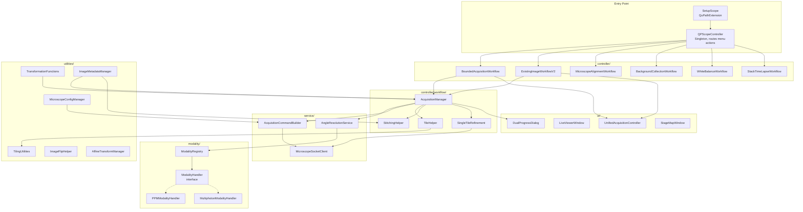
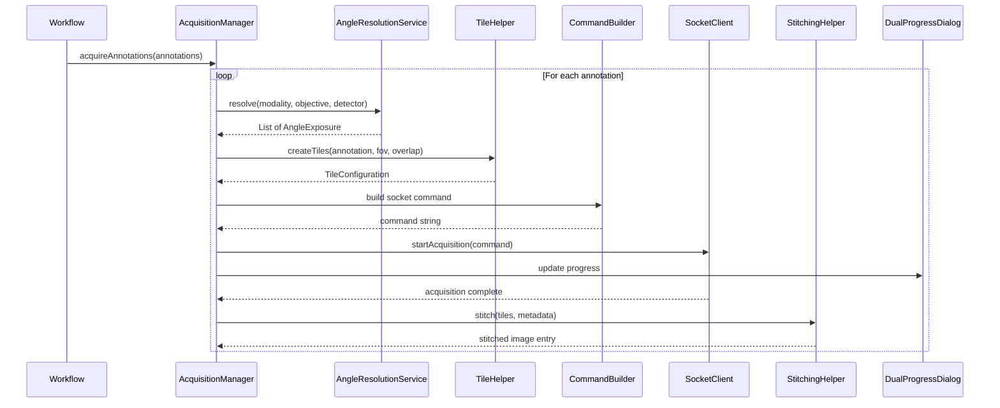
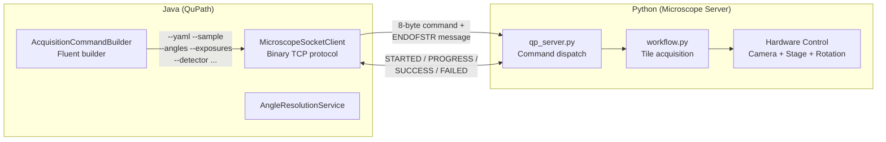
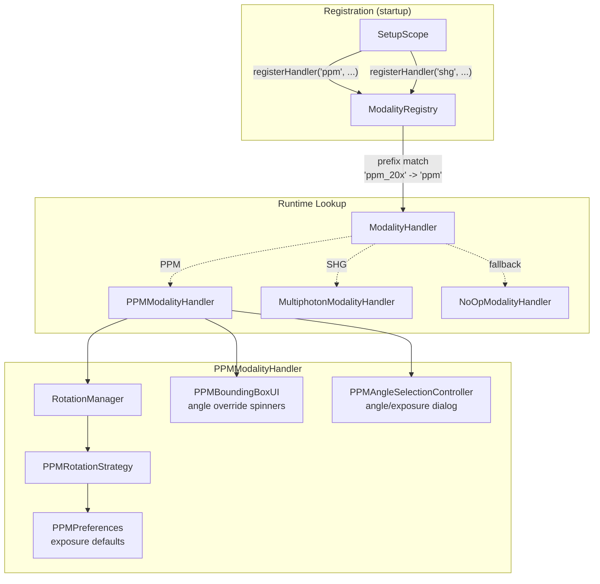
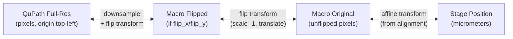
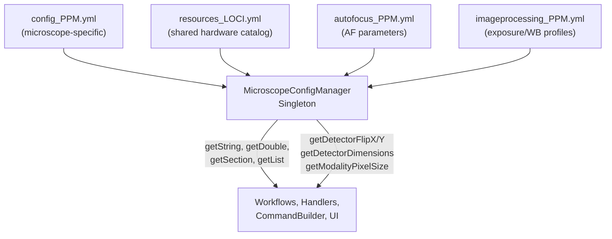
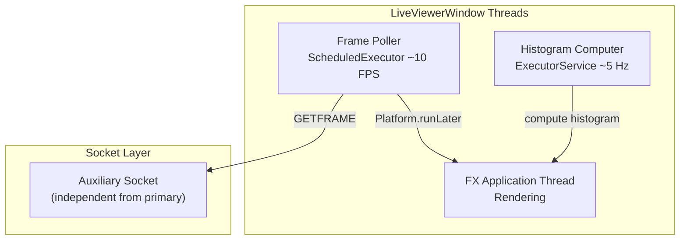

# QPSC Extension Architecture

Developer reference for the `qupath-extension-qpsc` Java codebase. This document covers the package structure, key abstractions, and how the major subsystems connect.

## Package Overview



## Package Details

### controller/ -- Workflow Orchestration

Each workflow is a self-contained class that orchestrates a complete user operation from dialog to completion. They follow a common pattern:

1. Show a dialog to collect parameters
2. Validate hardware state and configuration
3. Execute the operation (often async via `CompletableFuture`)
4. Report results and clean up

| Workflow | Purpose |
|----------|---------|
| `BoundedAcquisitionWorkflow` | Draw bounding box -> create project -> tile -> acquire -> stitch |
| `ExistingImageWorkflowV2` | Select annotations on existing image -> transform coords -> acquire -> stitch |
| `MicroscopeAlignmentWorkflow` | Calibrate QuPath-to-stage coordinate mapping |
| `BackgroundCollectionWorkflow` | Acquire flat-field correction images |
| `WhiteBalanceWorkflow` | Acquire white balance calibration coefficients |
| `StackTimeLapseWorkflow` | Z-stack or time-lapse at current position |

### controller/workflow/ -- Acquisition Pipeline Helpers

These are called by the workflow classes above during the acquisition phase:



**AcquisitionManager** is the central orchestrator. For each annotation it:
1. Resolves rotation angles via `AngleResolutionService`
2. Creates tile grid via `TileHelper` -> `TilingUtilities`
3. Builds the acquisition command via `AcquisitionCommandBuilder`
4. Sends to Python server via `MicroscopeSocketClient`
5. Monitors progress and updates `DualProgressDialog`
6. Triggers stitching via `StitchingHelper`
7. Writes metadata via `ImageMetadataManager`

### service/ -- External System Integration



**MicroscopeSocketClient** uses a dual-socket architecture:
- **Primary socket**: Long-running operations (acquisitions, calibrations)
- **Auxiliary socket**: Concurrent live viewer + stage control during acquisitions

The protocol is binary: 8-byte padded ASCII commands (e.g., `acquire_`, `getxy___`) with big-endian length-prefixed payloads.

**AcquisitionCommandBuilder** constructs flag-based string messages:
```
--yaml /path/config.yml --projects /data --sample S1 --scan-type ppm_20x_1
--region R1 --angles "(-7.0,0.0,7.0,90.0)" --exposures "(500,800,500,10)"
--objective LOCI_OBJECTIVE_20X --detector LOCI_DETECTOR_JAI_001
--pixel-size 0.1725 --wb-mode per_angle --af-tiles 9 ENDOFSTR
```

### modality/ -- Pluggable Imaging Mode System



**ModalityHandler** interface defines the plugin contract:

```java
public interface ModalityHandler {
    CompletableFuture<List<AngleExposure>> getRotationAngles(modality, objective, detector);
    Optional<BoundingBoxUI> createBoundingBoxUI();
    List<AngleExposure> applyAngleOverrides(angles, overrides);
    Optional<ImageType> getImageType();
    BackgroundValidationResult validateBackgroundSettings(...);
    List<ModalityMenuItem> getModalityMenuContributions();
}
```

New modalities are added by:
1. Implementing `ModalityHandler`
2. Registering with a prefix in `ModalityRegistry`
3. Defining `rotation_angles` in the YAML config

See [PPM_MODALITY.md](PPM_MODALITY.md) for the full PPM implementation.

### utilities/ -- Core Utilities

#### Coordinate Transformation Pipeline



**TransformationFunctions** provides the complete chain:
- `transformQuPathFullResToStage(coords, transform)` -- annotation to stage
- `transformStageToQuPathFullRes(coords, transform)` -- stage back to annotation
- `createFlipTransform(flipX, flipY, width, height)` -- optical flip matrix

**AffineTransformManager** persists transforms as JSON with metadata (microscope name, mounting method, Z scale/offset).

#### Configuration System



`MicroscopeConfigManager` merges the microscope config with the shared resources file. Hardware IDs (e.g., `LOCI_DETECTOR_JAI_001`) are resolved against `resources_LOCI.yml` for dimensions, flip state, debayering requirements, etc.

#### Tiling

`TilingUtilities` computes tile grids from annotations or bounding boxes:
- Calculates grid dimensions from camera FOV and configured overlap
- Applies serpentine (snake) traversal pattern for efficient stage movement
- Handles axis inversion for stage coordinate mapping
- Writes `TileConfiguration.txt` for the stitching pipeline

#### Image Metadata

`ImageMetadataManager` stores per-image metadata in QuPath project entries:

| Key | Example | Purpose |
|-----|---------|---------|
| `flip_x` / `flip_y` | `"1"` / `"0"` | Optical flip state (per-detector) |
| `detector_id` | `"LOCI_DETECTOR_JAI_001"` | Which detector captured this image |
| `image_collection` | `"3"` | Groups related images from same slide |
| `xy_offset_x/y_microns` | `"12500.0"` | Physical position for coordinate transforms |
| `modality` | `"ppm"` | Imaging modality |
| `objective` | `"LOCI_OBJECTIVE_20X"` | Objective used |
| `base_image` | `"slide_macro"` | Root image in the parent chain |

### ui/ -- User Interface

The UI layer uses JavaFX exclusively. Key components:

| Component | Purpose |
|-----------|---------|
| `UnifiedAcquisitionController` | Single consolidated dialog for all acquisition parameters |
| `AcquisitionWizardDialog` | Multi-step guided acquisition setup |
| `LiveViewerWindow` | Floating live camera feed with focus controls |
| `DualProgressDialog` | Split progress bars for acquisition + stitching |
| `StageMapWindow` | Top-down stage position visualization |
| `StageControlPanel` | XYZ joystick/button controls |
| `CameraControlController` | Exposure/gain settings |

**LiveViewerWindow** runs concurrent with acquisitions using the auxiliary socket:



## Design Patterns

| Pattern | Usage | Benefit |
|---------|-------|---------|
| **Strategy + Registry** | `ModalityHandler` + `ModalityRegistry` | New modalities without core changes |
| **Fluent Builder** | `AcquisitionCommandBuilder` | Readable command construction |
| **Singleton** | Controller, ConfigManager, LiveViewer | Shared state with controlled init |
| **Async/Future** | `CompletableFuture` throughout | Non-blocking UI |
| **Observer** | `NotificationService` | Decoupled event handling |
| **Command** | Socket protocol | Decouples QuPath from server implementation |

## Thread Safety

- `ModalityRegistry` uses `ConcurrentHashMap`
- All UI updates use `Platform.runLater()`
- `MicroscopeSocketClient` uses `synchronized` locks per socket
- Acquisition runs on `ForkJoinPool.commonPool` threads
- Stitching uses a single-threaded executor to prevent resource exhaustion
