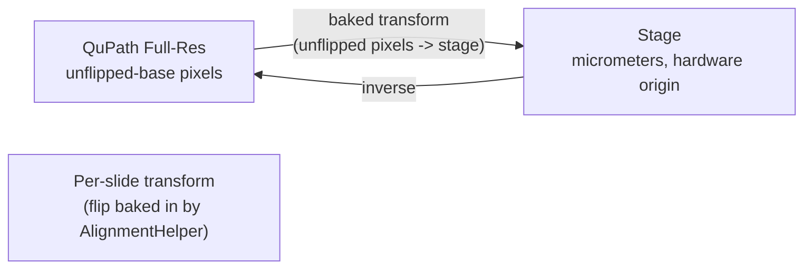
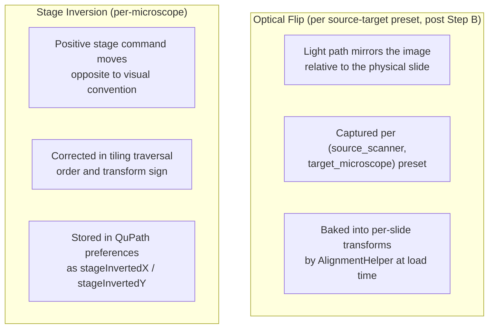
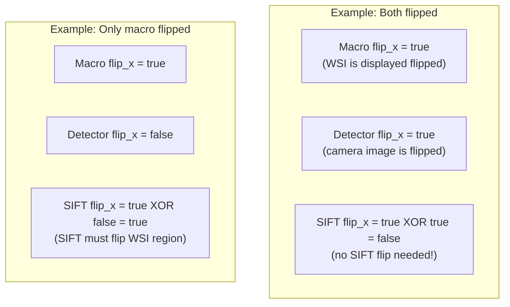
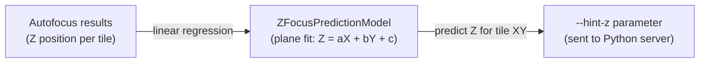

# Coordinate Transform System

Developer reference for how QPSC transforms coordinates between QuPath's pixel space and the physical microscope stage.

## The Problem

A user draws annotations on a whole-slide image (WSI) in QuPath, measured in pixels. The microscope stage moves in micrometers. The two coordinate systems differ in:
- **Scale**: pixels vs micrometers (pixel size varies by objective)
- **Origin**: QuPath is top-left; stage origin is hardware-dependent
- **Orientation**: the WSI may be optically flipped relative to stage coordinates
- **Axis direction**: stage axes may be inverted (positive = left instead of right)

## Transform Chain



After the Step B refactor (2026-05-04), there is **one project entry per slide** and **one canonical pixel frame** for downstream callers: the unflipped-base frame. The optical flip is captured on the saved `(source_scanner, target_microscope)` preset (`TransformPreset.flipMacroX/Y`) and on each per-slide alignment JSON (`flipMacroX/Y` field). `AlignmentHelper.checkForSlideAlignment` composes that flip into the loaded transform so every consumer downstream — `SingleTileRefinement`, `AcquisitionManager`, `ForwardPropagationWorkflow` — operates in unflipped-base pixel coords without further bookkeeping.

### Step 1: QuPath Full-Res, unflipped base

Annotations live on the unflipped base entry. There is no "flipped X/Y/XY" duplicate to choose between. Full-resolution pixel coordinates are interpreted in the unflipped pixel frame.

### Step 2: Flip baking (alignment-time correction, applied once at load)

Each per-slide alignment JSON records the `flipMacroX/Y` frame the alignment was built in. On load, `AlignmentHelper.checkForSlideAlignment` composes:

```
state.transform = saved_transform * createFlip(alignFlipX, alignFlipY, baseW, baseH)
```

so the resulting transform consumes unflipped-base pixel coords directly. `createFlip` lives on `ForwardPropagationWorkflow` (also used by Forward/Back propagation):

```java
// ForwardPropagationWorkflow.createFlip(flipX, flipY, width, height)
if (flipX && flipY) {
    flip.translate(width, height);
    flip.scale(-1, -1);
} else if (flipX) {
    flip.translate(width, 0);
    flip.scale(-1, 1);
} else if (flipY) {
    flip.translate(0, height);
    flip.scale(1, -1);
}
```

When the JSON's `flipMacroX/Y` are both `false` (or absent for legacy files), the bake step is a no-op and the saved transform is used as-is.

### Step 3: Affine Transform (alignment calibration)

The affine transform maps macro pixel coordinates to stage micrometers. It is computed either during the Microscope Alignment workflow (by collecting 3+ corresponding points in both coordinate spaces) or is auto-registered at import time by a BoundingBox acquisition (see "Auto-Registered Transforms" below).

```
| a  b  tx |     | macro_x |     | stage_x |
| c  d  ty |  *  | macro_y |  =  | stage_y |
| 0  0  1  |     |    1    |     |    1    |
```

The transform encodes scale, rotation, and translation. It is stored persistently as JSON by `AffineTransformManager`.

## Two Tiers of Transform Storage

`AffineTransformManager` exposes two independent persistence paths:

| Tier | File | Key | Created by | Consumed by |
|------|------|-----|------------|-------------|
| **Named presets** | `microscope_configurations/saved_transforms.json` | Preset name (scope-wide) | Manual alignment workflow when the user saves a reusable preset | `loadSavedTransformFromPreferences` — applied globally |
| **Per-slide alignments** | `{project}/alignmentFiles/{imageName}_alignment.json` | Image file name | Manual alignment workflow (per slide) **and** BoundingBox auto-registration | `StageControlPanel.initializeCentroidButton` via `AffineTransformManager.loadSlideAlignment(project, imageName)` |

Named presets survive across projects and sessions. Per-slide alignments live inside a specific project and are keyed by the stitched image's on-disk file name, which is the same string `QPProjectFunctions.getActualImageFileName(imageData)` returns — this is how the Live Viewer's Go-to-centroid button decides whether an alignment exists for the currently open image.

## Auto-Registered Transforms (BoundingBox acquisitions)

Every BoundingBox acquisition registers its own per-slide alignment automatically at stitch-import time, so Live Viewer Move-to-centroid and click-to-center work on the resulting image with zero manual alignment steps. The trick: BoundingBox already knows every input the transform needs.

**Inputs:**

| Input | Source |
|-------|--------|
| Stage bounds `(x1, y1, x2, y2)` in µm | User-entered in the BoundingBox dialog, carried through `StitchingMetadata.stageBoundsX1Um/...` |
| Stitched image pixel dimensions `(widthPx, heightPx)` | Read from the stitched file's `ImageServer` after import |
| Orientation | Guaranteed canonical — the stitcher already honours `StageImageTransform.stitcherFlipFlags()` when writing output |

**Math** (in `AffineTransformManager.buildTransformFromStageBounds`):

```java
scaleX = (x2 - x1) / widthPx;
scaleY = (y2 - y1) / heightPx;
transform = new AffineTransform();
transform.translate(x1, y1);
transform.scale(scaleX, scaleY);
```

The result is a pixel → stage transform with positive scale components and a translation equal to the top-left stage corner.

**Hook points** — `StitchingHelper.autoRegisterBoundsTransformIfAvailable` is called from three import sites so every flow is covered:

1. `StitchingHelper.importMergedImageOnly` — merged multichannel output (IF / BF+IF)
2. `StitchingHelper.importPerChannelFallback` — merge-failure fallback (each per-channel file gets its own alignment)
3. `TileProcessingUtilities.stitchImagesAndUpdateProject` single-file branch — non-channel region stitching (single-angle, PPM, etc.)

The helper is a no-op unless `StitchingMetadata.hasStageBounds()` is true, so annotation-based acquisitions are unaffected and continue to inherit alignment from the parent macro image.

**Annotation acquisitions remain parent-inherited:** they do not register a standalone alignment because they already work through the parent's transform plus the `xOffset`/`yOffset` metadata fields (see `StageControlPanel.handleGoToCentroid` sub-image branch, which derives sign from the parent alignment's scale signs).

## Flip vs Inversion

These are different concepts that must not be confused:



| Property | Flip | Inversion |
|----------|------|-----------|
| What it is | Optical mirror in light path | Stage axis direction convention |
| What it affects | Pixel-to-stage transform direction | Tile traversal order, transform sign |
| Where configured | `TransformPreset.flipMacroX/Y` in `saved_transforms.json`; mirrored on each per-slide alignment JSON | QuPath preferences per microscope |
| Applied when | `AlignmentHelper.checkForSlideAlignment` bakes the flip into the loaded transform | Computing tile grid positions |
| Storage post Step B | Per-pair preset + per-slide JSON. **Not** per-image metadata; per-image `FLIP_X/FLIP_Y` is no longer load-bearing for new code (legacy projects may still carry it). | Auto-detected from `StageInsert` calibration when YAML has `slide_holder`/`inserts`; falls back to `(false, false)` in the synthesized path. |

### Per-slide JSON `flipMacroX/Y` — every save site must write the truth

`AlignmentHelper.checkForSlideAlignment` reads these two booleans from the per-slide JSON and composes the corresponding flip into the returned transform. If a save site omits the fields, the loader assumes the transform is in unflipped-base frame and skips the bake — which silently mis-frames the transform if the saved math was actually in flipped frame. The four save sites and the frame each writes:

| Caller | File | Frame of saved transform | `flipMacroX/Y` written |
|---|---|---|---|
| Manual 3-point alignment | `ManualAlignmentPath.java` | unflipped-base (post-Step-B clicks land on the unflipped display) | `false, false` |
| Existing alignment + green-box | `ExistingAlignmentPath.java` | preset's macro frame | preset's `flipMacroX/Y` |
| Refined alignment | `ExistingImageWorkflowV2.saveRefinedAlignment` | unflipped-base (state.transform was already baked unflipped before refinement) | `false, false` |
| BoundingBox auto-register at stitch import | `StitchingHelper.autoRegisterBoundsTransformIfAvailable` | matches `StitchingMetadata.flipX/Y` (the flip the stitcher honoured on output) | `metadata.flipX, metadata.flipY` |

When `metadata.flipX/Y == true` (PPM, where the optical path is XY-flipped), `StitchingHelper` builds a transform with negative scale signs and opposite-corner origins so that **flipped-frame** pixel coords map to stage. Saving `flipMacroX = true, flipMacroY = true` on the JSON tells `AlignmentHelper` to pre-compose the matching flip on load, so `state.transform` ends up in the unflipped-base frame the rest of the pipeline expects.

## SIFT Alignment with Per-Detector Flip

When refining stage position via SIFT feature matching, the WSI region must be oriented to match the microscope's live view. The WSI region is read from the open project entry — post-Step-B that is the unflipped base, so the entry's `FLIP_X/FLIP_Y` metadata is `0/0` for new projects. The detector's optical flip still matters: if the camera mirrors the image, SIFT has to flip the WSI region the same way to make the features comparable. Hence the XOR (legacy projects with non-zero per-entry flip metadata also resolve correctly):

```
sift_flip_x = entry_flip_x XOR detector_flip_x
sift_flip_y = entry_flip_y XOR detector_flip_y
```



## Z-Focus Prediction (Tilt Correction)

For large acquisitions, the sample may be tilted relative to the focal plane. The `ZFocusPredictionModel` builds a tilt model from autofocus results and predicts the Z position for each tile:



The `--hint-z` flag tells the server to start its autofocus search near the predicted Z, reducing search time.

## Key Files

| File | Purpose |
|------|---------|
| `utilities/TransformationFunctions.java` | Complete transform chain (pixel <-> stage) |
| `utilities/AffineTransformManager.java` | Persistent transform storage (JSON); `TransformPreset.flipMacroX/Y` per-pair flip; `saveSlideAlignment` 7-arg overload writes per-slide `flipMacroX/Y` |
| `utilities/AffineTransform3D.java` | 3D transform with Z scale/offset |
| `utilities/FlipResolver.java` | Resolves macro flip in priority order: per-image metadata (legacy), active preset, per-detector YAML, default false |
| `utilities/ImageFlipHelper.java` | **Deprecated stub.** `validateAndFlipIfNeeded` is a no-op after Step B; flipped duplicates are no longer created |
| `controller/workflow/AlignmentHelper.java` | `checkForSlideAlignment` — single normalization point that bakes alignment-frame flip into the loaded transform |
| `controller/ForwardPropagationWorkflow.java` | `createFlip(flipX, flipY, w, h)` flip transform; back/forward propagation also baked through this |
| `utilities/TilingUtilities.java` | Grid computation with axis inversion |
| `utilities/ZFocusPredictionModel.java` | Tilt correction model |
| `controller/MicroscopeAlignmentWorkflow.java` | Calibrates the affine transform (manual 3-point workflow) |
| `controller/workflow/ManualAlignmentPath.java` | Saves `<sample>_<scope>_alignment.json` from manual clicks (unflipped frame) |
| `controller/workflow/ExistingAlignmentPath.java` | Green-box derived per-slide alignment; saves with preset's `flipMacroX/Y` |
| `controller/workflow/SingleTileRefinement.java` | SIFT-based and manual position refinement; consumes `state.transform` in unflipped-base frame |
| `controller/workflow/StitchingHelper.java` | `autoRegisterBoundsTransformIfAvailable` — BoundingBox auto-registration; saves with `metadata.flipX/Y` |
| `model/StitchingMetadata.java` | Carries optional stage bounds **and** `flipX/Y` through the stitch path |
| `controller/BoundedAcquisitionWorkflow.java` | Passes `(x1, y1, x2, y2)` into the bounds-aware `performRegionStitching` overload |
| `preferences/QPPreferenceDialog.java` | Stage inversion flags |
| `utilities/MicroscopeConfigManager.java` | Per-detector flip lookup (legacy fallback) |
