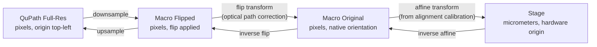
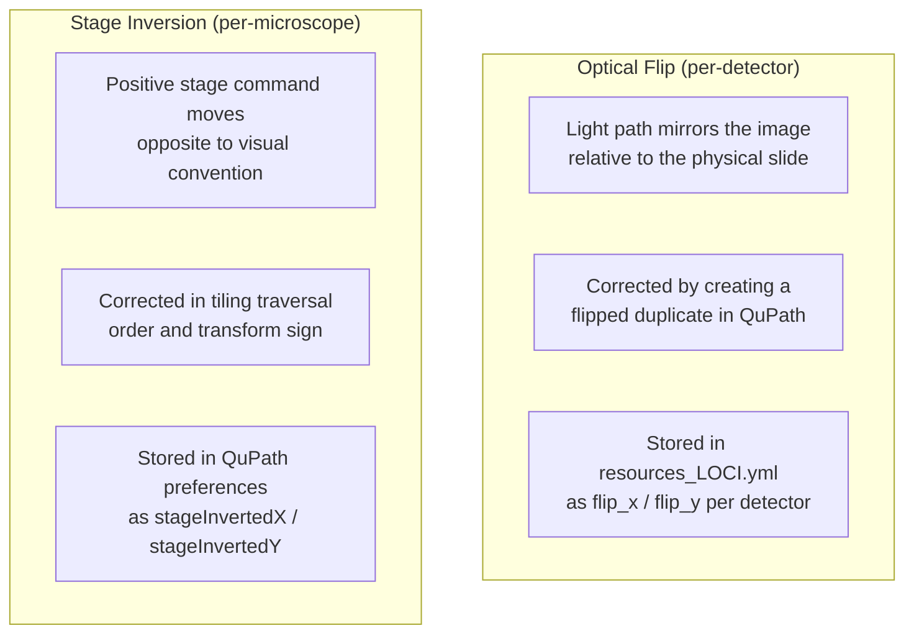
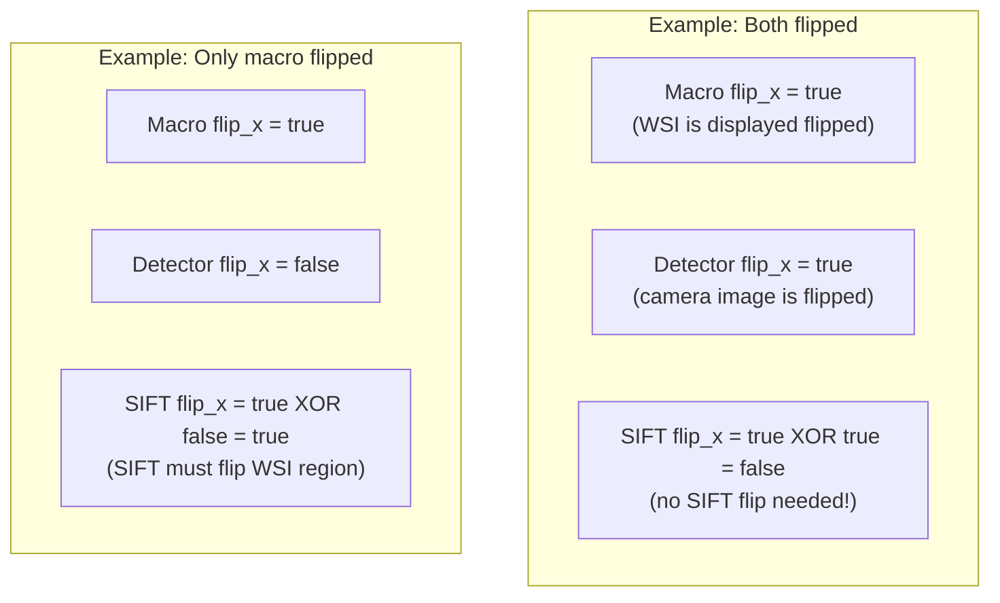
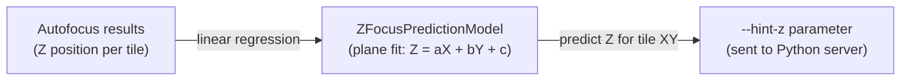

# Coordinate Transform System

Developer reference for how QPSC transforms coordinates between QuPath's pixel space and the physical microscope stage.

## The Problem

A user draws annotations on a whole-slide image (WSI) in QuPath, measured in pixels. The microscope stage moves in micrometers. The two coordinate systems differ in:
- **Scale**: pixels vs micrometers (pixel size varies by objective)
- **Origin**: QuPath is top-left; stage origin is hardware-dependent
- **Orientation**: the WSI may be optically flipped relative to stage coordinates
- **Axis direction**: stage axes may be inverted (positive = left instead of right)

## Transform Chain



### Step 1: QuPath Full-Res to Macro (downsample)

QuPath displays images at various zoom levels. Annotations are stored in full-resolution pixel coordinates. The macro/overview image is a downsampled version. The downsample factor is the ratio of full-res to macro pixel sizes.

### Step 2: Flip Correction (optical path)

The microscope's light path may produce images that are mirrored relative to the physical slide. This is corrected by an affine flip transform:

```java
// TransformationFunctions.createFlipTransform()
if (flipX && flipY) {
    transform.scale(-1.0, -1.0);
    transform.translate(-imageWidth, -imageHeight);
} else if (flipX) {
    transform.scale(-1.0, 1.0);
    transform.translate(-imageWidth, 0.0);
} else if (flipY) {
    transform.scale(1.0, -1.0);
    transform.translate(0.0, -imageHeight);
}
```

**Per-detector flip**: Different cameras may have different flip states. The flip is read from `resources_LOCI.yml` per detector (see [HARDWARE_ABSTRACTION.md](HARDWARE_ABSTRACTION.md#per-detector-optical-flip)).

### Step 3: Affine Transform (alignment calibration)

The affine transform maps macro pixel coordinates to stage micrometers. It is computed during the Microscope Alignment workflow by collecting 3+ corresponding points in both coordinate spaces.

```
| a  b  tx |     | macro_x |     | stage_x |
| c  d  ty |  *  | macro_y |  =  | stage_y |
| 0  0  1  |     |    1    |     |    1    |
```

The transform encodes scale, rotation, and translation. It is stored persistently as JSON by `AffineTransformManager`.

## Flip vs Inversion

These are different concepts that must not be confused:



| Property | Flip | Inversion |
|----------|------|-----------|
| What it is | Optical mirror in light path | Stage axis direction convention |
| What it affects | Image orientation in QuPath | Tile traversal order, transform sign |
| Where configured | `resources_LOCI.yml` per detector | QuPath preferences per microscope |
| Applied when | Creating flipped image duplicates | Computing tile grid positions |

## SIFT Alignment with Per-Detector Flip

When refining stage position via SIFT feature matching, the WSI region must be oriented to match the microscope's live view. If the WSI was flipped (for display) but the detector is also flipped (optical path), the two flips cancel out:

```
sift_flip_x = macro_flip_x XOR detector_flip_x
sift_flip_y = macro_flip_y XOR detector_flip_y
```



## Z-Focus Prediction (Tilt Correction)

For large acquisitions, the sample may be tilted relative to the focal plane. The `ZFocusPredictionModel` builds a tilt model from autofocus results and predicts the Z position for each tile:



The `--hint-z` flag tells the server to start its autofocus search near the predicted Z, reducing search time.

## Key Files

| File | Purpose |
|------|---------|
| `utilities/TransformationFunctions.java` | Complete transform chain (pixel <-> stage) |
| `utilities/AffineTransformManager.java` | Persistent transform storage (JSON) |
| `utilities/AffineTransform3D.java` | 3D transform with Z scale/offset |
| `utilities/ImageFlipHelper.java` | Creates flipped duplicate images |
| `utilities/TilingUtilities.java` | Grid computation with axis inversion |
| `utilities/ZFocusPredictionModel.java` | Tilt correction model |
| `controller/MicroscopeAlignmentWorkflow.java` | Calibrates the affine transform |
| `controller/workflow/SingleTileRefinement.java` | SIFT-based position refinement |
| `preferences/QPPreferenceDialog.java` | Stage inversion flags |
| `utilities/MicroscopeConfigManager.java` | Per-detector flip lookup |
