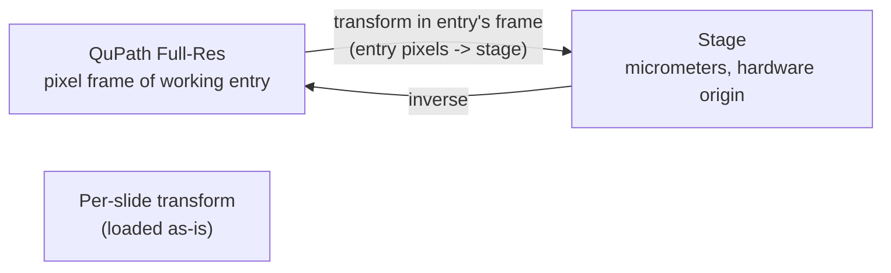
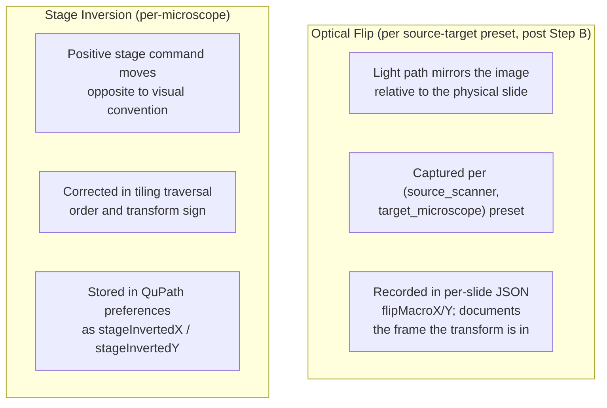
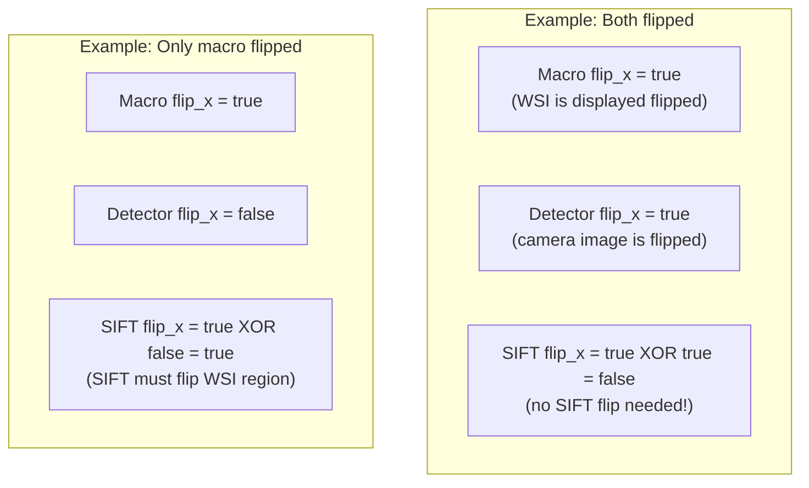
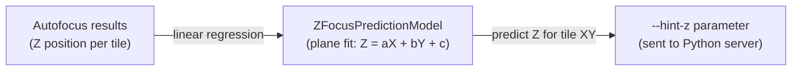

# Coordinate Transform System

Developer reference for how QPSC transforms coordinates between QuPath's pixel space and the physical microscope stage.

## The Problem

A user draws annotations on a whole-slide image (WSI) in QuPath, measured in pixels. The microscope stage moves in micrometers. The two coordinate systems differ in:
- **Scale**: pixels vs micrometers (pixel size varies by objective)
- **Origin**: QuPath is top-left; stage origin is hardware-dependent
- **Orientation**: the WSI may be optically flipped relative to stage coordinates
- **Axis direction**: stage axes may be inverted (positive = left instead of right)

## Transform Chain



The per-slide alignment JSON stores the pixel-to-stage transform in the **pixel frame of the entry the workflow runs on** — the flipped sibling for flip-needing scopes, the unflipped base for non-flip scopes. `AlignmentHelper.checkForSlideAlignment` loads this transform and returns it as-is; `validateAndFlipIfNeeded` puts the workflow on that same entry, so no frame conversion is needed. All save sites (`ManualAlignmentPath`, `ExistingAlignmentPath`, `saveRefinedAlignment`, `StitchingHelper.autoRegisterBoundsTransformIfAvailable`) write the transform in the pixel frame of the entry they are working on, recorded via `flipMacroX/Y` in the JSON.

A `(flipped X|Y|XY)` companion entry is **still created on demand** by the alignment-bearing workflows (`ManualAlignmentPath`, `ExistingAlignmentPath`, anything that runs single-tile refinement) on scopes where the active preset has `flipMacroX/Y = true` (e.g. PPM). The companion exists for **visual-UX reasons only**: during alignment, the operator visually compares the QuPath display to the live camera view, and on a flipped scope the unflipped base and the live camera view disagree by a mirror. The sibling restores visual parity. The sibling is no longer authoritative for flip state — the preset and per-slide JSON are.

`ImageFlipHelper.validateAndFlipIfNeeded` is the entry point for "ensure the sibling exists and is the open entry". It resolves flip from the preset using the open entry's `SOURCE_MICROSCOPE` metadata + active microscope name, and either reuses an existing sibling or creates one via `QPProjectFunctions.createFlippedDuplicate`.

**`validateAndFlipIfNeeded` is a no-op for sub-acquisitions.** The flipped-sibling concept applies only to imported macro entries -- a sub-image is a pyramid output from the active microscope's camera, already in the active scope's stage-aligned frame, and has no flipped companion. The helper short-circuits when the open entry has a non-zero `xy_offset` and a `base_image` distinct from its own name (the same predicate `ExistingImageWorkflowV2.isSubAcquisition` uses for routing). Without this guard, `findFlippedSibling`'s `base_image` match would resolve a sub-image to the parent macro's `(flipped XY)` sibling and silently switch the open entry across, dropping all sub-image annotations. See `claude-reports/design/2026-05-13_subimage-acquisition-routing-fix.md` for the full incident.

### Missing `source_microscope` is now a hard cancel on flip-needing scopes (2026-05-14)

`resolveFlipFromPreset` previously returned `(false, false)` silently when an entry lacked `source_microscope` metadata. On a flip-needing scope (e.g. PPM with `flipMacroX = flipMacroY = true` saved presets), the workflow then proceeded against the unflipped macro, the live camera view disagreed by a mirror, and `ManualAlignmentPath` persisted `flipMacroX/Y = false` on the per-slide JSON -- reintroducing the failure 9f4fb96 fixed for entries that DO carry source_microscope.

`ImageFlipHelper.validateAndFlipIfNeeded` now hard-cancels in this case: when `source_microscope` is missing AND `ImageFlipHelper.isActiveScopeFlipNeeding()` returns true (some preset for the active microscope has `flipMacroX || flipMacroY` set), the helper opens an FX-safe modal explaining the issue and completes its future exceptionally. The dialog points at Stage Map -> Stamp Source Microscope as the fix. On non-flip scopes (no saved preset has the flag), the legacy `(false, false)` path remains -- no behavioral change. Review finding H1.

### Objective + detector recorded on per-slide alignment JSON (2026-05-14)

`AffineTransformManager.saveSlideAlignment`'s 10-arg overload now persists the `objective` and `detector` the alignment was built against. All four save sites pass them (the workflow's wizard state or `StitchingMetadata`'s captured values). `SlideAlignmentResult` exposes them via `getObjective()` / `getDetector()`; `readAlignmentJsonWithFrame` parses them; legacy JSONs without the fields load with null.

`AlignmentHelper.checkForSlideAlignment` compares the loaded objective against the wizard's `sample.objective()`. When both are non-null and differ, an FX-safe modal Continue/Cancel dialog (`confirmContinueWithObjectiveMismatch`) surfaces both values and explains the refinement-translation trade-off. Cancel completes the alignment-check future with null and the workflow short-circuits. The 5% pixel-size gate cannot catch this class of mismatch when the wrong-objective happens to share a pixel size with the right one in YAML (e.g. SIFT-refined translation at 10x reused with the wizard set to 20x); the new advisory is the only second-layer defense. Review finding H8.

### `acquired_on_microscope` metadata (sub-image entries only)

Sub-images now carry an `acquired_on_microscope` per-entry metadata field, stamped at stitch-import time from `MicroscopeConfigManager.getMicroscopeName()`. It records the microscope that physically captured the image -- distinct from `source_microscope`, which on a sub-image is inherited from the parent macro and names the original scanner (e.g. "Ocus40"). The Existing Image workflow's `processSubAcquisitionPath` gates on this field: if the open entry's `acquired_on_microscope` disagrees with the active microscope, the workflow hard-cancels with a clear dialog -- the entry's `xy_offset` is in the acquiring scope's stage frame and would drive any other scope's stage to the wrong physical location. Legacy sub-images without the field fall back to parsing the microscope name from any derived alignment JSON's filename via `AffineTransformManager.getDerivedAlignmentMicroscope`. Macro entries do not carry `acquired_on_microscope`. See `claude-reports/design/2026-05-14_subimage-acquisition-cross-scope-gate.md` for the H2 + H3 fix narrative.

### Active microscope is a valid `source_microscope` (same-scope identity, 2026-05-22)

`source_microscope` used to be implicitly external -- the source dropdown was built only from saved transform-preset scanners, and `StageMapWindow.onOpenedImageChanged` default-stamped the persistent scanner preference onto any opened entry that lacked the field. On a scope whose only saved preset was a cross-scope alignment (e.g. OWS3 with only `OWS3_Ocus40_Transform`), this stamped `source_microscope = "Ocus40"` onto OWS3-native slides that had never seen an Ocus40. The downstream flip path then applied the `(Ocus40 -> OWS3)` optical flip to an image that was already in OWS3's frame, building a spurious `(flipped X)` sibling.

The active microscope is now itself a first-class `source_microscope` value:

- **`StageMapWindow.loadTransformPresets`** prepends the active microscope to the source dropdown. `getBestPresetForPair(X, X)` returns null naturally, so `resolveFlipFromPreset` yields `(false, false)` for `source == target` -- identity, no flip, no preset side-work.
- **`StageMapWindow.onOpenedImageChanged`** and **`pickInitialSource`** default to the active microscope, not the persistent scanner pref. The pref still seeds the *alignment workflow*'s initial scanner pick for genuine cross-scope work; it no longer auto-stamps onto unrelated opened entries.
- **`ImageFlipHelper.validateAndFlipIfNeeded`** short-circuits when `source_microscope == active microscope` OR `acquired_on_microscope == active microscope`. Belt-and-suspenders against stale tags from before this change: even if some old entry still carries a wrong external-scanner source, an image acquired on the active scope is in the active scope's frame and gets no flip.
- **`ExistingImageWorkflowV2.checkAndHandleSourceMismatch`** fires at workflow start when the open entry's `source_microscope` differs from the active microscope. The dialog offers three actions: **Fix source to `<active>`** (the common case -- update the tag and treat as native), **Proceed (cross-scope)** (keep the existing source and use its saved alignment), or **Cancel**. When `acquired_on_microscope == active`, the body calls out that the tag is inconsistent with the image's physical provenance and should be corrected.

Inheritance is unchanged: `ImageMetadataManager` still copies a parent entry's `source_microscope` onto child sub-acquisitions (line 375-377), so a same-scope chain stays same-scope and a genuine cross-scope chain (e.g. an Ocus40 macro acquired on OWS3) keeps the Ocus40 lineage that back-propagation needs.

The BoundingBox-derived alignment in `ImageMetadataManager.buildBoundingBoxPixelToStageTransform` does not consult `source_microscope` -- it builds the pixel-to-stage transform from `STAGE_BOUNDS_*` + `STITCHER_FLIP_*` alone. So the **Fix** branch of the mismatch dialog is safe: updating the source tag alters the flip-path decision and the alignment-JSON lookup, but does not invalidate any stored per-slide alignment math.

### Step 1: QuPath Full-Res, unflipped base

Annotations live on the unflipped base entry. The optional `(flipped XY)` sibling, when present, mirrors annotation coordinates via `TransformationFunctions.transformHierarchy` so back-propagation keeps the two in sync. Full-resolution pixel coordinates are interpreted in the unflipped pixel frame for transform purposes.

### Step 2: Transform stored in working entry's pixel frame (no load-time baking)

Each per-slide alignment JSON records, in `flipMacroX/Y`, the pixel frame the transform was saved in. On load, `AlignmentHelper.checkForSlideAlignment` returns this transform as-is; no frame conversion or flip baking is applied. This works because the save sites and the workflow operate on the **same entry**:

| Save Site | Entry it operates on | flipMacroX/Y recorded |
|---|---|---|
| `ManualAlignmentPath` | the open entry at save time (`ImageMetadataManager.isFlippedX/Y`) -- the flipped sibling for flip-needing scopes | flipped sibling -> `true, true` (PPM); base -> `false, false` |
| `ExistingAlignmentPath` + green-box | the open entry at save time (`ImageMetadataManager.isFlippedX/Y`) | as above |
| `saveRefinedAlignment` | the open entry at save time (`ImageMetadataManager.isFlippedX/Y`) | as above |
| `StitchingHelper.autoRegisterBoundsTransformIfAvailable` | sub-image (pixelFrame=`sub`, distinct path) | `metadata.flipX, metadata.flipY` |

`ImageFlipHelper.validateAndFlipIfNeeded` puts the workflow on the flipped sibling for flip-needing scopes (the unflipped base otherwise) -- the same entry the save site wrote from -- so the loaded transform's pixel frame already matches the workflow's operating frame and is used directly. Two earlier loading paths instead composed a flip "bake-delta" into the transform (one at load in `checkForSlideAlignment`, one post-flip-switch); both double-flipped an already-correct transform and drove the stage to the X/Y mirror of the selected tile (PPM 2026-05-19). `flipMacroX/Y` is now purely documentation of the saved frame -- it is read by the cross-scope composer and the legacy/unverified-flip advisories, but never used to bake.

### Step 3: Affine Transform (alignment calibration)

The affine transform maps macro pixel coordinates to stage micrometers. It is computed either during the Microscope Alignment workflow (by collecting 3+ corresponding points in both coordinate spaces) or is auto-registered at import time by a BoundingBox acquisition (see "Auto-Registered Transforms" below).

```
| a  b  tx |     | macro_x |     | stage_x |
| c  d  ty |  *  | macro_y |  =  | stage_y |
| 0  0  1  |     |    1    |     |    1    |
```

The transform encodes scale, rotation, and translation. It is stored persistently as JSON by `AffineTransformManager`.

## Two Tiers of Transform Storage

`AffineTransformManager` exposes two independent persistence paths:

| Tier | File | Key | Created by | Consumed by |
|------|------|-----|------------|-------------|
| **Named presets** | `microscope_configurations/saved_transforms.json` | Preset name (scope-wide) | Manual alignment workflow when the user saves a reusable preset | `loadSavedTransformFromPreferences` — applied globally |
| **Per-slide alignments** | `{project}/alignmentFiles/{imageName}_alignment.json` | Image file name | Manual alignment workflow (per slide) **and** BoundingBox auto-registration | `StageControlPanel.initializeCentroidButton` via `AffineTransformManager.loadSlideAlignment(project, imageName)` |

Named presets survive across projects and sessions. Per-slide alignments live inside a specific project and are keyed by the stitched image's on-disk file name, which is the same string `QPProjectFunctions.getActualImageFileName(imageData)` returns — this is how the Live Viewer's Go-to-centroid button decides whether an alignment exists for the currently open image.

## Auto-Registered Transforms (BoundingBox acquisitions)

Every BoundingBox acquisition registers its own per-slide alignment automatically at stitch-import time, so Live Viewer Move-to-centroid and click-to-center work on the resulting image with zero manual alignment steps. The trick: BoundingBox already knows every input the transform needs.

**Inputs:**

| Input | Source |
|-------|--------|
| Stage bounds `(x1, y1, x2, y2)` in µm | User-entered in the BoundingBox dialog, carried through `StitchingMetadata.stageBoundsX1Um/...` |
| Stitched image pixel dimensions `(widthPx, heightPx)` | Read from the stitched file's `ImageServer` after import |
| Orientation | Guaranteed canonical — the stitcher already honours `StageImageTransform.stitcherFlipFlags()` when writing output |

**Math** (in `AffineTransformManager.buildTransformFromStageBounds`):

```java
scaleX = (x2 - x1) / widthPx;
scaleY = (y2 - y1) / heightPx;
transform = new AffineTransform();
transform.translate(x1, y1);
transform.scale(scaleX, scaleY);
```

The result is a pixel → stage transform with positive scale components and a translation equal to the top-left stage corner.

**Hook points** — `StitchingHelper.autoRegisterBoundsTransformIfAvailable` is called from three import sites so every flow is covered:

1. `StitchingHelper.importMergedImageOnly` — merged multichannel output (IF / BF+IF)
2. `StitchingHelper.importPerChannelFallback` — merge-failure fallback (each per-channel file gets its own alignment)
3. `TileProcessingUtilities.stitchImagesAndUpdateProject` single-file branch — non-channel region stitching (single-angle, PPM, etc.)

The helper is a no-op unless `StitchingMetadata.hasStageBounds()` is true, so annotation-based acquisitions are unaffected and continue to inherit alignment from the parent macro image.

**Annotation acquisitions remain parent-inherited:** they do not register a standalone alignment because they already work through the parent's transform plus the `xOffset`/`yOffset` metadata fields (see `StageControlPanel.handleGoToCentroid` sub-image branch, which derives sign from the parent alignment's scale signs).

## Flip vs Inversion

These are different concepts that must not be confused:



| Property | Flip | Inversion |
|----------|------|-----------|
| What it is | Optical mirror in light path | Stage axis direction convention |
| What it affects | Pixel-to-stage transform direction | Tile traversal order, transform sign |
| Where configured | `TransformPreset.flipMacroX/Y` in `saved_transforms.json`; mirrored on each per-slide alignment JSON | QuPath preferences per microscope |
| Applied when | Each save site writes the transform in the frame of the entry it operates on; `AlignmentHelper.checkForSlideAlignment` loads it as-is (no bake) | Computing tile grid positions |
| Storage post Step B | Per-pair preset + per-slide JSON `flipMacroX/Y` documents the frame. **Not** per-image metadata; per-image `FLIP_X/FLIP_Y` is no longer load-bearing for new code (legacy projects may still carry it). | Auto-detected from `StageInsert` calibration when YAML has `slide_holder`/`inserts`; the synthesized-insert path (`StageInsertRegistry.synthesizeFromStageLimits`, used when YAML has only `stage.limits`) takes inversion from the stage-polarity preference instead. |

### Per-slide JSON `flipMacroX/Y` — records the pixel frame each transform was saved in

`AlignmentHelper.checkForSlideAlignment` reads `flipMacroX/Y` from the per-slide JSON purely as documentation of the frame the saved transform is in — this allows cross-scope alignment composition and legacy-flip advisories. The loader does **not** apply a flip bake; instead, the value lets `ImageFlipHelper.validateAndFlipIfNeeded` ensure the workflow runs on the correct entry. When `flipMacroX/Y` are omitted (BoundingBox fallback, legacy JSON), the loader assumes `false, false` and warns if a cross-scope compose attempt or legacy-flip check is needed.

The save sites record the frame they operated in:

| Caller | File | Frame of saved transform | `flipMacroX/Y` written |
|---|---|---|---|
| Manual 3-point alignment | `ManualAlignmentPath.java` | the open entry at save time -- the flipped sibling on flip-needing scopes | `ImageMetadataManager.isFlippedX/Y(openEntry)` |
| Existing alignment + green-box | `ExistingAlignmentPath.java` | the open entry at save time | `ImageMetadataManager.isFlippedX/Y(openEntry)` |
| Refined alignment | `ExistingImageWorkflowV2.saveRefinedAlignment` | the open entry at save time | `ImageMetadataManager.isFlippedX/Y(openEntry)` |
| BoundingBox auto-register at stitch import | `StitchingHelper.autoRegisterBoundsTransformIfAvailable` | sub-image (`pixelFrame=sub`, distinct path) | `metadata.flipX, metadata.flipY` |

The loaded transform is used in its saved frame — no baking applied. The workflow's open entry (determined by `validateAndFlipIfNeeded`) is the same entry the save site wrote from, so the frames match by construction.

## Stage / camera direction calibration (Calibrate Directions tool)

`StageDirectionCalibrationDialog` (`ui/StageDirectionCalibrationDialog.java`) is the interactive replacement for hand-editing `Inverted X/Y stage` + `Camera orientation`. It runs in two places:

- **Setup Wizard**, as `StageCalibrationStep` (`ui/setupwizard/StageCalibrationStep.java`), inserted between `StageStep` and `ProbeStageAfStep`.
- **Live Viewer**, as the **Calibrate Directions...** button below the arrow grid in the Navigate tab (`ui/liveviewer/StageControlPanel.java`).

### How it works

1. Captures the current stage `(x, y)` so it can restore it on close.
2. Issues `MicroscopeController.moveStageXY(curX + step, curY)` (the same code path the arrow buttons use), then asks the user which of Left / Right / Up / Down the image appeared to pan in.
3. Repeats for `+Y`.
4. Back-solves `(StagePolarity, CameraOrientation)` and writes both via `QPPreferenceDialog.setStageInvertedX/Y` and `setCameraOrientationProperty`.

### Back-solve canonicalization

For a given observed (xPan, yPan) pair there are usually **multiple** equivalent `(StagePolarity, CameraOrientation)` combinations — e.g. `(INVERT_Y, FLIP_H)` and `(INVERT_XY, NORMAL)` produce identical arrow-button, joystick, click-to-center, and stitcher-flip behaviour. The dialog walks the candidate space in this order and returns the first match:

- Orientations: `NORMAL` → `FLIP_H` → `FLIP_V` → `ROT_180` → `ROT_90_CW` → `ROT_90_CCW` → `TRANSPOSE` → `ANTI_TRANSPOSE`
- Polarities: `NORMAL` → `INVERT_Y` → `INVERT_X` → `INVERT_XY`

So an axis-aligned observation always resolves to a `CameraOrientation.NORMAL` answer with whatever polarity matches; only true 90°/270° rotations of the observed axes pull the canonical answer into the rotated orientations. The Manual override panel in the dialog lets users pick a specific equivalent combination if their hardware notes (e.g. "OWS3 has a FLIP_H optical path") call for a particular convention.

The back-solve predicts each candidate's image-pan with the inverse of `StageImageTransform.screenPanDeltaToMmDelta`:

```
sampleDelta = stagePolarity.mmToSampleDelta(mmDx, mmDy)
screenPan   = cameraOrientation.sampleToDisplay(sampleDelta)
```

A degenerate observation (both axes pan in the same direction, or both pan diagonally) is impossible and surfaces an error inviting the user to re-test with a larger step.

### Z direction is deferred

There is no `stageInvertedZ` preference today, and the calibration tool does not touch Z. See `claude-reports/TODO_LIST.md` for the work needed to add it (new preference, threading through `ZFocusPredictionModel` and the Live Viewer Z spinner, a Z test in the dialog, and a documented convention for which physical direction `+Z` means on this rig).

## SIFT Alignment with Per-Detector Flip

When refining stage position via SIFT feature matching, the WSI region must be oriented to match the microscope's live view. The WSI region is read from the open project entry — post-Step-B that is the unflipped base, so the entry's `FLIP_X/FLIP_Y` metadata is `0/0` for new projects. The detector's optical flip still matters: if the camera mirrors the image, SIFT has to flip the WSI region the same way to make the features comparable. Hence the XOR (legacy projects with non-zero per-entry flip metadata also resolve correctly):

```
sift_flip_x = entry_flip_x XOR detector_flip_x
sift_flip_y = entry_flip_y XOR detector_flip_y
```



## Z-Focus Prediction (Tilt Correction)

For large acquisitions, the sample may be tilted relative to the focal plane. The `ZFocusPredictionModel` builds a tilt model from autofocus results and predicts the Z position for each tile:



The `--hint-z` flag tells the server to start its autofocus search near the predicted Z, reducing search time.

## Key Files

| File | Purpose |
|------|---------|
| `utilities/TransformationFunctions.java` | Complete transform chain (pixel <-> stage) |
| `utilities/AffineTransformManager.java` | Persistent transform storage (JSON); `TransformPreset.flipMacroX/Y` per-pair flip; `saveSlideAlignment` 7-arg overload writes per-slide `flipMacroX/Y` |
| `utilities/AffineTransform3D.java` | 3D transform with Z scale/offset |
| `utilities/FlipResolver.java` | Resolves macro flip in priority order: per-image metadata (legacy), active preset, per-detector YAML, default false |
| `utilities/ImageFlipHelper.java` | `validateAndFlipIfNeeded` -- ensures a `(flipped X|Y|XY)` sibling exists and is the open entry on scopes where the active `(source_scanner, target_microscope)` preset has `flipMacroX/Y = true`. For visual UX during alignment only; not authoritative for flip state. **No-op when the open entry is a sub-acquisition** (sub-images do not have flipped siblings). |
| `controller/workflow/AlignmentHelper.java` | `checkForSlideAlignment` — loads per-slide alignment JSON and returns the transform in its saved frame; `flipMacroX/Y` documents the frame but no baking is applied |
| `controller/ForwardPropagationWorkflow.java` | `createFlip(flipX, flipY, w, h)` flip transform; back/forward propagation also baked through this |
| `utilities/TilingUtilities.java` | Grid computation with axis inversion |
| `utilities/ZFocusPredictionModel.java` | Tilt correction model |
| `controller/MicroscopeAlignmentWorkflow.java` | Calibrates the affine transform (manual 3-point workflow) |
| `controller/workflow/ManualAlignmentPath.java` | Saves `<sample>_<scope>_alignment.json` from manual clicks (unflipped frame) |
| `controller/workflow/ExistingAlignmentPath.java` | Green-box derived per-slide alignment; saves with preset's `flipMacroX/Y` |
| `controller/workflow/SingleTileRefinement.java` | SIFT-based and manual position refinement; consumes `state.transform` in unflipped-base frame |
| `controller/workflow/StitchingHelper.java` | `autoRegisterBoundsTransformIfAvailable` — BoundingBox auto-registration; saves with `metadata.flipX/Y` |
| `model/StitchingMetadata.java` | Carries optional stage bounds **and** `flipX/Y` through the stitch path |
| `controller/BoundedAcquisitionWorkflow.java` | Passes `(x1, y1, x2, y2)` into the bounds-aware `performRegionStitching` overload |
| `preferences/QPPreferenceDialog.java` | Stage inversion flags |
| `utilities/MicroscopeConfigManager.java` | Per-detector flip lookup (legacy fallback) |
