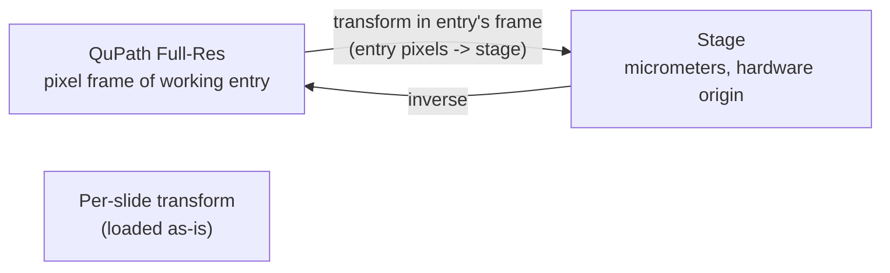
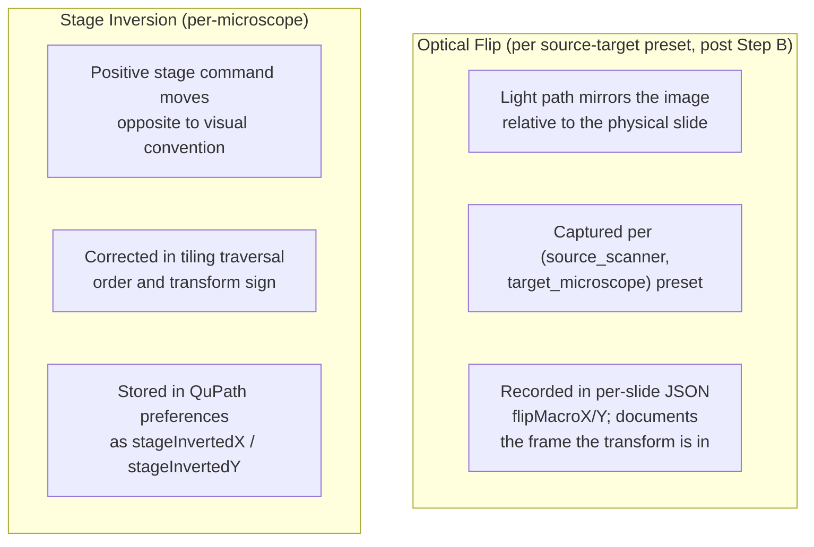
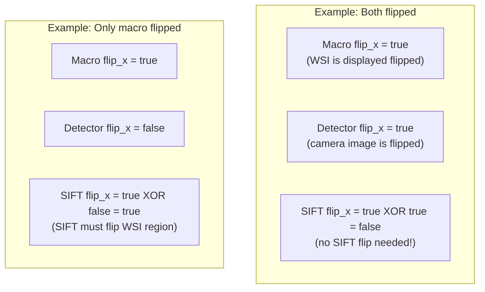
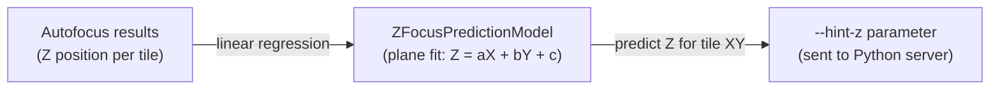

# Coordinate Transform System

Developer reference for how QPSC transforms coordinates between QuPath's pixel space and the physical microscope stage.

## The Problem

A user draws annotations on a whole-slide image (WSI) in QuPath, measured in pixels. The microscope stage moves in micrometers. The two coordinate systems differ in:
- **Scale**: pixels vs micrometers (pixel size varies by objective)
- **Origin**: QuPath is top-left; stage origin is hardware-dependent
- **Orientation**: the WSI may be optically flipped relative to stage coordinates
- **Axis direction**: stage axes may be inverted (positive = left instead of right)

## Transform Chain



The per-slide alignment JSON stores the pixel-to-stage transform in the **pixel frame of the entry the workflow runs on** — the flipped sibling for flip-needing scopes, the unflipped base for non-flip scopes. `AlignmentHelper.checkForSlideAlignment` loads this transform and returns it as-is; `validateAndFlipIfNeeded` puts the workflow on that same entry, so no frame conversion is needed. All save sites (`ManualAlignmentPath`, `ExistingAlignmentPath`, `MicroscopeAlignmentWorkflow.saveGeneralTransform`, `saveRefinedAlignment`, `StitchingHelper.autoRegisterBoundsTransformIfAvailable`) write the transform in the pixel frame of the entry they are working on, recorded via `flipMacroX/Y` in the JSON.

## The seven alignment surfaces

QPSC has seven distinct places where pixel→stage information lives. Different workflows write and consume different subsets in different orders. This is the map.

| # | Surface | Storage | Pixel/coord frame | Written by | Consumed by |
|---|---|---|---|---|---|
| **a** | `TransformPreset` (named) | `<configDir>/saved_transforms.json`, keyed `(sourceScanner, targetMicroscope)` and by name | Macro-image pixel frame of `sourceScanner` (≈ 81 µm/px) → target stage µm | `MicroscopeAlignmentWorkflow.saveGeneralTransform` → `AffineTransformManager.savePreset` | `ExistingAlignmentPath` (green-box redetect), cross-scope composer (`ExistingImageWorkflowV2.tryComposeCrossScopeAlignment`), Stage Map source dropdown, `FlipResolver.resolveFlipX/Y` |
| **b** | Per-slide alignment JSON, macro frame | `<project>/alignmentFiles/<lookupKey>_<scope>_alignment.json` (legacy unscoped: `<lookupKey>_alignment.json`) | `pixelFrame = "macro"`. Pixel coords of **the entry the workflow runs on** (flipped sibling on flip-needing scopes, base elsewhere) → active scope's stage µm. The tag "macro" excludes sub-image transforms; it does **not** assert literal macro pixel scale | `ManualAlignmentPath`, `ExistingAlignmentPath`, `ExistingImageWorkflowV2.saveRefinedAlignment`, **`MicroscopeAlignmentWorkflow.saveGeneralTransform`** (alongside the preset) | `AlignmentHelper.checkForSlideAlignment` (tier 1); `loadAllSlideAlignmentsFromDirectory` for cross-scope discovery |
| **c** | Per-slide alignment JSON, sub frame | `<project>/alignmentFiles/derived/<lookupKey>_<scope>_alignment.json` | `pixelFrame = "sub"`. Scale = **sub-image's own** pixel calibration (e.g. 0.250552 µm/px) → active scope's stage µm | `StitchingHelper.autoRegisterBoundsTransformIfAvailable` (sub-image stitched outputs) | `AffineTransformManager.loadDerivedAlignment` / `loadDerivedAlignmentWithFrame`, Live Viewer Go-To-Centroid. **Refused** by `AlignmentHelper.checkForSlideAlignment:257-265` (Layer 2 gate) for macro-frame workflows |
| **d** | `STAGE_BOUNDS_*` entry metadata | Per-entry metadata on a BoundingBox sub-acquisition (`STAGE_BOUNDS_X1_UM`, `X2`, `Y1`, `Y2`) | µm; corners of the acquired bounding rectangle | Stitch-import on BoundingBox flows (`ImageMetadataManager`) | `ImageMetadataManager.buildBoundingBoxPixelToStageTransform` — **tier 3** fallback inside `AlignmentHelper.checkForSlideAlignment` (used when no per-slide JSON exists but the open entry was a QPSC bounding-box acquisition) |
| **e** | `xy_offset_x/y_microns` entry metadata | Per-entry metadata on every sub-image (annotation-driven acquisition output) | µm offset in **the acquiring scope's stage frame** | Sub-image import on annotation-driven acquisitions | `ExistingImageWorkflowV2.processSubAcquisitionPath` (bypasses parent alignment entirely), `ForwardPropagationWorkflow`, propagation manager. Cross-scope use is gated by `acquired_on_microscope` |
| **f** | `MicroscopeController.currentTransform` | In-memory singleton (`AtomicReference<AffineTransform>` + FX-observable mirror `currentTransformProperty`) | Full-res QuPath pixel frame of the working entry → active stage µm. **Ephemeral**; cleared on workflow cleanup | `MicroscopeAlignmentWorkflow` (line ~952), `ManualAlignmentPath`, `ExistingAlignmentPath`, three sites in `ExistingImageWorkflowV2`. Always set **after** `ImageFlipHelper.validateAndFlipIfNeeded` succeeds | `AcquisitionManager` at stitch-input time, `StitchingHelper`, `StageControlPanel` Go-to-Centroid + click-to-center. The FX-observable mirror lets the Live Viewer re-evaluate alignment availability when a workflow installs one |
| **g** | Cross-scope composed transform | Ephemeral `AffineTransform` returned by `CrossScopeTransformBuilder.compose` | Sub-image pixels (in source-scope-acquisition frame) → target-scope stage µm. Four-step chain: source per-slide alignment → source preset⁻¹ → optional macro-frame mirror (when `flipMacroX/Y` disagree between presets) → target preset | `ExistingImageWorkflowV2.tryComposeCrossScopeAlignment` when active scope has no per-slide JSON but another scope does, AND both scopes share a `sourceScanner` preset | The same workflow that composes it (stored in `state.transform` + installed into surface (f)). Refinement is disabled for cross-scope acquisitions because target-scope refinement would mis-frame the composed transform |

### What `MicroscopeAlignmentWorkflow` saves

The microscope-to-microscope alignment workflow writes **three** surfaces:

1. Surface (a): the `TransformPreset` for `(sourceScanner, targetMicroscope)`, via `AffineTransformManager.savePreset`. This is the general macro→stage transform, reusable for any slide on this scope pair.
2. Surface (b): a per-slide alignment JSON for the open entry's macro-lookup key, via `AffineTransformManager.saveSlideAlignment` with `PIXEL_FRAME_MACRO`. The transform is `fullResToStageTransform` (the open entry's pixel frame → stage µm). This is what lets the very next Existing Image Acquisition on the same slide **skip manual alignment entirely** — `AlignmentHelper.checkForSlideAlignment` loads this directly.
3. Surface (f): `MicroscopeController.currentTransform`, for in-session use by the Live Viewer (Go-to-Centroid, click-to-center) before the user does anything else.

Surfaces (b) and (f) carry the **same** transform; (b) survives a session restart, (f) does not.

Prior to 2026-05-31 only (a) and (f) were written, which left the very next Existing Image run with no per-slide JSON to find — the workflow then routed through `processManualAlignmentPath`, whose `loadPixelSize` reads the macro pixel size from `config_<scanner>.yml` (~81 µm/px) instead of the slide's actual calibration (~0.25 µm/px), assembling a transform off by ~125–325×. The orphaned-sibling guard (`ExistingImageWorkflowV2.checkAndHandleOrphanedFlippedSibling`, commit `08e52f3c`) was the user-facing symptom. With surface (b) now written, the guard's "real-alignment carve-out" detects the per-slide JSON and lets the workflow proceed.

### Three tiers of slide-specific alignment lookup

`AlignmentHelper.checkForSlideAlignment` is the canonical macro-frame alignment loader. It tries three sources in priority order:

1. **Tier 1**: macro-frame per-slide JSON (surface b) at `alignmentFiles/<lookupKey>_<scope>_alignment.json`, falling back to legacy unscoped `<lookupKey>_alignment.json`. Refused if `pixelFrame != "macro"` (Layer 2 gate at `AlignmentHelper.java:254-265`).
2. **Tier 2**: deliberately **not** the sub-frame JSON (surface c). Workflows operating on macro-frame annotations must never load sub-frame transforms — the input scale disagreement silently shrinks every stage move by `camera_px / macro_px`. Sub-image entries with their own derived alignments are loaded via the parallel `loadDerivedAlignment` API used by Live Viewer Go-to-Centroid.
3. **Tier 3**: `STAGE_BOUNDS_*` entry metadata (surface d) via `ImageMetadataManager.buildBoundingBoxPixelToStageTransform`, enabling Existing Image Acquisition on QPSC-acquired bounding-box outputs with no manual setup.

Cross-scope composition (surface g) is a **parallel probe** done by `probeCrossScopeAlignmentRecord` after the tiered check returns null. It does not participate in the priority chain.

A `(flipped X|Y|XY)` companion entry is **still created on demand** by the alignment-bearing workflows (`ManualAlignmentPath`, `ExistingAlignmentPath`, anything that runs single-tile refinement) on scopes where the active preset has `flipMacroX/Y = true` (e.g. PPM). The companion exists for **visual-UX reasons only**: during alignment, the operator visually compares the QuPath display to the live camera view, and on a flipped scope the unflipped base and the live camera view disagree by a mirror. The sibling restores visual parity. The sibling is no longer authoritative for flip state — the preset and per-slide JSON are.

`ImageFlipHelper.validateAndFlipIfNeeded` is the entry point for "ensure the sibling exists and is the open entry". It resolves flip from the preset using the open entry's `SOURCE_MICROSCOPE` metadata + active microscope name, and either reuses an existing sibling or creates one via `QPProjectFunctions.createFlippedDuplicate`.

**`validateAndFlipIfNeeded` is a no-op for sub-acquisitions.** The flipped-sibling concept applies only to imported macro entries -- a sub-image is a pyramid output from the active microscope's camera, already in the active scope's stage-aligned frame, and has no flipped companion. The helper short-circuits when the open entry has a non-zero `xy_offset` and a `base_image` distinct from its own name (the same predicate `ExistingImageWorkflowV2.isSubAcquisition` uses for routing). Without this guard, `findFlippedSibling`'s `base_image` match would resolve a sub-image to the parent macro's `(flipped XY)` sibling and silently switch the open entry across, dropping all sub-image annotations. See `claude-reports/design/2026-05-13_subimage-acquisition-routing-fix.md` for the full incident.

### Missing `source_microscope` is now a hard cancel on flip-needing scopes (2026-05-14)

`resolveFlipFromPreset` previously returned `(false, false)` silently when an entry lacked `source_microscope` metadata. On a flip-needing scope (e.g. PPM with `flipMacroX = flipMacroY = true` saved presets), the workflow then proceeded against the unflipped macro, the live camera view disagreed by a mirror, and `ManualAlignmentPath` persisted `flipMacroX/Y = false` on the per-slide JSON -- reintroducing the failure 9f4fb96 fixed for entries that DO carry source_microscope.

`ImageFlipHelper.validateAndFlipIfNeeded` now hard-cancels in this case: when `source_microscope` is missing AND `ImageFlipHelper.isActiveScopeFlipNeeding()` returns true (some preset for the active microscope has `flipMacroX || flipMacroY` set), the helper opens an FX-safe modal explaining the issue and completes its future exceptionally. The dialog points at Stage Map -> Stamp Source Microscope as the fix. On non-flip scopes (no saved preset has the flag), the legacy `(false, false)` path remains -- no behavioral change. Review finding H1.

### Objective + detector recorded on per-slide alignment JSON (2026-05-14)

`AffineTransformManager.saveSlideAlignment`'s 10-arg overload now persists the `objective` and `detector` the alignment was built against. All four save sites pass them (the workflow's wizard state or `StitchingMetadata`'s captured values). `SlideAlignmentResult` exposes them via `getObjective()` / `getDetector()`; `readAlignmentJsonWithFrame` parses them; legacy JSONs without the fields load with null.

`AlignmentHelper.checkForSlideAlignment` compares the loaded objective against the wizard's `sample.objective()`. When both are non-null and differ, an FX-safe modal Continue/Cancel dialog (`confirmContinueWithObjectiveMismatch`) surfaces both values and explains the refinement-translation trade-off. Cancel completes the alignment-check future with null and the workflow short-circuits. The 5% pixel-size gate cannot catch this class of mismatch when the wrong-objective happens to share a pixel size with the right one in YAML (e.g. SIFT-refined translation at 10x reused with the wizard set to 20x); the new advisory is the only second-layer defense. Review finding H8.

### `acquired_on_microscope` metadata (sub-image entries only)

Sub-images now carry an `acquired_on_microscope` per-entry metadata field, stamped at stitch-import time from `MicroscopeConfigManager.getMicroscopeName()`. It records the microscope that physically captured the image -- distinct from `source_microscope`, which on a sub-image is inherited from the parent macro and names the original scanner (e.g. "Ocus40"). The Existing Image workflow's `processSubAcquisitionPath` gates on this field: if the open entry's `acquired_on_microscope` disagrees with the active microscope, the workflow hard-cancels with a clear dialog -- the entry's `xy_offset` is in the acquiring scope's stage frame and would drive any other scope's stage to the wrong physical location. Legacy sub-images without the field fall back to parsing the microscope name from any derived alignment JSON's filename via `AffineTransformManager.getDerivedAlignmentMicroscope`. Macro entries do not carry `acquired_on_microscope`. See `claude-reports/design/2026-05-14_subimage-acquisition-cross-scope-gate.md` for the H2 + H3 fix narrative.

### Active microscope is a valid `source_microscope` (same-scope identity, 2026-05-22)

`source_microscope` used to be implicitly external -- the source dropdown was built only from saved transform-preset scanners, and `StageMapWindow.onOpenedImageChanged` default-stamped the persistent scanner preference onto any opened entry that lacked the field. On a scope whose only saved preset was a cross-scope alignment (e.g. OWS3 with only `OWS3_Ocus40_Transform`), this stamped `source_microscope = "Ocus40"` onto OWS3-native slides that had never seen an Ocus40. The downstream flip path then applied the `(Ocus40 -> OWS3)` optical flip to an image that was already in OWS3's frame, building a spurious `(flipped X)` sibling.

The active microscope is now itself a first-class `source_microscope` value:

- **`StageMapWindow.loadTransformPresets`** prepends the active microscope to the source dropdown. `getBestPresetForPair(X, X)` returns null naturally, so `resolveFlipFromPreset` yields `(false, false)` for `source == target` -- identity, no flip, no preset side-work.
- **`StageMapWindow.onOpenedImageChanged`** and **`pickInitialSource`** default to the active microscope, not the persistent scanner pref. The pref still seeds the *alignment workflow*'s initial scanner pick for genuine cross-scope work; it no longer auto-stamps onto unrelated opened entries.
- **`ImageFlipHelper.validateAndFlipIfNeeded`** short-circuits when `source_microscope == active microscope` OR `acquired_on_microscope == active microscope`. Belt-and-suspenders against stale tags from before this change: even if some old entry still carries a wrong external-scanner source, an image acquired on the active scope is in the active scope's frame and gets no flip. **The short-circuit is bypassed when the caller passes explicit flip flags** (the 5-arg overload). The orientation-dialog answer in `MicroscopeAlignmentWorkflow` and the preset-derived flags in `ExistingImageWorkflowV2` / `ExistingAlignmentPath` are caller-asserted truth and must win over the metadata heuristic; otherwise an entry with `source_microscope` auto-stamped to the active scope silently nullifies a requested flip (Microscope Alignment regression hit 2026-05-26).
- **`ExistingImageWorkflowV2.checkAndHandleSourceMismatch`** fires at workflow start when the open entry's `source_microscope` differs from the active microscope. The dialog offers three actions: **Fix source to `<active>`** (the common case -- update the tag and treat as native), **Proceed (cross-scope)** (keep the existing source and use its saved alignment), or **Cancel**. When `acquired_on_microscope == active`, the body calls out that the tag is inconsistent with the image's physical provenance and should be corrected.

Inheritance is unchanged: `ImageMetadataManager` still copies a parent entry's `source_microscope` onto child sub-acquisitions (line 375-377), so a same-scope chain stays same-scope and a genuine cross-scope chain (e.g. an Ocus40 macro acquired on OWS3) keeps the Ocus40 lineage that back-propagation needs.

The BoundingBox-derived alignment in `ImageMetadataManager.buildBoundingBoxPixelToStageTransform` does not consult `source_microscope` -- it builds the pixel-to-stage transform from `STAGE_BOUNDS_*` + `STITCHER_FLIP_*` alone. So the **Fix** branch of the mismatch dialog is safe: updating the source tag alters the flip-path decision and the alignment-JSON lookup, but does not invalidate any stored per-slide alignment math.

### Step 1: QuPath Full-Res, unflipped base

Annotations live on the unflipped base entry. The optional `(flipped XY)` sibling, when present, mirrors annotation coordinates via `TransformationFunctions.transformHierarchy` so back-propagation keeps the two in sync. Full-resolution pixel coordinates are interpreted in the unflipped pixel frame for transform purposes.

### Step 2: Transform stored in working entry's pixel frame (no load-time baking)

Each per-slide alignment JSON records, in `flipMacroX/Y`, the pixel frame the transform was saved in. On load, `AlignmentHelper.checkForSlideAlignment` returns this transform as-is; no frame conversion or flip baking is applied. This works because the save sites and the workflow operate on the **same entry**:

| Save Site | Entry it operates on | flipMacroX/Y recorded |
|---|---|---|
| `ManualAlignmentPath` | the open entry at save time (`ImageMetadataManager.isFlippedX/Y`) -- the flipped sibling for flip-needing scopes | flipped sibling -> `true, true` (PPM); base -> `false, false` |
| `ExistingAlignmentPath` + green-box | the open entry at save time (`ImageMetadataManager.isFlippedX/Y`) | as above |
| `saveRefinedAlignment` | the open entry at save time (`ImageMetadataManager.isFlippedX/Y`) | as above |
| `StitchingHelper.autoRegisterBoundsTransformIfAvailable` | sub-image (pixelFrame=`sub`, distinct path) | `metadata.flipX, metadata.flipY` |

`ImageFlipHelper.validateAndFlipIfNeeded` puts the workflow on the flipped sibling for flip-needing scopes (the unflipped base otherwise) -- the same entry the save site wrote from -- so the loaded transform's pixel frame already matches the workflow's operating frame and is used directly. Two earlier loading paths instead composed a flip "bake-delta" into the transform (one at load in `checkForSlideAlignment`, one post-flip-switch); both double-flipped an already-correct transform and drove the stage to the X/Y mirror of the selected tile (PPM 2026-05-19). `flipMacroX/Y` is now purely documentation of the saved frame -- it is read by the cross-scope composer and the legacy/unverified-flip advisories, but never used to bake.

### Step 3: Affine Transform (alignment calibration)

The affine transform maps macro pixel coordinates to stage micrometers. It is computed either during the Microscope Alignment workflow (by collecting 3+ corresponding points in both coordinate spaces) or is auto-registered at import time by a BoundingBox acquisition (see "Auto-Registered Transforms" below).

```
| a  b  tx |     | macro_x |     | stage_x |
| c  d  ty |  *  | macro_y |  =  | stage_y |
| 0  0  1  |     |    1    |     |    1    |
```

The transform encodes scale, rotation, and translation. It is stored persistently as JSON by `AffineTransformManager`.

## Two Tiers of Transform Storage

`AffineTransformManager` exposes two independent persistence paths:

| Tier | File | Key | Created by | Consumed by |
|------|------|-----|------------|-------------|
| **Named presets** | `microscope_configurations/saved_transforms.json` | Preset name (scope-wide) | Manual alignment workflow when the user saves a reusable preset | `loadSavedTransformFromPreferences` — applied globally |
| **Per-slide alignments** | `{project}/alignmentFiles/{imageName}_alignment.json` | Image file name | Manual alignment workflow (per slide) **and** BoundingBox auto-registration | `StageControlPanel.initializeCentroidButton` via `AffineTransformManager.loadSlideAlignment(project, imageName)` |

Named presets survive across projects and sessions. Per-slide alignments live inside a specific project and are keyed by the stitched image's on-disk file name, which is the same string `QPProjectFunctions.getActualImageFileName(imageData)` returns — this is how the Live Viewer's Go-to-centroid button decides whether an alignment exists for the currently open image.

## Auto-Registered Transforms (BoundingBox acquisitions)

Every BoundingBox acquisition registers its own per-slide alignment automatically at stitch-import time, so Live Viewer Move-to-centroid and click-to-center work on the resulting image with zero manual alignment steps. The trick: BoundingBox already knows every input the transform needs.

**Inputs:**

| Input | Source |
|-------|--------|
| Stage bounds `(x1, y1, x2, y2)` in µm | User-entered in the BoundingBox dialog, carried through `StitchingMetadata.stageBoundsX1Um/...` |
| Stitched image pixel dimensions `(widthPx, heightPx)` | Read from the stitched file's `ImageServer` after import |
| Orientation | Guaranteed canonical — the stitcher already honours `StageImageTransform.stitcherFlipFlags()` when writing output |

**Math** (in `AffineTransformManager.buildTransformFromStageBounds`):

```java
scaleX = (x2 - x1) / widthPx;
scaleY = (y2 - y1) / heightPx;
transform = new AffineTransform();
transform.translate(x1, y1);
transform.scale(scaleX, scaleY);
```

The result is a pixel → stage transform with positive scale components and a translation equal to the top-left stage corner.

**Hook points** — `StitchingHelper.autoRegisterBoundsTransformIfAvailable` is called from three import sites so every flow is covered:

1. `StitchingHelper.importMergedImageOnly` — merged multichannel output (IF / BF+IF)
2. `StitchingHelper.importPerChannelFallback` — merge-failure fallback (each per-channel file gets its own alignment)
3. `TileProcessingUtilities.stitchImagesAndUpdateProject` single-file branch — non-channel region stitching (single-angle, PPM, etc.)

The helper is a no-op unless `StitchingMetadata.hasStageBounds()` is true, so annotation-based acquisitions are unaffected and continue to inherit alignment from the parent macro image.

**Annotation acquisitions remain parent-inherited:** they do not register a standalone alignment because they already work through the parent's transform plus the `xOffset`/`yOffset` metadata fields (see `StageControlPanel.handleGoToCentroid` sub-image branch, which derives sign from the parent alignment's scale signs).

## Flip vs Inversion

These are different concepts that must not be confused:



| Property | Flip | Inversion |
|----------|------|-----------|
| What it is | Optical mirror in light path | Stage axis direction convention |
| What it affects | Pixel-to-stage transform direction | Tile traversal order, transform sign |
| Where configured | `TransformPreset.flipMacroX/Y` in `saved_transforms.json`; mirrored on each per-slide alignment JSON | QuPath preferences per microscope |
| Applied when | Each save site writes the transform in the frame of the entry it operates on; `AlignmentHelper.checkForSlideAlignment` loads it as-is (no bake) | Computing tile grid positions |
| Storage post Step B | Per-pair preset + per-slide JSON `flipMacroX/Y` documents the frame. **Not** per-image metadata; per-image `FLIP_X/FLIP_Y` is no longer load-bearing for new code (legacy projects may still carry it). | Auto-detected from `StageInsert` calibration when YAML has `slide_holder`/`inserts`; the synthesized-insert path (`StageInsertRegistry.synthesizeFromStageLimits`, used when YAML has only `stage.limits`) takes inversion from the stage-polarity preference instead. |

### Stage Map "Apply Flips" uses the camera flip ONLY (not the stitcher composite)

The Stage Map's geometry is drawn through `StageMapCanvas.stageToScreen`, which already applies the active insert's axis inversion (= stage polarity — see the synthesized-insert path above). So the **unflipped** Stage Map is already in the *sample* frame. Only the **camera orientation** separates the sample frame from the displayed (Live Viewer) frame.

Therefore `StageMapWindow.resolveCurrentFlipAxes` composes **`StageImageTransform.cameraFlipFlags()`** (camera only) XOR the source preset's `flipMacroX/Y` — it must **not** use `stitcherFlipFlags()` (stage polarity + camera), which would re-apply the polarity already baked into the map geometry.

> **Why two different flag methods.** The *stitcher* builds its output from raw stage coordinates, so it needs the full `stitcherFlipFlags()` (polarity + camera). The *Stage Map* starts from already-polarity-corrected screen geometry, so it needs `cameraFlipFlags()` (camera only). Using the stitcher composite on the map double-counts polarity.

This was the OWS3 "Apply Flips" bug (2026-06-23): polarity `(true, true)`, camera `NORMAL` → `stitcherFlipFlags()` = `(true, true)`, but the unflipped map already matched the Live Viewer (and the stitched acquisition, and the arrows were correct), so the correct Apply-Flips value was `(false, false)`. Checking Apply Flips mirrored the whole canvas — including the acquisition overlay — 180° away from the Live Viewer. The fix swaps the base term to `cameraFlipFlags()`. On non-inverted scopes (polarity `false, false`) the two methods are identical, so only inverted-stage scopes change behavior. The macro-overlay (`flipMacroX/Y`) term is unchanged; cross-scope macro overlays on inverted-stage scopes should be re-verified, since their presets may have been tuned against the old (double-counted) base.

### Per-slide JSON `flipMacroX/Y` — records the pixel frame each transform was saved in

`AlignmentHelper.checkForSlideAlignment` reads `flipMacroX/Y` from the per-slide JSON purely as documentation of the frame the saved transform is in — this allows cross-scope alignment composition and legacy-flip advisories. The loader does **not** apply a flip bake; instead, the value lets `ImageFlipHelper.validateAndFlipIfNeeded` ensure the workflow runs on the correct entry. When `flipMacroX/Y` are omitted (BoundingBox fallback, legacy JSON), the loader assumes `false, false` and warns if a cross-scope compose attempt or legacy-flip check is needed.

The save sites record the frame they operated in:

| Caller | File | Frame of saved transform | `flipMacroX/Y` written |
|---|---|---|---|
| Manual 3-point alignment | `ManualAlignmentPath.java` | the open entry at save time -- the flipped sibling on flip-needing scopes | `ImageMetadataManager.isFlippedX/Y(openEntry)` |
| Existing alignment + green-box | `ExistingAlignmentPath.java` | the open entry at save time | `ImageMetadataManager.isFlippedX/Y(openEntry)` |
| Refined alignment | `ExistingImageWorkflowV2.saveRefinedAlignment` | the open entry at save time | `ImageMetadataManager.isFlippedX/Y(openEntry)` |
| BoundingBox auto-register at stitch import | `StitchingHelper.autoRegisterBoundsTransformIfAvailable` | sub-image (`pixelFrame=sub`, distinct path) | `metadata.flipX, metadata.flipY` |

The loaded transform is used in its saved frame — no baking applied. The workflow's open entry (determined by `validateAndFlipIfNeeded`) is the same entry the save site wrote from, so the frames match by construction.

## Camera-orientation calibration (Calibrate Directions tool)

`StageDirectionCalibrationDialog` (`ui/StageDirectionCalibrationDialog.java`) is the interactive replacement for hand-editing `Camera orientation`. It runs in two places:

- **Setup Wizard**, as `StageCalibrationStep` (`ui/setupwizard/StageCalibrationStep.java`), inserted between `StageStep` and `ProbeStageAfStep`.
- **Live Viewer**, as the **Calibrate Directions...** button below the arrow grid in the Navigate tab (`ui/liveviewer/StageControlPanel.java`).

### Polarity is NOT solved for -- this is deliberate

`StagePolarity` and `CameraOrientation` are intentionally separate in this codebase (see "Flip vs Inversion" above). Six call sites read `getStagePolarityProperty()` directly without composing with `CameraOrientation`:

- `utilities/TilingUtilities.java` (tile grid traversal direction)
- `controller/BoundedAcquisitionWorkflow.java`
- `controller/MicroscopeAlignmentWorkflow.java` (two call sites)
- `controller/workflow/ManualAlignmentPath.java`
- `ui/stagemap/StageInsertRegistry.java`

For these paths, picking a polarity that is *mathematically equivalent through `StageImageTransform`* but doesn't match the actual hardware wiring silently shifts tile positions and alignment math. So the calibration tool treats polarity as a **hardware-wiring fact** set once during stage configuration (verified by direct stage observation, e.g. the MicroManager-script check in `PREFERENCES.md`) and only solves for `CameraOrientation`. The Manual override panel still exposes both for power users.

### How it works

1. Captures the current stage `(x, y)` so it can restore it on close.
2. Issues `MicroscopeController.moveStageXY(curX + step, curY)` (the same code path the arrow buttons use), then asks the user which of Left / Right / Up / Down the image appeared to pan in.
3. Repeats for `+Y`.
4. Calls `backSolve(xObserved, yObserved, currentPolarity)` -- walks the 8 `CameraOrientation` values and returns the unique one whose composite with the user's current `StagePolarity` reproduces both observations.
5. Writes the result via `QPPreferenceDialog.setStageInvertedX/Y` (unchanged from current values) and `setCameraOrientationProperty(orientation)`.

### Predicting image pan

The back-solve predicts each candidate orientation's image-pan with the inverse of `StageImageTransform.screenPanDeltaToMmDelta`:

```
sampleDelta = stagePolarity.mmToSampleDelta(mmDx, mmDy)
screenPan   = cameraOrientation.sampleToDisplay(sampleDelta)
```

### Failure modes

With a fixed polarity, the 8 `CameraOrientation` values span 8 distinct (xPan, yPan) outcome pairs. A `null` return from `backSolve` therefore means one of:

1. **Inconsistent observations** -- the user picked answers that aren't physically possible (both axes panning the same direction, or both diagonal). The dialog asks them to re-test.
2. **Wrong stage polarity** -- positive stage commands physically move the carrier opposite to what the polarity claims, so no orientation under this polarity can reproduce the observed pans. The dialog flags this explicitly and points the user at the manual hardware check in `PREFERENCES.md`, plus offers Manual override.

The dialog distinguishes these two cases in its UI copy but cannot tell them apart programmatically -- both produce the same "no orientation matches" outcome.

### Z direction is deferred

There is no `stageInvertedZ` preference today, and the calibration tool does not touch Z. See `claude-reports/TODO_LIST.md` for the work needed to add it (new preference, threading through `ZFocusPredictionModel` and the Live Viewer Z spinner, a Z test in the dialog, and a documented convention for which physical direction `+Z` means on this rig).

## SIFT Alignment with Per-Detector Flip

When refining stage position via SIFT feature matching, the WSI region must be oriented to match the microscope's live view. The WSI region is read from the open project entry — post-Step-B that is the unflipped base, so the entry's `FLIP_X/FLIP_Y` metadata is `0/0` for new projects. The detector's optical flip still matters: if the camera mirrors the image, SIFT has to flip the WSI region the same way to make the features comparable. Hence the XOR (legacy projects with non-zero per-entry flip metadata also resolve correctly):

```
sift_flip_x = entry_flip_x XOR detector_flip_x
sift_flip_y = entry_flip_y XOR detector_flip_y
```



## Z-Focus Prediction (Tilt Correction)

For large acquisitions, the sample may be tilted relative to the focal plane. The `ZFocusPredictionModel` builds a tilt model from autofocus results and predicts the Z position for each tile:



The `--hint-z` flag tells the server to start its autofocus search near the predicted Z, reducing search time.

## Rotated stage inserts: camera-vs-stage tiling geometry

> **CORRECTION IN PROGRESS (2026-07-12, pending on-scope verification).** Sections 1-2 below
> describe a `genuine rotation` in the QuPath->stage transform, a FOV-swap to pre-compensate it,
> and portrait tiles as "correct." On-scope measurement (session `2026-07-12`, annotation
> `11581_35306`: QuPath-X -> stage-Y at 0.2505 um/px) showed that rotation is **spurious**: the
> `(rotated N)(flipped XY)` entry is in **camera orientation** (camera-X = QuPath-X = stage-X), so
> entry->stage should be **diagonal**, not axis-swapped. The axis swap came from an explicit `R270`
> in `ExistingAlignmentPath` (`ef9926e5`) landing on the already-rotated entry via a pure-scale
> `fullResToMacro`; `TilingUtilities`' FOV-swap then cancelled it at the level of stage *steps* ->
> correct stitch but **portrait tiles rotated 90 deg from the camera**. Both were removed together
> (diagonal transform + no FOV-swap => landscape tiles). **If the 2026-07-12 test confirms, rewrite
> sections 1-2** to describe the diagonal transform as canonical and delete the FOV-swap/Display-note
> reasoning. Until then, sections 1-2 record the superseded (compensating-pair) model. Entry
> construction (section 3) and the stage-frame stitch rule are unaffected.
>
> **Refinement (2026-07-13).** The R270 does TWO jobs: it fixes orientation AND positions the
> off-center tissue (the slide sits away from the macro center; the rotation places it near its true
> stage spot, ~mm). Removing it entirely fixed orientation but threw the image ~22mm out of stage
> bounds -> validation crash. Corrected `ExistingAlignmentPath` build: use the R270 anchor ONLY to
> find where the full-res image CENTER lands (~1.3mm-accurate tissue-center estimate), then build a
> pure DIAGONAL transform (scale = full-res pixel size, preset sign) anchored on that center.
> Diagonal orientation (QuPath-X -> stage-X) + in-bounds position; refinement corrects the ~1.3mm.
> On-scope multi-tile ground truth: refined transform is a POSITIVE diagonal at ~0.2509 um/px.

This is the durable model for **rotated slide holders** (e.g. `quad_v`, where each slide is
mounted 270 deg from the single-slide preset). It will recur for other inserts and camera setups.

**The fixed anchor:** the camera sensor is bolted to the stage. Its horizontal axis (FOV
**width**, e.g. 357 um) is along **stage-X**; its vertical axis (FOV **height**, 267 um) is
along **stage-Y** -- **always**. No QuPath image rotation changes this physical fact. So the
stage must always step **FOV-width in X** and **FOV-height in Y** for tiles to abut.

**What rotation does:** a slide mounted rotated is represented by a `(rotated N)(flipped XY)`
QuPath entry so annotations/coordinates live in the slide's microscope orientation. The
QuPath->stage alignment transform then carries a **genuine rotation**. For 270 (PPM quad_v,
verified 2026-07-10, `qpsc-session-20260710-154025`):

```
stage_x = pxSize * qy + c1
stage_y = -pxSize * qx + c2      (pxSize = QuPath image pixel size, e.g. 0.250552 um/px)
```

i.e. stage-X is driven by QuPath-**Y**, stage-Y by QuPath-**-X**. This mixes the axes, and two
consequences bit us repeatedly:

### 1. Tiling (stage moves) -- pre-compensate the grid for the rotation

The tile grid is laid out in QuPath pixel space, then transformed to stage. For the stage steps
to come out axis-aligned to the camera (FOV-width in X, FOV-height in Y), the QuPath grid step
must be **pre-compensated** for the rotation. For a 90/270 rotation, **swap
frameWidth <-> frameHeight** before converting to QuPath pixels (`isAcquisitionImageRotated90or270`
+ the FOV-swap in `TilingUtilities`; commit 70903af6, restored a41f9d87):

- QuPath-X step = frameHeight/pxSize  -> after the 270 transform -> **FOV height in stage-Y** OK
- QuPath-Y step = frameWidth/pxSize   -> after the 270 transform -> **FOV width in stage-X**  OK

Without the swap, a QuPath-X row step puts the frame **WIDTH** into stage-Y where the frame
**HEIGHT** belongs -> a `(width - height)`-sized gap every row and an overlap in the other axis
(the "using the Y distance as the X distance" striping). Worked example: frame 1421x1063 QuPath
px, camera 357x267 um; 1421 px row step -> 356 um in stage-Y but the tile is only 267 um tall ->
~89 um gap/row. The swap fixes it exactly.

### 2. Stitching -- assemble in the STAGE frame, never rotate/transpose tile positions

Tiles are captured in camera/stage orientation and the stitcher **cannot rotate tile content**.
Stitch using the **stage-frame** positions the server actually moved to (`TileConfiguration.txt`).
The stage-frame mosaic matches the `(rotated N)(flipped XY)` entry **because that entry was built
to match the camera orientation**. Do **NOT** try to "un-rotate" the stitch positions into the
QuPath frame -- that **transposes** the output (rows become columns). Verified wrong and reverted
2026-07-10 (the un-rotation `7d005123` -> revert `a41f9d87`).

### 3. Entry construction -- ONE composed entry, no `(rotated N)` intermediate

The `(rotated N)(flipped XY)` entry is built in a **single step** at slot-assignment time
(`MultiSlideAssignmentDialog.resolveAssignedEntry` -> `QPProjectFunctions.createRotatedFlippedDuplicate`):
a `RotatedImageServer` wrapped by the flip `TransformedServerBuilder` (rotation native first,
then the flip affine against the **rotated** dimensions -- byte-identical pixels to the old
two-step output). The required flip is resolved from the base's `(source-scanner, active-scope)`
preset at assignment, so the assigned entry is already the final working entry.

**Why one step (do not reintroduce the intermediate):** the old path persisted a bare,
annotation-free `(rotated N)` entry first and left the flip to the workflow. On the unattended
two-pass ACQUIRE_ONLY replay, `state.alignmentChoice` is null, so
`processSlideSpecificAlignment` resolves the flip to `(false,false)` and
`validateAndFlipIfNeeded` **no-ops** -- acquisition then ran on the intermediate: wrong pixel
frame (X/Y-mirror of the saved transform) and zero annotations ("No annotations detected").
The composed name ends in `(flipped XY)`, so `validateAndFlipIfNeeded` legitimately no-ops on
it while keeping BOTH passes on the correct entry; `contains("(rotated 270)")` and
`parseRotationDegrees` still fire, so tiling geometry (sections 1-2) is unchanged. A non-flip
scope still gets a pure `(rotated N)` entry (which is itself the working entry). Fixed
2026-07-11; retired the acquire-path annotation race-guards to belt-and-suspenders.

### Display note (not a bug)

In a 270-rotated QuPath frame a landscape stage FOV genuinely **appears portrait** (rotate a wide
rectangle 270 -> tall). So the swapped (portrait) grid rectangles drawn on the rotated entry are
**geometrically correct**. The instinct that "the tiles should look landscape" assumes the camera
is axis-aligned with the QuPath image; the alignment transform's rotation disproves that.

### Generalizing to other inserts / cameras

- The FOV-swap applies to **90/270** (axis-swapping) rotations only; **180** does not swap; **0**
  needs nothing. Drive the decision off the alignment transform's rotation, not the image's
  apparent orientation.
- Two INDEPENDENT rotation sources -- do not conflate:
  - **(A) camera-vs-stage sensor mount** -- `CameraOrientation`, reduced to two axis-aligned flip
    booleans by `StageImageTransform.stitcherFlipFlags()`. For a normal (non-tilted) mount this is
    NORMAL/FLIP and needs no tile rotation.
  - **(B) acquisition-image rotation** -- the `(rotated N)` holder rotation, folded into the
    alignment transform (the subject of this section).
- A camera physically mounted at a true 90 deg to the stage (an axis swap in (A)) is the one case
  the stitcher genuinely cannot express -- `stitcherFlipFlags()` logs an error and falls back to a
  mirror; correct output would require rotating tile content (deferred). Holder rotation (B) never
  needs tile-content rotation because it is handled entirely in the stage-move geometry.

## Key Files

| File | Purpose |
|------|---------|
| `utilities/TransformationFunctions.java` | Complete transform chain (pixel <-> stage) |
| `utilities/AffineTransformManager.java` | Persistent transform storage (JSON); `TransformPreset.flipMacroX/Y` per-pair flip; `saveSlideAlignment` 7-arg overload writes per-slide `flipMacroX/Y` |
| `utilities/AffineTransform3D.java` | 3D transform with Z scale/offset |
| `utilities/FlipResolver.java` | Resolves macro flip in priority order: per-image metadata (legacy), active preset, per-detector YAML, default false |
| `utilities/ImageFlipHelper.java` | `validateAndFlipIfNeeded` -- ensures a `(flipped X|Y|XY)` sibling exists and is the open entry on scopes where the active `(source_scanner, target_microscope)` preset has `flipMacroX/Y = true`. For visual UX during alignment only; not authoritative for flip state. **No-op when the open entry is a sub-acquisition** (sub-images do not have flipped siblings). |
| `controller/workflow/AlignmentHelper.java` | `checkForSlideAlignment` — loads per-slide alignment JSON and returns the transform in its saved frame; `flipMacroX/Y` documents the frame but no baking is applied |
| `controller/ForwardPropagationWorkflow.java` | `createFlip(flipX, flipY, w, h)` flip transform; back/forward propagation also baked through this |
| `utilities/TilingUtilities.java` | Grid computation with axis inversion |
| `utilities/ZFocusPredictionModel.java` | Tilt correction model |
| `controller/MicroscopeAlignmentWorkflow.java` | Calibrates the affine transform (manual 3-point workflow) |
| `controller/workflow/ManualAlignmentPath.java` | Saves `<sample>_<scope>_alignment.json` from manual clicks (unflipped frame) |
| `controller/workflow/ExistingAlignmentPath.java` | Green-box derived per-slide alignment; saves with preset's `flipMacroX/Y` |
| `controller/workflow/SingleTileRefinement.java` | SIFT-based and manual position refinement; consumes `state.transform` in unflipped-base frame |
| `controller/workflow/StitchingHelper.java` | `autoRegisterBoundsTransformIfAvailable` — BoundingBox auto-registration; saves with `metadata.flipX/Y` |
| `model/StitchingMetadata.java` | Carries optional stage bounds **and** `flipX/Y` through the stitch path |
| `controller/BoundedAcquisitionWorkflow.java` | Passes `(x1, y1, x2, y2)` into the bounds-aware `performRegionStitching` overload |
| `preferences/QPPreferenceDialog.java` | Stage inversion flags |
| `utilities/MicroscopeConfigManager.java` | Per-detector flip lookup (legacy fallback) |
