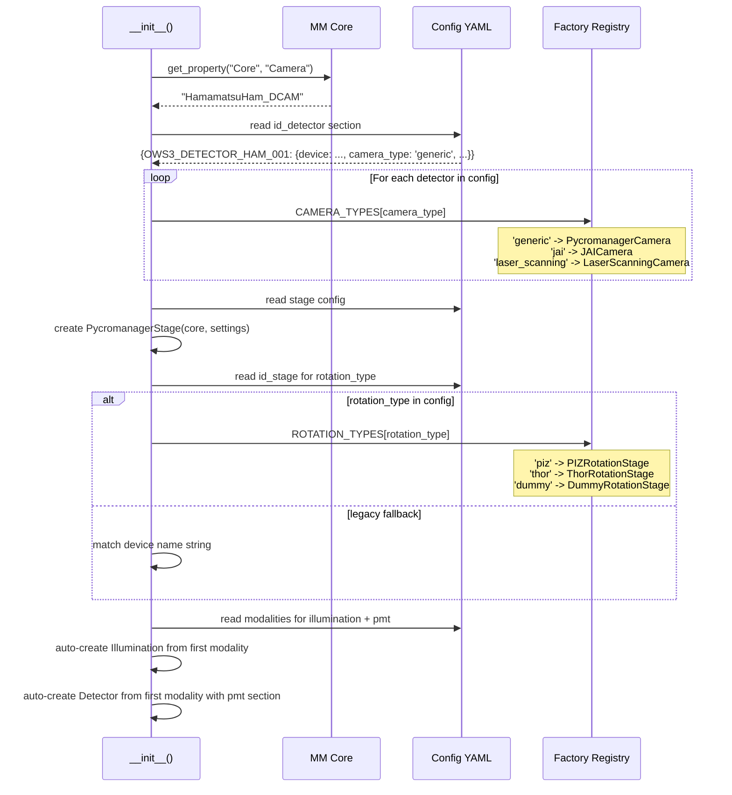
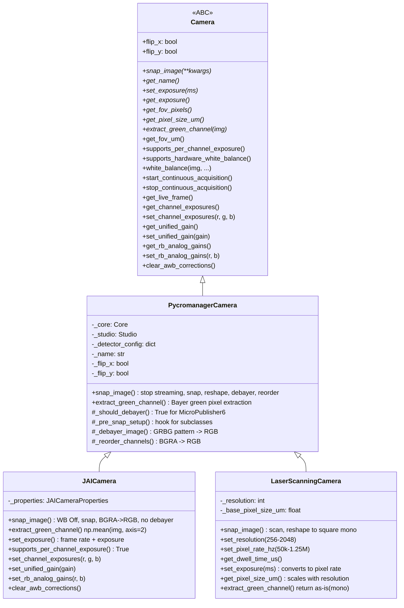
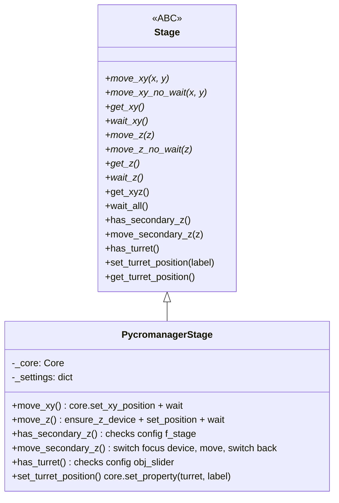
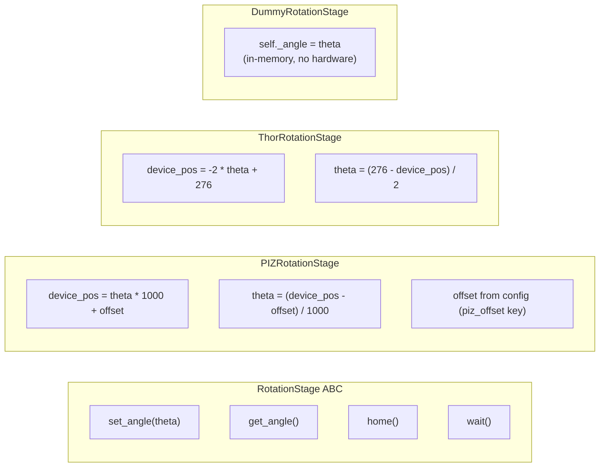
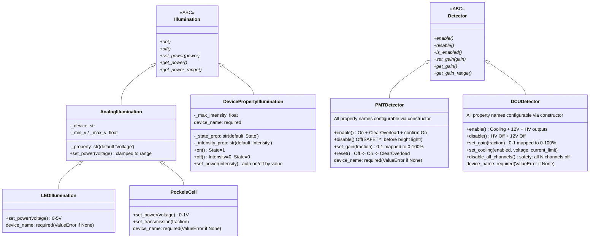
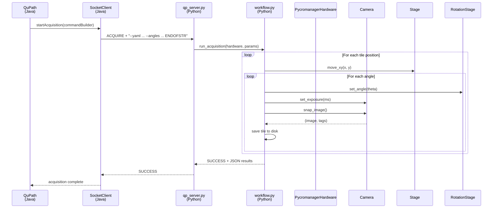

# Hardware Abstraction Layer

Developer reference for the Python-side hardware abstraction in `microscope_control`. This layer sits between the QPSC command server (which receives socket commands from QuPath) and Micro-Manager (which controls the physical hardware).

## Component Architecture

A microscope is composed of five swappable components:

```mermaid
graph TB
    subgraph "MicroscopeHardware (ABC)"
        CAM["camera: Camera<br/>(required)"]
        STG["stage: Stage<br/>(required)"]
        ROT["rotation_stage: RotationStage<br/>(optional)"]
        ILL["illumination: Illumination<br/>(optional)"]
        DET["detector: Detector<br/>(optional)"]
    end

    subgraph "Camera Implementations"
        PMC["PycromanagerCamera<br/>Generic MM camera<br/>Bayer debayer, software WB"]
        JAI["JAICamera<br/>3-CCD prism<br/>per-channel exp/gain"]
        LSC["LaserScanningCamera<br/>OSc-LSM<br/>configurable resolution"]
    end

    subgraph "Stage"
        PMS["PycromanagerStage<br/>Any MM stage<br/>+ optional condenser<br/>+ optional turret"]
    end

    subgraph "Rotation"
        PIZ["PIZRotationStage"]
        THR["ThorRotationStage"]
        DUM["DummyRotationStage"]
    end

    subgraph "Illumination"
        LED["LEDIllumination<br/>Analog voltage 0-5V"]
        DPI["DevicePropertyIllumination<br/>MM State + Intensity<br/>(DiaLamp, CoolLED, etc.)"]
        POC["PockelsCell<br/>Laser power 0-1V"]
    end

    subgraph "Detector"
        PMT["PMTDetector<br/>DCC-100 gain + overload"]
        DCU["DCUDetector<br/>DCU multi-channel PMT<br/>per-channel enable/gain/cooling"]
    end

    CAM --> PMC & JAI & LSC
    STG --> PMS
    ROT --> PIZ & THR & DUM
    ILL --> LED & DPI & POC
    DET --> PMT & DCU
```



## How Components Are Created

`PycromanagerHardware.__init__()` builds all components from the YAML config. Component creation uses config-driven factory registries -- the YAML declares the type, and a dict maps type strings to classes.



### Camera Factory

Camera subclass selection uses the `camera_type` field in each detector's config:

```python
CAMERA_TYPES = {
    "jai":             JAICamera,
    "laser_scanning":  LaserScanningCamera,
    "generic":         PycromanagerCamera,
}
# camera_type defaults to 'generic' if not specified
```

```yaml
# config YAML id_detector section
id_detector:
  LOCI_DETECTOR_JAI_001:
    device: 'JAICamera'
    camera_type: 'jai'          # <-- drives subclass selection
    flip_x: true
    flip_y: true
  OWS3_PMT_BOTTOM_001:
    device: 'OSc-LSM'
    camera_type: 'laser_scanning'
    base_pixel_size_um: 0.509
    flip_x: false
    flip_y: false
```

Adding a new camera type requires only: (1) implement a Camera subclass, (2) import it in `pycromanager.py`, and (3) add one entry to `CAMERA_TYPES`.

### Rotation Stage Factory

Uses the `rotation_type` field from the `id_stage` config section. Falls back to device name string matching for backward compatibility.

```python
ROTATION_TYPES = {
    "piz":   PIZRotationStage,
    "thor":  ThorRotationStage,
    "dummy": DummyRotationStage,
}
```

```yaml
id_stage:
  LOCI_ROTATION_PIZ_001:
    device: 'PIZStage'
    rotation_type: 'piz'       # <-- drives subclass selection
    piz_offset: 50280.0        # <-- calibration offset (was hardcoded)
```

The PIZ offset is now read from config (`piz_offset` key) with a fallback to the legacy `ppm_pizstage_offset` setting, then to the default 50280.0.

### Illumination Auto-Creation

Illumination is auto-created from the first modality config that has an `illumination` or `pockels_cell` section. The `type` field selects the subclass:

```yaml
modalities:
  brightfield:
    illumination:
      device: 'DiaLamp'
      type: 'device_property'     # -> DevicePropertyIllumination
      state_property: 'State'
      intensity_property: 'Intensity'
      max_intensity: 2100.0

  ppm_20x:
    illumination:
      device: 'LED-Dev1ao0'
      type: 'analog_voltage'      # -> LEDIllumination
      max_voltage: 5.0

  2p:
    pockels_cell:
      device: 'NIDAQAO-Dev2/ao1'
      max_voltage: 1.0            # -> PockelsCell
```

`apply_mode_setup()` switches the active illumination when changing modalities. The `get_illumination_for_modality()` method builds the correct Illumination instance on demand.

### Detector Auto-Creation

Detectors are auto-created from the first modality with a `pmt` section. The `type` field selects PMTDetector vs DCUDetector:

```yaml
modalities:
  2p:
    pmt:
      device: 'DCUModule1'
      type: 'dcu'              # -> DCUDetector (multi-channel)
      connector: 1
      max_gain_percent: 100.0

  shg:
    pmt:
      device: 'DCC100'
      type: 'dcc'              # -> PMTDetector (single-module, default)
      connector: 1
      max_gain_percent: 100.0
```

## Camera Hierarchy



### Per-Channel Exposure/Gain (Camera ABC)

The Camera base class defines optional per-channel exposure and gain methods with default no-op implementations. Handler code uses capability checks rather than type-checking for specific camera classes:

```python
# Handler code pattern -- camera-agnostic
if hardware.camera.supports_per_channel_exposure():
    hardware.camera.set_channel_exposures(r_ms, g_ms, b_ms)
else:
    hardware.camera.set_exposure(unified_ms)

# Camera ABC defaults (no-ops for cameras that don't support it)
def get_channel_exposures(self) -> Dict[str, float]:
    exp = self.get_exposure()
    return {"red": exp, "green": exp, "blue": exp}

def set_channel_exposures(self, red, green, blue, auto_enable=True):
    self.set_exposure(green)  # fallback: use green as unified

def set_unified_gain(self, gain): pass   # no-op
def set_rb_analog_gains(self, r, b): pass  # no-op
def clear_awb_corrections(self): pass      # no-op
```

Only JAICamera overrides these with real hardware control. Other cameras get safe no-op behavior automatically.

### Per-Detector Optical Flip

Each camera carries `flip_x` and `flip_y` properties read from the detector's YAML config. This replaces the old global flip preference.

```yaml
# config YAML id_detector section
id_detector:
  OWS3_DETECTOR_HAMAMATSU_001:
    device: 'HamamatsuHam_DCAM'
    camera_type: 'generic'
    flip_x: false      # Hamamatsu camera is NOT flipped
    flip_y: false
  OWS3_PMT_BOTTOM_001:
    device: 'OSc-LSM'
    camera_type: 'laser_scanning'
    flip_x: false      # Laser scanner is NOT flipped
    flip_y: false
```

On the Java side, `MicroscopeConfigManager.getDetectorFlipX/Y(detectorId)` reads these values. The flip fallback chain is:

```
Image metadata (most specific)
  -> Detector config from YAML
    -> Global preference (legacy fallback)
```

For SIFT alignment, flip is XOR'd: `sift_flip = macro_flip XOR detector_flip` (if both flipped, they cancel out).

### Multi-Camera Registry

`PycromanagerHardware` maintains a registry of all configured cameras:

```python
hardware.camera_registry
# {'OWS3_DETECTOR_HAMAMATSU_001': PycromanagerCamera(...),
#  'OWS3_PMT_BOTTOM_001': LaserScanningCamera(...)}

hardware.camera                        # Returns active camera
hardware.set_active_camera('OWS3_PMT_BOTTOM_001')  # Switch active
hardware.get_camera_for_detector('OWS3_DETECTOR_HAMAMATSU_001')  # Direct access
```

## Stage



The CAMM microscope uses:
- `ZStage:Z:32` -- primary Z focus
- `ZStage:F:32` -- secondary Z condenser (different focal plane per modality)
- `Turret:O:35` -- objective turret (4x / 20x switching)

Micro-Manager only has one active "focus device" at a time. `PycromanagerStage.move_secondary_z()` temporarily switches the focus device to the F-stage, moves it, then switches back to the primary Z.

### Stage Inversion Correction

On multi-modality microscopes where brightfield and laser scanning share a single MM config file, the pre-init stage Invert-X setting may differ between the original modality configs. The merged config uses one Invert-X value, and profiles that originally used a different inversion carry a `stage_invert_x_correction: true` flag.

`apply_mode_setup()` reads this flag and sets `hardware.stage_invert_x_correction`. Acquisition and coordinate code checks this flag to apply software X-axis inversion.

```yaml
acquisition_profiles:
  bf_20x:
    modality: 'brightfield'
    # BF originally used Invert-X=Yes; merged config uses No
    stage_invert_x_correction: true
```

## Rotation Stage



Each rotation stage has its own angle-to-device-position conversion formula. The caller always works in degrees (birefringence angle space); the implementation handles the hardware-specific conversion.

The PIZ offset is now configurable via the `piz_offset` key in the rotation stage's `id_stage` config entry, replacing the previous hardcoded default. Fallback chain: `id_stage.piz_offset` -> `ppm_pizstage_offset` (legacy) -> 50280.0.

## Illumination & Detector

These are optional components for systems with separate light sources and detectors (e.g., CAMM with LED + laser + PMT, or OWS3 with DiaLamp + Pockels cell + DCU PMT).



### Illumination Types

| Class | Config `type` | Control Method | Typical Hardware |
|-------|--------------|----------------|------------------|
| `LEDIllumination` | `analog_voltage` | NI DAQ analog output 0-5V | LED via Dev1ao0 |
| `DevicePropertyIllumination` | `device_property` (default) | MM State + Intensity properties | Nikon DiaLamp, Lumencor, CoolLED |
| `PockelsCell` | (via `pockels_cell` section) | NI DAQ analog output 0-1V | Laser power modulation |

### Detector Types

| Class | Config `type` | Channels | Typical Hardware |
|-------|--------------|----------|------------------|
| `PMTDetector` | `dcc` (default) | Single module | Becker & Hickl DCC-100 |
| `DCUDetector` | `dcu` | Multi-channel (1-4) | Becker & Hickl DCU |

### Device Name Requirements

All component constructors require an explicit `device_name`. Passing `None` raises `ValueError`. This applies to `LEDIllumination`, `PockelsCell`, `PMTDetector`, and `DCUDetector`.

### Configurable MM Property Names

PMTDetector, DCUDetector, and LaserScanningCamera accept configurable MM property names via constructor parameters. This allows the same class to work with different MM device adapters that use different property naming conventions.

PMTDetector defaults (BH DCC-100):
- `status_property`: `'DCC100 status'` (values: `'On'`/`'Off'`)
- `gain_property_fmt`: `'Connector{connector}GainHV_Percent'`
- `overload_property`: `'ClearOverload'`

DCUDetector defaults (BH DCU, pattern `C{N}_{suffix}`):
- `enable_suffix`: `'_EnableOutputs'`
- `gain_suffix`: `'_GainHV'`
- `power_suffix`: `'_Plus12V'`
- `cooling_suffix`: `'_Cooling'`

## MM ConfigGroup Preset Support

`apply_config_preset(group, preset)` applies Micro-Manager ConfigGroup presets -- the primary mechanism for switching light paths, filter wheels, shutters, and other state devices. MM presets bundle multiple device property changes into a single atomic operation.

```python
hardware.apply_config_preset("Light Path", "2-R100 (BF Camera)")
hardware.apply_config_preset("Lens Turret", "Nikon 20x 0.75NA air")
```

### Mode Setup Orchestration

`apply_mode_setup(profile_name)` orchestrates a full modality switch using the `acquisition_profiles` config. It enforces a strict safety sequence:

```
1. SAFETY: _safe_disable_pmt_and_shutters()  -- protect PMTs
2. Turn off current illumination
3. Apply MM ConfigGroup presets (light path, filter, etc.)
4. Switch camera/detector
5. Switch illumination source and set intensity
6. Apply mode positions (Z, F stages)
7. Set stage_invert_x_correction flag
```

Example acquisition profile with full setup:

```yaml
acquisition_profiles:
  2p_20x:
    modality: '2p'
    objective: 'OWS3_OBJECTIVE_NIKON_20X_001'
    detector: 'OWS3_PMT_BOTTOM_001'
    lsm_resolution: 512
    pockels_power: 0.4
    pmt_gain: 0.60
    illumination_intensity: 0.4
    mm_setup_presets:
      - group: 'Light Path'
        preset: 'Ti:Sapphire Laser'
      - group: 'Filter Turret'
        preset: 'FLIM and two photon filter + 680 sp'
      - group: 'Detector Shutters'
        preset: 'Open (Analog detector)'
      - group: 'Lens Turret'
        preset: 'Nikon 20x 0.75NA air'
```

### PMT Safety Interlock

`_safe_disable_pmt_and_shutters()` runs automatically before any light path or illumination change. It is intentionally conservative -- every step is attempted even if others fail.

Sequence:
1. Disable PMT via Detector abstraction (`disable_all_channels()` for DCU, `disable()` for DCC)
2. Close config-driven shutters from the `pmt_safety` config section

```yaml
pmt_safety:
  detector_shutter:
    device: 'Arduino-Switch'
    preset_group: 'Detector Shutters'    # Prefer ConfigGroup preset
    closed_preset: 'Closed and Off'
  laser_shutter:
    device: 'LaserShutter'
    closed_state: '0'                    # Direct property set (string, never boolean)
```

Each shutter supports two control modes: (1) ConfigGroup preset application (preferred for multi-property atomic sets), or (2) direct State property write with an explicit string value. All state values are strings -- never booleans -- to avoid MM type coercion issues.

## Generic Objective Swap

`swap_objective(target_profile)` reads `objective_swap_sequences` from config to determine the safe order of operations for switching objectives. Different objectives may require different sequences to avoid physical collisions (e.g., high-mag must retract turret before Z travel).

```yaml
objective_swap_sequences:
  low_mag:
    objectives: ['OBJ_4X_001']
    sequence:
      - {action: set_focus_device, device_key: z_stage}
      - {action: move_position, device_key: z_stage, value_key: z}
      - {action: set_turret}
      - {action: set_focus_device, device_key: f_stage}
  high_mag:
    objectives: ['OBJ_20X_001']
    sequence:
      - {action: set_turret}
      - {action: set_focus_device, device_key: z_stage}
      - {action: move_position, device_key: z_stage, value_key: z}
      - {action: set_focus_device, device_key: f_stage}
      - {action: move_position, device_key: f_stage, value_key: f}
```

This replaces previous CAMM-specific objective swap code with a fully config-driven approach that works for any microscope.

## Brightfield Modality

Brightfield support spans both Java and Python:

**Java side** (`BrightfieldModalityHandler`): Registered under prefixes `"bf"` and `"brightfield"` in `ModalityRegistry`. Returns an empty rotation angle list (single snap per tile), sets image type to `BRIGHTFIELD_H_E`, and disables debayer (monochrome sCMOS).

**Python side** (config): Brightfield modalities use `DevicePropertyIllumination` for transmitted light (DiaLamp) or `LEDIllumination` for analog-controlled LEDs. Background correction uses flat-field division. No rotation stage or external detector needed.

```yaml
modalities:
  brightfield:
    type: 'brightfield'
    illumination:
      device: 'DiaLamp'
      type: 'device_property'
      max_intensity: 2100.0
    background_correction:
      enabled: true
      method: 'divide'
```

## Data Flow: QuPath to Hardware



## Configuration Files

| Config File | Microscope | Modalities |
|-------------|-----------|------------|
| `config_PPM.yml` | PPM/CAMM | Polarized light (PPM) + optional brightfield |
| `config_CAMM.yml` | CAMM | PPM + multiphoton/SHG |
| `config_OWS3.yml` | Nikon Ti2-E (OWS3) | Brightfield (Hamamatsu) + two-photon (OSc-LSM + DCU PMT) |

The OWS3 config (`config_OWS3.yml`) is the reference example for dual-modality systems with per-profile MM setup presets, PMT safety interlock, and detector shutter control.

## File Listing

| File | Lines | Purpose |
|------|-------|---------|
| `hardware/base.py` | 291 | MicroscopeHardware ABC + Position + delegations |
| `hardware/camera/base.py` | 259 | Camera ABC (with per-channel exposure/gain defaults) |
| `hardware/camera/pycromanager_camera.py` | 427 | Generic MM camera |
| `hardware/camera/jai_camera.py` | 211 | JAI 3-CCD prism camera |
| `hardware/camera/laser_scanning_camera.py` | 222 | OSc-LSM laser scanner |
| `hardware/stage.py` | 300 | Stage ABC + PycromanagerStage |
| `hardware/rotation.py` | 270 | RotationStage ABC + PIZ/Thor/Dummy |
| `hardware/illumination.py` | 243 | Illumination ABC + AnalogIllumination + LED/PockelsCell + DevicePropertyIllumination |
| `hardware/detector.py` | 327 | Detector ABC + PMTDetector + DCUDetector |
| `hardware/pycromanager.py` | 1451 | PycromanagerHardware (composes all above, factory registries, mode setup, safety interlock) |
