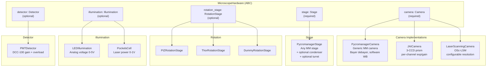
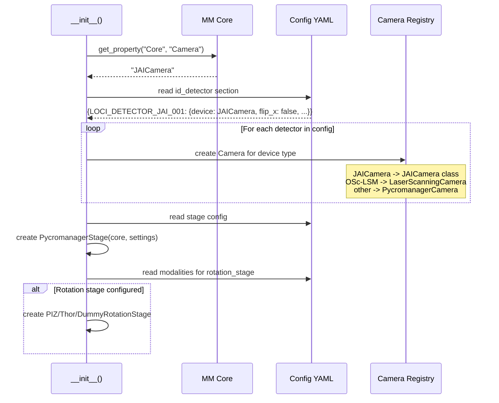
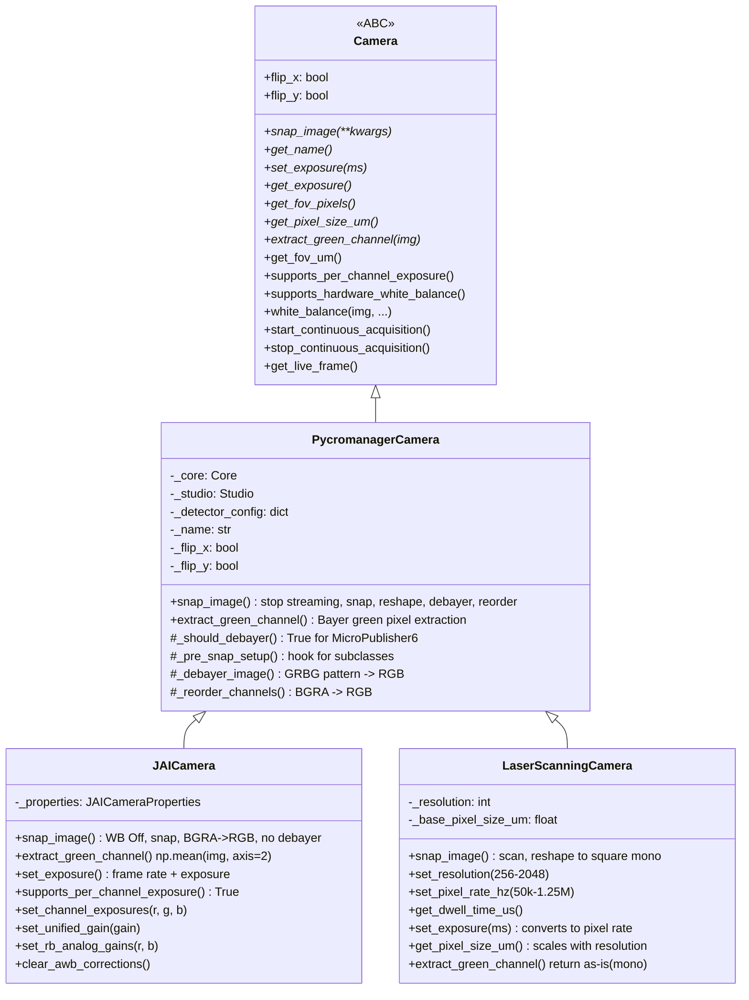
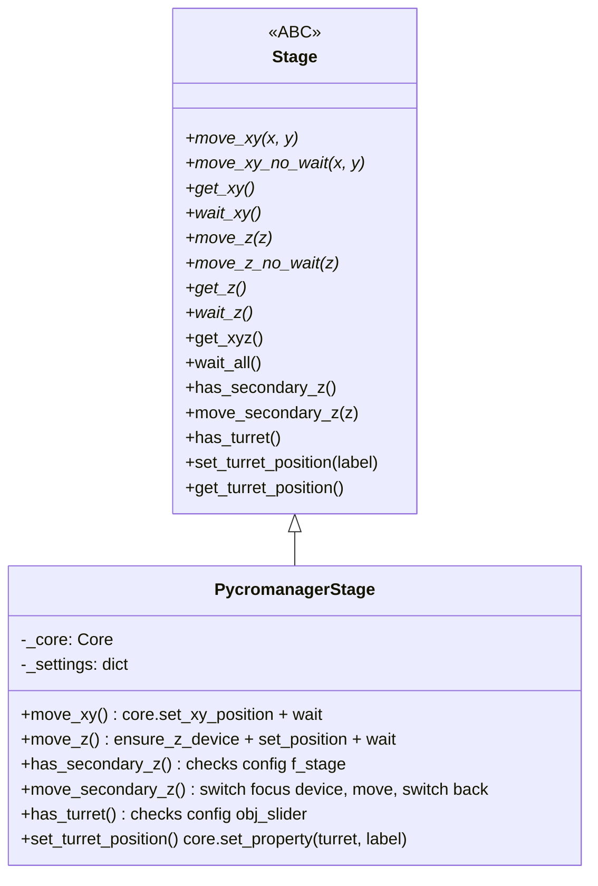
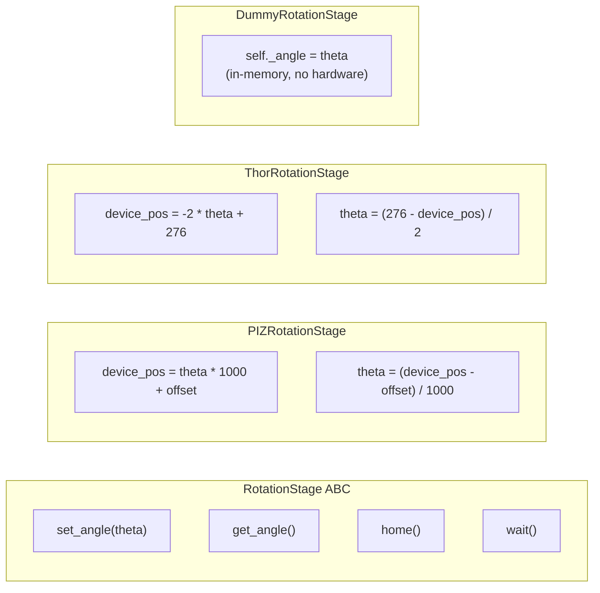
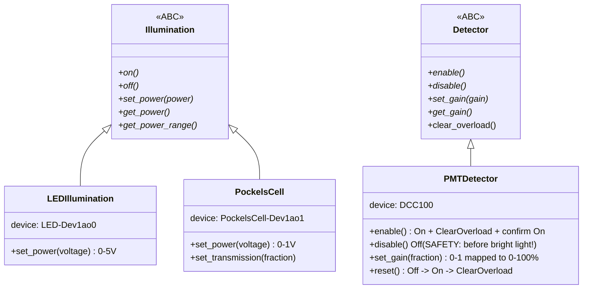
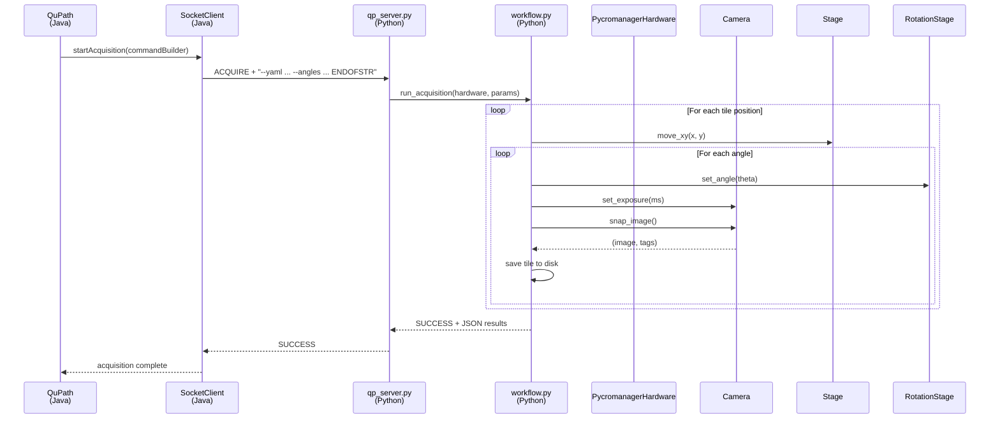

# Hardware Abstraction Layer

Developer reference for the Python-side hardware abstraction in `microscope_control`. This layer sits between the QPSC command server (which receives socket commands from QuPath) and Micro-Manager (which controls the physical hardware).

## Component Architecture

A microscope is composed of five swappable components:



## How Components Are Created

`PycromanagerHardware.__init__()` auto-detects hardware from the YAML config and Micro-Manager state:



## Camera Hierarchy



### Per-Detector Optical Flip

Each camera carries `flip_x` and `flip_y` properties read from the detector's YAML config. This replaces the old global flip preference.

```yaml
# resources_LOCI.yml
id_detector:
  LOCI_DETECTOR_QCAM_001:
    device: 'QCamera'
    flip_x: true       # Brightfield camera IS flipped
    flip_y: true
  LOCI_PMT_001:
    device: 'OSc-LSM'
    flip_x: false      # Laser scanner is NOT flipped
    flip_y: false
```

On the Java side, `MicroscopeConfigManager.getDetectorFlipX/Y(detectorId)` reads these values. The flip fallback chain is:

```
Image metadata (most specific)
  -> Detector config from YAML
    -> Global preference (legacy fallback)
```

For SIFT alignment, flip is XOR'd: `sift_flip = macro_flip XOR detector_flip` (if both flipped, they cancel out).

### Multi-Camera Registry

`PycromanagerHardware` maintains a registry of all configured cameras:

```python
hardware.camera_registry
# {'LOCI_DETECTOR_JAI_001': JAICamera(...),
#  'LOCI_DETECTOR_TELEDYNE_001': PycromanagerCamera(...)}

hardware.camera                        # Returns active camera
hardware.set_active_camera('LOCI_PMT_001')  # Switch active
hardware.get_camera_for_detector('LOCI_DETECTOR_JAI_001')  # Direct access
```

## Stage



The CAMM microscope uses:
- `ZStage:Z:32` -- primary Z focus
- `ZStage:F:32` -- secondary Z condenser (different focal plane per modality)
- `Turret:O:35` -- objective turret (4x / 20x switching)

Micro-Manager only has one active "focus device" at a time. `PycromanagerStage.move_secondary_z()` temporarily switches the focus device to the F-stage, moves it, then switches back to the primary Z.

## Rotation Stage



Each rotation stage has its own angle-to-device-position conversion formula. The caller always works in degrees (birefringence angle space); the implementation handles the hardware-specific conversion.

## Illumination & Detector

These are optional components for systems with separate light sources and detectors (e.g., CAMM with LED + laser + PMT).



## Data Flow: QuPath to Hardware



## File Listing

| File | Lines | Purpose |
|------|-------|---------|
| `hardware/base.py` | 326 | MicroscopeHardware ABC + Position + delegations |
| `hardware/camera/base.py` | 191 | Camera ABC |
| `hardware/camera/pycromanager_camera.py` | 416 | Generic MM camera |
| `hardware/camera/jai_camera.py` | 211 | JAI 3-CCD prism camera |
| `hardware/camera/laser_scanning_camera.py` | 217 | OSc-LSM laser scanner |
| `hardware/stage.py` | 300 | Stage ABC + PycromanagerStage |
| `hardware/rotation.py` | 193 | RotationStage ABC + PIZ/Thor/Dummy |
| `hardware/illumination.py` | 163 | Illumination ABC + LED/PockelsCell |
| `hardware/detector.py` | 175 | Detector ABC + PMTDetector |
| `hardware/pycromanager.py` | 1058 | PycromanagerHardware (composes all above) |
