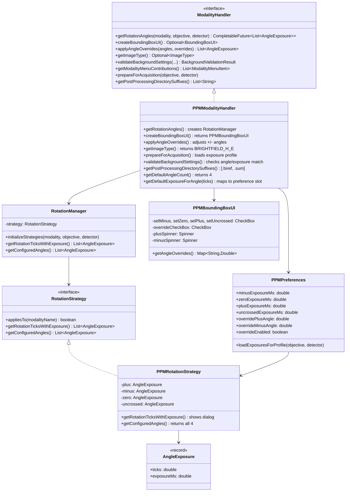
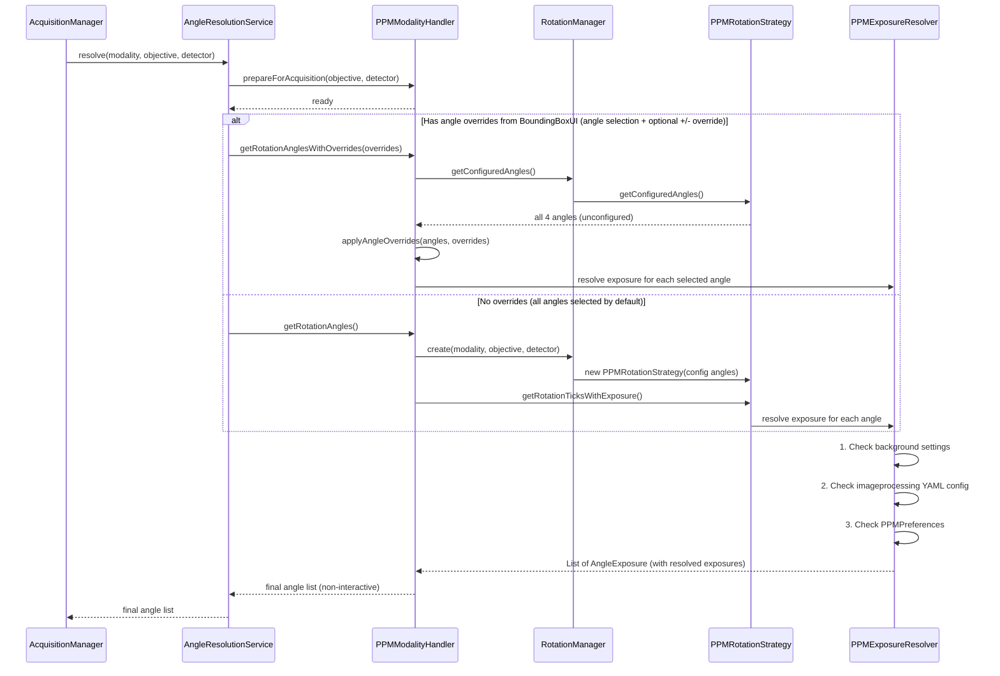
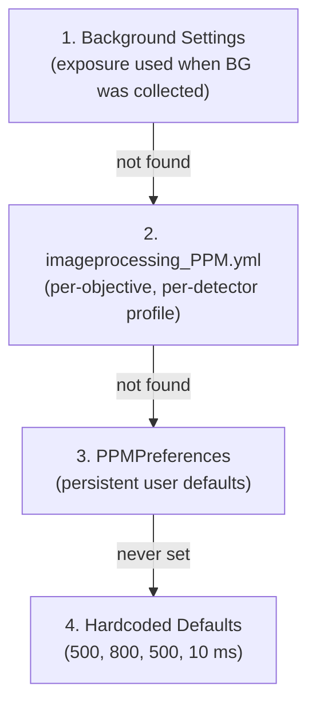
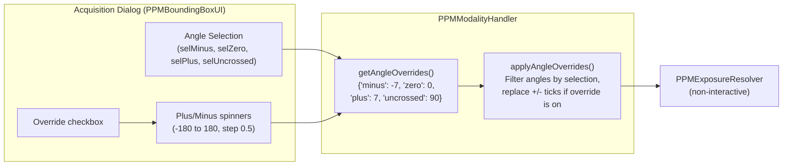
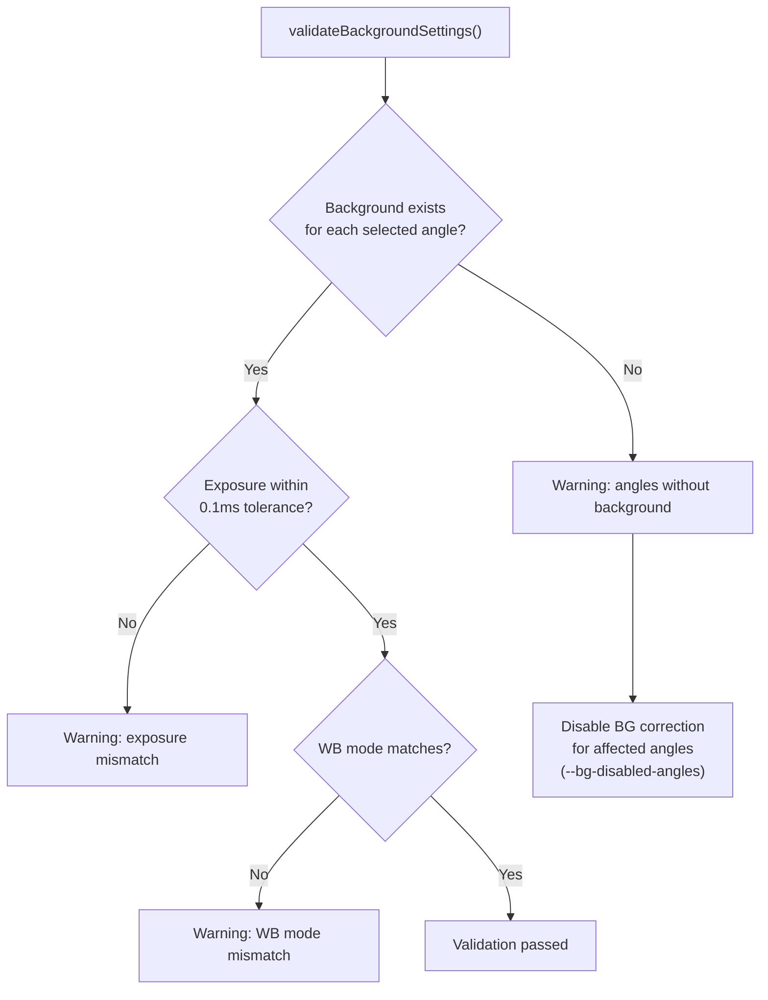

# PPM Modality Implementation

Developer reference for the Polarized light microscopy (PPM) implementation in QPSC. PPM captures tissue at multiple polarizer rotation angles to reveal collagen fiber orientation via birefringence.

## Overview

PPM acquires images at 2-4 rotation angles per tile position. Each angle has an independent exposure time because transmitted light intensity varies significantly with polarizer orientation (crossed polarizers transmit very little light; uncrossed transmit maximum).

The standard PPM angle set is:

| Name | Ticks | Degrees | Typical Exposure | Purpose |
|------|-------|---------|-----------------|---------|
| negative | -7.0 | -14 deg | 500 ms | Birefringence signal (negative offset) |
| crossed | 0.0 | 0 deg | 800 ms | Crossed polarizers (minimum transmission) |
| positive | 7.0 | +14 deg | 500 ms | Birefringence signal (positive offset) |
| uncrossed | 90.0 | 180 deg | 10 ms | Uncrossed polarizers (maximum transmission) |

The birefringence image is computed from the positive and negative angles. The crossed image shows extinction. The uncrossed image provides a brightfield-like reference.

## Class Diagram



## Angle Resolution Flow



All angle selection and override values come upfront from the `PPMBoundingBoxUI` in the acquisition dialog. There is no per-image dialog -- angle resolution is non-interactive.

## Configuration

### YAML Structure (config_PPM.yml)

```yaml
modalities:
  ppm:
    type: 'polarized'
    rotation_stage:
      device: 'LOCI_STAGE_PI_001'      # Hardware ID -> resources_LOCI.yml
      type: 'polarizer'
    rotation_angles:
      - name: 'negative'
        tick: -7                         # Hardware units (degrees for PI stage)
      - name: 'crossed'
        tick: 0
      - name: 'positive'
        tick: 7
      - name: 'uncrossed'
        tick: 90
```

### Exposure Profile (imageprocessing_PPM.yml)

```yaml
imaging_profiles:
  ppm:
    LOCI_OBJECTIVE_OLYMPUS_20X_POL_001:
      LOCI_DETECTOR_JAI_001:
        exposures_ms:
          # Per-channel for JAI 3-CCD (R/G/B independent)
          minus: { r: 480.0, g: 520.0, b: 550.0 }
          zero:  { r: 750.0, g: 800.0, b: 850.0 }
          plus:  { r: 480.0, g: 520.0, b: 550.0 }
          uncrossed: { r: 8.0, g: 10.0, b: 12.0 }
```

The `PPMPreferences.loadExposuresForProfile()` method reads this structure and extracts the green channel value (median channel, matches background collection) as the per-angle exposure default.

## Exposure Priority Chain

When resolving exposure for a PPM angle, the system checks in order:



This ensures consistency: if background images were collected at specific exposures, acquisitions default to the same values.

## Angle Selection & Override System

Users control which angles are acquired and can override the default +/- angles via controls in `PPMBoundingBoxUI` (part of the acquisition dialog). This happens upfront before acquisition starts -- there is no per-image angle popup.



The angle selection determines *which* angles are included. The override spinners only affect the positive and negative angles when the override checkbox is enabled; crossed (0) and uncrossed (90) are always preserved because they are physically meaningful reference positions. Exposure for each angle is resolved non-interactively (background → config → preferences).

## Background Validation

Before acquisition, `PPMModalityHandler.validateBackgroundSettings()` checks that background images are compatible:



## Sunburst Calibration (hue -> angle) is objective-independent

The PPM sunburst calibration (`.npz`) maps image **hue -> orientation angle**.
This mapping is **objective-INDEPENDENT**: a calibration captured at one
objective (e.g. 40x) is valid for acquisitions at any other (e.g. 20x). A
higher-magnification objective yields a better-quality calibration, but the
hue->angle relationship itself does not change with magnification.

Consequences for the code:

- The active calibration is a single global preference
  (`PPMPreferences.activeCalibrationPath`), and
  `QPProjectFunctions.addImageToProjectWithMetadata` stamps it onto **every**
  imported PPM image (`ppm_calibration` metadata) regardless of objective. This
  is correct -- **do NOT add an objective / magnification gate to the stamping.**
  (One was added in `0cfc8d6f` on a wrong premise and reverted in `1810cf58`; a
  20x image carrying a "40x" calibration path is valid, just where it was
  captured.)
- If the magnification in the stamped path is ever surfaced to users as a
  potential mismatch, that is a labelling concern, not a data concern.

## Post-Processing Outputs

The Python acquisition server creates additional outputs for PPM:

```
tiles/
  ppm_20x_1/
    Region_1/
      tile_000_ang-7.0.tif    # Raw tile at -7 degrees
      tile_000_ang0.0.tif     # Raw tile at 0 degrees
      tile_000_ang7.0.tif     # Raw tile at +7 degrees
      tile_000_ang90.0.tif    # Raw tile at 90 degrees
    Region_1.biref/           # Computed birefringence
      tile_000.tif
    Region_1.sum/             # Sum of angle images
      tile_000.tif
```

The `.biref` and `.sum` directories are discovered by `StitchingHelper` via `PPMModalityHandler.getPostProcessingDirectorySuffixes()` and stitched as additional output images.

### Channel Naming on Import

When PPM post-processed outputs (`.biref` and `.sum` files) are imported into a QuPath project, they are assigned stable, descriptive channel names:

| Output | Channel Name | Purpose |
|--------|--------------|---------|
| `_biref.ome.tif` | "PPM Subtracted" | Birefringence image (computed from +/- angle pair) |
| `_sum.ome.tif` | "PPM Sum" | Sum of angle images (brightness reference) |

The channel names persist across project re-opens and enable consistent display settings across repeated acquisitions. Without this, repeated PPM runs would have ambiguous channel names like "Channel 0" and "Channel 1" depending on which tile happened to be read first by BioFormats.

## Birefringence bit depth (8-bit inputs vs. high-bit-depth capture)

The `.biref` file has **always** been written as 16-bit single-channel. But the
birefringence is computed from the two angle frames, and the JAI 3-CCD delivers
**8-bit RGB** by default -- so the historical 16-bit `.biref` carries only ~8 bits
of real information. The normalized formula `|(I+ - I-)/(I+ + I-)|` runs in float32
and is **scale-invariant**, so higher-bit inputs do not change the *shape* of the
result; they reduce **quantization noise**, most visibly in the dark crossed-polarizer
regions where `I+ + I-` is small and 8-bit integer steps make the ratio coarse.

An **opt-in** preference, **PPM > "High Bit Depth PPM Capture"** (`PPMPreferences.getHighBitDepth`,
default OFF), acquires the PPM angle frames at the camera's higher-bit PixelFormat so
the biref is computed from genuine high-precision inputs. Data flow:

- Java: `PPMModalityHandler.configureCommandBuilder` emits `--ppm-high-bit-depth true`
  (via `AcquisitionCommandBuilder.ppmHighBitDepth`) only when the preference is on.
  When off, no flag is sent and the acquisition is byte-identical to the 8-bit path.
- Python: `workflow.py` parses the flag, resolves the high-bit full-scale from the
  detector's `high_bit_depth` YAML block, and wraps **only the per-tile angle-snap
  call** in `camera.set_high_bit_mode(True)` / `set_high_bit_mode(False)` (autofocus,
  which runs before the wrap, stays 8-bit; the format is always restored, even on
  cancel/error, so live view and other modalities are never left in 16-bit).
- `JAICamera.set_high_bit_mode` flips a config-driven MM device property (the JAI is a
  prism, so higher bits come from the PixelFormat, not debayering). The property name
  and values are camera/adapter specific and live in `resources_LOCI.yml` under the JAI
  detector's `high_bit_depth` block; **absent -> the feature is a safe no-op** (logs a
  warning, stays 8-bit).
- `ppm_library` `ppm_normalized_difference_abs` / `ppm_angle_sum` take an `input_max`
  so the biref dark-mask threshold (`--biref-min-intensity`, specified on the 8-bit
  scale) and the sum normalization track the input's real full-scale. `input_max=None`
  keeps the exact 8-bit behavior.

The JAI hardware WB (per-channel exposures/gains) is a set of **ratios** plus a relative
target level, so an existing 8-bit calibration stays valid at high bit depth without
re-calibration (the same exposures produce the same *relative* level; only the ADC
resolution changes). The `bit_depth: 16` hook in `jai/calibration.py` only matters if
you re-run a WB calibration in high-bit mode.

**Verification owed on the scope:** discover the JAI PixelFormat property/values, confirm
the camera delivers *real* extra bits (not left-shifted 8-bit), and collect the PPM
flat-field background in the same high-bit mode so the flat-field divide matches scales.

## Z-stack / angle loop-order toggle (2026-05-14)

PPM acquisitions historically ran **z-outer / angle-inner**: every angle re-images at each z plane before z advances. When users start z-stacking PPM (e.g. 40x on thicker tissue slices) this becomes expensive -- a 5-z x 4-angle field pays 20 rotation-stage moves per tile when the same data could be acquired with 4.

A loop-order toggle in the acquisition dialog flips the nest to **angle-outer / z-inner** ("Z per angle (fast for thicker slides)") via the `--inner-axis z` wire flag. The per-angle WB / JAI-calibration / exposure block is hoisted outside the inner z loop so it runs once per angle per tile (was once per angle-z, wastefully). Default remains angle-inner so existing PPM acquisitions are byte-identical; the toggle only changes anything for callers that explicitly request the alternative ordering.

The new code path lives in `_acquire_tile_angles_angle_outer` in `microscope_command_server/acquisition/workflow.py`. The post-sweep birefringence creation and z-projection semantics match the default body.

## PPM Menu Contributions

`PPMModalityHandler.getModalityMenuContributions()` adds four items to the PPM menu in QuPath:

| Menu Item | Workflow | Purpose |
|-----------|----------|---------|
| Polarizer Calibration | `PolarizerCalibrationWorkflow` | Calibrate rotation stage tick values |
| Rotation Sensitivity Test | `PPMSensitivityTestWorkflow` | Analyze impact of angular deviations |
| Birefringence Optimization | `BirefringenceOptimizationWorkflow` | Find optimal +/- angles for max signal |
| Reference Slide (Sunburst) | `SunburstCalibrationWorkflow` | Create hue-to-angle mapping from reference |

## Key Files

| File | Purpose |
|------|---------|
| `modality/ModalityHandler.java` | Plugin interface |
| `modality/ModalityRegistry.java` | Prefix-based handler lookup |
| `modality/AngleExposure.java` | Immutable (ticks, exposureMs) record |
| `modality/ppm/PPMModalityHandler.java` | PPM implementation (~450 lines) |
| `modality/ppm/PPMExposureResolver.java` | Resolves exposure per angle (background → config → prefs) |
| `modality/ppm/RotationManager.java` | Config loading + strategy creation |
| `modality/ppm/RotationStrategy.java` | PPMRotationStrategy + NoRotationStrategy |
| `modality/ppm/PPMPreferences.java` | Persistent exposure/angle defaults |
| `modality/ppm/ui/PPMBoundingBoxUI.java` | Angle selection checkboxes, override spinners |
| `service/AngleResolutionService.java` | Orchestrates the resolution pipeline |
| `service/AcquisitionCommandBuilder.java` | Formats `--angles` and `--exposures` |
