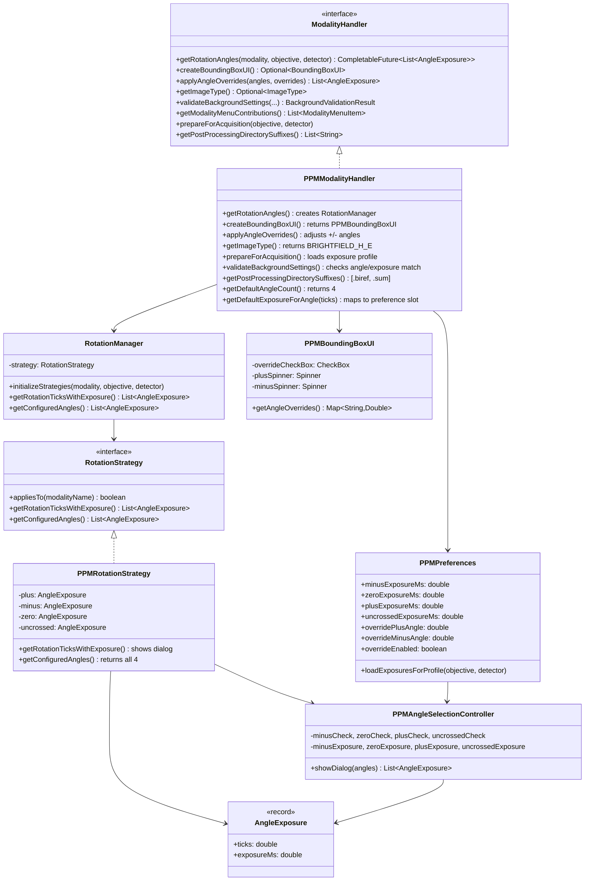
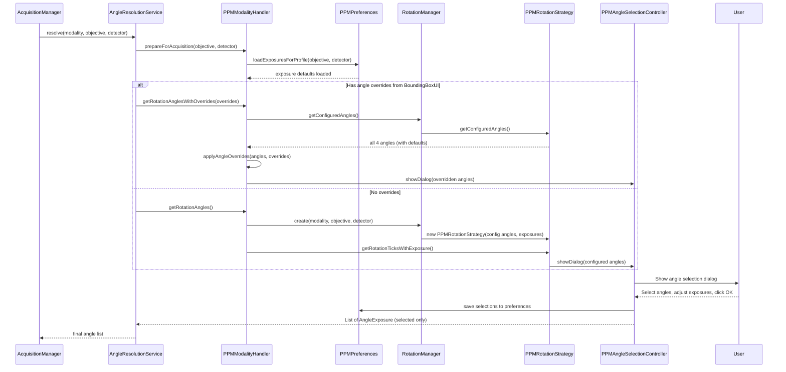
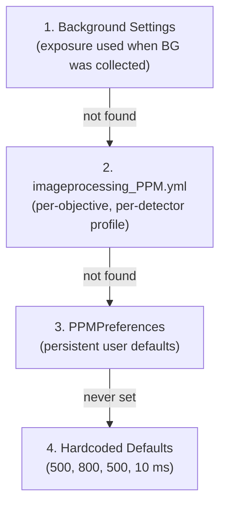
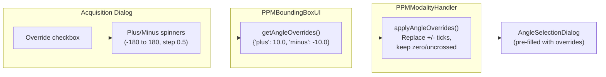
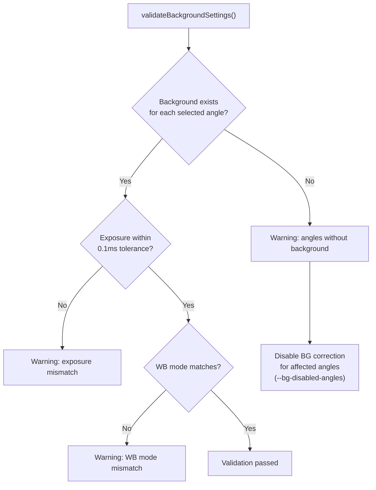

# PPM Modality Implementation

Developer reference for the Polarized light microscopy (PPM) implementation in QPSC. PPM captures tissue at multiple polarizer rotation angles to reveal collagen fiber orientation via birefringence.

## Overview

PPM acquires images at 2-4 rotation angles per tile position. Each angle has an independent exposure time because transmitted light intensity varies significantly with polarizer orientation (crossed polarizers transmit very little light; uncrossed transmit maximum).

The standard PPM angle set is:

| Name | Ticks | Degrees | Typical Exposure | Purpose |
|------|-------|---------|-----------------|---------|
| negative | -7.0 | -14 deg | 500 ms | Birefringence signal (negative offset) |
| crossed | 0.0 | 0 deg | 800 ms | Crossed polarizers (minimum transmission) |
| positive | 7.0 | +14 deg | 500 ms | Birefringence signal (positive offset) |
| uncrossed | 90.0 | 180 deg | 10 ms | Uncrossed polarizers (maximum transmission) |

The birefringence image is computed from the positive and negative angles. The crossed image shows extinction. The uncrossed image provides a brightfield-like reference.

## Class Diagram



## Angle Resolution Flow



## Configuration

### YAML Structure (config_PPM.yml)

```yaml
modalities:
  ppm:
    type: 'polarized'
    rotation_stage:
      device: 'LOCI_STAGE_PI_001'      # Hardware ID -> resources_LOCI.yml
      type: 'polarizer'
    rotation_angles:
      - name: 'negative'
        tick: -7                         # Hardware units (degrees for PI stage)
      - name: 'crossed'
        tick: 0
      - name: 'positive'
        tick: 7
      - name: 'uncrossed'
        tick: 90
```

### Exposure Profile (imageprocessing_PPM.yml)

```yaml
imaging_profiles:
  ppm:
    LOCI_OBJECTIVE_OLYMPUS_20X_POL_001:
      LOCI_DETECTOR_JAI_001:
        exposures_ms:
          # Per-channel for JAI 3-CCD (R/G/B independent)
          minus: { r: 480.0, g: 520.0, b: 550.0 }
          zero:  { r: 750.0, g: 800.0, b: 850.0 }
          plus:  { r: 480.0, g: 520.0, b: 550.0 }
          uncrossed: { r: 8.0, g: 10.0, b: 12.0 }
```

The `PPMPreferences.loadExposuresForProfile()` method reads this structure and extracts the green channel value (median channel, matches background collection) as the per-angle exposure default.

## Exposure Priority Chain

When resolving exposure for a PPM angle, the system checks in order:



This ensures consistency: if background images were collected at specific exposures, acquisitions default to the same values.

## Angle Override System

Users can override the default +/- angles for a single acquisition without changing the global config. This is useful when the birefringence signal is weak and a wider angular spread is needed.



The override only affects the positive and negative angles. Crossed (0) and uncrossed (90) are always preserved because they are physically meaningful reference positions.

## Background Validation

Before acquisition, `PPMModalityHandler.validateBackgroundSettings()` checks that background images are compatible:



## Post-Processing Outputs

The Python acquisition server creates additional outputs for PPM:

```
tiles/
  ppm_20x_1/
    Region_1/
      tile_000_ang-7.0.tif    # Raw tile at -7 degrees
      tile_000_ang0.0.tif     # Raw tile at 0 degrees
      tile_000_ang7.0.tif     # Raw tile at +7 degrees
      tile_000_ang90.0.tif    # Raw tile at 90 degrees
    Region_1.biref/           # Computed birefringence
      tile_000.tif
    Region_1.sum/             # Sum of angle images
      tile_000.tif
```

The `.biref` and `.sum` directories are discovered by `StitchingHelper` via `PPMModalityHandler.getPostProcessingDirectorySuffixes()` and stitched as additional output images.

## PPM Menu Contributions

`PPMModalityHandler.getModalityMenuContributions()` adds four items to the PPM menu in QuPath:

| Menu Item | Workflow | Purpose |
|-----------|----------|---------|
| Polarizer Calibration | `PolarizerCalibrationWorkflow` | Calibrate rotation stage tick values |
| Rotation Sensitivity Test | `PPMSensitivityTestWorkflow` | Analyze impact of angular deviations |
| Birefringence Optimization | `BirefringenceOptimizationWorkflow` | Find optimal +/- angles for max signal |
| Reference Slide (Sunburst) | `SunburstCalibrationWorkflow` | Create hue-to-angle mapping from reference |

## Key Files

| File | Purpose |
|------|---------|
| `modality/ModalityHandler.java` | Plugin interface |
| `modality/ModalityRegistry.java` | Prefix-based handler lookup |
| `modality/AngleExposure.java` | Immutable (ticks, exposureMs) record |
| `modality/ppm/PPMModalityHandler.java` | PPM implementation (~450 lines) |
| `modality/ppm/RotationManager.java` | Config loading + strategy creation |
| `modality/ppm/RotationStrategy.java` | PPMRotationStrategy + NoRotationStrategy |
| `modality/ppm/PPMPreferences.java` | Persistent exposure/angle defaults |
| `modality/ppm/ui/PPMBoundingBoxUI.java` | Angle override spinners |
| `modality/ppm/ui/PPMAngleSelectionController.java` | Angle/exposure dialog |
| `service/AngleResolutionService.java` | Orchestrates the resolution pipeline |
| `service/AcquisitionCommandBuilder.java` | Formats `--angles` and `--exposures` |
