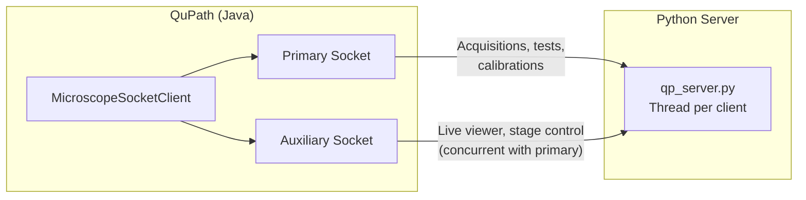
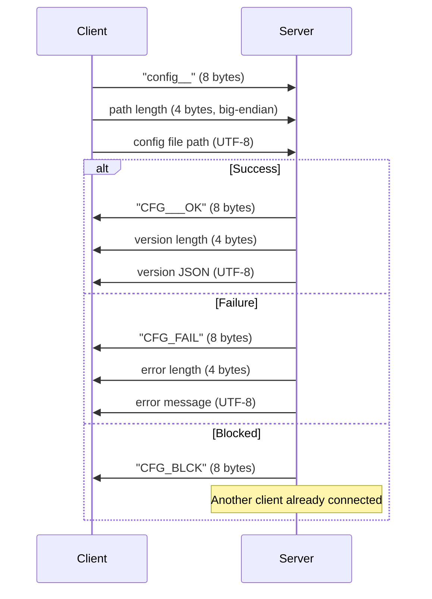
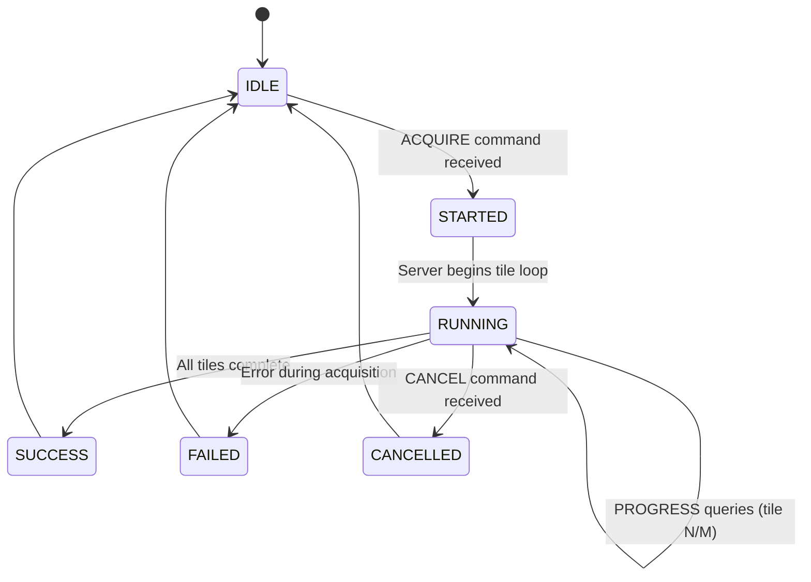

# Socket Communication Protocol

Developer reference for the binary TCP protocol between the QuPath Java extension (`MicroscopeSocketClient`) and the Python microscope server (`qp_server.py`).

## Connection Architecture



The dual-socket design allows the live viewer and stage controls to operate during long-running acquisitions. Each socket gets its own handler thread on the server.

## Protocol Format

### Command Structure

All commands are **8-byte ASCII strings**, padded with underscores:

```
| 8 bytes: command |
| e.g.: "acquire_" |
```

### Message Types

**Simple command (no payload):**
```
Client: [8-byte command]
Server: [8-byte response]
```

**Command with string payload:**
```
Client: [8-byte command]
Client: [UTF-8 string + "ENDOFSTR"]
Server: [variable response, read until timeout]
```

**Command with binary payload:**
```
Client: [8-byte command]
Client: [4-byte big-endian length] [payload bytes]
Server: [4-byte big-endian length] [response bytes]
```

### CONFIG Handshake

The first command after connection must be CONFIG:



## Command Reference

### Stage Control

| Command | Wire Format | Payload | Response |
|---------|------------|---------|----------|
| GETXY | `getxy___` | none | 16 bytes: X,Y as big-endian doubles |
| GETZ | `getz____` | none | 8 bytes: Z as big-endian double |
| GETXYZ | `getxyz__` | none | 24 bytes: X,Y,Z as big-endian doubles |
| MOVE | `move____` | 16 bytes: X,Y doubles | 8-byte ack |
| MOVEZ | `move_z__` | 8 bytes: Z double | 8-byte ack |
| MOVEXYZ | `movexyz_` | 24 bytes: X,Y,Z doubles | 8-byte ack |
| MOVER | `move_r__` | 8 bytes: angle double | 8-byte ack |
| GETR | `getr____` | none | 8 bytes: angle double |

### Acquisition

| Command | Wire Format | Payload | Response |
|---------|------------|---------|----------|
| ACQUIRE | `acquire_` | flag-based string + ENDOFSTR | STARTED -> SUCCESS/FAILED |
| BGACQUIRE | `bgacquir` | flag-based string + ENDOFSTR | STARTED -> SUCCESS/FAILED |
| STATUS | `status__` | none | status string |
| PROGRESS | `progress` | none | progress string |
| CANCEL | `cancel__` | none | 8-byte ack |

### Acquisition Message Format

The ACQUIRE payload is a flag-based string:

```
--yaml /path/config.yml
--projects /path/projects
--sample SampleName
--scan-type ppm_20x_1
--region AnnotationName
--objective LOCI_OBJECTIVE_OLYMPUS_20X_POL_001
--detector LOCI_DETECTOR_JAI_001
--pixel-size 0.1725
--angles "(-7.0,0.0,7.0,90.0)"
--exposures "(500.0,800.0,500.0,10.0)"
--bg-correction true
--bg-method divide
--bg-folder /path/to/backgrounds
--wb-mode per_angle
--processing "(debayer,background_correction,white_balance)"
--af-tiles 9
--af-steps 20
--af-range 10.0
--hint-z -3245.5
ENDOFSTR
```

### Camera Control

| Command | Wire Format | Payload | Response |
|---------|------------|---------|----------|
| GETEXP | `getexp__` | none | exposure values |
| SETEXP | `setexp__` | exposure string | ack |
| GETGAIN | `getgain_` | none | gain values |
| SETGAIN | `setgain_` | gain string | ack |
| GETMODE | `getmode_` | none | mode flags |
| SETMODE | `setmode_` | mode string | ack |
| SNAP | `snap____` | exposure bytes | image data |
| GETCAM | `getcam__` | none | camera name string |

### Live Mode

| Command | Wire Format | Payload | Response |
|---------|------------|---------|----------|
| GETLIVE | `getlive_` | none | 1 byte: 0/1 |
| SETLIVE | `setlive_` | 1 byte: 0/1 | 8-byte ack |
| GETFRAME | `getframe` | none | image metadata + pixel data |
| STRTSEQ | `strtseq_` | none | 8-byte ack |
| STOPSEQ | `stopseq_` | none | 8-byte ack |

### Calibration & Testing

| Command | Wire Format | Payload | Response |
|---------|------------|---------|----------|
| TESTAF | `testaf__` | params + ENDOFSTR | AF result |
| TESTADAF | `testadaf` | params + ENDOFSTR | adaptive AF result |
| AFBENCH | `afbench_` | params + ENDOFSTR | benchmark results |
| SIFTAL | `siftal__` | `--wsi-region ... --flip-x ENDOFSTR` | `SUCCESS:x,y\|inliers:N` |
| PPMBIREF | `ppmbiref` | params + ENDOFSTR | optimization result |
| SBCALIB | `sbcalib_` | params + ENDOFSTR | calibration result |
| WBSIMPLE | `wbsimple` | params + ENDOFSTR | WB result |
| WBPPM | `wbppm___` | params + ENDOFSTR | WB result |

### System

| Command | Wire Format | Payload | Response |
|---------|------------|---------|----------|
| CONFIG | `config__` | path length + path | CFG___OK/CFG_FAIL/CFG_BLCK |
| SHUTDOWN | `shutdown` | none | none (server exits) |
| DISCONNECT | `quitclnt` | none | none (close connection) |
| GETPXSZ | `getpxsz_` | none | 8 bytes: pixel size double |
| GETFOV | `getfov__` | none | 16 bytes: FOV X,Y doubles |

## Acquisition Lifecycle



The client polls STATUS and PROGRESS on a background thread while the primary socket blocks on the ACQUIRE response.

## Timeouts

| Operation | Default Timeout |
|-----------|----------------|
| Socket connection | 3000 ms |
| Default read | 5000 ms |
| Acquisition acknowledgment | 30 s |
| Autofocus test | 120 s |
| Background acquisition | 180 s |
| Z-stack / time-lapse | 600 s |
