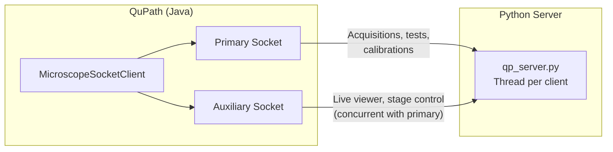
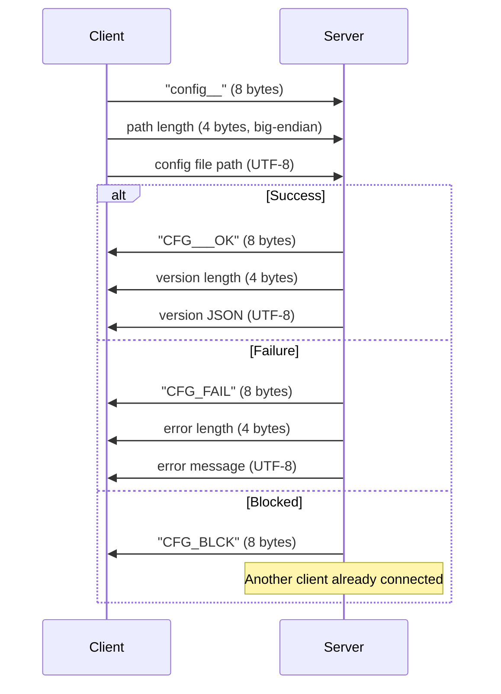
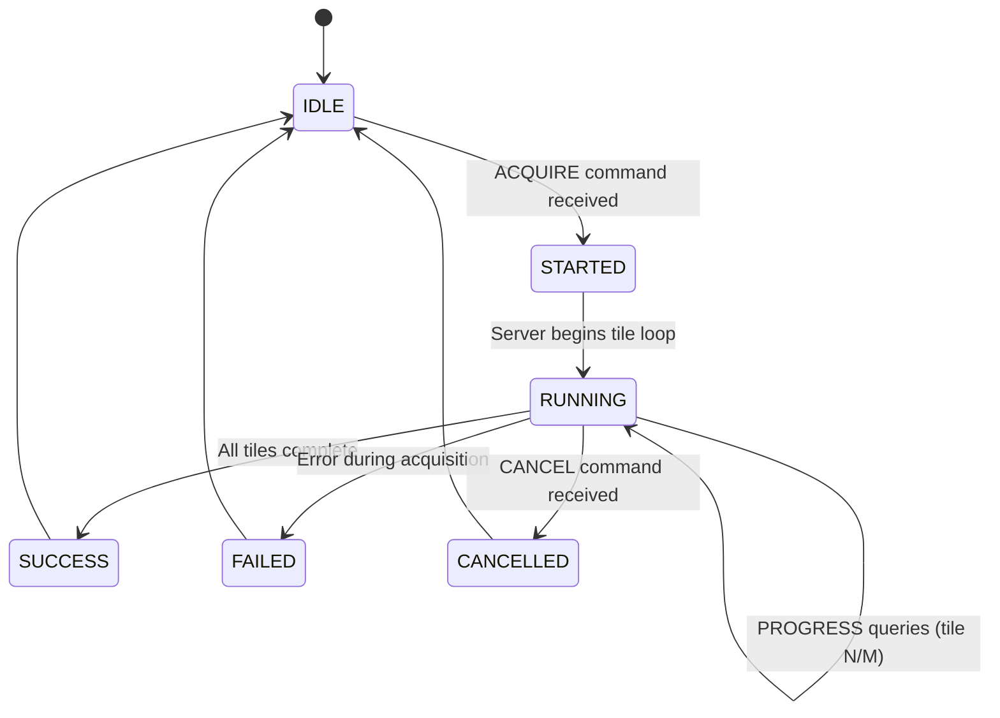

# Socket Communication Protocol

Developer reference for the binary TCP protocol between the QuPath Java extension (`MicroscopeSocketClient`) and the Python microscope server (`qp_server.py`).

## Connection Architecture



The dual-socket design allows the live viewer and stage controls to operate during long-running acquisitions. Each socket gets its own handler thread on the server.

## Protocol Format

### Command Structure

All commands are **8-byte ASCII strings**, padded with underscores:

```
| 8 bytes: command |
| e.g.: "acquire_" |
```

### Message Types

**Simple command (no payload):**
```
Client: [8-byte command]
Server: [8-byte response]
```

**Command with string payload:**
```
Client: [8-byte command]
Client: [UTF-8 string + "ENDOFSTR"]
Server: [variable response, read until timeout]
```

**Command with binary payload:**
```
Client: [8-byte command]
Client: [4-byte big-endian length] [payload bytes]
Server: [4-byte big-endian length] [response bytes]
```

### CONFIG Handshake

The first command after connection must be CONFIG:



## Command Reference

### Stage Control

| Command | Wire Format | Payload | Response |
|---------|------------|---------|----------|
| GETXY | `getxy___` | none | 16 bytes: X,Y as big-endian doubles |
| GETZ | `getz____` | none | 8 bytes: Z as big-endian double |
| GETXYZ | `getxyz__` | none | 24 bytes: X,Y,Z as big-endian doubles |
| MOVE | `move____` | 16 bytes: X,Y doubles | 8-byte ack |
| MOVEZ | `move_z__` | 8 bytes: Z double | 8-byte ack |
| MOVEXYZ | `movexyz_` | 24 bytes: X,Y,Z doubles | 8-byte ack |
| MOVER | `move_r__` | 8 bytes: angle double | 8-byte ack |
| GETR | `getr____` | none | 8 bytes: angle double |

### Acquisition

| Command | Wire Format | Payload | Response |
|---------|------------|---------|----------|
| ACQUIRE | `acquire_` | flag-based string + ENDOFSTR | STARTED -> SUCCESS/FAILED |
| BGACQUIRE | `bgacquir` | flag-based string + ENDOFSTR | STARTED -> SUCCESS/FAILED |
| STATUS | `status__` | none | status string |
| PROGRESS | `progress` | none | progress string |
| CANCEL | `cancel__` | none | 8-byte ack |

### Acquisition Message Format

The ACQUIRE payload is a flag-based string:

```
--yaml /path/config.yml
--projects /path/projects
--sample SampleName
--scan-type ppm_20x_1
--region AnnotationName
--objective LOCI_OBJECTIVE_OLYMPUS_20X_POL_001
--detector LOCI_DETECTOR_JAI_001
--pixel-size 0.1725
--angles "(-7.0,0.0,7.0,90.0)"
--exposures "(500.0,800.0,500.0,10.0)"
--bg-correction true
--bg-method divide
--bg-folder /path/to/backgrounds
--wb-mode per_angle
--processing "(debayer,background_correction,white_balance)"
--af-tiles 9
--af-steps 20
--af-range 10.0
--af-disabled
--hint-z -3245.5
--z-stack
--z-start -5.0
--z-end 5.0
--z-step 2.0
--z-projection max
--save-raw true
ENDOFSTR
```

`--af-disabled` is mutually exclusive with the `--af-tiles`/`--af-steps`/`--af-range` triplet. When the Java side's "Disable Autofocus" preference is on, the triplet is omitted and `--af-disabled` is sent in its place. The server short-circuits `_configure_autofocus` (no YAML load required, no AF positions scheduled), so no pre-acquisition AF fires, no per-tile drift checks run, and no manual-focus prompts appear.

### Camera Control

| Command | Wire Format | Payload | Response |
|---------|------------|---------|----------|
| GETEXP | `getexp__` | none | exposure values |
| SETEXP | `setexp__` | exposure string | ack |
| GETGAIN | `getgain_` | none | gain values |
| SETGAIN | `setgain_` | gain string | ack |
| GETMODE | `getmode_` | none | mode flags |
| SETMODE | `setmode_` | mode string | ack |
| SETCAM | `setcam__` | mode + exposures + gains | ack |
| SNAP | `snap____` | exposure bytes | image data |
| GETCAM | `getcam__` | none | camera name string |
| GETBIN | `getbin__` | none | 1-byte count + N bytes binnings + 1-byte current |
| SETBIN | `setbin__` | 1-byte unsigned binning factor | `ACK_____` / `ERR_SETB` |
| GETCAP | `getcap__` | optional 32-byte profile name (null-padded UTF-8); empty = current state | 4-byte big-endian length + UTF-8 JSON capability dict |

**Binning** (`GETBIN` / `SETBIN`, Camera Control v2 phase 1): cameras whose MM device exposes a `Binning` property report it through these commands. Cameras without binning support return `[1]` from `GETBIN` and no-op `SETBIN`. Binning factors are unsigned bytes (1..255). The server stops live-mode streaming before applying `SETBIN`.

**Capability query** (`GETCAP`, phase 2): single round-trip that returns everything the Camera Control v2 dialog needs to render — camera capabilities, every illumination source declared in the config, and the modality / channels / rotation angles for the queried profile. JSON shape:

```json
{
  "camera": {
    "name": "...", "type": "jai" | "hamamatsu" | "laser_scanning" | "generic",
    "supports_per_channel_exposure": bool,
    "supports_hardware_white_balance": bool,
    "available_binnings": [int, ...],
    "current_binning": int,
    "exposure_range_ms": [float, float],
    "gain_range": [float, float] | null
  },
  "illumination": [
    {"label": str, "device": str, "power_range": [float, float],
     "current_power": float, "is_on": bool,
     "value_type": "binary" | "continuous" | "discrete"}
  ],
  "modality": {
    "name": str, "default_wb_mode": str,
    "is_multi_angle": bool,
    "channels": [{"id": str, "exposure_ms": float, ...}] | null,
    "rotation_angles": [float, ...] | null
  },
  "active_profile": str | null
}
```

`value_type` tells the client which input widget to render: `"binary"` → checkbox (only valid powers are 0 and `power_range[1]`); `"continuous"` → spinner / text field; `"discrete"` → reserved for a future enumerated-set source (radio buttons). Empty payload returns the current state via the server's tracked `_active_profile`; non-empty payload describes what the profile would render after Apply (no actual hardware change).

### Illumination & Profile

| Command | Wire Format | Payload | Response |
|---------|------------|---------|----------|
| GETILLM | `getillm_` | none | 14 bytes: avail flag + 3 floats (power/min/max) + 1-byte is_on |
| SETILLM | `setillm_` | 4-byte big-endian float | `ACK_____` / `ERR_ILLM` |
| SETILLMD | `setilmd_` | 32-byte device name + 4-byte float | `ACK_____` / `ERR_DEVN` / `ERR_ILLM` |
| APPLYPR | `applypr_` | 32-byte profile name | `ACK_____` / `ERR_PROF` |
| APPLYCH | `applych_` | 32-byte profile name + 32-byte channel id | `ACK_____` / `ERR_CHAN` |

**SETILLM** drives whichever source the active profile selected (the legacy single-source endpoint). **SETILLMD** drives a NAMED source independently; the server walks every modality, builds each illumination via `_build_illumination_from_config`, finds the device-name match, and calls `set_power` on it. Lets the dialog tune any declared source without first APPLYPRing to its modality. Note: if the source's optical path is not currently selected, the value is staged but no light reaches the sample until the user APPLYPRs the matching profile.

**APPLYCH** applies a single channel from a profile's library — `mm_setup_presets` (cube turret, shutter, etc.) + `device_properties` (per-channel light source + intensity) + per-channel exposure, all via the same `apply_channel_hardware_state` helper the acquisition workflow uses. Empty channel id calls `_disable_all_modality_illuminations` to fully unset (used by the Live Viewer's "None" channel radio).

### Live Mode

| Command | Wire Format | Payload | Response |
|---------|------------|---------|----------|
| GETLIVE | `getlive_` | none | 1 byte: 0/1 |
| SETLIVE | `setlive_` | 1 byte: 0/1 | 8-byte ack |
| GETFRAME | `getframe` | none | image metadata + pixel data |
| CORRECTFRAME | `crctfram` | none | image metadata + pixel data, or `FAILED:<reason>` |
| STRTSEQ | `strtseq_` | none | 8-byte ack |
| STOPSEQ | `stopseq_` | none | 8-byte ack |

#### CORRECTFRAME

Same wire format as `GETFRAME` on success (20-byte big-endian header followed by raw pixel bytes); the server applies flat-field correction using the background image for the current rotation angle before sending. On any configuration failure -- no `imageprocessing_<scope>.yml` peer file, modality not enabled in `background_correction`, missing per-angle background, shape mismatch -- the server sends a textual `FAILED:<reason>` payload instead, so the Java client can fall back to an uncorrected snap with a clear status message.

Java is expected to have already validated settings-match (modality / objective / detector / WB mode / current angle) via `BackgroundSettingsReader.findBackgroundSettings(...)` + `ModalityHandler.validateBackgroundSettings(...)` before issuing this command -- the same pre-flight `AcquisitionConfigurationBuilder` runs for ACQUIRE. The server-side check is a second line of defense for racy YAML edits during a session, not the primary gate.

The Live Viewer's right-click "Apply background correction" menu item routes through this command; clicking Snap with the option ticked sends `CORRECTFRAME` and writes the corrected pixels to the user's chosen OME-TIFF.

### Calibration & Testing

| Command | Wire Format | Payload | Response |
|---------|------------|---------|----------|
| TESTAF | `testaf__` | params + ENDOFSTR | AF result |
| TESTADAF | `testadaf` | params + ENDOFSTR | adaptive AF result |
| AFBENCH | `afbench_` | params + ENDOFSTR | benchmark results |
| SIFTAL | `siftal__` | `--wsi-region <path> --micro-px <f> --wsi-px <f> --min-px <f> --ratio <f> --min-matches <n> --contrast <f> [--nfeatures <n>] [--mono-norm PERCENTILE\|MIN_MAX\|BIT_SHIFT] [--pct-low <f>] [--pct-high <f>] [--clahe true\|false] [--clahe-clip <f>] [--flip-x] [--flip-y] ENDOFSTR` | `SUCCESS:x,y\|inliers:N\|confidence:C` or `FAILED:<reason>` |
| PPMBIREF | `ppmbiref` | params + ENDOFSTR | optimization result |
| SBCALIB | `sbcalib_` | params + ENDOFSTR | calibration result |
| WBSIMPLE | `wbsimple` | params + ENDOFSTR | WB result |
| WBPPM | `wbppm___` | params + ENDOFSTR | WB result |
| PROBEZ | `probez__` | none | `PROBEZOK` or `PROBEZFL` (logs to server_session) |
| STRMAFZ | `strmafz_` | `--yaml <path> [--objective <id>] [--range <um>] ENDOFSTR` | `SUCCESS:<i>:<f>:<shift>:<n>:<span>` / `UNAVAILABLE:<reason>` / `FAILED:<reason>` |

#### PROBEZ

One-shot Z-stage diagnostic probe. No payload. Runs a snapshot of
the focus device's property table, move-timing tests, a MaxSpeed
sensitivity sweep, a streaming-during-motion test, and a
per-exposure metric-stability sweep. Every log line is tagged
`PROBEZ [step-N]:` for easy filtering. Two CSVs per run are
written to the same `logs/` directory as the session log:
`probez_metric_range6_*.csv` and `probez_metric_range12_*.csv`.

State restoration: all writable properties on the focus device
are snapshotted at entry and restored in a `finally` block,
including Z position and camera exposure.

Intended as diagnostic tooling for new-rig onboarding and for
debugging `STRMAFZ` UNAVAILABLE responses. See
[developer/PROBEZ.md](PROBEZ.md) for the detailed guide and
`handlers/probez.py` for the implementation.

Response: `PROBEZOK` on normal completion (~30-60 seconds),
`PROBEZFL` if a safety check failed (sequence already running,
server not configured, etc.).

#### SIFTAL

SIFT auto-alignment. Snaps a microscope image, matches it against the WSI region file at `--wsi-region`, and returns the offset in micrometers.

Required flags:

| Flag | Description |
|---|---|
| `--wsi-region <path>` | Path to the PNG/TIFF region extracted from the WSI by the Java client. |
| `--micro-px <f>` | Microscope camera pixel size (um/px). |
| `--wsi-px <f>` | WSI pixel size (um/px). |

Optional matching parameters (defaults shown):

| Flag | Default | Description |
|---|---|---|
| `--min-px <f>` | 1.0 | Both images downsampled to at least this resolution before SIFT. |
| `--ratio <f>` | 0.7 | Lowe's ratio test threshold. |
| `--min-matches <n>` | 10 | Minimum inlier matches required for success. |
| `--contrast <f>` | 0.04 | Feature-detection sensitivity. |
| `--nfeatures <n>` | 0 (unlimited) | Cap on detected features. |
| `--flip-x` / `--flip-y` | off | Flip the WSI region before matching to align with microscope orientation. |

Optional bit-depth / cross-modality preprocessing (defaults shown):

| Flag | Default | Description |
|---|---|---|
| `--mono-norm PERCENTILE\|MIN_MAX\|BIT_SHIFT` | `PERCENTILE` | How >8-bit grayscale (typical 16-bit camera capture) is compressed to 8-bit. The legacy `BIT_SHIFT` mode (raw `/256`) collapses dynamic range when the camera doesn't span the full bit depth -- which is most cameras. `PERCENTILE` is the right default; `MIN_MAX` uses the actual data extremes. |
| `--pct-low <f>` | 2.0 | Lower percentile clip used by `PERCENTILE` mode. |
| `--pct-high <f>` | 98.0 | Upper percentile clip used by `PERCENTILE` mode. |
| `--clahe true\|false` | `true` | Apply Contrast-Limited Adaptive Histogram Equalisation to both grayscale images before SIFT. Standard cross-modality robustness trick when matching monochrome brightfield against 8-bit H&E. |
| `--clahe-clip <f>` | 2.0 | CLAHE clipLimit. Higher = more aggressive equalisation. |

Response formats:

- `SUCCESS:<offset_x_um>,<offset_y_um>|inliers:<n>|confidence:<f>` -- match succeeded; the server has already moved the stage by `(offset_x, offset_y)`.
- `FAILED:<reason>` -- match failed (insufficient features, missing region file, etc.). The stage is not moved.

#### STRMAFZ

Streaming autofocus scan. Used by the Live Viewer's **Autofocus**
button. Streams frames during continuous Z motion and fits the focus
curve, replacing the stepped Sweep Drift Check on calibrated hardware.

Payload flags (text, terminated by `ENDOFSTR`):

| Flag | Required | Description |
|---|---|---|
| `--yaml <path>` | yes | Path to the active `config_<scope>.yml` |
| `--objective <id>` | no | Caller's preferred objective (e.g. `LOCI_OBJECTIVE_OLYMPUS_20X_POL_001`). If missing, the server auto-resolves via pixel-size match against `config.hardware.objectives`. |
| `--range <um>` | no | Override of `sweep_range_um` from the yaml. |
| `--dump 1` | no | Enable server-side frame dumping (TIFs + CSV + manifest). When set, the server writes all captured frames and per-frame metrics to a diagnostics folder and includes the path in the response. Used by the Autofocus Configuration Editor's Test button for offline analysis. |
| `--max-attempts <n>` | no | Cap on focus-search attempts (edge retries). Pass 0 (default) to use the server default (MAX_EDGE_RETRIES + 1 = 3), appropriate for Live Viewer "find focus from scratch" use. Pass 1 from tile-AF to perform a single fast scan with the previous tile's Z as a tight seed. |

Server-side sequence:

1. Resolve objective (client-provided > pixel-size match > yaml first entry).
2. Load `sweep_range_um` for the objective.
3. Pre-flight: motion blur budget and saturation checks; fail with `UNAVAILABLE` if either refuses.
4. If dump enabled, create a timestamped dump folder under `config/logs/streaming_af_dumps/`.
5. Seed-move to `z_start` at full speed; drop speed property to slow for the scan motion; start continuous sequence acquisition; fire non-blocking move to `z_end`; pop every frame with `(t_ms, z_at_pop, metric)`; save frames/metrics if dump enabled; parabolic-fit peak; commit final Z.
6. Always restore speed property in `finally`.

Response formats:

- `SUCCESS:<initial_z>:<final_z>:<shift>:<n_samples>:<z_span>[:dump=<path>]`
  -- scan completed and committed a new focus; optional dump path appended if dump was enabled
- `UNAVAILABLE:<reason>[:dump=<path>]` -- a pre-flight check refused to run,
  or no interior peak found after edge retries. The stage is
  moved to the best Z found if a focus slope was detected
  (better than initial_z even without a peak). Caller should
  fall back to stepped Sweep Focus. This is informational,
  not an error. Dump path included if dump folder was created.
- `FAILED:<reason>` -- mid-scan error; stage state has been
  restored but no new focus was committed

The optional `:dump=<path>` suffix is appended to any response when `--dump` was enabled. Clients extract it by searching for the `:dump=` marker and parsing the path up to the next whitespace or end of string. The path is an absolute directory containing:
- `attempt_N/` subdirectories (one per focus-search attempt)
- `attempt_N/frames/` — TIF files (one per captured frame)
- `attempt_N/samples.csv` — CSV with columns (idx, wall_ms, z_assumed_um, z_actual_um, metric)
- `attempt_N/manifest.json` — metadata (scan parameters, fit results, etc.)

See `handlers/streaming_focus.py` for the implementation.

### System

| Command | Wire Format | Payload | Response |
|---------|------------|---------|----------|
| CONFIG | `config__` | path length + path | CFG___OK/CFG_FAIL/CFG_BLCK |
| SHUTDOWN | `shutdown` | none | none (server exits) |
| DISCONNECT | `quitclnt` | none | none (close connection) |
| GETPXSZ | `getpxsz_` | none | 8 bytes: pixel size double |
| GETFOV | `getfov__` | none | 16 bytes: FOV X,Y doubles |

## Acquisition Lifecycle



The client polls STATUS and PROGRESS on a background thread while the primary socket blocks on the ACQUIRE response.

## Timeouts

| Operation | Default Timeout |
|-----------|----------------|
| Socket connection | 3000 ms |
| Default read | 5000 ms |
| Acquisition acknowledgment | 30 s |
| Autofocus test | 120 s |
| Background acquisition | 180 s |
| Z-stack / time-lapse | 600 s |
