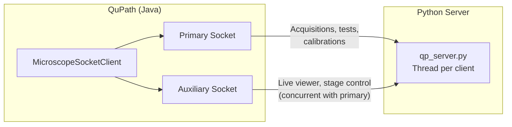
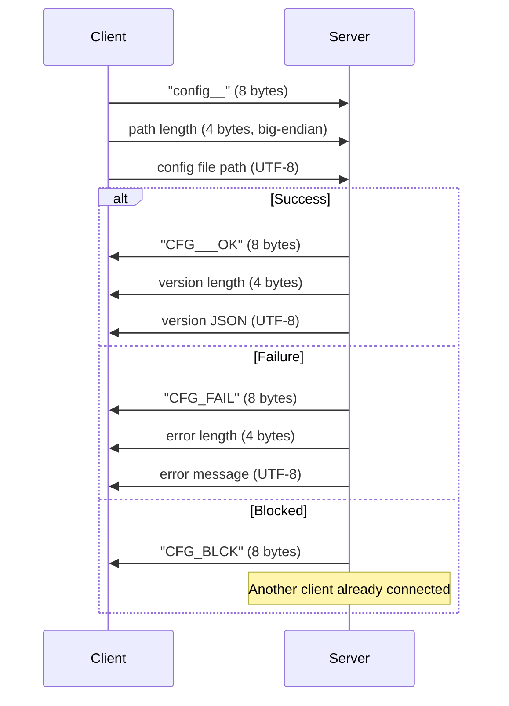
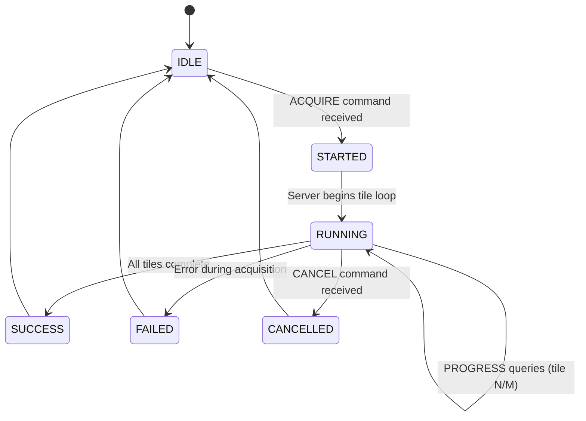

# Socket Communication Protocol

Developer reference for the binary TCP protocol between the QuPath Java extension (`MicroscopeSocketClient`) and the Python microscope server (`qp_server.py`).

## Connection Architecture


```mermaid
graph LR
    subgraph "QuPath (Java)"
        MSC["MicroscopeSocketClient"]
        PS["Primary Socket"]
        AS["Auxiliary Socket"]
    end

    subgraph "Python Server"
        QPS["qp_server.py<br/>Thread per client"]
    end

    MSC --> PS -->|"Acquisitions, tests,<br/>calibrations"| QPS
    MSC --> AS -->|"Live viewer, stage control<br/>(concurrent with primary)"| QPS
```

The dual-socket design allows the live viewer and stage controls to operate during long-running acquisitions. Each socket gets its own handler thread on the server.

See also [Client-side dimension inference (no protocol change)](#client-side-dimension-inference-no-protocol-change) at the end of this document for how the live progress panel infers per-axis counters from the existing tile index without any new socket commands.

## Protocol Format

### Command Structure

All commands are **8-byte ASCII strings**, padded with underscores:

```
| 8 bytes: command |
| e.g.: "acquire_" |
```

### Message Types

**Simple command (no payload):**
```
Client: [8-byte command]
Server: [8-byte response]
```

**Command with string payload:**
```
Client: [8-byte command]
Client: [UTF-8 string + "ENDOFSTR"]
Server: [variable response, read until timeout]
```

**Command with binary payload:**
```
Client: [8-byte command]
Client: [4-byte big-endian length] [payload bytes]
Server: [4-byte big-endian length] [response bytes]
```

### CONFIG Handshake

The first command after connection must be CONFIG:


```mermaid
sequenceDiagram
    participant C as Client
    participant S as Server

    C->>S: "config__" (8 bytes)
    C->>S: path length (4 bytes, big-endian)
    C->>S: config file path (UTF-8)

    alt Success
        S->>C: "CFG___OK" (8 bytes)
        S->>C: version length (4 bytes)
        S->>C: version JSON (UTF-8)
    else Failure
        S->>C: "CFG_FAIL" (8 bytes)
        S->>C: error length (4 bytes)
        S->>C: error message (UTF-8)
    else Blocked
        S->>C: "CFG_BLCK" (8 bytes)
        Note over S: Another client already connected
    end
```

## Command Reference

### Stage Control

| Command | Wire Format | Payload | Response |
|---------|------------|---------|----------|
| GETXY | `getxy___` | none | 16 bytes: X,Y as big-endian doubles |
| GETZ | `getz____` | none | 8 bytes: Z as big-endian double |
| GETXYZ | `getxyz__` | none | 24 bytes: X,Y,Z as big-endian doubles |
| MOVE | `move____` | 16 bytes: X,Y doubles | 8-byte ack |
| MOVEZ | `move_z__` | 8 bytes: Z double | 8-byte ack |
| MOVEXYZ | `movexyz_` | 24 bytes: X,Y,Z doubles | 8-byte ack |
| MOVER | `move_r__` | 8 bytes: angle double | 8-byte ack |
| GETR | `getr____` | none | 8 bytes: angle double |

### Acquisition

| Command | Wire Format | Payload | Response |
|---------|------------|---------|----------|
| ACQUIRE | `acquire_` | flag-based string + ENDOFSTR | STARTED -> SUCCESS/FAILED |
| BGACQUIRE | `bgacquir` | flag-based string + ENDOFSTR | STARTED -> SUCCESS/FAILED |
| STATUS | `status__` | none | status string |
| PROGRESS | `progress` | none | progress string |
| CANCEL | `cancel__` | none | 8-byte ack |

### Acquisition Monitoring Poll Commands

While an acquisition runs, the client polls these best-effort channels on the primary socket alongside STATUS / PROGRESS. Each is **optional**: an older server ignores the unknown 8-byte command, the client's first read times out, and the client permanently disables that poll (via a `volatile boolean`) without disturbing the connection. New QuPath and old server, or new server and old QuPath, both work.

| Command | Wire Format | Payload | Response |
|---------|------------|---------|----------|
| REQMANF | `reqmanf_` | none | 8-byte status: `IDLE____`, or a manual-focus request |
| REQHWER | `reqhwer_` | none | 8-byte status: `IDLE____` / `HWERR___` + 4-byte big-endian length + UTF-8 body |
| REQTWARN | `reqtwarn` | none | 8-byte status: `IDLE____` / `TWARN___` + 4-byte big-endian length + UTF-8 body |
| REQSAT | `reqsat__` | none | 8-byte status: `IDLE____` / `SATWARN_` + 4-byte big-endian length + UTF-8 body |
| ACKSAT | `acksat__` | 8-byte choice (`continue` / `cancel`, underscore-padded) | 3-byte `ACK` |

**REQHWER** -- polled to detect a hardware error the server is waiting on. When the status starts with `HWERR`, the 4-byte length + UTF-8 message follow; the client shows a retry/skip/cancel dialog and replies with `ACKHWER`.

**REQTWARN** -- polled to detect a time-lapse "falling behind" warning. When the status starts with `TWARN`, a 4-byte big-endian unsigned length and a UTF-8 message body follow. The server raises this once the first timepoint overruns the requested interval and **keeps returning the same warning on every poll until acquisition ends** -- the client de-dupes with a one-shot latch and surfaces it exactly once (a modal dialog plus a push notification). There is no acknowledgement command; the warning is informational and the acquisition continues.

**REQSAT / ACKSAT** -- polled to detect a saturation continue/cancel decision the server is blocked on. When the birefringence saturation guard trips on the initial monitoring tiles, the server pauses its acquisition thread and returns `SATWARN_` + 4-byte length + UTF-8 reason on every `REQSAT` poll until answered. The client shows a modal with a red **Continue anyway** button and a **Cancel acquisition** button, then replies with `ACKSAT` (`continue` resumes the scan with the saturation guard suppressed for the rest of the run; `cancel` aborts as a `FAILED` acquisition). If the client has no saturation handler wired (or is an older build that never polls `REQSAT`), it answers `cancel` so the server's paused thread never blocks indefinitely -- the pre-feature hard-abort behavior. The server-side wait also short-circuits to `cancel` if a `CANCEL` arrives while the prompt is open. The `FAILED:` status payload cap is 500 bytes (within the client's 512-byte read window) so the full saturation reason survives.

### Acquisition Message Format

The ACQUIRE payload is a flag-based string:

```
--yaml /path/config.yml
--projects /path/projects
--sample SampleName
--scan-type ppm_20x_1
--region AnnotationName
--objective LOCI_OBJECTIVE_OLYMPUS_20X_POL_001
--detector LOCI_DETECTOR_JAI_001
--pixel-size 0.1725
--angles "(-7.0,0.0,7.0,90.0)"
--exposures "(500.0,800.0,500.0,10.0)"
--bg-correction true
--bg-method divide
--bg-folder /path/to/backgrounds
--wb-mode per_angle
--processing "(debayer,background_correction,white_balance)"
--af-tiles 9
--af-steps 20
--af-range 10.0
--af-disabled
--hint-z -3245.5
--z-stack
--z-start -5.0
--z-end 5.0
--z-step 2.0
--z-projection max
--inner-axis channel
--timepoints 5
--interval 60.0
--save-raw true
ENDOFSTR
```

`--timepoints` / `--interval` are emitted by `AcquisitionCommandBuilder` only when the user enables the Time-Lapse Options pane in the acquisition dialog (`timepoints > 1`). `--interval` is the seconds between the *start* of consecutive timepoints. Omitting both flags yields a single-timepoint acquisition (byte-identical to pre-time-lapse builds). The server's main multi-tile workflow loops over timepoints with a drift-corrected scheduler; see the `REQTWARN` poll below for the falling-behind warning channel.

`--af-disabled` is mutually exclusive with the `--af-tiles`/`--af-steps`/`--af-range` triplet. When the Java side's "Disable Autofocus" preference is on, the triplet is omitted and `--af-disabled` is sent in its place. The server short-circuits `_configure_autofocus` (no YAML load required, no AF positions scheduled), so no pre-acquisition AF fires, no per-tile sweep autofocus runs, and no manual-focus prompts appear.

`--inner-axis` selects the inner loop of the per-tile snap nest. Allowed values: `z`, `channel`, `angle`. Omit the flag to get the per-modality default (`z` for widefield channel acquisitions, `angle` for PPM angle acquisitions, ignored for single-axis non-channel non-angle paths). The flag is additive -- callers that don't set it produce byte-identical command lines to pre-toggle builds. See `documentation/tools/z-stack-timelapse.md` for the user-facing semantics (fixed-slide-fast vs drift-tolerant for widefield; angle-switch-fast for PPM z-stacks).

`--z-projection` selects how the Z-stack is reduced. Values `max` (default), `min`, `sum`, `mean`, `std`, `edf` compute a 2D projection: one projected tile per position is written to `{group}/{filename}` and stitched into a 2D mosaic. The value `none` instead *preserves* every Z-plane: the server writes each plane to `{group}/[t{tt}/]z{zz}/{filename}` (the `t{tt}` segment is present only when `--timepoints > 1`), and the stitcher (`qupath-extension-tiles-to-pyramid`) derives each tile's z/t from those directory names and assembles a single multi-dimensional (5D: x,y,z,channel/angle,t) mosaic. `max`, `min`, `sum`, `mean`, and `std` are classical projections (brightest, darkest, summed, averaged, or variance-of-Z); `edf` (Extended Depth of Field) takes each pixel from the Z-plane where that pixel is sharpest — a focus-aware fusion, and the only one of these that is correct for brightfield, where the brightest pixels are background rather than signal. **`edf` requires `microscope-imageprocessing >= 0.2.0` on the server**; the projection name is passed straight to `get_projection()` with no whitelist, so an older server fails with a `KeyError` *after* the tiles have been acquired. The command server pins that floor, but a server installed from an older checkout will not have it. `none` is mapped from the acquisition dialog's "None" projection choice; the Java side sends it only when the Z-stack pane is enabled, so omitting Z-stack or choosing any projection other than "None" yields the unchanged 2D output. The `none` plane layout matches the existing `--save-raw true` forensic layout for a single timepoint, so 2D/projected output is byte-identical.

### Background Acquisition (BGACQUIRE)

`BGACQUIRE` collects flat-field background images. Like `ACQUIRE` it takes a
flag-based string ending in `ENDOFSTR`:

```
--yaml /path/config.yml
--output /path/to/backgrounds
--modality Brightfield
--angles "(-7.0,0.0,7.0,90.0)"
--exposures "(500.0,800.0,500.0,10.0)"
--wb-mode per_angle
--objective LOCI_OBJECTIVE_OLYMPUS_20X_POL_001
--detector LOCI_DETECTOR_JAI_001
--target-intensity 51200
--profile Brightfield_10x
--channels DAPI,FITC,TRITC
ENDOFSTR
```

`--profile` is optional: the server applies that acquisition profile's
`illumination_intensity` before collecting, and reports the value back. When
omitted, the server resolves a profile itself from `--modality` + `--objective`
(`_resolve_background_profile_key`); the Java client's `resolveProfileKey` is a
deliberate mirror of that algorithm.

`--channels` is optional and selects the per-channel (fluorescence) path: the
server collects one background per listed channel id at that channel's
profile-resolved exposure and intensity, instead of the angle-based path. The
client has already applied the unused-channel rule, so the server collects
exactly the channels it is given.

The server replies `STARTED:<output>` immediately, then on completion:

```
SUCCESS:<output>|<angle:exposure,...>|<meta>
```

The third pipe-field `<meta>` is `lamp=<intensity|none>;device=<label|none>;profile=<key|none>`,
plus `;chint=<id:intensity,...>` for the per-channel path. It carries the lamp
intensity actually applied (the `apply_profile_illumination` return value) so the
client can record it in `background_settings.yml` and later validate that
acquisition runs at the same lamp level. The field is optional -- an old server
omits it and the client tolerates its absence (lamp checks are then skipped).
`GETILLM` is the companion probe for "does this scope have an adjustable lamp".

### Camera Control

| Command | Wire Format | Payload | Response |
|---------|------------|---------|----------|
| GETEXP | `getexp__` | none | exposure values |
| SETEXP | `setexp__` | exposure string | ack |
| GETGAIN | `getgain_` | none | gain values |
| SETGAIN | `setgain_` | gain string | ack |
| GETMODE | `getmode_` | none | mode flags |
| SETMODE | `setmode_` | mode string | ack |
| SETCAM | `setcam__` | mode + exposures + gains | ack |
| SNAP | `snap____` | exposure bytes | image data |
| GETCAM | `getcam__` | none | camera name string |
| GETBIN | `getbin__` | none | 1-byte count + N bytes binnings + 1-byte current |
| SETBIN | `setbin__` | 1-byte unsigned binning factor | `ACK_____` / `ERR_SETB` |
| GETCAP | `getcap__` | optional 32-byte profile name (null-padded UTF-8); empty = current state | 4-byte big-endian length + UTF-8 JSON capability dict |

**Binning** (`GETBIN` / `SETBIN`, Camera Control v2 phase 1): cameras whose MM device exposes a `Binning` property report it through these commands. Cameras without binning support return `[1]` from `GETBIN` and no-op `SETBIN`. Binning factors are unsigned bytes (1..255). The server stops live-mode streaming before applying `SETBIN`.

**Capability query** (`GETCAP`, phase 2): single round-trip that returns everything the Camera Control v2 dialog needs to render — camera capabilities, every illumination source declared in the config, and the modality / channels / rotation angles for the queried profile. JSON shape:

```json
{
  "camera": {
    "name": "...", "type": "jai" | "hamamatsu" | "laser_scanning" | "generic",
    "supports_per_channel_exposure": bool,
    "supports_hardware_white_balance": bool,
    "available_binnings": [int, ...],
    "current_binning": int,
    "exposure_range_ms": [float, float],
    "gain_range": [float, float] | null
  },
  "illumination": [
    {"label": str, "device": str, "power_range": [float, float],
     "current_power": float, "is_on": bool,
     "value_type": "binary" | "continuous" | "discrete"}
  ],
  "modality": {
    "name": str, "default_wb_mode": str,
    "is_multi_angle": bool,
    "channels": [{"id": str, "exposure_ms": float, ...}] | null,
    "rotation_angles": [float, ...] | null
  },
  "active_profile": str | null
}
```

`value_type` tells the client which input widget to render: `"binary"` → checkbox (only valid powers are 0 and `power_range[1]`); `"continuous"` → spinner / text field; `"discrete"` → reserved for a future enumerated-set source (radio buttons). Empty payload returns the current state via the server's tracked `_active_profile`; non-empty payload describes what the profile would render after Apply (no actual hardware change).

### Illumination & Profile

| Command | Wire Format | Payload | Response |
|---------|------------|---------|----------|
| GETILLM | `getillm_` | none | 14 bytes: avail flag + 3 floats (power/min/max) + 1-byte is_on |
| SETILLM | `setillm_` | 4-byte big-endian float | `ACK_____` / `ERR_ILLM` |
| SETILLMD | `setilmd_` | 32-byte device name + 4-byte float | `ACK_____` / `ERR_DEVN` / `ERR_ILLM` |
| APPLYPR | `applypr_` | 32-byte profile name | `ACK_____` / `ERR_PROF` |
| APPLYCH | `applych_` | 32-byte profile name + 32-byte channel id | `ACK_____` / `ERR_CHAN` |

**SETILLM** drives whichever source the active profile selected (the legacy single-source endpoint). **SETILLMD** drives a NAMED source independently; the server walks every modality, builds each illumination via `_build_illumination_from_config`, finds the device-name match, and calls `set_power` on it. Lets the dialog tune any declared source without first APPLYPRing to its modality. Note: if the source's optical path is not currently selected, the value is staged but no light reaches the sample until the user APPLYPRs the matching profile.

**APPLYCH** applies a single channel from a profile's library — `mm_setup_presets` (cube turret, shutter, etc.) + `device_properties` (per-channel light source + intensity) + per-channel exposure, all via the same `apply_channel_hardware_state` helper the acquisition workflow uses. Empty channel id calls `_disable_all_modality_illuminations` to fully unset (used by the Live Viewer's "None" channel radio).

### Live Mode

| Command | Wire Format | Payload | Response |
|---------|------------|---------|----------|
| GETLIVE | `getlive_` | none | 1 byte: 0/1 |
| SETLIVE | `setlive_` | 1 byte: 0/1 | 8-byte ack |
| GETFRAME | `getframe` | none | image metadata + pixel data |
| CORRECTFRAME | `crctfram` | none | image metadata + pixel data, or `FAILED:<reason>` |
| STRTSEQ | `strtseq_` | none | 8-byte ack |
| STOPSEQ | `stopseq_` | none | 8-byte ack |

#### CORRECTFRAME

Same wire format as `GETFRAME` on success (20-byte big-endian header followed by raw pixel bytes); the server applies flat-field correction using the background image for the current rotation angle before sending. On any configuration failure -- no `imageprocessing_<scope>.yml` peer file, modality not enabled in `background_correction`, missing per-angle background, shape mismatch -- the server sends a textual `FAILED:<reason>` payload instead, so the Java client can fall back to an uncorrected snap with a clear status message.

Java is expected to have already validated settings-match (modality / objective / detector / WB mode / current angle) via `BackgroundSettingsReader.findBackgroundSettings(...)` + `ModalityHandler.validateBackgroundSettings(...)` before issuing this command -- the same pre-flight `AcquisitionConfigurationBuilder` runs for ACQUIRE. The server-side check is a second line of defense for racy YAML edits during a session, not the primary gate.

The Live Viewer's right-click "Apply background correction" menu item routes through this command; clicking Snap with the option ticked sends `CORRECTFRAME` and writes the corrected pixels to the user's chosen OME-TIFF.

### Calibration & Testing

| Command | Wire Format | Payload | Response |
|---------|------------|---------|----------|
| TESTAF | `testaf__` | params + ENDOFSTR | AF result |
| TESTADAF | `testadaf` | params + ENDOFSTR | adaptive AF result |
| AFBENCH | `afbench_` | params + ENDOFSTR | benchmark results |
| SIFTAL | `siftal__` | `--wsi-region <path> --micro-px <f> --wsi-px <f> --min-px <f> --ratio <f> --min-matches <n> --contrast <f> [--nfeatures <n>] [--mono-norm PERCENTILE\|MIN_MAX\|BIT_SHIFT] [--pct-low <f>] [--pct-high <f>] [--clahe true\|false] [--clahe-clip <f>] [--rgb-conv GREEN\|LUMINANCE] [--flip-x] [--flip-y] ENDOFSTR` | `SUCCESS:x,y\|inliers:N\|confidence:C` or `FAILED:<reason>` |
| PPMBIREF | `ppmbiref` | params + ENDOFSTR | optimization result |
| SBCALIB | `sbcalib_` | params + ENDOFSTR | calibration result |
| WBSIMPLE | `wbsimple` | params + ENDOFSTR | WB result |
| WBPPM | `wbppm___` | params + ENDOFSTR | WB result |
| PROBEZ | `probez__` | none | `PROBEZOK` or `PROBEZFL` (logs to server_session) |
| STRMAFZ | `strmafz_` | `--yaml <path> [--objective <id>] [--range <um>] ENDOFSTR` | `SUCCESS:<i>:<f>:<shift>:<n>:<span>` / `UNAVAILABLE:<reason>` / `ABORTED:<reason>` / `FAILED:<reason>` |
| ABORTAF | `abortaf_` | none | `ACK` |
| FINDTISS | `findtiss` | `--yaml <path> [--objective <id>] [--dir <dx>,<dy>] [--step <um>] [--max-attempts <n>] ENDOFSTR` | `FOUND:<x>:<y>:<attempt>:<of>` / `NOTFOUND:<x>:<y>:<of>` / `ABORTED:<x>:<y>:<done>` / `FAILED:<reason>` |

#### PROBEZ

One-shot Z-stage diagnostic probe. No payload. Runs a snapshot of
the focus device's property table, move-timing tests, a MaxSpeed
sensitivity sweep, a streaming-during-motion test, and a
per-exposure metric-stability sweep. Every log line is tagged
`PROBEZ [step-N]:` for easy filtering. Two CSVs per run are
written to the same `logs/` directory as the session log:
`probez_metric_range6_*.csv` and `probez_metric_range12_*.csv`.

State restoration: all writable properties on the focus device
are snapshotted at entry and restored in a `finally` block,
including Z position and camera exposure.

Intended as diagnostic tooling for new-rig onboarding and for
debugging `STRMAFZ` UNAVAILABLE responses. See
[developer/PROBEZ.md](PROBEZ.md) for the detailed guide and
`handlers/probez.py` for the implementation.

Response: `PROBEZOK` on normal completion (~30-60 seconds),
`PROBEZFL` if a safety check failed (sequence already running,
server not configured, etc.).

#### SIFTAL

SIFT auto-alignment. Snaps a microscope image, matches it against the WSI region file at `--wsi-region`, and returns the offset in micrometers.

Required flags:

| Flag | Description |
|---|---|
| `--wsi-region <path>` | Path to the PNG/TIFF region extracted from the WSI by the Java client. |
| `--micro-px <f>` | Microscope camera pixel size (um/px). |
| `--wsi-px <f>` | WSI pixel size (um/px). |

Optional matching parameters (defaults shown):

| Flag | Default | Description |
|---|---|---|
| `--min-px <f>` | 1.0 | Both images downsampled to at least this resolution before SIFT. |
| `--ratio <f>` | 0.7 | Lowe's ratio test threshold. |
| `--min-matches <n>` | 10 | Minimum inlier matches required for success. |
| `--contrast <f>` | 0.04 | Feature-detection sensitivity. |
| `--nfeatures <n>` | 0 (unlimited) | Cap on detected features. |
| `--flip-x` / `--flip-y` | off | Flip the WSI region before matching to align with microscope orientation. |

Optional bit-depth / cross-modality preprocessing (defaults shown):

| Flag | Default | Description |
|---|---|---|
| `--mono-norm PERCENTILE\|MIN_MAX\|BIT_SHIFT` | `PERCENTILE` | How >8-bit grayscale (typical 16-bit camera capture) is compressed to 8-bit. The legacy `BIT_SHIFT` mode (raw `/256`) collapses dynamic range when the camera doesn't span the full bit depth -- which is most cameras. `PERCENTILE` is the right default; `MIN_MAX` uses the actual data extremes. |
| `--pct-low <f>` | 2.0 | Lower percentile clip used by `PERCENTILE` mode. |
| `--pct-high <f>` | 98.0 | Upper percentile clip used by `PERCENTILE` mode. |
| `--clahe true\|false` | `true` | Apply Contrast-Limited Adaptive Histogram Equalisation to both grayscale images before SIFT. Standard cross-modality robustness trick when matching monochrome brightfield against 8-bit H&E. |
| `--clahe-clip <f>` | 2.0 | CLAHE clipLimit. Higher = more aggressive equalisation. |
| `--rgb-conv GREEN\|LUMINANCE` | `GREEN` | How a colour (RGB, e.g. H&E) reference image is collapsed to one channel. Only affects colour images -- the monochrome camera snapshot is untouched. `GREEN` (default) takes the green channel: both H&E stains absorb green, so it carries the most tissue structure and keeps the tissue-dark intensity polarity of a brightfield mono camera. `LUMINANCE` is the legacy `BGR2GRAY` weighting, whose red term brightens eosin and washes out cytoplasm contrast (worse against a mono camera). Do NOT add an absorbance/OD mode here -- it inverts polarity and its gradients run opposite the intensity microscope image. |

Response formats:

- `SUCCESS:<offset_x_um>,<offset_y_um>|inliers:<n>|confidence:<f>` -- match succeeded; the server has already moved the stage by `(offset_x, offset_y)`.
- `FAILED:<reason>` -- match failed (insufficient features, missing region file, etc.). The stage is not moved.

#### STRMAFZ

Streaming autofocus scan. Used by the Live Viewer's **Autofocus**
button. Streams frames during continuous Z motion and fits the focus
curve, replacing the stepped Sweep Autofocus on calibrated hardware.

Payload flags (text, terminated by `ENDOFSTR`):

| Flag | Required | Description |
|---|---|---|
| `--yaml <path>` | yes | Path to the active `config_<scope>.yml` |
| `--objective <id>` | no | Caller's preferred objective (e.g. `LOCI_OBJECTIVE_OLYMPUS_20X_POL_001`). If missing, the server auto-resolves via pixel-size match against `config.hardware.objectives`. |
| `--range <um>` | no | Override of `sweep_range_um` from the yaml. |
| `--dump 1` | no | Enable server-side frame dumping (TIFs + CSV + manifest). When set, the server writes all captured frames and per-frame metrics to a diagnostics folder and includes the path in the response. Used by the Autofocus Configuration Editor's Test button for offline analysis. |
| `--max-attempts <n>` | no | Cap on focus-search attempts (edge retries). Pass 0 (default) to use the server default (MAX_EDGE_RETRIES + 1 = 3), appropriate for Live Viewer "find focus from scratch" use. Pass 1 from tile-AF to perform a single fast scan with the previous tile's Z as a tight seed. |
| `--z-start <um>` | no | Profiling mode: explicit Z interval start. Must be paired with `--z-end`; a partial specification is ignored with a warning. The stage returns here after the scan. Use for characterisation, where the region of interest is not near the current Z -- an ordinary scan derives its window from the current position and cannot be aimed. |
| `--z-end <um>` | no | Profiling mode: explicit Z interval end. May be greater OR less than `--z-start`; the server simply traverses from one to the other. Ordering them so the traverse runs from greater objective-sample separation toward lesser is the CALLER's business -- the server has no notion of which way retracts (see `stage.focus.retract_sign`). |

Profiling commits to nothing: it records the metric profile, returns the stage to
`--z-start`, and reports success as a measurement. Deciding what the profile means is
the caller's job. It is mutually exclusive with approach-from-safe-Z; if both are
requested, the profiling traverse runs and the approach is skipped, since profiling is
the one that moves nothing permanently.
| `--safe-z <um>` | no | Declared retracted position for approach-from-safe-Z. Must be paired with `--approach-max`; a partial specification is rejected with a warning and the standard scan runs, because neither has a safe default. |
| `--approach-max <um>` | no | Signed travel bound from the safe Z toward the sample. The **sign carries the approach direction**, so the server never infers upright/inverted or stage polarity. Clamped to `stage.limits.z_um`. |
| `--tissue-gate 1` | no | Commit only to a peak where the strategy's validity check finds tissue. Set when validation found surfaces (coverslip, slide face) *before* focus -- exactly when committing to the first peak would land on glass. |

**Approach-from-safe-Z** (`--safe-z` + `--approach-max`) replaces the edge-retry
walk for that call rather than seeding it. The walk starts wherever the stage was
left and decides after each scan whether to continue, so every continuation is a
guess that moving further -- possibly toward the sample -- is correct. The
approach retracts to a position the operator measured as clear of the sample and
scans in once, bounded. On failure the stage is returned to the safe Z rather
than left where the scan stopped. The walk does **not** run as a fallback: doing
so would reintroduce the open-ended travel the approach exists to avoid.

QPSC only sends these flags when a Focus Approach Validation run has licensed the
modality/objective; see `claude-reports/design/2026-08-24_approach-from-safe-z-autofocus.md`.

Server-side sequence:

1. Resolve objective (client-provided > pixel-size match > yaml first entry).
2. Load `sweep_range_um` for the objective.
3. Pre-flight: motion blur budget and saturation checks; fail with `UNAVAILABLE` if either refuses.
4. If dump enabled, create a timestamped dump folder under `config/logs/streaming_af_dumps/`.
5. Seed-move to `z_start` at full speed; drop speed property to slow for the scan motion; start continuous sequence acquisition; fire non-blocking move to `z_end`; pop every frame with `(t_ms, z_at_pop, metric)`; save frames/metrics if dump enabled; parabolic-fit peak; commit final Z.
6. Always restore speed property in `finally`.

Response formats:

- `SUCCESS:<initial_z>:<final_z>:<shift>:<n_samples>:<z_span>[:dump=<path>]`
  -- scan completed and committed a new focus; optional dump path appended if dump was enabled
- `UNAVAILABLE:<reason>[:dump=<path>]` -- a pre-flight check refused to run,
  or no interior peak found after edge retries. The stage is
  moved to the best Z found if a focus slope was detected
  (better than initial_z even without a peak). Caller should
  fall back to stepped Sweep Autofocus. This is informational,
  not an error. Dump path included if dump folder was created.
- `ABORTED:<reason>[:dump=<path>]` -- the client cancelled the scan
  via `ABORTAF` (see below). The stage is returned to the pre-scan
  `initial_z`. No new focus committed; not an error.
- `FAILED:<reason>` -- mid-scan error; stage state has been
  restored but no new focus was committed

#### FINDTISS

Move the stage in **XY** until the camera is looking at tissue, so a focus scan that
follows has something to find. Never changes Z, exposure, or any camera setting -- the
caller orders the pair itself:

```
MOVE -> FINDTISS -> STRMAFZ -> (SIFT)
```

**Why it exists.** A multi-slide batch predicts each slide's first alignment landmark
from the base transform. Measured over 8 slides on 2026-08-24, that prediction lands a
median **613 um** from its target (worst **1507 um**), which frequently puts the camera
over blank glass. Autofocus there commits to coverslip contrast or exhausts its attempt
budget. The second landmark, corrected by the first's translation, lands within **26 um**,
so the base transform's error is very nearly a constant per-slide offset -- **only the
first landmark of a slide needs this**, and QPSC only sends it there.

SIFT reach is *not* the problem being solved: it matched at 1507 um with 796 inliers and
0.999 confidence. So the search only has to put tissue -- any tissue -- in view. That is
why the pattern is a coarse fan rather than a fine raster.

Payload flags (text, terminated by `ENDOFSTR`):

| Flag | Required | Description |
|---|---|---|
| `--yaml <path>` | yes | Path to the active `config_<scope>.yml`; the server derives `autofocus_<scope>.yml` from it for the tissue thresholds. |
| `--objective <id>` | no | Objective whose per-objective `texture_threshold` / `tissue_area_threshold` / `rgb_brightness_threshold` apply. Missing falls back to the shipped defaults. |
| `--dir <dx>,<dy>` | no | Stage-space hint toward where tissue is believed to be; only its bearing is used. QPSC computes it as the vector from the predicted position to the centre of the tile grid. Unusable input is ignored with a warning -- the search still works without it. |
| `--step <um>` | no | Radius increment. Default: one camera FOV diagonal. Deliberately coarse, and it DOES leave gaps -- stepping 446 um along X with a 357 x 267 um field skips 89 um. A step that could not skip anything on any bearing would be the field's short side (267 um), needing far more positions for the same reach. Acceptable because the target is a tissue mass many fields across, not a specific field. |
| `--max-attempts <n>` | no | Positions to visit **including the starting one**. Default is two complete rings: **7 with a hint, 17 without** (three bearings per ring versus eight). Capped at 25. Not one fixed number, because that cannot mean "whole rings" for both patterns, and stopping mid-ring biases the search toward whichever bearings are enumerated first. |

**Search pattern** (`server/tissue_search.py`, pure and unit-tested). The first position
is always where the caller already is -- at the median error the camera is often still on
tissue, and checking costs one snap. After that, positions lie on rings at whole multiples
of `--step`. With a hint, three bearings per ring: down the hint, then +/-45 deg. Without
one, the four compass points then the four diagonals. So reach is
`step * ((max_attempts - 1) // bearings_per_ring)` -- an attempt budget converts directly
into a distance, which is how it was sized against the measurement above.

Tissue is decided by the **same strategy validity check the acquisition path uses**
(`texture_and_area` etc. from `microscope_imageprocessing.focus`), so there is no new
metric to calibrate.

**Exposure is deliberately not adjusted.** The caller has just put the modality into its
alignment reference state (for PPM, the calibrated uncrossed angle and exposure) and SIFT
is about to match against that state, so a brightness-chasing loop here would silently
change what the next step depends on. This differs from the acquisition path's first-tile
search, which does double exposure -- that one owns the camera state; this one borrows it.

Response formats:

- `FOUND:<x>:<y>:<attempt>:<of>` -- tissue found; **the stage is standing at `(x, y)`**.
- `NOTFOUND:<x>:<y>:<of>` -- every searched position was background. **The stage has been
  returned to where the search started**, and `(x, y)` is that starting point: a search
  that found nothing has no reason to prefer its last guess over its first, and leaving
  the stage elsewhere would silently invalidate the caller's own prediction.
- `ABORTED:<x>:<y>:<completed>` -- the operator cancelled via `ABORTAF`. **The stage has
  been returned to the starting point**, and `completed` is how many positions had been
  checked. `FINDTISS` honours the same abort signal as `STRMAFZ` on purpose: the Live Viewer
  turns its Autofocus button into a Cancel toggle BEFORE the search starts, so from the
  operator's side the search and the scan are one action and one Cancel must stop whichever
  half is running. The signal is polled BETWEEN positions, never mid-move -- a stage move is
  a blocking hardware call and tearing one down part-way loses track of where the stage is.
- `FAILED:<reason>` -- the search could not run at all (no FOV and no `--step`, stage
  position unreadable, validity check unavailable). Nothing moved.

A move that fails mid-search (typically a stage limit) is logged and skipped; the search
continues with the offsets still reachable rather than abandoning the slide.

**Compatibility -- this verb carries a payload, and that matters.** A server without the
command does NOT simply ignore it. `qp_server.py` reads 8 bytes, finds no handler, logs
`Unknown command` and continues -- with the text payload still in the stream. It then eats
that payload eight bytes at a time as if each slice were a command, and whatever is left
over when the payload does not divide by eight stays buffered and shifts every LATER
command on that socket. Payload-free probes like `REQHWER` / `REQSAT` are safe against an
old server for exactly this reason; `FINDTISS` is not.

`MicroscopeSocketClient.findTissue` therefore treats "no usable reply" as a hard signal:
it clears a session flag so nothing asks again, drops the primary socket so the next
command reconnects onto a clean stream, and returns `FAILED`. Autofocus then runs from the
predicted position -- the behaviour that predates the search. **Any future command that
sends a payload needs the same treatment.**

#### ABORTAF

Cancel an in-progress `STRMAFZ` scan. No payload. Response: `ACK`
(3 bytes).

Because `STRMAFZ` blocks the **primary** socket for the entire scan,
the QuPath client sends `ABORTAF` on its **auxiliary** socket. The
server keys a per-client-IP abort `threading.Event` -- both the
primary and auxiliary connections share the client IP, so the abort
set from the auxiliary connection is observed by the `STRMAFZ`
handler running on the primary connection.

`handle_streaming_focus` polls that Event between scan attempts and,
inside `_run_streaming_scan`, between captured frames (~2 ms cadence).
On abort it stops the scan, restores the camera ROI and stage speed,
returns Z to the pre-scan position, and replies `ABORTED:user-cancelled`
on the primary socket.

`ABORTAF` is best-effort: `ACK` only means the request was recorded,
not that a scan was running. An older server without the handler
discards the unknown command and sends no reply; the client uses a
short read timeout on the `ACK` so this degrades to a silent no-op.

The optional `:dump=<path>` suffix is appended to any response when `--dump` was enabled. Clients extract it by searching for the `:dump=` marker and parsing the path up to the next whitespace or end of string. The path is an absolute directory containing:
- `attempt_N/` subdirectories (one per focus-search attempt)
- `attempt_N/frames/` — TIF files (one per captured frame)
- `attempt_N/samples.csv` — CSV with columns (idx, wall_ms, z_assumed_um, z_actual_um, metric)
- `attempt_N/manifest.json` — metadata (scan parameters, fit results, etc.)

See `handlers/streaming_focus.py` for the implementation.

### System

| Command | Wire Format | Payload | Response |
|---------|------------|---------|----------|
| CONFIG | `config__` | path length + path | CFG___OK/CFG_FAIL/CFG_BLCK |
| SHUTDOWN | `shutdown` | none | none (server exits) |
| DISCONNECT | `quitclnt` | none | none (close connection) |
| GETPXSZ | `getpxsz_` | none | 8 bytes: pixel size double |
| GETFOV | `getfov__` | none | 16 bytes: FOV X,Y doubles |
| GETLOG | `getlog__` | none | 4-byte big-endian length + UTF-8 bytes (or 0 for no active log) |

#### GETLOG

Fetches the tail of the Python server's current session log (for bug reports). The server replies with a 4-byte big-endian length followed by that many UTF-8 bytes (already head+tail trimmed server-side, keeping the version banner for provenance plus recent lines where errors typically appear). A length of 0 indicates the server has no active session log.

**Timeout handling:** Pre-GETLOG servers ignore this command and send no reply. Callers MUST apply their own timeout (typically 6 seconds) or the read would block until the socket's default read timeout. This allows forward compatibility when deploying a newer QuPath alongside an older server deployment.

## Acquisition Lifecycle


```mermaid
stateDiagram-v2
    [*] --> IDLE
    IDLE --> STARTED: ACQUIRE command received
    STARTED --> RUNNING: Server begins tile loop
    RUNNING --> RUNNING: PROGRESS queries (tile N/M)
    RUNNING --> SUCCESS: All tiles complete
    RUNNING --> FAILED: Error during acquisition
    RUNNING --> CANCELLED: CANCEL command received
    SUCCESS --> IDLE
    FAILED --> IDLE
    CANCELLED --> IDLE
```

The client polls STATUS and PROGRESS on a background thread while the primary socket blocks on the ACQUIRE response.

## Timeouts

| Operation | Default Timeout |
|-----------|----------------|
| Socket connection | 3000 ms |
| Default read | 5000 ms |
| Acquisition acknowledgment | 30 s |
| Autofocus test | 120 s |
| Background acquisition | 180 s |
| Z-stack / time-lapse | 600 s |

## Client-side dimension inference (no protocol change)

The live progress panel (under-progress-bar "Channel: ... | Z step N/M | Tile K/T" counters) does **not** add new socket commands. It reuses the existing tile-index PROGRESS poll and decodes per-axis state purely on the Java side, given the deterministic per-position loop order the server already uses.

**Loop hierarchy assumed by the decomposer** (time dimension outermost when present, `for t: for pos: ...`):

- Widefield default (`innerAxis=z`): per-position `for ch: for z`.
- Widefield `innerAxis=channel`: per-position `for z: for ch`.
- PPM default (`innerAxis=angle`): per-position `for z: for angle`.
- PPM `innerAxis=z`: per-position `for angle: for z`.

**Java consumers:**

- `qupath.ext.qpsc.service.mda.LiveDimensionDecomposer` -- pure-arithmetic helper that turns a tile index `k` plus an `AcquisitionPlan` into `(t, posIdx, chIdx, zIdx)`.
- `qupath.ext.qpsc.model.AcquisitionPlan` -- record carrying counts (positions, channels, Z, T), `innerAxis`, and total image count. Built once per annotation and shared between the MDA auto-save path and the live counters.

**Drift handling:** if any computed index exceeds its expected dimension, the per-axis labels collapse to a single note ("Dimension counters out of sync; showing aggregate only") and the aggregate progress bar continues unaffected. A WARN log line carries `k`, the plan, and the observed counts.

**Warning:** if the server's per-position loop order ever changes, the Java decomposer will drift and the live counters will collapse to an aggregate-only display. Update `LiveDimensionDecomposer` and add a server-side dimension-event protocol if the loop order needs to vary per acquisition.
