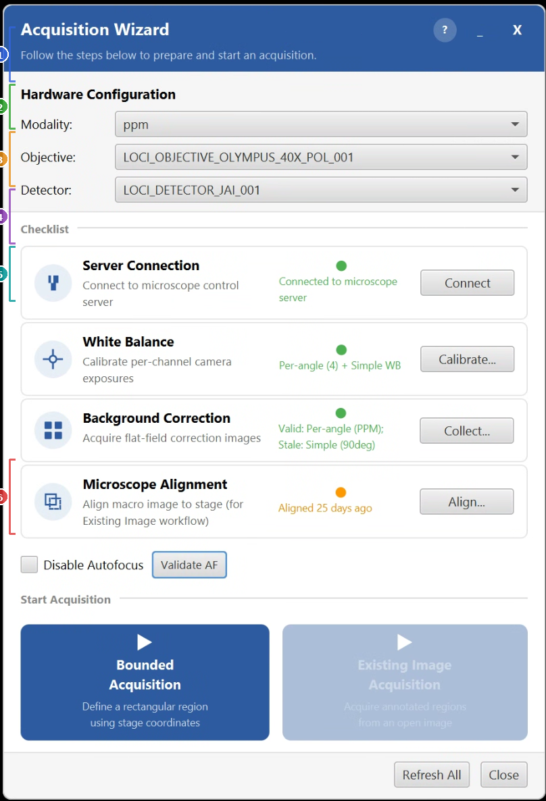

# Acquisition Wizard
> Menu: Extensions > QP Scope > Acquisition Wizard...
> [Back to README](../../README.md) | [All Tools](../UTILITIES.md)

## Purpose

The Acquisition Wizard is a checklist-style dashboard that guides users through
the full setup-to-acquisition pipeline. It provides a single persistent window
where you can verify hardware configuration, check calibration status, run
prerequisite steps, and launch acquisition workflows.

Use this tool when you want a guided, step-by-step approach to setting up and
starting a microscope acquisition. It is especially helpful for new users or
when switching between hardware configurations.

## Prerequisites

- A valid microscope configuration YAML file must be set in QP Scope preferences.
- The microscope control server (microscope_command_server) must be running on
  the microscope computer for the "Connect" step to succeed.

## Wizard Layout

The wizard has three main sections:

### 1. Hardware Configuration

Dropdown selectors for the current hardware setup:

| Selector | Description |
|----------|-------------|
| Modality | The imaging modality (e.g., "ppm" for polarized light microscopy). Populated from the YAML config. |
| Objective | The objective lens to use (e.g., "20x"). Filtered by the selected modality. |
| Detector | The camera/detector to use. Filtered by the selected modality and objective. |

Changing any selector automatically refreshes the calibration status indicators
for white balance and background correction.

### 2. Checklist

Four prerequisite steps, each with a status indicator, description, and action button:

| Step | Status Dot | Action Button | Description |
|------|-----------|---------------|-------------|
| Server Connection | Green/Red | Connect | Connects to the microscope control server. Required before any acquisition. |
| White Balance | Green/Orange/Red/Gray | Calibrate... | Launches the white balance calibration workflow. Status depends on whether calibration data exists for the selected hardware. For non-JAI cameras, shows "Not Applicable" (configure through MicroManager instead). |
| Background Correction | Green/Orange/Red | Collect... | Launches the background/flat-field image collection workflow. Checks whether background images exist for the current modality/objective/detector combination. |
| Microscope Alignment | Green/Orange/Red | Align... | Launches the microscope alignment workflow. Checks for an existing alignment transform and reports its confidence level (high, aging, or stale). Required for the Existing Image workflow. |

**Status dot colors:**
- **Green** -- Step is satisfied and ready.
- **Orange** -- Step has a result but it may be stale or incomplete (warning).
- **Red** -- Step has not been completed or is missing.
- **Gray** -- Step is not applicable for the current hardware configuration.

### 3. Start Acquisition

Two large buttons to launch the main acquisition workflows:

| Button | Requirements | Description |
|--------|-------------|-------------|
| Bounded Acquisition | Server connection (green) | Define a rectangular acquisition region using stage coordinates. Does not require an open image. |
| Existing Image Acquisition | Server connection (green) + open image in QuPath | Acquire annotated regions from an already-open image. Also requires microscope alignment. |

## Workflow

1. Open the wizard from the menu.
2. Select the correct modality, objective, and detector from the dropdowns.
3. Work through the checklist from top to bottom:
   - Click "Connect" to establish a server connection.
   - Click "Calibrate..." to run white balance (if needed for your camera).
   - Click "Collect..." to acquire background correction images.
   - Click "Align..." to run microscope alignment (needed for Existing Image only).
4. Once prerequisites are satisfied, click one of the acquisition buttons.

## Behavior

- When the wizard opens, it **automatically opens the Live Viewer and Stage Map**
  if they are not already open. This ensures you have the camera feed and stage
  overview available during setup.
- The wizard is **non-modal** and **always-on-top**, so you can interact with
  QuPath and other dialogs while it remains visible.
- When the wizard **loses focus** (you click elsewhere), it automatically
  **collapses** to a small floating pill showing four status dots. Click the
  pill or bring it back into focus to expand.
- When the wizard **regains focus**, it automatically **refreshes all statuses**
  and expands.
- The pill and the wizard header are both **draggable** -- drag them anywhere
  on screen.
- Click "Refresh All" in the bottom bar to manually refresh all status checks.
- The wizard opens near the **top-right** of the QuPath window by default.

## Tips & Troubleshooting

- **"Not connected" after clicking Connect**: Verify the microscope control
  server is running and the host/port are configured correctly in preferences.
- **White Balance shows "Not Applicable"**: This is normal for non-JAI cameras.
  White balance for standard cameras is managed through MicroManager's device
  property browser.
- **Alignment shows "stale" or "aging"**: The confidence score decays over time.
  Re-run the alignment workflow to refresh it, especially if the sample or
  stage has been moved.
- **Existing Image button is disabled**: Either the server is not connected, or
  no image is currently open in QuPath. Open an image first.
- **Collapsed pill dots are all gray**: The wizard has not yet checked statuses.
  Click the pill to expand and trigger a refresh.

## See Also

- [White Balance Comparison Test](wb-comparison-test.md) -- Compare WB modes
- [PREFERENCES.md](../PREFERENCES.md) -- Microscope configuration file settings
