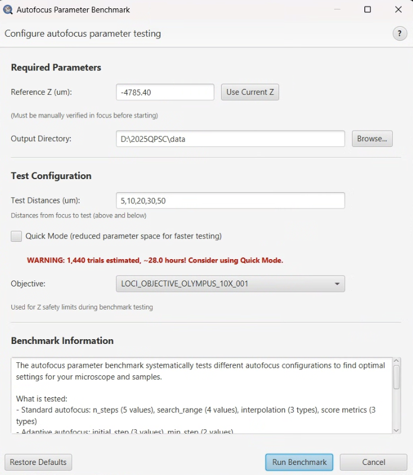

# Autofocus Parameter Benchmark

> Menu: Extensions > QP Scope > Utilities > Autofocus Parameter Benchmark...
> [Back to README](../../README.md) | [All Tools](../UTILITIES.md)

## Purpose

Systematically find optimal autofocus settings by testing multiple parameter
combinations. This tool defocuses the microscope by known amounts and then measures
how accurately autofocus recovers the correct focus position across different
parameter sets.

Use this tool when optimizing autofocus performance on new sample types, after
hardware changes, or when the current autofocus settings are unreliable.

## Prerequisites

- Connected to microscope server
- Microscope positioned on a representative sample area
- Known good focus position (reference Z) established manually
- Autofocus hardware functional

## Options

| Option | Type | Description |
|--------|------|-------------|
| Reference Z Position | Spinner | Known good focus position to use as the ground truth reference |
| Output Directory | Directory Picker | Where to save benchmark results and reports |
| Test Distances | Text Field | Comma-separated list of defocus distances to test (in um) |
| Quick Mode | CheckBox | Faster but less comprehensive testing (fewer parameter combinations) |

## Workflow

1. Manually focus the microscope on a representative area of your sample.
2. Open the Autofocus Parameter Benchmark from the menu.
3. Record the current Z position as the Reference Z Position.
4. Choose an output directory for results.
5. Enter test distances (e.g., "5,10,20,50") -- these are the amounts the system will
   deliberately defocus before attempting to recover.
6. Optionally enable Quick Mode for faster (but less thorough) testing.
7. Click Start to begin the benchmark.

The system then:
1. Defocuses by each specified distance from the reference position.
2. Runs autofocus with various parameter combinations (n_steps, search_range_um).
3. Measures how accurately focus is recovered (error = difference from reference Z).
4. Generates a report with optimal parameter recommendations.

## Output

| File | Description |
|------|-------------|
| CSV results file | All test results with parameter combinations and error measurements |
| Summary report | Best parameter combinations ranked by accuracy |
| Performance graphs | Plots showing accuracy vs. parameters (full mode only) |

## Tips & Troubleshooting

- **Position matters** -- choose a sample area with clear features for reliable
  autofocus metrics. Blank or featureless areas will produce unreliable results.
- **Verify reference Z** -- ensure the reference position is correctly focused before
  starting. All results are measured against this reference.
- **Full benchmark duration** -- a full benchmark may take 10-30 minutes depending on
  the number of parameter combinations and test distances.
- **Quick mode** tests fewer combinations but finishes much faster. Use this for a
  rough estimate, then refine with full mode if needed.
- After finding optimal parameters, apply them using the
  [Autofocus Configuration Editor](autofocus-editor.md).

## See Also

- [Autofocus Configuration Editor](autofocus-editor.md) -- Apply the optimal parameters found by this benchmark
- [All Tools](../UTILITIES.md) -- Complete utilities reference
