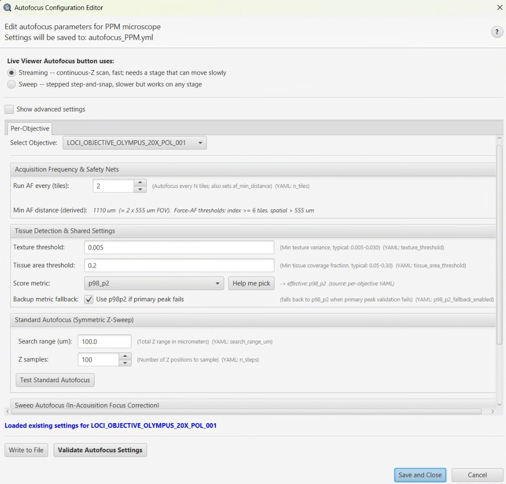

# Autofocus Configuration Editor

> Menu: Extensions > QP Scope > Utilities > Autofocus Configuration Editor...
> [Back to README](../../README.md) | [All Tools](../UTILITIES.md)

## Purpose

Configure per-objective autofocus parameters in an easy-to-use GUI. This tool allows
customization of focus search behavior for different objectives, controlling how many
Z positions are sampled, how wide the search range is, and how frequently autofocus
runs during tiled acquisition.

Use this tool when setting up a new objective for acquisition or when adjusting
autofocus behavior for different sample types (e.g., thick vs. thin sections).

## Prerequisites

- Microscope configuration YAML loaded with objective definitions
- At least one objective defined in the configuration

## Options

### Acquisition Frequency & Safety Nets

Controls how densely autofocus is scheduled across the tile grid.

| Parameter | Type | Typical Range | Description |
|-----------|------|---------------|-------------|
| Objective | ComboBox | - | Select the objective to configure |
| n_tiles | Spinner | 3-10 | AF grid spacing (every N tiles in each axis). Also sets `af_min_distance = n_tiles x mean(camera FOV)` |
| gap_index_multiplier | Spinner | 1-5 (default 3) | Force AF after `gap_index_multiplier x n_tiles` positions without one. Safety net for scan-order gaps |
| gap_spatial_multiplier | Text | 1.0-3.0 (default 2.0) | Force AF when nearest AF exceeds `gap_spatial_multiplier x af_min_distance`. Safety net for disconnected fragments |
| af_min_distance (derived) | Read-only | - | Computed from `n_tiles x mean FOV`. Updates live as inputs change. Also shows effective force-AF thresholds in tile count and micrometers |

See [AUTOFOCUS.md](../AUTOFOCUS.md#how-af-position-selection-works) for the full explanation of how the grid and safety nets interact.

### Standard Autofocus

| Parameter | Type | Typical Range | Description |
|-----------|------|---------------|-------------|
| n_steps | Spinner | 5-20 | Number of Z positions to sample during autofocus |
| search_range_um | Spinner | 10-50 | Total Z range to search in micrometers |

### Sweep Drift Check

The Sweep Drift Check section configures a periodic Z sweep that monitors focus drift during acquisition.

| Parameter | Type | Default | Description |
|-----------|------|---------|-------------|
| sweep_range_um | Spinner | 10 | Total Z range for the sweep in micrometers |
| sweep_n_steps | Spinner | 6 | Number of Z positions to sample during each sweep |
| score_metric | ComboBox | normalized_variance | Focus quality metric used to evaluate each Z position |

**Available score_metric options:**

| Metric | Description |
|--------|-------------|
| `normalized_variance` | Default and recommended. Variance of the image normalized by its mean intensity. |
| `laplacian_variance` | Variance of the Laplacian-filtered image. |
| `sobel` | Sum of Sobel edge magnitudes. |
| `brenner_gradient` | Brenner gradient-based focus measure. |
| `p98_p2` | Difference between 98th and 2nd intensity percentiles. |

**Test Sweep Drift Check** button: runs a single sweep at the current position so you can verify parameters before acquisition.

### Buttons

| Button | Action |
|--------|--------|
| **Write to File** | Save all settings to YAML file |
| **OK** | Save and close dialog |
| **Cancel** | Discard unsaved changes |

## Workflow

1. Open the Autofocus Configuration Editor from the menu.
2. Select the objective you want to configure from the dropdown.
3. Adjust **n_tiles** -- how often autofocus triggers (every N tiles). Watch the
   read-only **af_min_distance** line update to see the resulting AF grid spacing.
4. (Optional) Tighten **gap_index_multiplier** / **gap_spatial_multiplier** if you
   suspect the planned grid may skip warped or fragmented regions; the read-only
   description under each field shows the concrete force-AF threshold in tiles and
   micrometers as you edit.
5. Adjust **n_steps** -- the number of Z positions sampled during each autofocus run.
6. Adjust **search_range_um** -- the total Z range (in um) over which focus is searched.
7. Configure **Sweep Drift Check** parameters if needed (sweep_range_um, sweep_n_steps, score_metric).
8. Click **Test Sweep Drift Check** to verify the sweep works at the current position.
9. Click **Write to File** to save settings, or **OK** to save and close.

## Output

Settings are saved to `autofocus_{microscope}.yml` in the microscope configuration
directory. Each objective gets its own section in the file.

## Parameter Guidelines

| Objective | n_steps | search_range_um | n_tiles |
|-----------|---------|-----------------|---------|
| 10X | 9 | 15 | 5 |
| 20X | 11 | 15 | 5 |
| 40X | 15 | 10 | 7 |

## Tips & Troubleshooting

- **Higher magnification objectives** need more steps and a smaller search range
  because depth of field is narrower.
- **Lower n_tiles** means more frequent autofocus, which is slower but more reliable
  for uneven samples.
- **Thick samples** may need a larger search_range_um to accommodate Z variation.
- If autofocus consistently fails, try increasing n_steps or widening search_range_um.
- **Tilted slides going out of focus between AF points:** tighten `gap_index_multiplier`
  (try 2 or even 1.5) rather than widening `sweep_range_um`. A wider sweep just tolerates
  more drift at individual AF points; tighter index gaps reduce how much drift can
  accumulate in the first place.
- **Vertical focus bands in serpentine scans:** `gap_index_multiplier` is probably too
  small and recreating the "AF pillar" pattern. Raise it towards 4-5.
- **Disconnected tissue fragments going out of focus:** lower `gap_spatial_multiplier`
  (try 1.0-1.5) so the spatial safety net catches the jump to the next fragment.
- **`af_min_distance` shows "FOV unavailable"** in the editor: the objective isn't
  referenced by any modality with a valid camera/FOV in the microscope config. The
  value is still computed correctly at runtime by Python using the active modality,
  so this is a display-only limitation.
- Use the [Autofocus Parameter Benchmark](autofocus-benchmark.md) to systematically
  find optimal settings for your sample type.

## See Also

- [Autofocus Parameter Benchmark](autofocus-benchmark.md) -- Systematically find optimal autofocus settings
- [All Tools](../UTILITIES.md) -- Complete utilities reference
