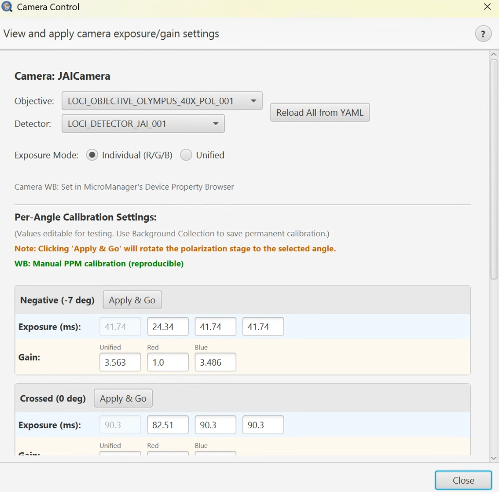

# Camera Control

> Menu: Extensions > QP Scope > Camera Control...
> [Back to README](../../README.md) | [All Tools](../UTILITIES.md)

## Purpose

View and test camera exposure and gain settings loaded from calibration profiles. This utility is particularly useful for JAI 3-CCD camera white balance troubleshooting and verifying calibration values before acquisition. Changes made here are for testing only and are not saved to the YAML calibration file.

## Prerequisites

- Connected to microscope server (will prompt if not connected)

## Options

### Camera Info

Displays the current camera name detected from the hardware.

### Objective/Detector Selection

| Option | Type | Description |
|--------|------|-------------|
| Objective | ComboBox | Select objective to load its calibration profile |
| Detector | ComboBox | Select camera/detector for calibration values |
| Reload from YAML | Button | Restore all values from the YAML calibration file |

Changing the objective or detector automatically loads the corresponding calibration values.

### Exposure Mode Toggle (JAI cameras only)

Visible when a JAI 3-CCD camera is detected:

| Option | Values | Description |
|--------|--------|-------------|
| Exposure Mode | Individual / Unified | Individual: per-channel R/G/B exposures. Unified: single exposure for all channels. |

Gain is always unified. The gain row shows unified gain plus analog Red and Blue gain values.

### Per-Angle Cards (PPM modality)

For PPM modality, each polarizer angle is displayed as a color-coded card:

| Angle | Description |
|-------|-------------|
| Uncrossed (90 deg) | Brightest angle |
| Crossed (0 deg) | Darkest angle (extinction) |
| Positive (7 deg) | Intermediate birefringence angle |
| Negative (-7 deg) | Opposite intermediate angle |

Each card shows:

| Field | Type | Description |
|-------|------|-------------|
| Exposure All (ms) | Spinner | Unified exposure time |
| Exposure R/G/B (ms) | Spinner | Per-channel exposure times (when in Individual mode) |
| Gain Unified | Spinner | Unified gain value |
| Gain R / B | Spinner | Analog red and blue gain values |
| Apply | Button | Set camera settings AND move rotation stage to this angle |

## Workflow

1. Open Camera Control from the menu
2. Select the objective and detector combination to load calibration values
3. Review the exposure and gain settings for each angle
4. Click **Apply** on any angle card to test those settings
5. The system automatically pauses live mode, applies settings, moves the rotation stage, and restores live mode
6. Use **Reload from YAML** to revert to saved calibration values after testing

## Output

No persistent output. Camera Control is a testing and verification tool. Changes to exposure and gain values are applied to the hardware temporarily but are not saved to the YAML calibration file.

## Tips & Troubleshooting

- Values can be edited for **testing purposes only** -- changes are not saved
- Use [Background Collection](background-collection.md) for permanent calibration changes
- The dialog stays on top of other windows for convenience during testing
- When clicking Apply, live mode is automatically paused and restored to prevent interference
- If exposure values look wrong, click **Reload from YAML** to restore saved calibration
- For JAI cameras, verify both unified and per-channel modes work as expected

## See Also

- [Live Viewer](live-viewer.md) - Real-time camera feed to see the effect of settings changes
- [Background Collection](background-collection.md) - Collect flat-field correction images with calibrated settings
- [Bounded Acquisition](bounded-acquisition.md) - Uses the calibration profiles tested here
- [Existing Image Acquisition](existing-image-acquisition.md) - Uses the calibration profiles tested here
