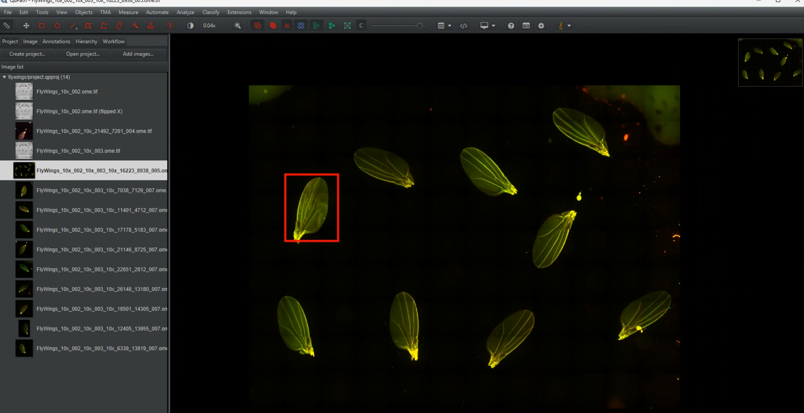

# Existing Image Acquisition

> Menu: Extensions > QP Scope > Acquire from Existing Image
> [Back to README](../../README.md) | [All Tools](../UTILITIES.md) | [All Workflows](../WORKFLOWS.md)

## Purpose

Acquire high-resolution images of specific regions annotated on an existing macro/overview image. Annotations drawn in QuPath define the regions to scan, and a coordinate transform maps image positions to physical stage positions. Use this when you have a macro image of your slide and want to acquire targeted regions of interest.

The acquisition dialog consolidates all options in a single scrollable panel. You may need to scroll to see all options on smaller screens.

## Prerequisites

- QuPath project open with an image entry and annotations defining regions to acquire
- Valid coordinate alignment between image and stage (see [Microscope Alignment](microscope-alignment.md))
- Python microscope server running

### Macro Image Requirement for Scanner-Preset Alignment

The **"Use existing alignment"** option with saved scanner presets requires a macro image to be reachable from the current entry. The scanner-preset path runs green-box detection on the macro to localize the whole-slide image on the microscope slide. Sub-images acquired by prior QPSC workflows (Bounded Acquisition, etc.) typically do not have a reachable macro, so in those cases the scanner-preset combo is disabled.

When a macro is not available, you can still use:
- **Slide-specific alignment** (if available) — QPSC-acquired images automatically carry alignment metadata from their acquisition stage coordinates. Even without an explicit saved JSON alignment file, QPSC stitches are recognized and can be used directly. For other images, manual alignment creates a JSON file that remains available for future acquisitions on the same slide.
- **Manual alignment** — create a new alignment or re-run the Microscope Alignment tool on the current image.

### Sub-Image Requirements

When acquiring from a sub-image (an image created by a prior Bounded Acquisition or Acquire from Existing Image workflow), the sub-image entry must have **objective metadata**. This records which microscope objective was used when the sub-image was originally acquired, and is critical for accurate coordinate transformation on subsequent acquisitions.

If you see a dialog titled "Sub-image Missing Objective -- Workflow Cancelled," the opened sub-image lacks this metadata. To fix, either:
1. **Re-acquire the sub-image** using the current workflow, which will stamp the objective on import.
2. **Hand-edit the project entry metadata** to add the correct objective name (advanced; not recommended unless you know the original objective).

If you see a dialog titled "Sub-image Objective Mismatch," the sub-image was acquired at a different objective than the wizard's current setting. The mismatch shifts every tile by half the field-of-view difference between the two objectives. Recommended: cancel, switch the wizard to the entry's objective, or re-acquire the sub-image at the desired objective.

## Options

### Sample Setup

| Option | Type | Required | Description |
|--------|------|----------|-------------|
| Sample Name | TextField | Yes | Name for acquired images. Defaults to current image name. |
| Use Existing Project | Auto | - | If a project is open, images are added to the current project. If no project is open, you will be prompted to create or select one. |

### Alignment Selection

The workflow offers three paths to align the image with the microscope stage:

| Option | Type | Description |
|--------|------|-------------|
| Use Existing Alignment | RadioButton | Select from previously saved scanner-preset transforms. **Requires a macro image** — if unavailable, slide-specific alignments (below) are used instead. If neither scanner presets nor slide-specific alignment is available, you must choose manual alignment. |
| Manual Alignment | RadioButton | Create a new alignment using the Microscope Alignment workflow. Does not require a macro image. |
| Refinement Options | - | After selecting an alignment method, choose whether to refine it with zero, one, or multiple reference tiles before acquiring the full region. |

When scanning from a sub-image that lacks a macro, the "Use Existing Alignment" option may display available scanner transforms but the combo will be disabled (greyed out). Slide-specific alignments saved during prior QPSC acquisitions remain available as alternatives to manual alignment.

Selected transforms are validated before use. Invalid transforms show a warning and allow reselection.

**Cross-Scope Alignment:** If no per-slide alignment exists for the active microscope but one was built for another microscope on the same sample, the system can compose an alignment through the shared macro frame. When successful, a modal dialog appears explaining that cross-scope alignment is approximate and asking you to confirm before proceeding. The refinement options are automatically disabled for cross-scope acquisitions (see Refinement Options below). After acquisition, run Microscope Alignment on this microscope to build a native target-scope alignment that future acquisitions can reuse without composition.

If alignment records from other microscopes exist but *cannot* be composed through a shared scanner preset to the active scope, a non-modal info dialog appears listing how many records were considered. This typically means the microscopes use incompatible scanner-preset bridges, or the macro-frame alignment was built on a scope whose presets do not overlap with the active scope. In this case, run Microscope Alignment on the active microscope to build a native alignment for this slide.

### Refinement Options

| Option | Description |
|--------|-------------|
| No Refinement | Use saved transform directly (fastest). Best when transform is known to be accurate. Default when a prior QPSC acquisition has auto-registered alignment on the current slide. |
| Single-Tile Refinement | Refine alignment using one reference tile. Corrects only the offset (translation). Quick adjustment for minor drift or when a slide has been removed and re-seated since the last acquisition. The corrected alignment is saved for subsequent acquisitions. Also the default for alignments older than ~50 days (low confidence) — verifies the aged transform in 2–3 minutes before full acquisition. |
| Multi-Tile Refinement | Refine alignment using 2 or more reference tiles spread across the slide. Solves for a rotation + scale correction (not just offset), essential when a slide sits rotated in its holder slot. Faster than full manual alignment because it starts from your existing alignment. The dialog displays the recovered rotation and scale as diagnostics (non-zero rotation confirms slide play; scale far from 1.0 suggests a pixel-size/objective mismatch). **If the correction appears implausibly large** (rotation > 10° or scale < 0.9 / > 1.1), a red warning appears: the base alignment does not match the stage (e.g., axis swap or wrong orientation). Re-check the alignment before saving; you can still proceed if you are confident. Time: 4–6 minutes. |
| Full Manual Alignment | Create new transform with multiple points. Use the first time or after hardware changes. Always available as an explicit choice, even for aged alignments. |

**Automatic Recommendation by Alignment Age or Insert Change:** The dialog shows an automatic recommendation based on the saved alignment's last-refinement date and whether it was built for the current stage insert:
- **"Proceed without refinement"** — Alignment recently created or refined (high confidence) AND built on the current stage insert.
- **"Single-tile refinement"** — Alignment aged 1–~50 days (medium confidence) or older than ~50 days (low confidence). For aged alignments, the message adds: "verify the existing alignment; choose Full manual to re-align from scratch" to encourage explicit choice.
- **"Single-tile refinement"** — During multi-slide batch acquisition (Multi-Slide Acquisition workflow), when a saved alignment was created on a *different* stage insert than the one currently in use (e.g., an alignment from a single-slide layout but the microscope now has a multi-slide holder). The dialog explains that the previous alignment cannot be trusted because the slide's position in the holder has changed, and single-tile refinement will establish a fresh alignment for the current mount.
- **Multi-tile refinement** is *not* auto-recommended (the recommendation logic only ever suggests No Refinement, Single-tile, or Full manual) — it is a manual choice you select when the holder design allows slides to shift or rotate in their slot (common with vertical multi-slide holders). Multi-tile refinement captures 2+ spread reference points and solves a rotation + scale correction, eliminating the "perfect at one tile, drifting elsewhere" problem that single-tile cannot fix. Much faster than full manual re-alignment because it starts from the existing alignment.

**Saved Alignment Objective Mismatch Advisory:** If you load a saved alignment that was created at a different objective than your wizard's current setting, the system checks whether the mismatch poses a real risk. Going to a coarser objective (lower magnification, e.g., 40x alignment → 10x acquisition) is safe: the linear transform is preserved and any refinement translation shrinks to a fraction of the new tile. Going to a finer objective (higher magnification, e.g., 10x alignment → 40x acquisition) extrapolates the refinement translation across multiple tiles and risks misalignment. A modal dialog appears only in the risky case (finer objective), explaining that refinement translations are tied to the objective's tile geometry. You can continue with the loaded alignment or cancel to adjust the wizard's objective or re-align. (Note: this is distinct from a sub-image entry's objective mismatch, which is checked separately and has its own advisory.)

**Legacy Alignment Flip-Frame Advisory:** If you load an alignment JSON that was saved before flip-frame tracking was introduced (no `flipMacroX` / `flipMacroY` fields in the JSON file), and the active microscope has any saved preset requiring a flipped sibling (meaning flip matters for some scanner-on-this-scope pairing), a modal dialog appears. The dialog explains that we cannot determine whether the saved transform was built in a flipped or unflipped frame, and reusing it risks applying the wrong frame to your coordinates. Recommended: cancel and re-run Microscope Alignment for this slide to rebuild the JSON with flip-frame metadata. You can continue with the legacy alignment at your own risk if you are confident the frame is correct.

**Cross-Scope Alignment Refinement:** When a cross-scope alignment is composed (see Alignment Selection above), refinement options are automatically disabled. Single-tile and full manual refinement on the target scope would mis-frame the composed transform that was built in the source scope's coordinate system. If you need refinement after a cross-scope acquisition, the recommended approach is to run Microscope Alignment on the target microscope to build a native alignment that is properly framed in that scope's coordinates. Future acquisitions using that native alignment can then use refinement normally.

### Annotation Class Selection

| Column | Type | Description |
|--------|------|-------------|
| Select | CheckBox | Include/exclude this annotation class |
| Class Name | Label | Annotation classification name |
| Count | Label | Number of annotations with this class |
| Preview | Color Swatch | Color of the annotation class |

Select All / Deselect All buttons are available for convenience.

### Hardware Configuration

| Option | Type | Default | Description |
|--------|------|---------|-------------|
| Modality | ComboBox | From config | Imaging modality (e.g., ppm_20x, bf_10x). **Modality changes sync across all open dialogs** (Acquisition Wizard, Live Viewer Camera tab, Background Collection, Sample Setup, etc.), so selecting a modality here updates all other open dialogs' selectors automatically and drives the hardware via APPLYPR (filter cube, lamp, condenser, etc.). |
| Quick Start (link, next to Modality) | Hyperlink | - | Opens the Acquisition Wizard pre-focused on the current modality so prerequisite checklists (server, white balance, background, alignment, AF) can be run without leaving the dialog. |
| Objective | ComboBox | From config | Objective lens for this modality. **Objective changes sync across all open dialogs** (Acquisition Wizard, Live Viewer Camera Control, Background Collection, etc.), so selecting a new objective here updates all other open dialogs' selectors automatically. |
| Detector | ComboBox | From config | Camera/detector combination |
| WB Mode | ComboBox | From preference | White balance mode (JAI cameras only): Off, Camera AWB, Simple, or Per-angle calibrated exposures. Applies immediately on selection. Listed under hardware (rather than under acquisition options) because the choice is camera-specific and matches the underlying calibration set. |
| Angle Overrides | Various | - | Modality-specific angle controls (if applicable) |

### Acquisition & Stitching Options

| Option | Type | Default | Description |
|--------|------|---------|-------------|
| Z-Stack Projection | ComboBox | From preference | When acquiring Z-stacks, how to reduce the slices: Max, Min, Sum, Mean, Std, or **None** (preserve the full Z-stack as a multi-dimensional stitched image instead of projecting to 2D). Projection is applied on the microscope server during acquisition. See [Z-Stack / Time-Lapse](z-stack-timelapse.md) for full Z-stack configuration. |
| Stitched output | ComboBox | Single combined file | How to group stitched channels into files for multi-channel acquisitions. **Single combined file** merges all channels (except those marked "Split" in the channel picker) into one multichannel OME-TIFF, imported as a single entry. **Separate file per channel** writes every channel as its own stitched file, each imported as a separate entry. Per-channel "Split" checkboxes (when "Customize" is enabled in the channel picker) can override this global setting, writing individual channels as separate files even when "Single combined file" is selected. See [Preferences > Stitched output organization](../PREFERENCES.md#stitched-output-organization-multi-channel-acquisitions) for more details. |

### MDA Export

After configuring modality, objective, and detector, you may export the planned acquisition as a set of MicroManager MDA files instead of starting acquisition immediately. This is useful when you want to hand off the acquisition plan to Micro-Manager for execution outside of QuPath.

**To export MDA files:**

Click the **"Save MDA..."** button in the dialog footer. The button writes one MDA file set per selected annotation:
- `MDA_<region>.txt` — acquisition parameters
- `MDA_<region>.pos` — stage positions
- `MDA_<region>.NOTES` — metadata

The dialog remains open after export, so you can still Start Acquisition or Cancel as needed.

The same MDA export action is also available in the per-modality hardware configuration panels (in the modality TitledPane), but the footer button provides a more discoverable entry point.

## Behavior

When acquiring from a multi-slide project, the progress panel displays the active plan and per-axis counters. During the interactive Setup phase (alignment and refinement), the panel automatically **collapses** when you click into another window (such as an alignment dialog or the Stage Map), keeping it out of your way. When collapsed, the panel floats on top as a thin bar so it can never be buried behind other windows — the **Expand** button is always reachable with one click. During the unattended Acquire phase, auto-collapse is disabled so the progress panel stays visible so you can watch the acquisition progress. You can also manually click the **Collapse** button to collapse or expand the panel at any time.

## Workflow

### Startup Check: Source Microscope Mismatch

When you start this workflow, QPSC checks whether the opened image's `source_microscope` metadata matches the active microscope. If they disagree, the system uses the `acquired_on_microscope` metadata (when present) to decide what to do:

**Silent auto-resolution:** The system can resolve many mismatches without user intervention:

- **Wrong tag detected:** If `acquired_on_microscope` matches the active microscope, the image was acquired on this scope — the `source_microscope` tag is stale from a prior operation. The system silently corrects the tag in place and proceeds without showing a dialog.
- **Genuine cross-scope detected:** If `acquired_on_microscope` is present but differs from the active microscope, the image truly was acquired on a different scanner. The system silently proceeds using that source scanner's preset for coordinate transformation, no dialog needed.

**Manual decision required:** If `acquired_on_microscope` is missing (typical for entries imported before that metadata existed), the system cannot tell whether the mismatch is a wrong tag or genuine cross-scope. In this ambiguous case, a dialog appears asking you to choose:

| Option | Behavior | When to Use |
|--------|----------|------------|
| **Fix source to `<active>`** | Update the image's `source_microscope` tag to the active microscope and treat it as a same-scope, native image (no flip). | The image was actually acquired on this microscope but carries an incorrect external-scanner tag — the most common case. |
| **Proceed (cross-scope)** | Keep the existing `source_microscope` tag and apply any saved cross-scope alignment (e.g., `Ocus40 -> PPM`). | The image truly was acquired on a different microscope and you want to use the saved cross-scope preset to transform its coordinates. |
| **Cancel** | Abort the workflow. | You need to investigate or correct the metadata first. |

**When the dialog does NOT appear:** The dialog is skipped if: (a) the image has no `source_microscope` tag, (b) its tag already matches the active microscope, or (c) the `acquired_on_microscope` tag is present and unambiguous (either matching active or differing from it).

### Startup Check: Orphaned Flipped Sibling

When you start this workflow, QPSC checks whether the opened image is an orphaned flipped sibling — a `(flipped X|Y|XY)` companion entry whose base image is already in the active microscope's frame.

**What orphaned siblings are:** Flipped siblings are automatically created during alignment workflows on scopes where optical flip matters (e.g., PPM). They are companions to the unflipped base entry. In rare cases, a previous workflow run under an incorrect source tag created a sibling, then a later fix corrected the base's source metadata. When the base is now in the active scope's frame, the orphaned sibling is no longer needed — and it lacks the stage-bounds metadata it would need to guide alignment on this scope.

**If the dialog appears:**

| Option | Behavior | When to Use |
|--------|----------|------------|
| **OK** | Acknowledges the message and cancels the workflow. | You need to open the base image instead. |

**Why this matters:** An orphaned sibling has no stage-bounds metadata of its own. If you tried to run the workflow on it, manual alignment would fall back to the scanner's macro pixel size (e.g., 81 µm/px) instead of the image's actual calibration (e.g., 0.65 µm/px on a 10x stitch). The coordinate transform would be wrong by ~125x, and the first refinement tile would land hundreds of thousands of microns outside the stage limits.

**When the dialog is skipped:** If a per-slide alignment JSON already exists for this image's lookup key (e.g., from a prior Microscope Alignment run on this sibling), the check is bypassed and the workflow proceeds. The per-slide JSON contains the correct calibration and prevents the ~125x error case entirely. This means you can now run Microscope Alignment on a flipped sibling, and immediately use that sibling in Existing Image Acquisition without hitting the orphaned-sibling dialog.

**To fix (when dialog appears):**

1. Click **OK** to close the dialog and cancel the workflow.
2. Open the base image (the one without the `(flipped X|Y|XY)` suffix) from the project pane.
3. Re-run the Existing Image Acquisition workflow on the base.
4. When convenient, you can delete the orphaned sibling from the project — it is no longer needed.

**When the dialog does NOT appear:** If the image is not a flipped sibling, or if its base's source microscope differs from the active microscope (e.g., a genuine cross-scope sibling like a PPM acquisition on an Ocus40 macro), the workflow proceeds to Step 1 without prompting. The dialog is also skipped if a per-slide alignment JSON already exists for the image.

### Step 1: Sample Setup

Enter a sample name and confirm the project location. If a project is already open, images will be added to it automatically.

### Step 2: Alignment Selection

Choose how to align QuPath image coordinates with physical stage positions. You can use a previously saved transform, create a new one, or reuse the last transform.

### Step 3: Refinement Options

Select the level of alignment refinement needed. The dialog shows an automatic recommendation based on alignment age. When using a recently refined alignment, No Refinement is the default and fastest. For aged alignments (older than ~50 days), the dialog automatically recommends Single-Tile Refinement — a quick 2–3 minute verification before full acquisition. (The automatic recommendation never picks Multi-Tile — that is a manual choice.) For multi-slide holders where slides may shift or rotate in their slots, select Multi-Tile Refinement yourself to solve for rotation + scale, keeping accuracy consistent across the whole slide. Choose Single-Tile Refinement manually to correct for minor drift or when a slide has been physically removed and re-seated since the last acquisition; the corrected alignment is saved for future acquisitions. Use Multi-Tile Refinement when you suspect slide play in the holder — one tile perfectly aligned but acquisition drifts further away indicates the need for a rotation + scale correction. Use Full Manual Alignment explicitly when you want a complete re-alignment from scratch, or for the first time on a new scope or after significant hardware changes. Full manual remains always available, even when not recommended.

If you choose Single-Tile or Multi-Tile Refinement, the workflow first generates tile detections from the **annotation classes you selected for collection** (not from every annotation in the image). The tile-selection dialog then lets you pick one tile (single-tile) or sequentially add 2+ tiles (multi-tile) as references. This avoids the noisy/overlapping tile grids that used to appear when unrelated annotations got tiled alongside the ones you actually wanted to acquire. The dialog reports the count and class names so you can confirm the right set was tiled.

For **Single-Tile Refinement,** an embedded capture pane appears in the refinement panel after the stage moves. It encourages you to click **Auto-Align (SIFT)** to refine the position automatically. The **Capture position** button is disabled until SIFT has run successfully, preventing accidental skipping of refinement. If SIFT fails, use the microscope controls (joystick or Stage Control dialog) to nudge the stage closer, then try SIFT again. To keep the predicted position without refining, click **Skip point** instead of Capture.

For **Multi-Tile Refinement,** the refinement panel guides you through adding reference points: for each tile you select, the stage automatically moves to its predicted position, and an embedded capture pane appears where you can run SIFT automatically (or nudge manually and refine). The measured stage position is captured when you click **Capture position**. The panel displays the recovered rotation and scale live as you add points. After 2+ points, you can interpret the values:
- **Non-zero rotation** (a few degrees) confirms the slide has play in the holder — this is normal and the correction handles it.
- **Scale far from 1.0** suggests a residual pixel-size or objective mismatch — also correctable.
- **Implausibly large rotation** (> 10°) or **scale far outside [0.9, 1.1]** indicates the base alignment does NOT match the stage (e.g., axis swap or wrong orientation). In this case, a red warning appears and a log line is written. This suggests you should cancel refinement and re-check the base alignment (or run Microscope Alignment again) before proceeding. You can still click "Solve & Save" if you are confident, but the warning flag should be investigated first.

**SIFT result feedback:** Each refinement point shows the Auto-Align (SIFT) result persistently in the dialog:
- **SIFT: not run for this point yet.** — Initial state before running Auto-Align.
- **SIFT: running...** — SIFT is executing; wait for completion.
- **SIFT: confidence XX%, N inliers, moved (X.X, Y.Y) µm.** — Successful match. Confidence ≥50% (green) is recommended; lower confidence (orange) suggests marginal features. The inlier count and movement offsets help you assess whether the stage moved as expected. Capture if the live view matches the tile.
- **SIFT: no confident match.** — Insufficient features or stage too far from the target. Nudge manually and try Auto-Align again, or use the joystick to position and click Capture.
- **SIFT: <error message>** — SIFT encountered an error; see the message for details.

To tune SIFT behavior (search margin, confidence threshold, bit-depth normalization), see [Preferences > SIFT Auto-Alignment](../PREFERENCES.md#sift-auto-alignment).

Once you have 2+ points and are satisfied with the diagnostics, click "Solve & Save" to compute the correction and apply it to the alignment. Spread the reference tiles far apart (not in a line) for the best rotation estimate.

SIFT works best on tissue with visible features and only succeeds when the live view already overlaps the selected tile by at least a few hundred microns. See [Microscope Alignment > Step 4](microscope-alignment.md#step-4-refinement-manual-or-automatic) for the full SIFT walkthrough.

### Step 4: Annotation Class Selection

Choose which annotation classes to include in the acquisition. The dialog shows all classes present on the current image with their counts and color previews. The same selection drives tiling for the Single-Tile Refinement step (Step 3).

**Automatic annotation inheritance on rotated/flipped entries:** If you are acquiring from a rotated or flipped sub-image that has no annotations of its own, but the source macro image does, QPSC automatically transforms the source annotations through the same rotation and flip operations that produced this entry, writes them to the sub-image entry, and uses them for acquisition. This avoids having to manually re-draw annotations when working with intermediate processing steps. If both the sub-image and its source are empty, the normal "No annotations found" dialog appears.

### Step 5: Hardware Configuration

Select the modality, objective, and detector combination. Only valid hardware combinations are shown.

### Step 6: Acquisition Progress

The progress monitor shows:

- Current region / total regions
- Tile progress within current region
- Overall progress bar

For each annotation, the system:

1. Navigates to the annotation location
2. Runs autofocus
3. Acquires all tiles covering the annotation
4. Stitches tiles for this annotation
5. Moves to the next annotation

### Step 7: Completion

Each annotation's acquisition is added to the project as it completes. Metadata includes:

- Parent image reference
- Annotation name
- XY offset from parent image
- All hardware settings used

## Output

- One stitched image per annotation, added to the QuPath project
- Acquisition metadata linking each image to its parent and annotation
- XY offset information for coordinate mapping back to the macro image

## Tips & Troubleshooting

| Issue | Cause | Solution |
|-------|-------|----------|
| "Source microscope mismatch" dialog appears on startup | The image's `source_microscope` metadata differs from the active microscope | See the **Startup Check: Source Microscope Mismatch** section above. The most common fix: click **Fix source to `<active>`** to update the tag. |
| "No annotations found" | No annotations on image | When opening a rotated or flipped sub-image that has no annotations, QPSC automatically copies annotations from the source macro image (after transforming them through the rotation+flip), if available. Only if both the sub-image and its source are empty does this dialog appear. **Draw annotations on the macro image and re-run the workflow.** **Note:** If annotations exist but do not match the pre-selected annotation classes, the workflow skips this dialog and goes directly to the Annotation Class Selection step so you can choose the classes that actually exist. |
| "Transform validation failed" | Alignment is off | Run refinement or create a new transform |
| Scanner-preset combo is greyed out / unavailable | Image has no reachable macro (common for sub-images from prior QPSC acquisitions) | Use manual alignment, or if a slide-specific alignment was created during a prior acquisition, select "Use Existing Alignment" to access it directly without the scanner-preset combo. |
| Images appear shifted | Coordinate mismatch | Check flip/invert settings in Preferences |
| "Pixel size not set" | Missing calibration | Set image pixel size in QuPath image properties |
| Poor alignment at edges | Too few alignment points | Add more calibration points spread across the image |
| Auto-Align (SIFT) fails near correct tile | Bit-depth mismatch (16-bit camera vs 8-bit H&E WSI) | SIFT Settings should default to `PERCENTILE` 2/98 + CLAHE on. If still failing, raise CLAHE clip to 4.0 or widen percentile to 0.5/99.5. See [Preferences > SIFT Auto-Alignment](../PREFERENCES.md#sift-auto-alignment). |
| Auto-Align (SIFT) fails far from tile | Stage too far from target | Drive the stage roughly close (live view should partially overlap the tile) before clicking SIFT. SIFT is a refinement, not a search. |
| "Sub-image Acquired on a Different Microscope -- Workflow Cancelled" | Sub-image opened on a different scope than the one that acquired it | See [TROUBLESHOOTING.md: Sub-image Cross-Scope Mismatch](../TROUBLESHOOTING.md#q-sub-image-acquired-on-a-different-microscope--workflow-cancelled) for two ways to resolve this. |
| Images appear misaligned after a slide is removed and re-seated | Slide position changed, alignment from prior acquisition is no longer valid | Use Single-Tile Refinement in the Refinement Options step to correct for the new position; the corrected alignment is saved for subsequent acquisitions. |

## See Also

- [Bounded Acquisition](bounded-acquisition.md) - Acquire by defining stage coordinates directly
- [Microscope Alignment](microscope-alignment.md) - Create the coordinate transform needed for this workflow
- [Camera Control](camera-control.md) - Verify camera settings before acquisition
- [Background Collection](background-collection.md) - Collect flat-field correction images
- [Live Viewer](live-viewer.md) - Verify positioning and focus before acquisition
- [Communication Settings](server-connection.md) - Configure server connection and alerts
