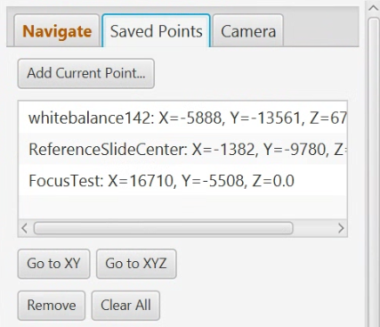
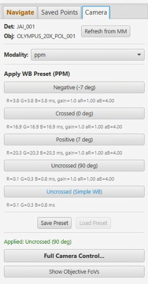

# Live Viewer

> Menu: Extensions > QP Scope > Live Viewer
> [Back to README](../../README.md) | [All Tools](../UTILITIES.md)

## Purpose

Real-time camera feed with integrated stage control, histogram, and noise statistics. This is the primary tool for verifying microscope communication, positioning the stage, and checking camera settings before acquisition. Use this as a first test after setting up a microscope connection.

## Window Title

The window title dynamically displays the current imaging modality and expected objective magnification, e.g. `Live Viewer (Brightfield) (10x)`. The title updates in real time when you change the modality via the Camera tab dropdown or when the objective is re-detected. If either value is unknown, the title degrades to `Live Viewer`.

## Prerequisites

- Connected to microscope server (see [Communication Settings](server-connection.md))
- Microscope hardware initialized in Micro-Manager

## Options

### Camera Feed

| Option | Type | Description |
|--------|------|-------------|
| Fit Mode | Toggle | Scale image to fit the dialog window |
| Display Scale | ComboBox | Select display magnification level |
| Show Tiles | CheckBox | During acquisition, display the most recently acquired tile instead of the live feed. Updates approximately every 8 seconds as new tiles are captured. Useful for monitoring focus drift without waiting for stitching to complete. Works with multi-angle acquisitions (PPM). |

Double-click on the camera image to center the stage at that position.

### Snap

The **Snap** button on the toolbar captures the current live frame and writes it to disk as an OME-TIFF.

- Clicking Snap opens a file save dialog. The dialog defaults to the current QuPath project folder. Once you save to a different folder, subsequent Snaps in the same session default to that folder; the choice resets to the project folder when QuPath restarts.
- The suggested filename includes the active modality and a `yyyyMMdd-HHmmss` timestamp so successive snaps do not overwrite each other.
- The saved OME-TIFF embeds the current stage XY/Z, pixel size, modality, objective, and detector as OME-XML metadata.
- Snap is disabled while Live is OFF and before the first frame arrives -- this avoids saving a stale buffer.
- When **Show Tiles** is enabled and a tile from disk is being displayed, Snap still captures the **live feed**, not the on-disk tile. Stop the live feed and re-open if you want to defer.

#### Snap options (right-click)

Right-click the Snap button to open a context menu:

| Option | Default | Description |
|---|---|---|
| Save raw bit depth | ON | Preserve the camera's native bit depth (16-bit when supported). Uncheck to apply the current display contrast and save as 8-bit. |
| Apply background correction | OFF | Request a flat-field-corrected frame from the server via the `CORRECTFRAME` socket command. **Greyed out unless** the configured backgrounds match the live state -- same compatibility check the ACQUIRE workflow runs (modality + objective + detector + WB mode + current angle). Exposure mismatch and WB-mode mismatch produce a status-bar warning, not a block (matches ACQUIRE: flat-field correction is exposure-independent). |
| Open file after save | OFF | After a successful save, open the file in the OS default image viewer. |
| Reset save folder to project | -- | Forget the last-used save folder; the next snapshot defaults to the current project folder. |

The status bar reports a clickable "Show in folder" link after each successful save.

### Focus Controls Toolbar

The toolbar contains a single autofocus button and a range selector:

| Control | Description |
|---|---|
| **Autofocus** | Single button that runs either streaming continuous-Z autofocus or Sweep Autofocus, depending on your selection in the Autofocus Configuration dialog (Extensions > QP Scope > Utilities > Autofocus Configuration). While Streaming AF is running the button reads **Cancel Autofocus** and can be clicked to abort. While Sweep Autofocus is running the button reads **Sweeping...** and is disabled (server-side operation has no client-side cancel; Z is returned to the starting position on any server-side failure). |
| **Range dropdown** | Options are dynamically populated per objective based on magnification: 4x/5x up to 200µm, 10x up to 100µm, 20x up to 50µm, 40x up to 20µm, 60x+ up to 10µm. "Config" uses `sweep_range_um` from `autofocus_<scope>.yml`. Explicit values override the YAML for Streaming AF only; Sweep Autofocus always reads from the YAML regardless of dropdown selection. Higher magnifications have shallower depth-of-field, so wider search ranges waste time and may misfocus on debris. |

#### Button state transitions

The Autofocus button changes appearance to communicate status:

| Button State | Appearance | What happened |
|---|---|---|
| Ready | Default styling, label "Autofocus" | Normal idle state |
| Streaming Running | Label "Cancel Autofocus", enabled | Streaming AF is running; click to cancel |
| Sweep Running | Label "Sweeping...", disabled | Sweep Autofocus is running on the server (no client-side cancel) |
| Cancelled | Returns to "Autofocus" | Streaming AF cancelled by the user; Z restored to the pre-scan position |
| Success | Returns to "Autofocus" | Focus found and committed |
| Failed | Dialog appears | The selected autofocus method could not find focus |

When autofocus fails, a dialog appears with the diagnostic reason (e.g., **"metric_flat"** for sparse vs. dense texture strategy mismatch, **"no peak found"** for Z starting position outside search range, **"saturation"** for overexposure, **"blur"** for exposure too long for streaming AF on this stage). The dialog offers a button to open the Autofocus Configuration dialog so you can switch autofocus methods if desired.

#### Choosing the autofocus method

The Autofocus Configuration dialog (Extensions > QP Scope > Utilities > Autofocus Configuration) contains radio buttons labeled "Live Viewer Autofocus button uses:" that let you select which method the Live Viewer's Autofocus button runs:

- **Streaming** -- continuous-Z scan, fast (~1 second on PPM at 0.73 ms exposure). Requires a stage capable of slow continuous motion. Streaming refuses (showing the failure dialog -- there is no automatic fallback) when exposure is too long (>~40 ms on a Prior, varies by stage), the camera is saturated, or the stage lacks a speed property. If you hit these often, switch the method to Sweep. Streaming AF can be cancelled by clicking the button while running.
- **Sweep** -- server-side stepped scan over a narrow Z range, slower than Streaming (~5-10 seconds) but works on any camera and any stage. Always uses `sweep_range_um` from the autofocus YAML; the focus range dropdown does not override it for Sweep. More reliable when exposure is long or the sample has sparse signal. Sweep runs entirely on the server with no per-frame client feedback, so the button shows "Sweeping..." while running and cannot be cancelled.

Your choice is stored per QuPath installation, so each microscope rig naturally tracks its own preferred method (e.g., STREAMING on PPM where the stage can crawl, SWEEP on OWS3 where the stage cannot).

#### Server feasibility gates (streaming only)

When you select Streaming in the Autofocus Configuration, the server checks three pre-flight gates before each scan. If any fail, the Autofocus button triggers the failure dialog with diagnostic details:

- **Stage speed property**: focus device must expose `MaxSpeed`, `Velocity`, `Speed`, or `MaxVelocity`. Piezo stages and demo adapters typically do not.
- **Motion blur budget**: `min_velocity * exposure` must stay under ~0.5 um (25% of a nominal 20X DOF). On a Prior at MaxSpeed=1 (~11.5 um/s), the per-stage exposure ceiling is ~43 ms. Longer exposures (dark fluorescence, low-angle PPM) will refuse.
- **Saturation**: the saturated-pixel fraction in a pre-scan snap must be below a per-modality threshold (brightfield 50%, PPM 50%, fluorescence/widefield 2%, laser-scanning/SHG 1%) or the focus metric will not discriminate. When saturation is detected, the failure dialog shows: *"Streaming autofocus could not find focus. The stage was left at its current Z."* The streaming-AF code path anchors absolutely on the full sensor as of microscope_command_server `7f40a47` (2026-05-11): every entry calls `clear_roi()` to establish a known full-sensor baseline, every exit calls `clear_roi()` to return there. Refusals through this gate (or the blur-budget gate) now unconditionally leave the camera at full sensor, regardless of entry state or which exit path the handler takes. The earlier partial fix (`44b0ab0`, 2026-05-08) closed the leak paths but did not heal a pre-existing cropped state; the absolute-anchoring follow-up does. See `claude-reports/2026-05-11_streaming-af-absolute-roi-anchoring.md`.

#### Slope without peak

If either Autofocus or Sweep Autofocus detects a focus slope (monotonic profile) but cannot find a true peak even after edge retries, the stage is left at the best Z found rather than returning to the starting position.

See [AUTOFOCUS.md](../AUTOFOCUS.md#autofocus-live-viewer) for the full design story and [developer/PROBEZ.md](../developer/PROBEZ.md) for how to characterize the envelope on a new rig.

### Histogram Panel

| Option | Type | Description |
|--------|------|-------------|
| Min/Max Sliders | Slider | Contrast adjustment range. Dragging either slider also clears the persistent Always Auto-Scale flag (and unchecks the box) so the manual range is honored. |
| Full Range | Button | Reset Min/Max to the full sensor range and clear the persistent Always Auto-Scale flag. |
| Auto Scale | Button | One-shot rescale of the contrast range to the current frame. Does NOT flip the persistent Always Auto-Scale flag -- use it when you want a single rescale without committing to per-frame auto-scale. |
| Always Auto-Scale | CheckBox | When checked, every live frame and acquired tile is auto-scaled (drives the persistent `autoScale` flag). When unchecked, your manual Min/Max sliders are preserved. Replaces the previous always-on per-tile rescale, which was breaking non-fluorescence acquisitions whose contrast was already correctly set. |

The histogram shows a 256-bin luminance distribution updated in real time. Per-channel (R/G/B) saturation percentages are displayed below the histogram and turn red when any channel exceeds 1% saturation.

### Stage Control - Navigate Tab

The Navigate tab combines movement controls and direct position entry in a single panel.

**Movement Controls:**

| Option | Type | Description |
|--------|------|-------------|
| Virtual Joystick | Drag Control | Click-and-drag with quadratic response curve for fine/coarse movement |
| FOV Step Size | ComboBox | Step size as fraction of field of view (1/4 FOV, 1/2 FOV, 1 FOV, etc.) |
| Arrow Buttons | Buttons | Up/Down/Left/Right for precise single-step movement |
| Double-Step Arrows | Buttons | Outer arrow buttons for 2x step size movement |
| Sample Movement | CheckBox | Enable "sample perspective" movement (direction inversion for intuitive control) |
| Z Controls | Spinner + Buttons | Z position display with up/down buttons. Scroll on the Z field or Move Z button to stream Z continuously — the stage ramps smoothly through intermediate focus planes, tracking the wheel like a physical focus knob. |
| Polarizer Controls | Spinner | Rotation angle control (PPM modality only) |
| **Calibrate Directions...** | Button | Opens an interactive dialog that jogs the stage in +X and +Y, asks which way the image appeared to pan, and solves for the camera orientation (optical flip/rotation) under your current stage polarity setting. Non-blocking: saves your original position and restores it when closing. The same calibration dialog is available in the Setup Wizard as an optional step. Note: stage polarity is treated as a hardware-wiring fact and is not changed by this tool — use the MicroManager-script procedure in [PREFERENCES.md](../PREFERENCES.md#inverted-x-stage) to verify polarity if needed. See that same section for the coordinate frame details. |

**Move to Position:**

| Option | Type | Description |
|--------|------|-------------|
| X / Y / Z / R Fields | TextField | Enter absolute coordinates (um) or rotation angle to move to |
| Move Buttons | Button | Move the stage to the entered coordinate for that axis |
| Go to Centroid | Button | Move the stage to the centroid of the current QuPath annotation. Enabled when the open image has alignment data (sub-image offset metadata, bounding-box stage bounds, or derived alignment). The status text indicates which alignment type is available. |

### Stage Control - Saved Points Tab

| Option | Type | Description |
|--------|------|-------------|
| Save Current Position | Button | Save current XYZ position with a custom name |
| Saved Points List | Table | Named positions with Go To and Delete actions |

Saved points are stored in JSON preferences and persist across sessions.

### Stage Control - Camera Tab

Shows the current hardware and provides modality-dependent camera controls.

| Option | Type | Description |
|--------|------|-------------|
| Detector / Objective | Label | Read-only display of the current detector and objective (auto-detected from MicroManager pixel size) |
| Modality | Dropdown | Select the imaging modality (PPM, Brightfield, Fluorescence, etc.). Changing the dropdown sends `APPLYPR` to actually drive the hardware -- the cube turret moves, the light path switches, the previous source is turned off, and the new modality's source becomes active. (Previously the dropdown was UI-only and the lamp stayed on the previous modality, so any tuning values you typed were calibrated against unfiltered light.) A status label below the dropdown shows progress: "Switching to..." during the switch, "Switched to [profile]" on success, or "Switch failed: [error]" on failure. **Modality changes sync across all open dialogs** (Acquisition Wizard, Background Collection, Sample Setup, etc.), so selecting a modality here updates the other dialogs' selectors automatically. **After switching**, if both profiles have calibrated parfocality offsets for the current objective, the stage automatically shifts Z by the calibrated delta to maintain focus. If offsets are missing or the two profiles belong to different objectives, no Z shift is applied (you may need to refocus manually). See [Parfocality Calibration](parfocality-calibration.md) to calibrate offsets per profile. |
| Full Camera Control | Button | Opens the full [Camera Control](camera-control.md) dialog for detailed exposure / gain / binning / illumination adjustments |

**PPM modality content:**

| Option | Type | Description |
|--------|------|-------------|
| WB Angle Presets | Buttons | One button per calibrated angle (e.g., "Uncrossed (90 deg)"). Clicking applies the per-channel exposures, gains, and rotates the polarizer. Exposure and gain details shown below each button. |
| Simple WB Preset | Button | Applies the Simple WB base exposures and gains at the uncrossed angle (blue text, shown only if Simple WB has been calibrated) |

**Brightfield modality content:**

| Option | Type | Description |
|--------|------|-------------|
| Brightfield WB | Button | Applies the single white balance preset (no rotation). |

**Fluorescence / widefield IF modality content (per-channel preview):**

When a fluorescence-style modality has a channel library declared in YAML (`modalities.<name>.channels`), the panel renders one row per channel:

| Option | Type | Description |
|--------|------|-------------|
| Profile | Dropdown + Apply | Pick the acquisition profile (e.g. `Fluorescence_10x`) whose channel library to use. Apply runs `APPLYPR` to switch the cube + epi shutter + light source, then rebuilds the panel: the displayed exposure/illumination fields re-pull from saved prefs and re-push them to hardware so the numbers you see match what the camera is actually using. (Without that step `APPLYPR` would reset hardware to the YAML defaults while the UI still showed your previous tunings, leading to a dim image and stale displayed values until you nudged a slider.) The dropdown selection itself is preserved across rebuilds. |
| (None -- deactivate all) | Radio | Selecting this sends `APPLYCH` with an empty channel id, which calls `_disable_all_modality_illuminations` to turn off every source declared in the modality. Default-selected on dialog open. |
| Per-channel rows | Radio + Spinner + Spinner | One row per channel id (DAPI, FITC, ...). The radio button now drives hardware via `APPLYCH`: the cube/shutter presets run, the per-channel light source switches, the per-channel intensity property is written, and the per-channel exposure is applied -- all on the server in `apply_channel_hardware_state`, the same helper the acquisition workflow uses. The exposure spinner round-trips to the live camera; the intensity spinner persists to PersistentPreferences for the next acquisition (independent live tuning of the channel's intensity property requires SETILLMD on the channel's intensity device, scheduled if friction surfaces). |
| Channel Preset Bar | ComboBox + Save / Delete | Named presets capturing per-channel exposure and intensity spinner state. **Save** snapshots every channel's current spinner values and marks the currently-active preview channel as "selected" in the preset. **Selecting** a preset in the dropdown restores those spinner values across all channels and, if exactly one channel was selected, fires its radio (APPLYCH switches the cube/light path to it). **Delete** removes the preset. Presets are shared with the [Bounded Acquisition](bounded-acquisition.md) dialog's Fluorescence panel, so saving here makes the preset available there and vice versa. |
| Save / Load Preset | Buttons | (Legacy, separate from the Channel Preset Bar above.) Save: stores `profile\|exp\|gain\|illum` keyed by modality + objective + detector. Load: runs `APPLYPR` for the saved profile *before* writing `SETCAM` and `SETILLM`, so the right cube + light path are in place when the preset's illumination power lands. Legacy preset format (no leading profile) auto-resolves to the first profile matching the section's modality. |

**Other modalities:** Show a placeholder message indicating presets are not yet configured.

When a preset or channel is applied, the live feed pauses briefly while the camera settings update, then resumes automatically (`withLiveModeHandling`).

### Noise Stats Panel

| Option | Type | Description |
|--------|------|-------------|
| Measure | Button | Capture multiple frames for temporal noise analysis |

Displays a per-channel (R/G/B) grid showing Mean, StdDev, and SNR values.

### RGB Readouts

Displays current R, G, B mean intensity values from the live feed. Useful for calibration diagnostics and verifying white balance.

## Workflow

1. Open Live Viewer from the menu
2. Verify the camera feed is displaying (confirms microscope communication)
3. Use stage controls to navigate to the area of interest
4. Use the Camera tab to apply WB presets for the desired polarizer angle
5. Check histogram and saturation indicators for proper exposure
6. Use noise stats to verify camera performance
7. Save important positions using the Saved Points tab

## Output

The Live Viewer does not produce persistent output files. It provides real-time visual feedback for:

- Camera feed verification
- Stage positioning
- Histogram-based exposure assessment
- Noise characterization measurements
- Saved stage positions (persisted in preferences)

## Tips & Troubleshooting

- **No image displayed**: Verify server connection and that Micro-Manager has initialized the camera
- **Image is black**: Check illumination source, lamp power, and exposure settings
- **Image is saturated**: Reduce exposure time or lamp intensity; check the per-channel saturation indicators
- **Stage does not move**: Check hardware initialization in Micro-Manager
- The dialog is a singleton -- opening it again brings the existing window to front
- Live streaming pauses automatically during acquisition, camera operations, and WB preset application, then resumes afterward
- If frames stop arriving, the viewer will automatically attempt to restart the camera up to twice before turning off
- Stage control settings (step size, sample movement mode) are persisted between sessions

## See Also

- [Camera Control](camera-control.md) - View and test camera exposure and gain settings
- [Communication Settings](server-connection.md) - Configure the microscope server connection
- [Stage Map](stage-map.md) - Visual reference for stage insert layout
- [Bounded Acquisition](bounded-acquisition.md) - Acquire after verifying position in Live Viewer
- [Microscope Alignment](microscope-alignment.md) - Use Live Viewer to navigate during alignment
