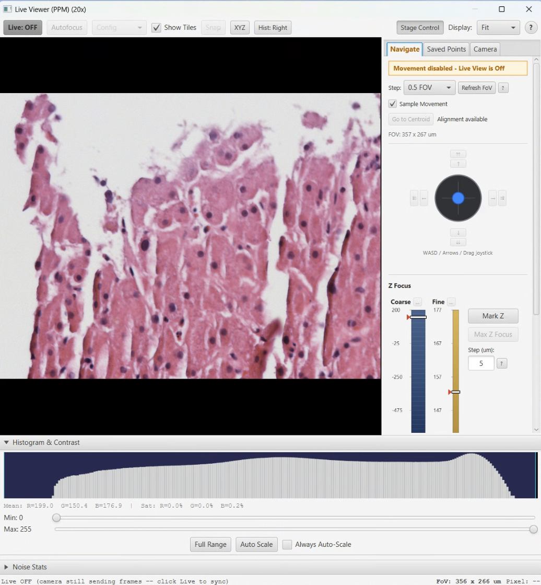
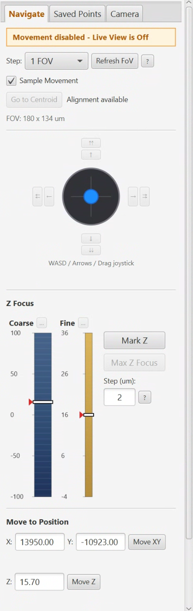

# Live Viewer

> Menu: Extensions > QP Scope > Live Viewer
> [Back to README](../../README.md) | [All Tools](../UTILITIES.md)

## Purpose

Real-time camera feed with integrated stage control, histogram, and noise statistics. This is the primary tool for verifying microscope communication, positioning the stage, and checking camera settings before acquisition. Use this as a first test after setting up a microscope connection.

## Prerequisites

- Connected to microscope server (see [Communication Settings](server-connection.md))
- Microscope hardware initialized in Micro-Manager

## Options

### Camera Feed

| Option | Type | Description |
|--------|------|-------------|
| Fit Mode | Toggle | Scale image to fit the dialog window |
| Display Scale | ComboBox | Select display magnification level |
| Show Tiles | CheckBox | During acquisition, display the most recently acquired tile instead of the live feed. Updates approximately every 8 seconds as new tiles are captured. Useful for monitoring focus drift without waiting for stitching to complete. Works with multi-angle acquisitions (PPM). |

Double-click on the camera image to center the stage at that position.

### Histogram Panel

| Option | Type | Description |
|--------|------|-------------|
| Min/Max Sliders | Slider | Contrast adjustment range |
| Auto Scale | Button | Automatically set contrast range based on current image |

The histogram shows a 256-bin luminance distribution updated in real time. Per-channel (R/G/B) saturation percentages are displayed below the histogram and turn red when any channel exceeds 1% saturation.

### Stage Control - Navigate Tab

The Navigate tab combines movement controls and direct position entry in a single panel.

**Movement Controls:**

| Option | Type | Description |
|--------|------|-------------|
| Virtual Joystick | Drag Control | Click-and-drag with quadratic response curve for fine/coarse movement |
| FOV Step Size | ComboBox | Step size as fraction of field of view (1/4 FOV, 1/2 FOV, 1 FOV, etc.) |
| Arrow Buttons | Buttons | Up/Down/Left/Right for precise single-step movement |
| Double-Step Arrows | Buttons | Outer arrow buttons for 2x step size movement |
| Sample Movement | CheckBox | Enable "sample perspective" movement (direction inversion for intuitive control) |
| Z Controls | Spinner + Buttons | Z position display with up/down buttons |
| Polarizer Controls | Spinner | Rotation angle control (PPM modality only) |

**Move to Position:**

| Option | Type | Description |
|--------|------|-------------|
| X / Y / Z / R Fields | TextField | Enter absolute coordinates (um) or rotation angle to move to |
| Move Buttons | Button | Move the stage to the entered coordinate for that axis |
| Go to Centroid | Button | Move the stage to the centroid of the current QuPath annotation |

### Stage Control - Saved Points Tab

| Option | Type | Description |
|--------|------|-------------|
| Save Current Position | Button | Save current XYZ position with a custom name |
| Saved Points List | Table | Named positions with Go To and Delete actions |

Saved points are stored in JSON preferences and persist across sessions.

### Stage Control - Camera Tab

Shows the current hardware and provides modality-dependent camera controls.

| Option | Type | Description |
|--------|------|-------------|
| Detector / Objective | Label | Read-only display of the current detector and objective (auto-detected from MicroManager pixel size) |
| Modality | Dropdown | Select the imaging modality (PPM, Brightfield, etc.). Content below changes based on selection. |
| Full Camera Control | Button | Opens the full [Camera Control](camera-control.md) dialog for detailed exposure and gain adjustments |

**PPM modality content:**

| Option | Type | Description |
|--------|------|-------------|
| WB Angle Presets | Buttons | One button per calibrated angle (e.g., "Uncrossed (90 deg)"). Clicking applies the per-channel exposures, gains, and rotates the polarizer. Exposure and gain details shown below each button. |
| Simple WB Preset | Button | Applies the Simple WB base exposures and gains at the uncrossed angle (blue text, shown only if Simple WB has been calibrated) |

**Brightfield modality content:**

| Option | Type | Description |
|--------|------|-------------|
| Brightfield WB | Button | Applies the single white balance preset (no rotation). |

**Other modalities:** Show a placeholder message indicating presets are not yet configured.

When a preset is applied, the live feed pauses briefly while the camera settings are updated, then resumes automatically.

### Noise Stats Panel

| Option | Type | Description |
|--------|------|-------------|
| Measure | Button | Capture multiple frames for temporal noise analysis |

Displays a per-channel (R/G/B) grid showing Mean, StdDev, and SNR values.

### RGB Readouts

Displays current R, G, B mean intensity values from the live feed. Useful for calibration diagnostics and verifying white balance.

## Workflow

1. Open Live Viewer from the menu
2. Verify the camera feed is displaying (confirms microscope communication)
3. Use stage controls to navigate to the area of interest
4. Use the Camera tab to apply WB presets for the desired polarizer angle
5. Check histogram and saturation indicators for proper exposure
6. Use noise stats to verify camera performance
7. Save important positions using the Saved Points tab

## Output

The Live Viewer does not produce persistent output files. It provides real-time visual feedback for:

- Camera feed verification
- Stage positioning
- Histogram-based exposure assessment
- Noise characterization measurements
- Saved stage positions (persisted in preferences)

## Tips & Troubleshooting

- **No image displayed**: Verify server connection and that Micro-Manager has initialized the camera
- **Image is black**: Check illumination source, lamp power, and exposure settings
- **Image is saturated**: Reduce exposure time or lamp intensity; check the per-channel saturation indicators
- **Stage does not move**: Check hardware initialization in Micro-Manager
- The dialog is a singleton -- opening it again brings the existing window to front
- Live streaming pauses automatically during acquisition, camera operations, and WB preset application, then resumes afterward
- If frames stop arriving, the viewer will automatically attempt to restart the camera up to twice before turning off
- Stage control settings (step size, sample movement mode) are persisted between sessions

## See Also

- [Camera Control](camera-control.md) - View and test camera exposure and gain settings
- [Communication Settings](server-connection.md) - Configure the microscope server connection
- [Stage Map](stage-map.md) - Visual reference for stage insert layout
- [Bounded Acquisition](bounded-acquisition.md) - Acquire after verifying position in Live Viewer
- [Microscope Alignment](microscope-alignment.md) - Use Live Viewer to navigate during alignment
