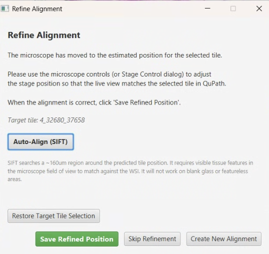
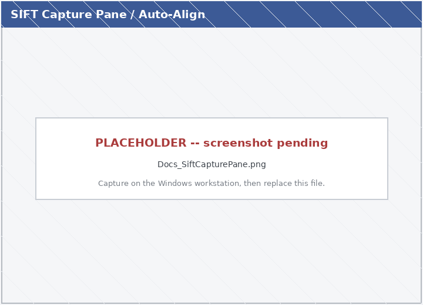
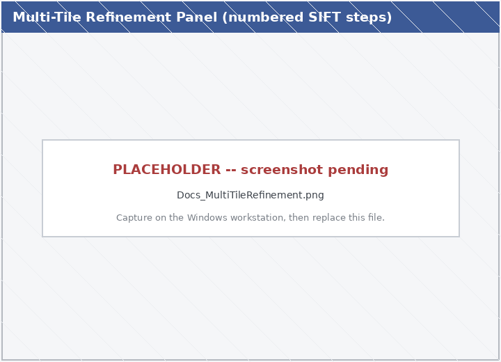

# Microscope Alignment

> Menu: Extensions > QP Scope > Microscope Alignment
> [Back to README](../../README.md) | [All Tools](../UTILITIES.md) | [All Workflows](../WORKFLOWS.md)

## Purpose

Create or update the coordinate transformation between QuPath image coordinates and physical microscope stage positions. This alignment is required for accurate stage positioning when acquiring from existing images. Use this tool the first time you set up a slide/scanner combination, after hardware changes affecting positioning, or when acquired images do not align with annotations.

The figure below shows the end-to-end purpose of alignment: a whole-slide overview with a target annotation in QuPath (a), cross-instrument alignment with QPSC to a second microscope (b, c), and high-resolution re-acquisition of the sub-region on that microscope (d).

## Prerequisites

- Macro/overview image loaded in QuPath with pixel size calibration
- Microscope server connected
- Stage can move to known positions
- Image must have visible features suitable for point matching

## Options

### Macro Image Selection

| Option | Type | Description |
|--------|------|-------------|
| Image | ComboBox | Select the macro/overview image to use for alignment (if multiple images are in the project) |

The selected image must have pixel size calibration and should cover the area of interest.

### Point Marking

| Column | Type | Description |
|--------|------|-------------|
| # | Label | Point number |
| Image X | Label | X coordinate in QuPath pixels |
| Image Y | Label | Y coordinate in QuPath pixels |
| Stage X | Label | X coordinate in micrometers |
| Stage Y | Label | Y coordinate in micrometers |
| Delete | Button | Remove this point pair |

Mark at least 3 points. More points improve accuracy.

### Transform Quality Metrics

| Metric | Good Value | Description |
|--------|------------|-------------|
| Mean Error | < 50 um | Average positioning error across all points |
| Max Error | < 100 um | Worst-case error for any single point |
| R-squared | > 0.99 | Overall fit quality (1.0 = perfect) |

### Save Transform

| Field | Type | Description |
|-------|------|-------------|
| Transform Name | TextField | Descriptive name for this transform |
| Scanner | ComboBox | Scanner type this applies to (if applicable) |
| Notes | TextArea | Optional notes about conditions or setup |

## Workflow

### Step 1: Macro Image Selection

If multiple images exist in the project, select the macro/overview image to use for alignment. The image must have visible features that you can also locate under the microscope.

The alignment workflow automatically loads the flipped version of the macro image (matching the Live Viewer orientation) before point selection begins. This ensures that image coordinates correspond correctly to what you see through the camera.

### Step 1B: Tissue Annotations (Automatic Requirement)

The alignment workflow requires tissue annotations (ROIs) to exist on the active entry. These define the tissue area from which calibration tiles will be automatically selected.

**If no annotations are present when you start manual alignment:**
- A dialog appears prompting you to draw tissue ROIs or run tissue detection in QuPath
- Click **Use Annotations and Continue** after drawing or detecting tissue, or close/cancel the dialog to abort
- The workflow pauses until you confirm annotations exist

**Typical approaches:**
- **Draw manually**: Use QuPath's annotation tools (Brush, Freehand, or Wand) to outline tissue regions
- **Run tissue detection**: Use QuPath's image analysis → Cell detection & classification → Positive pixel classifier (or Haralick features) to auto-segment tissue
- **Use existing annotations**: If tissue is already annotated on this entry, the workflow proceeds without prompting

On multi-slide acquisitions where a fresh rotated/flipped entry is opened, this entry carries no annotations by default, so the prompt will appear. This replaces the previous behavior of failing hard if no annotations existed.

### Step 2: Point Marking

For each calibration point:

1. **In QuPath**: Click on a recognizable feature in the macro image
2. **Move Stage**: Navigate the microscope stage to the same physical location
3. **Record Point**: Click "Record Point" to capture both coordinate pairs
4. **Repeat**: Mark at least 3 points (more points = better accuracy)

**Point distribution guidelines:**

- Spread points across the entire image
- Cover corners and center if possible
- Do not cluster points in one area
- Use easily identifiable features (tissue edges, landmarks)

### Step 3: Transform Calculation

After marking points, click **Calculate Transform**. The system computes the best-fit affine transformation and displays error statistics. Review the quality metrics to assess accuracy.

### Step 4: Refinement (Manual or Automatic)

This workflow already drives 3-point refinement implicitly: after you select a reference tile, two further tiles (top-center and left-center) are visited and confirmed in turn. The Position Confirmation dialog at each tile now includes an **Auto-Align (SIFT)** button so you can refine the last few microns before clicking **Current Position is Accurate** to commit the point.

> **Tip:** SIFT only succeeds when the live view already overlaps the selected tile by at least a few hundred microns. Pick a reference tile near visible features and drive the stage close (joystick or Live Viewer click-to-center) before clicking Auto-Align.

> **In focus, not saturated.** Every SIFT dialog now shows a bold reminder to confirm the live image is in focus and well-exposed before aligning. SIFT matches on image detail, so a blurry or blown-out frame will misalign or fail -- this is not checked automatically.

For each tile-confirm step:

1. Select a tile with tissue on the QuPath image where you want to image. The blue **Select tile** button moves the stage to its predicted position.
1b. Autofocus then runs automatically at that position (no click needed).
2. Either click **Auto-Align (SIFT)** to refine, or use the joystick to position manually.
3. Click **Current Position is Accurate** to commit the measurement; click **Cancel acquisition** to abort.

**Multi-slide batch mode:** When running alignment as part of a multi-slide batch (e.g., on a 4-slide carrier):
The workflow first attempts the green-box + preset path, which re-detects the tissue's location on each slide's own macro image. This is the primary alignment path when a scanner preset exists (the preset captures the optical properties for the source/target microscope pair). If no usable scanner preset is available, the workflow falls back to the full 3-point manual landmark alignment to measure the slide's true position and rotation for its current mount.

- **Green-box + preset path (primary):** Re-detects tissue location per slide using the scanner preset for orientation/scale. After initial green-box detection and preset application, the selected **single-tile refinement** corrects the per-slot center offset (the preset was calibrated at one holder position, not necessarily the current slot). This combines automatic tissue detection with manual operator verification.
- **Manual landmark (fallback):** When no preset exists, the full 3-point landmark process runs instead. You manually confirm three points (reference tile, then top-center and left-center refinement tiles) to establish position and rotation.

The slot-center seed (from holder calibration) speeds up multi-slide runs by moving the stage near the slide at the start of each alignment, so you drive a short distance to the tissue rather than navigating from scratch.

**Auto-Align (SIFT)**:
- Extracts a region from the WSI around the selected tile (with the configured search margin, default 160um).
- Snaps a microscope image and matches against the WSI region using SIFT feature detection.
- Pixel size differences between the WSI and microscope are handled automatically (both images are rescaled to the lower resolution).
- Optical flip is applied based on the image's per-slide metadata.
- The stage moves to correct any offset found by the matching; the status line shows the offset and number of matched features.
- If matching fails (insufficient features or stage too far off), refine manually.

SIFT auto-alignment works best on tissue with visible structural features. It can struggle on blank areas, very uniform tissue, or regions with repetitive patterns; in those cases use manual alignment.

The same Auto-Align (SIFT) helper is also available in the post-alignment single-tile refinement step of the **Existing Image Workflow**. An embedded capture pane appears with "Capture position" (disabled until SIFT runs), "Skip point" (keeps the predicted position without refining), and "Create New Alignment" buttons, since that step writes the per-slide alignment JSON.

**Multi-tile refinement panel:** For slides that may sit rotated in their slot (common with the multi-slide vertical holder), the **multi-tile** refinement mode shows a numbered-steps panel that solves a rotation + scale correction from 2 or more reference points. Each step is color-matched to its button -- **1. Select tile** (blue), **2. Auto-Align (SIFT)** (amber), **3. Add reference point** (teal), **4. Solve & Save** (green) -- and an attention pulse glows the next action. Spread the points far apart (not in a line) for the best rotation estimate.

**Trust SIFT mode** (advanced): Enable via the `trustSiftAlignment` preference (see [Preferences](../PREFERENCES.md#sift-auto-alignment)). When enabled, the post-alignment single-tile refinement step runs SIFT automatically without showing the manual dialog. If confidence (inlier ratio) exceeds the configurable threshold (default 50%), the position is auto-accepted and the workflow continues unattended. Falls back to manual if SIFT fails or confidence is too low. (The 3-point alignment confirm step always shows the dialog -- there are no auto-accept semantics there because each click is the human committing a calibration point.)

**Cross-modality matching (16-bit camera vs 8-bit WSI):** When the microscope camera produces 16-bit images and the reference is an 8-bit H&E or PPM WSI, SIFT collapses if the camera range is naively bit-shifted to 8-bit. The SIFT Settings dialog exposes mono-normalization mode (`PERCENTILE` / `MIN_MAX` / `BIT_SHIFT`), percentile clip points, and CLAHE settings. Defaults (`PERCENTILE` 2/98 + CLAHE on, clipLimit=2.0) are tuned for that case. See [Preferences > SIFT Auto-Alignment](../PREFERENCES.md#sift-auto-alignment) for tuning guidance.

### Step 5: Validation

Test the calculated transform:

1. Select a validation point (not used in the calculation)
2. Click **Go To Point** to move the stage
3. Verify the stage arrives at the expected physical location
4. Check visual alignment through the microscope eyepiece or live viewer

If validation fails:

- Add more calibration points
- Check for systematic errors (flip/invert settings)
- Ensure points were accurately marked in both coordinate systems

### Step 5: Quality Summary and Save

After calculating the transform, a quality summary dialog is displayed with pass/warn/fail indicators for:

- **Scale** -- Whether the computed pixel-to-stage scale matches the expected value
- **Residuals** -- Whether the point-fitting residual errors are within acceptable limits
- **Translation stability** -- Whether the translation component is consistent across point subsets

If any indicator shows a warning or failure, you must acknowledge the issue before the alignment is saved. This prevents silently saving a poor-quality transform.

Give the transform a descriptive name and save it. The workflow then writes **two** files plus an in-memory transform:

1. A named `TransformPreset` for the `(source scanner, active microscope)` pair, stored in the configuration folder's `saved_transforms.json`. This is the **general** macro→stage transform, reusable for any future slide on this scope pair. The Stage Map source dropdown picks it up automatically.
2. A **per-slide alignment JSON** for the currently-open slide, stored in `<project>/alignmentFiles/<base>_<scope>_alignment.json`. This is **slide-specific** -- the next [Existing Image Acquisition](existing-image-acquisition.md) on this same slide loads this transform directly and **skips manual alignment**. The JSON also records the focused stage Z captured during refinement, so when this alignment is reused, the first autofocus can seed from that saved Z value instead of starting from scratch (a meaningful time savings on high-magnification objectives).
3. The `MicroscopeController.currentTransform` singleton, so the Live Viewer's Go-to-Centroid and click-to-center work immediately for this session.

Multiple presets can coexist for different scope pairs. The per-slide JSON is overwritten each time you re-align the same slide.

## Output

- A saved transform preset (general, reusable for any slide on this scope pair)
- A per-slide alignment JSON (specific to the slide that was open during alignment; consumed automatically by the next Existing Image Acquisition on that slide)
- An in-memory transform for the current session (Live Viewer navigation works immediately)
- Quality metrics for assessing alignment accuracy

## Understanding Flip and Invert Settings

These are two independent concepts that affect coordinate mapping:

**Image Flipping (Optical Property):**

- Corrects for optical inversions in the microscope light path
- Affects how annotations appear relative to stage coordinates
- Set in Preferences: "Flip macro image X/Y"

**Stage Inversion (Coordinate Direction):**

- Corrects for stage coordinate system conventions
- Affects which direction stage movement commands go
- Set in Preferences: "Inverted X/Y stage"

**Typical Settings:**

| Configuration | Flip X | Flip Y | Invert X | Invert Y |
|---------------|--------|--------|----------|----------|
| Standard upright | OFF | OFF | OFF | ON |
| Inverted microscope | OFF | ON | OFF | ON |
| Flipped slide scanner | ON | OFF | OFF | ON |

## Tips & Troubleshooting

| Issue | Cause | Solution |
|-------|-------|----------|
| Large mean error | Points inaccurately marked | Re-mark with more care and precision |
| Stage moves wrong direction | Invert settings wrong | Toggle Invert X or Y in Preferences |
| Image appears mirrored | Flip settings wrong | Toggle Flip X or Y in Preferences |
| Points do not form a pattern | Incorrect point pairs | Verify each QuPath point matches its stage position |
| Validation point is off | Not enough calibration points | Add more points spread across the image |

## See Also

- [Existing Image Acquisition](existing-image-acquisition.md) - Uses the coordinate transform created here
- [Bounded Acquisition](bounded-acquisition.md) - Alternative workflow using direct stage coordinates (no transform needed)
- [Live Viewer](live-viewer.md) - Use to navigate and verify stage positions during alignment
- [Stage Map](stage-map.md) - Visual reference for stage insert layout
