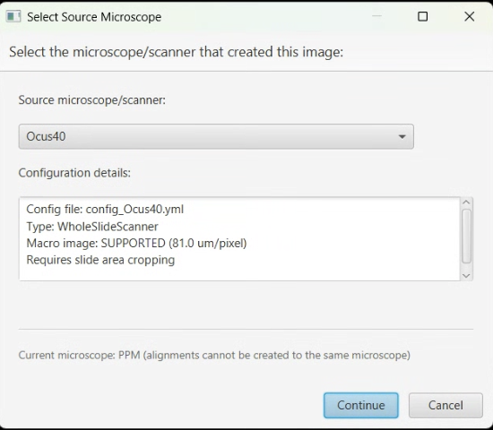

# Microscope Alignment

> Menu: Extensions > QP Scope > Microscope Alignment
> [Back to README](../../README.md) | [All Tools](../UTILITIES.md) | [All Workflows](../WORKFLOWS.md)

## Purpose

Create or update the coordinate transformation between QuPath image coordinates and physical microscope stage positions. This alignment is required for accurate stage positioning when acquiring from existing images. Use this tool the first time you set up a slide/scanner combination, after hardware changes affecting positioning, or when acquired images do not align with annotations.

## Prerequisites

- Macro/overview image loaded in QuPath with pixel size calibration
- Microscope server connected
- Stage can move to known positions
- Image must have visible features suitable for point matching

## Options

### Macro Image Selection

| Option | Type | Description |
|--------|------|-------------|
| Image | ComboBox | Select the macro/overview image to use for alignment (if multiple images are in the project) |

The selected image must have pixel size calibration and should cover the area of interest.

### Point Marking

| Column | Type | Description |
|--------|------|-------------|
| # | Label | Point number |
| Image X | Label | X coordinate in QuPath pixels |
| Image Y | Label | Y coordinate in QuPath pixels |
| Stage X | Label | X coordinate in micrometers |
| Stage Y | Label | Y coordinate in micrometers |
| Delete | Button | Remove this point pair |

Mark at least 3 points. More points improve accuracy.

### Transform Quality Metrics

| Metric | Good Value | Description |
|--------|------------|-------------|
| Mean Error | < 50 um | Average positioning error across all points |
| Max Error | < 100 um | Worst-case error for any single point |
| R-squared | > 0.99 | Overall fit quality (1.0 = perfect) |

### Save Transform

| Field | Type | Description |
|-------|------|-------------|
| Transform Name | TextField | Descriptive name for this transform |
| Scanner | ComboBox | Scanner type this applies to (if applicable) |
| Notes | TextArea | Optional notes about conditions or setup |

## Workflow

### Step 1: Macro Image Selection

If multiple images exist in the project, select the macro/overview image to use for alignment. The image must have visible features that you can also locate under the microscope.

### Step 2: Point Marking

For each calibration point:

1. **In QuPath**: Click on a recognizable feature in the macro image
2. **Move Stage**: Navigate the microscope stage to the same physical location
3. **Record Point**: Click "Record Point" to capture both coordinate pairs
4. **Repeat**: Mark at least 3 points (more points = better accuracy)

**Point distribution guidelines:**

- Spread points across the entire image
- Cover corners and center if possible
- Do not cluster points in one area
- Use easily identifiable features (tissue edges, landmarks)

### Step 3: Transform Calculation

After marking points, click **Calculate Transform**. The system computes the best-fit affine transformation and displays error statistics. Review the quality metrics to assess accuracy.

### Step 4: Validation

Test the calculated transform:

1. Select a validation point (not used in the calculation)
2. Click **Go To Point** to move the stage
3. Verify the stage arrives at the expected physical location
4. Check visual alignment through the microscope eyepiece or live viewer

If validation fails:

- Add more calibration points
- Check for systematic errors (flip/invert settings)
- Ensure points were accurately marked in both coordinate systems

### Step 5: Save Transform

Give the transform a descriptive name and save it. Saved transforms are stored in the configuration folder and can be selected in the [Existing Image Acquisition](existing-image-acquisition.md) workflow. Multiple transforms can exist for different conditions.

## Output

- A saved coordinate transformation file linking QuPath pixel coordinates to stage positions
- Transform can be reused across sessions until hardware or slide position changes
- Quality metrics for assessing alignment accuracy

## Understanding Flip and Invert Settings

These are two independent concepts that affect coordinate mapping:

**Image Flipping (Optical Property):**

- Corrects for optical inversions in the microscope light path
- Affects how annotations appear relative to stage coordinates
- Set in Preferences: "Flip macro image X/Y"

**Stage Inversion (Coordinate Direction):**

- Corrects for stage coordinate system conventions
- Affects which direction stage movement commands go
- Set in Preferences: "Inverted X/Y stage"

**Typical Settings:**

| Configuration | Flip X | Flip Y | Invert X | Invert Y |
|---------------|--------|--------|----------|----------|
| Standard upright | OFF | OFF | OFF | ON |
| Inverted microscope | OFF | ON | OFF | ON |
| Flipped slide scanner | ON | OFF | OFF | ON |

## Tips & Troubleshooting

| Issue | Cause | Solution |
|-------|-------|----------|
| Large mean error | Points inaccurately marked | Re-mark with more care and precision |
| Stage moves wrong direction | Invert settings wrong | Toggle Invert X or Y in Preferences |
| Image appears mirrored | Flip settings wrong | Toggle Flip X or Y in Preferences |
| Points do not form a pattern | Incorrect point pairs | Verify each QuPath point matches its stage position |
| Validation point is off | Not enough calibration points | Add more points spread across the image |

## See Also

- [Existing Image Acquisition](existing-image-acquisition.md) - Uses the coordinate transform created here
- [Bounded Acquisition](bounded-acquisition.md) - Alternative workflow using direct stage coordinates (no transform needed)
- [Live Viewer](live-viewer.md) - Use to navigate and verify stage positions during alignment
- [Stage Map](stage-map.md) - Visual reference for stage insert layout
