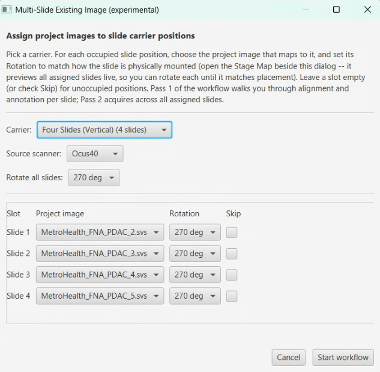
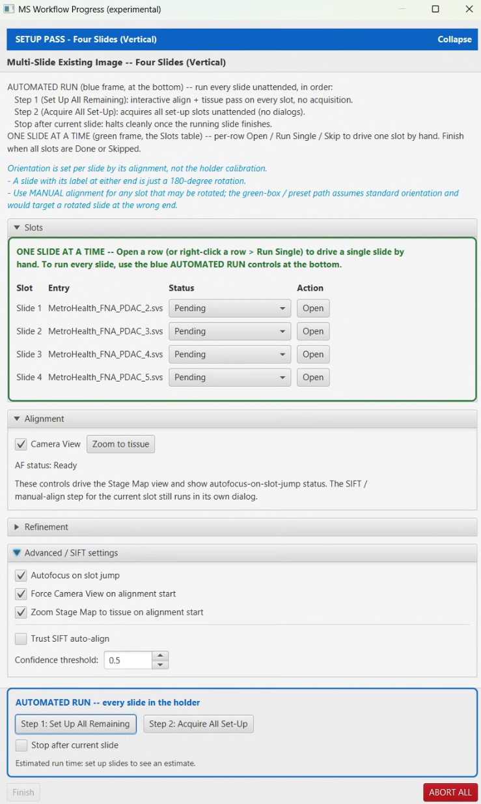
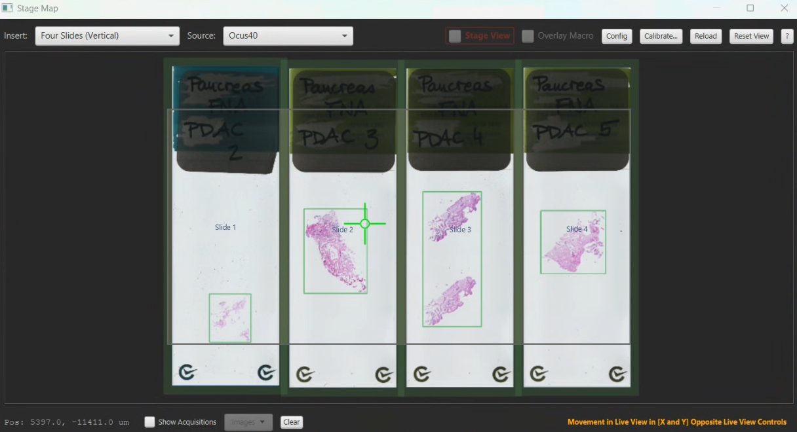

# Multi-Slide Acquisition

> Menu: Extensions > QP Scope > Multi-Slide Acquisition...
> [Back to README](../../README.md) | [All Tools](../UTILITIES.md) | [All Workflows](../WORKFLOWS.md)

## Purpose

Acquire several slides in one carrier (holder) in a single, mostly-unattended
batch. Multi-slide acquisition is a shepherding layer over the regular
[Existing Image Acquisition](existing-image-acquisition.md) workflow: it aligns
and acquires each slot in a slide holder using the same per-slide logic, but
splits the work into a **setup pass** (interactive alignment on every slot) and
an **acquire pass** (walk-away, no dialogs). Use it when you have a multi-slide
holder (currently the 4-slide vertical holder, `quad_v`) and want to set up all
slides once and then let the run proceed on its own.

> **Dialogs you will see.** Two are specific to this workflow -- the **carrier /
> slot assignment** dialog and the **batch progress panel** (above). The rest
> are the *same* dialogs as the single-slide
> [Existing Image Acquisition](existing-image-acquisition.md): the acquisition
> config dialog, the green-box tissue preview, tile selection, and the
> [refinement / Auto-Align (SIFT) dialogs](microscope-alignment.md#step-4-refinement-manual-or-automatic).
> This page does not re-screenshot those shared dialogs; see their own pages.

## When the menu appears

The **Multi-Slide Acquisition...** menu item appears automatically when the
active microscope config defines a multi-slide holder (carrier) -- e.g. the
4-slide vertical holder, `quad_v`. If your config has no multi-slide holder, the
entry is hidden. (There is no preference to toggle; it follows the config. See
[Stage carrier schema](../developer/CARRIER_SCHEMA.md) for defining a holder.)

## Prerequisites

- A QuPath project containing one macro/overview entry per slide you want to
  acquire (the same kind of entry the single-slide Existing Image workflow uses).
- A configured multi-slide stage insert (e.g. `quad_v`) in the microscope
  config. See [Stage carrier schema](../developer/CARRIER_SCHEMA.md).
- A microscope connection for acquisition (the assignment and alignment steps
  are interactive; the acquire pass runs against the saved per-slide alignments).

## Before you start

When you launch **Multi-Slide Acquisition...**, the **Live Viewer** and **Stage Map** are automatically opened (if not already visible). These show the camera feed and stage context while you assign slides to carrier slots. If either window is already open, it is brought to focus instead of opening a duplicate.

## Step 1 -- Assign slides to slots

In the assignment dialog:

1. **Pick the carrier** for the holder you have mounted.
2. **Set rotations.** Use **Rotate all slides** at the top to set every slot at
   once when slides are mounted the same way. The default follows the insert
   type: horizontal inserts (e.g. `single_h`) default to 0 degrees; vertical
   inserts (e.g. `quad_v`, `single_v`) use your last-saved quarter-turn choice.
   Per-slot pickers below override this for exceptions.
3. **Assign each slot** to one project macro entry and set its **Rotation** to
   match how the slide physically sits in the holder:
   - **0** -- normal orientation
   - **90** -- rotated 90 degrees clockwise
   - **180** -- upside down (label at the opposite end)
   - **270** -- rotated 270 degrees clockwise (90 counter-clockwise)

   Each non-zero rotation creates or reuses a rotated duplicate entry so
   acquisition aligns to the mounted orientation. Check **Skip** to leave a slot
   empty.
4. **Preview placement.** The [Stage Map](stage-map.md) is displayed alongside this
   dialog and shows all assigned slides rendered at their chosen rotations over the
   holder's slots, updating live as you change rotations. The preview stays
   visible after the dialog closes, as a layout reference through the alignments
   that follow.

   

> **Slide orientation note.** Each slot's true orientation comes from *its own
> alignment during setup*, not from the holder calibration (which only knows the
> slot center). Placing a slide label-end-reversed is a pure 180-degree rotation
> about the slot center, and a manual landmark alignment measures that rotation
> directly, so a reversed slide is still handled correctly.

## Step 2 -- Run the batch

The batch progress panel is organized into collapsible sections: **Slots**
(per-slide table), **Alignment**, **Refinement**, and **Advanced / SIFT
settings**. Controls are color-coded by mode -- the **Slots** table is framed in
**green** ("one slide at a time", the per-row manual controls), and the
automated drivers are grouped in a **blue "AUTOMATED RUN"** frame at the bottom.
An **attention pulse** glows the recommended next step so you always know what to
click.

There are two ways to run, and you can mix them:

### Two-pass (walk-away) run

1. **Step 1: Set Up All Remaining** -- runs the interactive align + refine +
   tissue pass on every slot **without acquiring**. Each slot advances to
   **Set up (ready to acquire)** and remembers its acquisition settings.
2. **Step 2: Acquire All Set-Up** -- acquires every set-up slot **unattended,
   with no dialogs**, replaying each slot's settings against the alignment saved
   during setup. The acquire pass **pipelines over stitching**: a slot advances
   to the next as soon as its stage work completes, while stitching and import
   happen in the background, so later slots acquire while earlier ones stitch.

Front-load your decisions in the setup pass, then leave it running.

> **Tip:** choose **single-tile refinement** during each slot's setup -- the
> focus Z it establishes seeds that slot's first-tile autofocus in the acquire
> pass, so acquisition starts near focus instead of hunting.

### Manual, one slot at a time

Use the **Status** dropdown to mark a slot **Done** (acquired outside the batch)
or **Skipped**. **Open** switches to that slot's macro entry. Right-click a
slot's entry name for **Run Single**, which launches the regular workflow on
that slot.

### Control buttons

- **Stop after current slide** -- halts the driver cleanly once the running
  slide finishes (an in-flight acquisition is never interrupted).
- **Abort All** (red, footer) -- stops the driver immediately and prevents
  further slides from starting. With no acquisition in flight it closes the
  panel; during an acquisition it confirms, then cancels the running acquisition
  (tiles already captured are kept, current tile discarded). The refinement
  dialog carries an equivalent **Abort Batch** button so it stays reachable when
  the refinement window covers the panel.
- **Collapse / Expand** -- shrink the panel to a thin bar during alignment so it
  does not cover the Stage Map or refinement views. The panel also auto-collapses
  when you click another window during setup, and stays expanded during the
  unattended acquire pass so progress stays visible.

### Finishing

A slot advances to **Done** on a successful acquisition, or stays **In
Progress** / **Set up** if a run is cancelled at a gate or hits a handled error
(so you can retry or mark it Skipped). Once every slot is **Done** or
**Skipped**, click **Finish**. A combined saturation summary is shown if any
tiles had concerning saturation during the run.

## Alignment during multi-slide runs

By default, **every slide is aligned fresh** on each batch pass -- a saved
per-slide alignment is never reused, because a slide's position in a holder
depends on its current mount and a prior single-slide alignment is meaningless
for the holder. Fresh alignment works one of two ways:

- **Primary path:** re-detect tissue with the green-box + scanner-preset path.
  The scanner preset supplies optical orientation/scale (calibrated at setup),
  and the holder's per-slot center calibration provides a rough auto-move near
  the first tile.
- **Fallback path:** if no usable scanner preset exists, fall back to the full
  3-point manual landmark alignment (which establishes position AND rotation).

A **refinement** step then corrects the per-slot position and captures focus Z
for unattended acquisition:

- **Single-tile** corrects the offset only (fast; cannot fix a slide sitting
  rotated in its slot).
- **Multi-tile** captures 2+ spread reference tiles and solves a rotation +
  scale correction, keeping alignment accurate across the whole slide. For a
  vertical holder (e.g. `quad_v`) slides sit loosely and can rotate, so the
  dialog **defaults to Multi-tile** for these holders; horizontal inserts and
  single vertical slides default to single-tile. If acquisition is accurate near
  one spot but drifts with distance after a single-tile refine, switch that slot
  to multi-tile.

  

- **Autofocus on slot jump** (Advanced / SIFT settings, default on) autofocuses
  after the stage jumps to each refinement tile, before the capture pane
  appears. Keep a Live Viewer stream open during multi-slide alignment so the
  streaming full-search AF is used (slot jumps can land far from the previous
  slide's focus).

The setup pass writes a fresh per-slide alignment JSON specific to that slide's
position in the current holder, and records which stage insert it was made on.
If you switch stage inserts, an old alignment from a different insert is detected
and treated as invalid, and the dialog recommends fresh refinement.

> **TEST-ONLY alignment reuse.** The preference **Reuse saved alignment (TESTING
> ONLY)** makes the batch reuse each slot's saved alignment instead of
> re-deriving it. This is **UNSAFE for real acquisition** -- it assumes every
> slide is still mounted exactly as when its alignment was captured. Slots with
> no valid saved alignment fall back to fresh alignment. See
> [Preferences](../PREFERENCES.md) for when to enable it.

## Estimated run time

The panel shows a live whole-batch time estimate. Before setup it reads "set up
slides to see an estimate"; after **Step 1** it shows total slides and tiles with
a "(measured timing)" or "(rough -- no measured timing yet)" qualifier; during
**Step 2** it updates live with a "Remaining ~Xs of ~Ys" line. The estimate is
**annotation-aware** -- each region incurs a startup overhead (~6 s for a region
move + focus pass), so many small regions cost more than one large region at
equal tile count. It uses the learned per-file wall-clock cost when available
(self-calibrating after every run) and a conservative fallback otherwise.

## Alerts

Per-slide completion alerts (system beep + toast) are sent as each slide
finishes, and a batch-complete push notification is sent once all stitching is
done. Push notifications require ntfy.sh configured in
[Communication Settings](server-connection.md); see
[Alerts](../PREFERENCES.md#alerts-qupath-scope-alerts).

## Provenance and recovery

Each assigned entry gets `slide_position`, `slide_carrier`, and `ms_run_id`
metadata so a run is auditable and partial runs are recoverable after a crash.

## See Also

- [Existing Image Acquisition](existing-image-acquisition.md) -- the per-slide
  workflow this batches over
- [Stage Map](stage-map.md) -- live placement preview and slot calibration
- [Stage carrier schema](../developer/CARRIER_SCHEMA.md) -- defining a
  multi-slide holder
- [Workflows Guide](../WORKFLOWS.md) -- the full narrative version of this
  workflow
