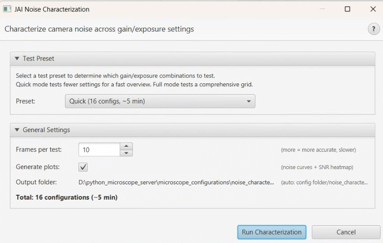

# JAI Noise Characterization

> Menu: Extensions > QP Scope > Utilities > JAI Camera > Noise Characterization...
> [Back to README](../../README.md) | [All Tools](../UTILITIES.md)

## Purpose

Measure camera noise statistics (mean, standard deviation, SNR) with configurable
presets. This tool captures multiple frames and computes temporal noise statistics
per channel, providing a quantitative assessment of camera performance.

Use this tool to characterize camera noise levels, detect hardware issues, verify
camera health after service, or compare performance across different gain/exposure
settings.

**Note:** This menu item only appears when a JAI camera is detected in the
configuration.

## Prerequisites

- JAI camera connected and detected in the microscope configuration
- Connected to microscope server
- Microscope positioned at a uniform area (blank slide or lens cap) for clean
  noise measurement

## Options

| Preset | Frames | Description |
|--------|--------|-------------|
| **Quick** | 10 | Fast measurement for spot checks |
| **Full** | 100 | Comprehensive measurement for detailed characterization |
| **Custom** | User-defined | Specify exact frame count for specific needs |

## Workflow

1. Position the microscope at a uniform area (blank slide or cap on the objective).
2. Open Noise Characterization from the menu.
3. Select a preset or enter a custom frame count.
4. Click Start to begin capturing frames.
5. The system acquires the specified number of frames and computes per-channel
   statistics.
6. Results are displayed in a non-modal dialog.

## Output

Per-channel (R, G, B) statistics displayed in the results dialog:

| Metric | Description |
|--------|-------------|
| Mean | Average intensity value per channel |
| StdDev | Standard deviation of intensity (temporal noise) |
| SNR | Signal-to-noise ratio (Mean / StdDev) |

The Live Viewer also provides real-time noise statistics via the "Measure" button
in the Noise Stats panel, which uses the same measurement approach.

## Tips & Troubleshooting

- **Use a uniform target** -- any spatial variation (dust, sample features) will
  inflate the measured noise. A blank slide or lens cap is ideal.
- **Frame count matters** -- Quick (10 frames) gives a rough estimate; Full (100
  frames) provides statistically robust measurements.
- **Compare across sessions** -- if noise levels increase significantly over time,
  this may indicate camera degradation or connection issues.
- **Preferences persist** -- the frame count setting is saved between sessions.
- The dialog is non-modal, so you can continue interacting with the microscope
  while viewing results.

## See Also

- [White Balance Calibration](white-balance-calibration.md) -- Calibrate per-channel exposure for JAI cameras
- [All Tools](../UTILITIES.md) -- Complete utilities reference
