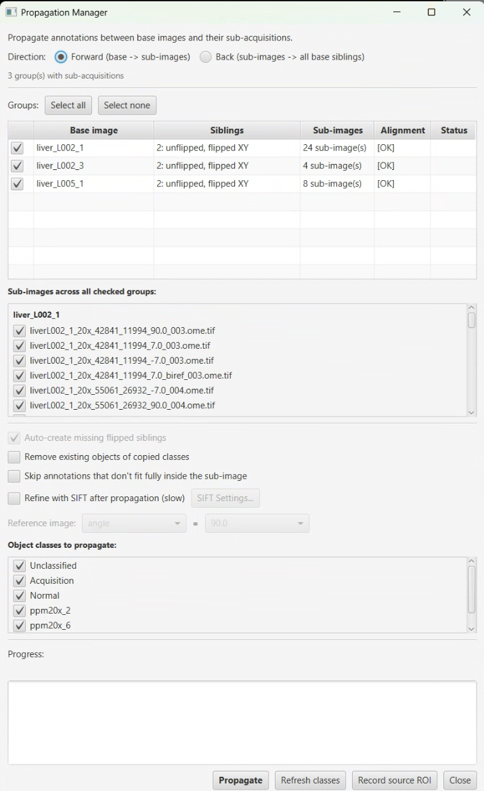

# Propagation Manager

> Menu: Extensions > QP Scope > Utilities > Propagation Manager...
> [Back to README](../../README.md) | [All Tools](../UTILITIES.md)

## Purpose

Transfer annotations and detections between base images (whole-slide scans) and their acquired sub-images (stitched acquisitions). Supports both directions:

- **Forward Propagation**: Copy objects FROM the base image TO sub-images. Use this to push tissue region annotations, landmarks, or classification labels drawn on the overview into each acquired sub-image.
- **Back Propagation**: Copy objects FROM sub-images TO the base image. Use this to consolidate analysis results (cell detections, classified regions) from multiple sub-images back onto the overview for a unified view.

## Prerequisites

- A QuPath project with at least one base image and one or more sub-images
- Sub-images must have `base_image` metadata (automatically set during acquisition)
- An alignment transform must exist for the base image (created by Microscope Alignment) — required for FORWARD propagation, and as a fallback for BACK when no parent tile detections are present
- Sub-images must have `xy_offset_x_microns` and `xy_offset_y_microns` metadata (automatically set during acquisition)
- For cross-scope projects (sub acquired on one microscope, project opened on another), the source scope's config (`config_<sourceScope>.yml`) must be next to the active config so FOV can be resolved offline; if it is missing, the dialog surfaces a warning naming the missing file
- Microscope server connection is **not** required when the data above is present

## How It Works

### Coordinate Transform

#### Back propagation (preferred path)

When the sub's parent entry (`original_image_id`) holds tile detections from the original acquisition, BACK propagation **bypasses the alignment transform entirely** and uses the tile-detection bbox as ground truth:

1. Walk `sub.original_image_id` to find the parent entry (often the unflipped base, sometimes a legacy `(flipped X|Y|XY)` sibling).
2. Find detections on the parent named `<index>_<sub.annotation_name>` with a `TileNumber` measurement (set by `TilingUtilities` at acquisition time).
3. Take their bbox union — this is the physical extent the camera captured.
4. If the parent is a flipped sibling, mirror the bbox to unflipped-base coordinates and record the axis-flip.
5. Linearly interpolate sub_px → base_px inside that rectangle.

The result is recorded on the sub as `source_roi_*_px` metadata, so subsequent BACK runs are fast and produce identical results.

This path is exact relative to what was commanded at acquisition time; it has no alignment, no half-FOV, and no flip-resolution math to drift.

#### Forward propagation, and BACK fallback

Forward (and BACK when no parent tile detections exist) uses the alignment transform to map base image pixels to physical stage coordinates (microns):

**Forward** (base -> sub):
1. Base image annotation (unflipped base pixels) -> stage microns (via alignment, with alignment-frame flip applied as a transform step)
2. Stage microns -> sub-image pixels (subtract corrected XY offset = `xy_offset - halfFOV`, divide by sub pixel size)

**Back fallback** (sub -> base):
1. Sub-image annotation (sub pixels) -> stage microns (multiply by sub pixel size, add corrected XY offset)
2. Stage microns -> alignment-frame pixels (via inverse alignment)
3. Alignment-frame pixels -> unflipped-base pixels (apply unflip if alignment was built in a flipped frame)

For cross-scope projects, BACK swaps in the source scope's per-slide alignment so the xy_offset is inverted in its native stage frame.

Objects whose bounding box falls outside the target image bounds are filtered or clipped to image bounds.

## Options

### Direction

| Option | Description |
|--------|-------------|
| Forward (Base -> Sub-images) | Copy objects from base images into their sub-images |
| Back (Sub-images -> Base) | Copy objects from sub-images back to their base image |

### Group Selection

The dialog shows one row per base-image group, with a checkbox to enable that group for propagation, and per-row indicators for sibling count, sub-acquisition count, and whether an alignment file was found. "Select all" and "Select none" buttons act on the group list. Multi-group runs aggregate results and warnings into one status pane.

Under Step B (single unflipped base entry per slide), each group corresponds to one `MetroHealth_142.svs`-style entry. Legacy projects with `(flipped X|Y|XY)` duplicates still show their duplicates as siblings; BACK propagation writes to the unflipped base AND mirrors the result to each surviving duplicate via `createFlip(W,H)`.

### Sub-Image Selection

A checkbox list shows all sub-images for the checked groups, with section headers per group. Check or uncheck individual sub-images to control which ones participate in propagation.

### Object Classes

Select which annotation/detection classes to propagate. The class list refreshes based on the current direction:
- **Forward**: Shows classes found in the selected base image
- **Back**: Shows classes found in the selected sub-images

Use the "Refresh Classes" button to rescan after changing image or direction selections.

## Workflow

### Forward Propagation (Typical Use)

1. Draw region annotations on the base image (e.g., mark tumor regions, tissue boundaries)
2. Open **Propagation Manager** from the QP Scope menu
3. Select **Forward** direction
4. Choose the base image variant (flipped or original) from the dropdown
5. Verify sub-images and classes are correctly selected
6. Click **Propagate**
7. Open a sub-image to verify the annotations landed in the correct positions

### Back Propagation (Typical Use)

1. Run analysis on sub-images (e.g., cell detection, classification)
2. Open **Propagation Manager** from the QP Scope menu
3. Select **Back** direction
4. Check one or more base groups (use **Select all** for whole-project consolidation)
5. Select which sub-images to pull objects from
6. Click **Propagate**
7. Open the unflipped base image to see all results consolidated on the overview. The viewer is automatically reloaded after the worker writes so the new objects appear without you having to re-open the entry.

The first BACK run for each sub stamps a ground-truth source rectangle from the parent's tile detections; subsequent runs use that stamp directly for fast, repeatable placement.

### Recording a source ROI manually

If the parent entry's tile detections are missing (e.g. from an old workflow that didn't create them), use **Record source ROI**:

1. Open the unflipped base image
2. Draw a single annotation that bounds the area you originally acquired
3. Select that annotation
4. Click **Record source ROI** in the dialog
5. The rectangle is stamped on every sub-acquisition in the checked groups whose base matches the open entry
6. Run BACK propagation — the GT path uses the manually-stamped rectangle

## Output

- Objects are added to the target image's hierarchy and saved automatically
- The status area shows per-image results: `source_image -> target_image: N objects`
- Failed propagations are reported with error messages

## Tips & Troubleshooting

- **Objects appear in the wrong position (BACK)**: Check the log for `BackProp: using GROUND-TRUTH source rect from metadata`. If present, the GT path is in use and the result is mathematically exact relative to what was commanded at acquisition time — any visible offset is an alignment / acquisition issue, not a propagation bug. If absent, the alignment fallback is in use; verify the alignment is current and the correct (sub source) scope's alignment was loaded.
- **Half-tile offset**: With the GT path active, half-tile offsets are not possible — sub_px (0,0) maps exactly to tile-bbox UL. With the alignment fallback, half-FOV correction requires either `fov_x_um`/`fov_y_um` metadata on the sub, an entry in the active or source-scope config, or a live microscope connection.
- **Cross-scope: missing config warning**: The dialog flags subs whose source scope's config file is not next to the active config. Add `config_<sourceScope>.yml` to the same directory and retry.
- **No sub-images found**: Sub-images must have `base_image` metadata. This is set automatically during acquisition workflows.
- **No alignment found**: Required for FORWARD propagation; for BACK, only required when the parent has no tile detections (the GT path bypasses it). Run Microscope Alignment if needed.
- **Objects missing after propagation**: Objects whose bounding box falls outside the target image bounds are clipped or filtered. This is expected.
- **Dialog auto-closes when switching images**: Fixed (2026-05-05) — the dialog no longer initOwners to the QuPath stage, so it stays open across image switches.
- **Empty class list on first open**: Toggle the direction and toggle back, or click "Refresh Classes" to rescan.
- Propagation can be run multiple times. Duplicate objects may accumulate -- clear the target hierarchy first if you want a clean propagation.

## See Also

- [Microscope Alignment](microscope-alignment.md) -- Create the alignment transform needed for propagation
- [Bounded Acquisition](bounded-acquisition.md) -- Acquire sub-images with automatic metadata
- [Existing Image Acquisition](existing-image-acquisition.md) -- Acquire from existing images with coordinate tracking
