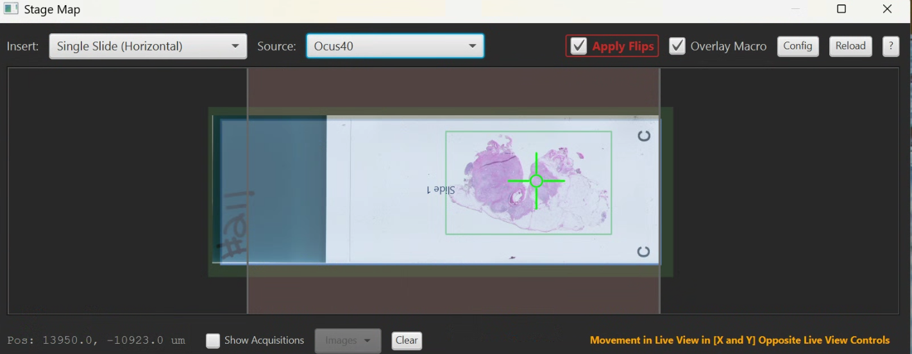

# Stage Map

> Menu: Extensions > QP Scope > Stage Map
> [Back to README](../../README.md) | [All Tools](../UTILITIES.md)

## Purpose

Visual representation of the microscope stage insert showing slide positions. Helps users understand where slides are located on the stage, see the current stage position, and optionally overlay macro images for spatial reference. Use this tool to verify slide placement and prevent moving to positions outside the stage insert.

## Prerequisites

- Connected to microscope server (see [Communication Settings](server-connection.md))
- Stage insert configuration defined in the microscope configuration file

## Options

| Option | Type | Default | Description |
|--------|------|---------|-------------|
| Insert Configuration | ComboBox | From config | Select the stage insert layout matching your hardware |
| Overlay Macro | CheckBox | Auto | Overlay the current macro image on the map display. Automatically enabled when a macro image and alignment transform are detected. Also updates when switching between images in the project. |

## Workflow

1. Open Stage Map from the menu
2. Select the insert configuration that matches your physical stage insert
3. View slide boundaries, accessible areas, and current stage position
4. Optionally enable macro overlay to see your image in spatial context
5. Use the map as a reference while navigating with the [Live Viewer](live-viewer.md)

## Output

No persistent output. The Stage Map provides a real-time visual display showing:

- Slide boundaries within the stage insert
- Current stage position indicator
- Visual preview of accessible areas
- Optional macro image overlay

## Tips & Troubleshooting

- If slide positions do not match the physical layout, verify the correct insert configuration is selected
- The macro overlay helps confirm that your overview image is correctly positioned relative to the stage
- Use this tool alongside the Live Viewer to understand spatial context when navigating
- If the current position indicator seems wrong, verify stage communication via [Communication Settings](server-connection.md)

## See Also

- [Live Viewer](live-viewer.md) - Navigate the stage with real-time camera feed
- [Microscope Alignment](microscope-alignment.md) - Create coordinate transforms between image and stage
- [Communication Settings](server-connection.md) - Verify server connection if position display is incorrect
- [Bounded Acquisition](bounded-acquisition.md) - Define acquisition regions using stage coordinates
