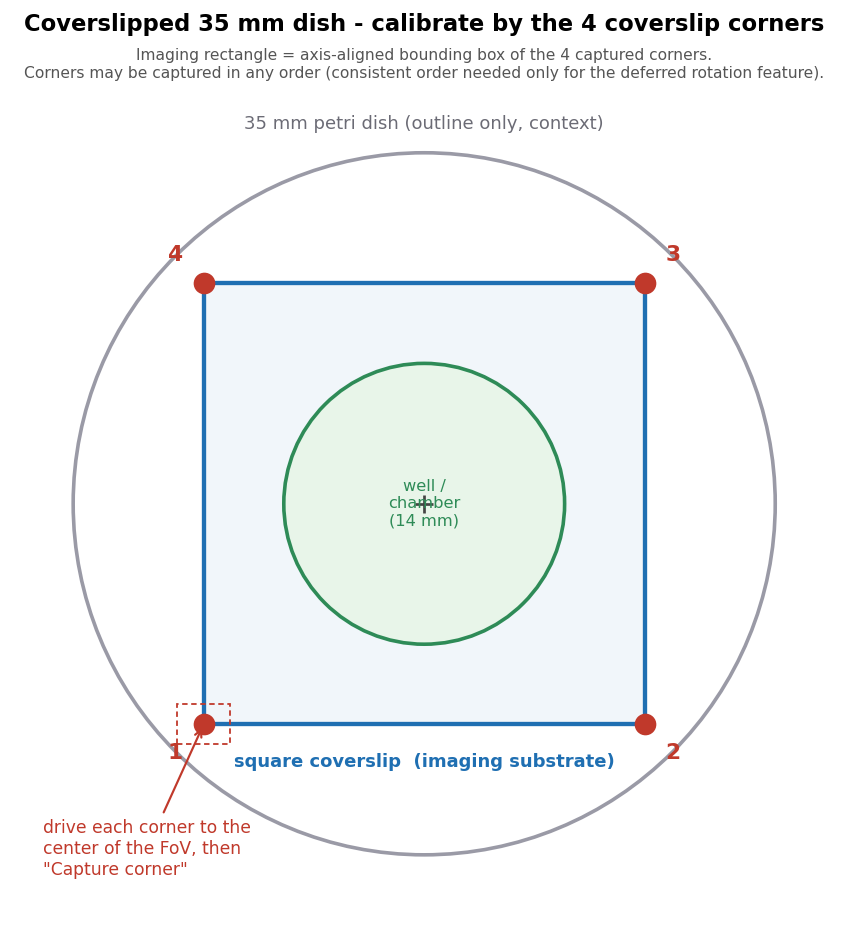

# Stage Map

> Menu: Extensions > QP Scope > Stage Map
> [Back to README](../../README.md) | [All Tools](../UTILITIES.md)

## Purpose

Visual representation of the microscope stage insert showing slide positions. Helps users understand where slides are located on the stage, see the current stage position, and optionally overlay macro images for spatial reference. Use this tool to verify slide placement and prevent moving to positions outside the stage insert.

## Prerequisites

- Connected to microscope server (see [Communication Settings](server-connection.md))
- Stage insert configuration defined in the microscope configuration file

## Visual Elements

The Stage Map displays several visual indicators:

| Element | Color | Meaning |
|---------|-------|---------|
| Crosshair circle | Lime green | Current stage position |
| Crosshair lines | Lime green | Current stage X/Y position markers |
| Target crosshair | Yellow (thin black outline) | Position under the mouse cursor on the Stage Map -- double-click to move the stage there |
| FOV rectangle | Orange | Field of view at current position |
| Bounding-box preview | Translucent green | Region that will be acquired when using [Bounded Acquisition](bounded-acquisition.md) (shown while the acquisition dialog is open) |
| Search-range preview | Translucent bright orange (dashed) | Area searched during SIFT auto-align, shown for the whole time the Refine Alignment / Position Confirmation dialog is open. Centered on the predicted stage position and sized to the search region: one FOV plus search margin on each side. Updates live as you change **Search margin** in SIFT Settings, so you can see how close the stage must be for SIFT to work. With coarse-to-fine search enabled this is the area the coarse pass covers. |

## Options

| Option | Type | Default | Description |
|--------|------|---------|-------------|
| Insert Configuration | ComboBox | From config | Select the stage insert layout matching your hardware |
| Preset | ComboBox | Active microscope | Select which scanner's macro to display. The dropdown remembers your last selection across sessions. When you open Stage Map, it defaults to: (1) your persistent choice from the prior session, (2) the active microscope (same-scope identity), or (3) the first available preset. When you switch between project images, the dropdown **does NOT change automatically** — to display a different macro overlay (e.g., when working with derived images), pick manually from the dropdown. This lets you stay on your preferred scanner without the dropdown jumping when you navigate to a sub-acquisition with a different ancestor. Saved scanner-to-stage transform presets are created during [Microscope Alignment](microscope-alignment.md). **Important:** This dropdown drives macro overlay display only; it does NOT relabel the entry's acquisition-origin metadata. |
| Apply Flips | CheckBox | From config | Flip the Stage Map to match the Live Viewer orientation. Default state composes the active scope's **Stage Polarity** + **Camera Orientation** (same composition the stitcher uses) XOR'd with the macro overlay's flipMacroX/Y from the selected source preset. Independent of which project image is open. Updates automatically when stage polarity or camera orientation are edited (e.g., via Calibrate Directions). Use the toggle to compare against the un-flipped view. |
| Overlay Macro | CheckBox | Auto | Overlay the current macro image on the map display. Automatically enabled when a macro image and alignment transform are detected. Requires a Preset to be selected. Also updates when switching between images in the project. |
| Show Acquisitions | CheckBox | Off | Show / hide the acquisition overlay. First check scans the project for per-slide alignments and paints a translucent thumbnail at each acquired image's stage position. Unchecking hides the overlay but retains the cached thumbnails, so re-checking is instant. Use the **Clear** button to drop the cache and force a fresh project rescan next time. |
| Images | MenuButton | All visible | Dropdown list showing each loaded acquisition image as a checkbox. Toggle individual images on/off to control which ones appear in the acquisitions overlay. Right-click the button for **Select All** / **Select None** shortcuts. Only enabled when acquisitions are loaded. |
| Config | Button | — | Reveal the microscope configuration file in your system file browser. Use this to manually edit aperture and slide reference points for custom stage inserts. |
| Calibrate... | Button | — | Calibrate the selected insert's reference points by driving the stage to each point in Live View and capturing the position. Opens a **non-modal** window (it stays open and does **not** block the Live Viewer / joystick, so you can keep moving the stage). **Coverslipped petri dishes** show four **coverslip-corner** rows with a wireframe schematic (dish, coverslip, central well): drive each corner of the square coverslip to the center of the FOV and click "Capture corner" to take both X and Y at once (any order). **Multi-slot slide holders** (num_slides > 1) show a "Per-slot center" section: for each slot, drive to two **diagonal corners** of the slide (identifiable points, unlike the featureless middle) and click "Capture corner 1" / "Capture corner 2"; the dialog stores their midpoint as the slot center (the midpoint of a rectangle's diagonal is its center regardless of rotation), shown with a wireframe highlighting the active slot. These per-slot centers override the fixed pitch (slide_spacing_mm) when present. Slide holders / legacy inserts show single-axis edge rows captured with "Use current X/Y". "Save to config" writes the values straight back to the microscope YAML and reloads the map; the window stays open so you can capture more points. Only enabled for inserts that have editable reference points in the config (the synthesized single-slide baseline cannot be calibrated this way). |
| Reload | Button | — | Re-read the microscope configuration file from disk and update the Stage Map display. Use this after manually editing the YAML or after calibrating an insert to see the changes reflected on the map. |
| Clear | Button | — | Drop the cached acquisition thumbnails and Images list. Unlike unchecking **Show Acquisitions** (which just hides the overlay and keeps the cache), Clear frees memory and forces a fresh project rescan the next time you re-enable **Show Acquisitions**. Use this after acquiring new images that should appear in the overlay. |

## Mouse navigation

| Action | Effect |
|--------|--------|
| **Mouse wheel** | Zoom in/out, anchored on the cursor -- the point under the pointer stays put as the view scales. Use it to inspect a large macro overview or acquired tiles in slide context. |
| **Drag (left button)** | Pan the view. |
| **Right-click** | Reset zoom and pan back to the fit-to-insert view. |
| **Double-click (left button)** | Move the stage to that point (unchanged). |

Zoom and pan are display-only -- they never move the stage. Switching inserts, reloading the config, or right-clicking returns to the fit view. Resizing the window also re-fits.

## Workflow

1. Open Stage Map from the menu
2. Select the insert configuration that matches your physical stage insert
3. Select the scanner preset that matches how the current slide was scanned (e.g., "Ocus40 to PPM")
4. View slide boundaries, accessible areas, and current stage position
5. Open a scanned slide image -- the macro overlay enables automatically if a preset is selected
6. Use the map as a reference while navigating with the [Live Viewer](live-viewer.md)

## Output

No persistent output. The Stage Map provides a real-time visual display showing:

- Slide boundaries within the stage insert
- Current stage position indicator
- Visual preview of accessible areas
- Optional macro image overlay

## Tips & Troubleshooting

- If slide positions do not match the physical layout, verify the correct insert configuration is selected
- **No presets in dropdown?** Run [Microscope Alignment](microscope-alignment.md) through the Existing Image workflow to create a scanner-to-stage transform preset
- **Macro overlay not appearing?** Ensure a preset is selected AND the current image has an embedded macro (SVS files typically do)
- The macro overlay helps confirm that your overview image is correctly positioned relative to the stage
- The preset selector remembers your last selection across sessions
- **Switching between images with different macro sources?** When you switch to a derived entry (e.g., a PPM sub-image) with a different ancestor scanner, manually pick its scanner from the Preset dropdown to view the parent's macro overlay. The dropdown no longer auto-syncs on image switches so your selection persists across navigation
- Use this tool alongside the Live Viewer to understand spatial context when navigating
- If the current position indicator seems wrong, verify stage communication via [Communication Settings](server-connection.md)
- **Calibrating custom stage inserts (e.g. petri-dish carriers):** Select the insert in the **Insert Configuration** dropdown, then click **Calibrate...** to define its reference points interactively. For a **coverslipped 35mm dish**, drive each corner of the square coverslip to the center of the FOV and click "Capture corner" (the wireframe in the dialog shows which is which; corners may be captured in any order). The imaging rectangle is the bounding box of the four corners, and axis inversion is taken from your **Stage Polarity** setting -- so the dish must be placed in your scope's usual orientation. (Putting the same dish back at an arbitrary rotation and having the previously-acquired image re-imprint onto the map in the matching orientation is a separate, not-yet-built feature -- re-capturing the corners re-centers the imaging area but does not rotate prior overlays.) Slide holders show single-axis edge rows ("Use current X/Y"). The captured coordinates are saved directly to the microscope YAML and the map reloads on save. Only inserts with editable reference points can be calibrated this way (the default single-slide insert is synthesized from the stage limits -- edit `slide_size_um` / `stage.limits` for that).

- **Show Acquisitions not displaying coverage?** Check the console log when toggling the checkbox. Acquired images may not display if alignment files are missing or if the project used annotation-based acquisition without alignment registration. The tool searches for three types of alignment records: saved JSON files, auto-registered sub-frame alignments from stitched outputs, and entry-level stage metadata. If none are found, no overlay is drawn.
- **Uncheck vs Clear:** Unchecking **Show Acquisitions** hides the overlay but keeps the cached thumbnails in memory — re-checking it again is instant. Use the **Clear** button to free memory and force a fresh project rescan (useful after acquiring new images). You do not need to clear unless you've added new acquisitions to the project.
- **Too many acquisitions on the overlay?** Use the **Images** dropdown to toggle visibility of individual acquisitions, or right-click the button for quick **Select All / Select None** to manage which images are displayed.

## See Also

- [Live Viewer](live-viewer.md) - Navigate the stage with real-time camera feed
- [Microscope Alignment](microscope-alignment.md) - Create coordinate transforms between image and stage
- [Communication Settings](server-connection.md) - Verify server connection if position display is incorrect
- [Bounded Acquisition](bounded-acquisition.md) - Define acquisition regions using stage coordinates
