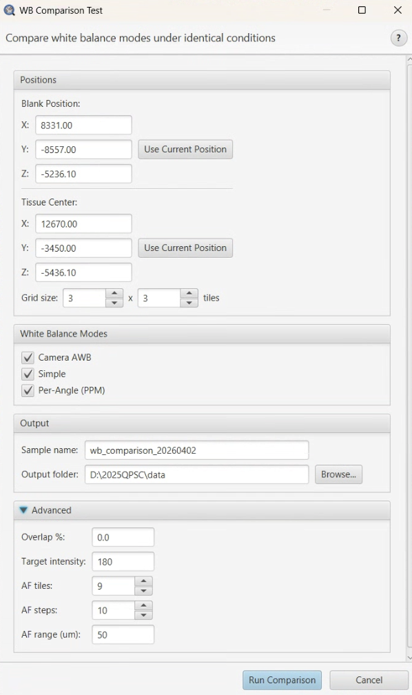

# WB Comparison Test
> Menu: Extensions > QP Scope > Utilities > WB Comparison Test...
> [Back to README](../../README.md) | [All Tools](../UTILITIES.md)



## Purpose

The WB Comparison Test acquires the same tissue region using multiple white
balance (WB) calibration modes, producing side-by-side stitched images in a
single QuPath project. This allows direct visual and quantitative comparison
of how different WB approaches affect image quality and color consistency.

Use this tool when:
- Evaluating which WB mode produces the best color balance for your sample.
- Validating a new WB calibration method.
- Documenting WB performance differences for a publication or report.

## Prerequisites

- Microscope control server must be running and connected.
- A microscope configuration YAML file must be set in preferences.
- The slide must be loaded with a blank (empty) region accessible for
  calibration and a tissue region for acquisition.
- For Camera AWB mode: AWB must be enabled manually in MicroManager's Device
  Property Browser before running the test. Camera AWB cannot be controlled
  programmatically.

## Options

### Positions

| Option | Type | Default | Description |
|--------|------|---------|-------------|
| Blank X | Double | (persisted) | X stage coordinate of the blank region used for calibration and backgrounds. |
| Blank Y | Double | (persisted) | Y stage coordinate of the blank region. |
| Blank Z | Double | (persisted) | Z stage coordinate (focus) of the blank region. |
| Tissue X | Double | (persisted) | X stage coordinate of the tissue center for acquisition. |
| Tissue Y | Double | (persisted) | Y stage coordinate of the tissue center. |
| Tissue Z | Double | (persisted) | Z stage coordinate (focus) of the tissue center. |
| Grid size | Cols x Rows | 3 x 3 | Number of tiles to acquire in a grid centered on the tissue position. |

Each position group has a **"Use Current Position"** button that reads the
current stage XYZ from the microscope.

### White Balance Modes

| Option | Type | Default | Description |
|--------|------|---------|-------------|
| Camera AWB | Checkbox | Checked | Uses the camera's built-in auto white balance. Must be set manually in MicroManager before running. Always runs last to prevent residual AWB state from affecting other modes. |
| Simple | Checkbox | Checked | Single-exposure WB calibration using iterative gain/exposure adjustment. |
| Per-Angle (PPM) | Checkbox | Checked | Per-angle WB calibration for PPM modality, calibrating each polarizer angle independently. |

At least one mode must be selected.

### Output

| Option | Type | Default | Description |
|--------|------|---------|-------------|
| Sample name | String | "wb_comparison_YYYYMMDD" | Name for the QuPath project and output folder. |
| Output folder | Path | QuPath projects folder | Root directory for output files. |

### Advanced

| Option | Type | Default | Description |
|--------|------|---------|-------------|
| Overlap % | Double | (from preferences) | Tile overlap percentage for the acquisition grid. |
| Target intensity | Double | 180.0 | Target mean pixel intensity for WB calibration (0-255). |
| AF tiles | Integer | 9 | Number of tiles to use for autofocus. |
| AF steps | Integer | 10 | Number of Z steps in the autofocus sweep. |
| AF range (um) | Double | 50.0 | Total Z range for the autofocus sweep in micrometers. |

## Workflow

For each selected WB mode, the workflow performs these steps in sequence:

1. **Move to blank position** -- Stage moves to the specified blank region.
2. **Calibrate white balance** -- Runs the mode-specific calibration:
   - Camera AWB: Skipped (user handles manually via MicroManager).
   - Simple: Iterative gain/exposure adjustment to reach target intensity.
   - Per-Angle: Independent calibration at each PPM polarizer angle.
3. **Collect backgrounds** -- Acquires flat-field correction images at the blank
   position using the freshly calibrated exposures.
4. **Move to tissue position** -- Stage moves to the tissue center. Subsequent
   modes reuse the focus Z found by the first mode's autofocus to avoid
   search failures.
5. **Acquire tile grid** -- Acquires the configured grid of tiles with autofocus
   and background correction applied.
6. **Stitch tiles** -- Stitches each angle's tiles into pyramidal images using
   directory isolation to prevent filename collisions.

If one mode fails, the workflow continues with remaining modes.

## Output

- A **QuPath project** at `{output_folder}/{sample_name}/` containing all
  stitched images across all WB modes.
- **Tile images** organized by WB mode and angle in subdirectories.
- **Stitched pyramidal images** for each angle of each WB mode, registered in
  the QuPath project for side-by-side comparison.
- A **summary dialog** showing which modes succeeded or failed.

### Directory Structure

```
{output_folder}/{sample_name}/
  {modality}_{objective}_{index}/
    wb_simple/
      backgrounds/
      {modality}_{objective}_{index}/bounds/{angle}/
    wb_per_angle/
      backgrounds/
      {modality}_{objective}_{index}/bounds/{angle}/
    wb_camera_awb/
      backgrounds/
      {modality}_{objective}_{index}/bounds/{angle}/
```

## Tips & Troubleshooting

- **Camera AWB runs last intentionally**: AWB Continuous mode on JAI cameras
  is difficult to deactivate reliably. Running it last prevents residual AWB
  state from corrupting other WB methods.
- **Autofocus "peak at edge" failures**: The first mode searches from the
  provided tissue Z. If tissue Z is far from optimal focus, autofocus may fail.
  Ensure tissue Z is reasonably close to focus. Subsequent modes reuse the
  focus Z from the previous mode, so this is mainly a risk for the first mode.
- **Camera AWB shows "skipping calibration"**: This is expected. Camera AWB
  must be configured through MicroManager's Device Property Browser, not
  programmatically.
- **All positions show NaN**: Click "Use Current Position" to populate from
  the current stage location, or type values manually.
- **Settings are persisted**: All position and parameter values are saved via
  QuPath preferences and restored the next time you open the dialog.

## See Also

- [Acquisition Wizard](acquisition-wizard.md) -- Guided acquisition setup
- [PREFERENCES.md](../PREFERENCES.md) -- Default overlap and other settings
