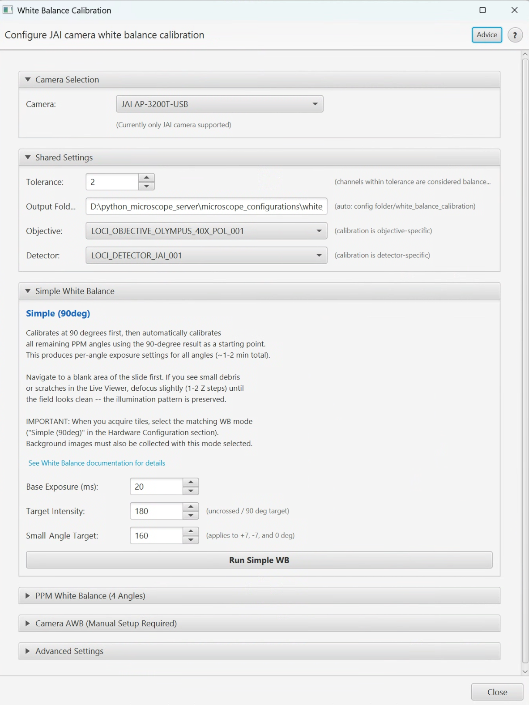

# White Balance Calibration

> Menu: Extensions > QP Scope > Utilities > JAI Camera > JAI White Balance Calibration...
> [Back to README](../../README.md) | [All Tools](../UTILITIES.md)

## Purpose

Calibrate per-channel (R, G, B) exposure times for JAI 3-CCD prism cameras. This
ensures neutral white balance at each polarization angle without digital gain
artifacts. Each color channel is adjusted independently so that a white reference
area produces equal R, G, B intensity values.

Use this tool before background collection and acquisition whenever the camera,
light source, or optical path has changed.



## Prerequisites

- Microscope positioned at a clean, white reference area (blank slide or uniform
  bright background)
- JAI or other prism-based camera selected in the configuration
- Connected to microscope server

## Options

| Option | Type | Default | Description |
|--------|------|---------|-------------|
| Mode | ComboBox | - | **Simple** (calibrates at 90 deg, then all angles; ~1-2 min) or **PPM** (independent calibration at all 4 angles with per-angle targets; most accurate) |
| Target Intensity | Spinner | 200 | Target grayscale value to achieve per channel |
| Tolerance | Spinner | 5 | Acceptable deviation from target intensity |
| Max Analog Gain | Spinner | - | Maximum allowed analog gain setting |
| Gain Threshold Ratio | Spinner | - | Ratio at which to start using analog gain |
| Calibrate Black Level | CheckBox | OFF | Also calibrate black level offsets |

### PPM Mode Per-Angle Targets

When PPM mode is selected, individual targets can be configured for each angle:

| Angle | Typical Target | Notes |
|-------|---------------|-------|
| Crossed (0 deg) | ~245 | Darkest angle -- higher target to compensate |
| Uncrossed (90 deg) | ~125 | Brightest angle -- lower target to avoid saturation |
| Positive (+7 deg) | Intermediate | Between crossed and uncrossed |
| Negative (-7 deg) | Intermediate | Between crossed and uncrossed |

## Workflow

1. Position the microscope on a clean, white reference area.
2. Open the White Balance Calibration dialog.
3. Select **Simple** or **PPM** mode:
   - **Simple**: Calibrates R/G/B at 90 degrees first, then automatically rotates
     to each remaining angle and calibrates there using the 90-degree result as a
     starting point. Takes ~1-2 minutes for all angles.
   - **PPM**: Fully independent calibration at each angle with configurable
     per-angle target intensities. Most accurate but takes longer.
4. Set the target intensity (default 200 is suitable for most cases).
5. Click Start.
6. The system iteratively adjusts R, G, B exposure times for each channel
   independently until all channels reach the target intensity within tolerance.
7. Both modes produce per-angle exposure settings for all angles.
8. Calibration values are automatically saved.

## Output

Calibration data is stored in the YAML configuration file
(`imageprocessing_{microscope}.yml`):

```yaml
imaging_profiles:
  ppm:
    LOCI_OBJECTIVE_20X:
      LOCI_DETECTOR_JAI:
        angles:
          crossed:
            exposures_ms: {r: 45.2, g: 38.1, b: 52.3}
```

Subsequent background collection and acquisitions automatically use these
per-channel exposure settings.

## Tips & Troubleshooting

- **Run BEFORE background collection** -- white balance calibration must be done
  first so that background images use the correct per-channel exposures.
- **Each objective/detector combination** needs separate calibration since the light
  path characteristics differ.
- **Recalibrate** after any hardware changes affecting the light path (lamp
  replacement, filter changes, optical realignment).
- If calibration fails to converge, check that the reference area is truly uniform
  and bright. Dust or sample residue will skew results.
- The tolerance setting controls how precise the calibration needs to be. A tighter
  tolerance (e.g., 2) takes longer but produces more accurate white balance.

## See Also

- [Noise Characterization](noise-characterization.md) -- Measure camera noise statistics
- [Polarizer Calibration](polarizer-calibration.md) -- Calibrate the PPM rotation stage offset
- [All Tools](../UTILITIES.md) -- Complete utilities reference
