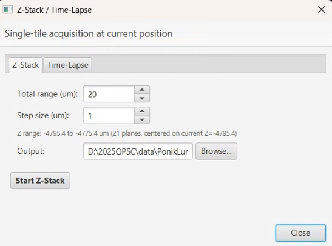

# Z-Stack / Time-Lapse

> Menu: Extensions > QP Scope > Utilities > Z-Stack / Time-Lapse...
> [Back to README](../../README.md) | [All Tools](../UTILITIES.md)

## Purpose

Acquire single-tile Z-stacks or time-lapse sequences at the current stage position. These are basic acquisition modes for capturing 3D depth information or temporal dynamics without the complexity of multi-tile stitching.

## Prerequisites

- Connected to the microscope server
- Stage positioned at the area of interest (use the Live Viewer to navigate)
- For Z-stacks: focus set to the approximate center of the desired Z range

## Z-Stack

Acquires images at multiple Z positions centered on the current focus.

| Parameter | Description | Default |
|-----------|-------------|---------|
| Total range (um) | Full Z range to sweep (centered on current Z) | 20 |
| Step size (um) | Distance between Z planes | 1.0 |
| Output folder | Directory for saved images | `<project>/zstack/` |

The info label shows the computed Z range and number of planes. For example, 20 um range with 1 um step = 21 planes centered on current Z.

### Output

Individual TIFF files named `z0000_Z<position>.tif` with metadata including Z position and plane index.

## Time-Lapse

Acquires images at the current position at regular intervals.

| Parameter | Description | Default |
|-----------|-------------|---------|
| Timepoints | Number of acquisitions | 10 |
| Interval (sec) | Seconds between time points (0 = as fast as possible) | 5.0 |
| Output folder | Directory for saved images | `<project>/timelapse/` |

The info label shows total acquisition duration.

### Output

Individual TIFF files named `t00000_T<elapsed>s.tif` with metadata including timepoint index and elapsed time.

## Modality Support

Both Z-stack and time-lapse support every modality the acquisition workflow handles:

- **PPM / multi-angle:** all configured rotation angles are acquired at each Z plane or time point. Files suffixed with the angle: `z0000_Z10.0_angle90.tif`.
- **Brightfield (single-angle, single-channel):** standard Z-stack-then-project per tile.
- **Widefield IF / fluorescence (multi-channel):** Z-stack runs *per channel* (commit `e8e3799`). For each tile, the workflow iterates channels (channel-outer, Z-inner ordering minimizes filter wheel changes), accumulates Z planes per channel, and applies the configured projection per channel. Stage Z is restored to center between channels. Saturation runaway detection fires once per tile per channel.

## Per-Tile Z-Stacks (Multi-Tile Acquisition)

The main QPSC acquisition workflow supports Z-stacks at every tile position. This is essential for SHG and multiphoton imaging where tissue extends through multiple focal planes, and for thick-section fluorescence where the signal is distributed across Z.

When Z-stack parameters are included in an acquisition command (`--z-stack --z-start --z-end --z-step`), the system:

1. Performs autofocus at each tile position to find the optimal Z (or skips when `--af-disabled`).
2. Acquires multiple Z-planes centered on the autofocus result -- per channel for IF, per angle for PPM, single-pass for BF.
3. Computes a projection (e.g., max intensity) to produce a single 2D tile (per channel / angle when applicable).
4. Saves the projected tile for stitching (same pipeline as 2D acquisition).

### Projection Types

| Projection | Flag | Description | Use case |
|-----------|------|-------------|----------|
| **Max intensity** | `--z-projection max` | Brightest value at each pixel across Z | SHG, fluorescence (default) |
| **Min intensity** | `--z-projection min` | Darkest value at each pixel across Z | Absorption / transmitted light |
| **Sum** | `--z-projection sum` | Total signal across Z (overflow-safe) | Thick-section fluorescence |
| **Mean** | `--z-projection mean` | Average across Z (noise reduction) | General denoising |
| **Std deviation** | `--z-projection std` | Variability across Z | Highlighting Z-localized structures |

### Output Layout

Per-tile output structure depends on the modality:

| Modality | Projected output | Raw Z planes (with `--save-raw`) |
|---|---|---|
| Brightfield (single-shot) | `<output>/<tile>.tif` | `<output>/z000/<tile>.tif`, `z001/`, ... |
| PPM (multi-angle) | `<output>/<angle>/<tile>.tif` | `<output>/<angle>/z000/<tile>.tif`, ... |
| Widefield IF (channels) | `<output>/<channel>/<tile>.tif` | `<output>/<channel>/z000/<tile>.tif`, ... |

### Raw Z-Plane Storage

Add `--save-raw` to save individual Z-planes alongside the projected tiles. Planes land in `z000/`, `z001/`, etc. subdirectories under the appropriate per-angle / per-channel / output directory (see table above).

## Future Expansion

- Per-tile time-lapse (conditional): trigger time-lapse at specific positions based on image content
- Combined multi-tile Z-stack + time-lapse

## See Also

- [Live Viewer](live-viewer.md) -- Navigate to the position of interest
- [Camera Control](camera-control.md) -- Adjust exposure and gain before acquisition
